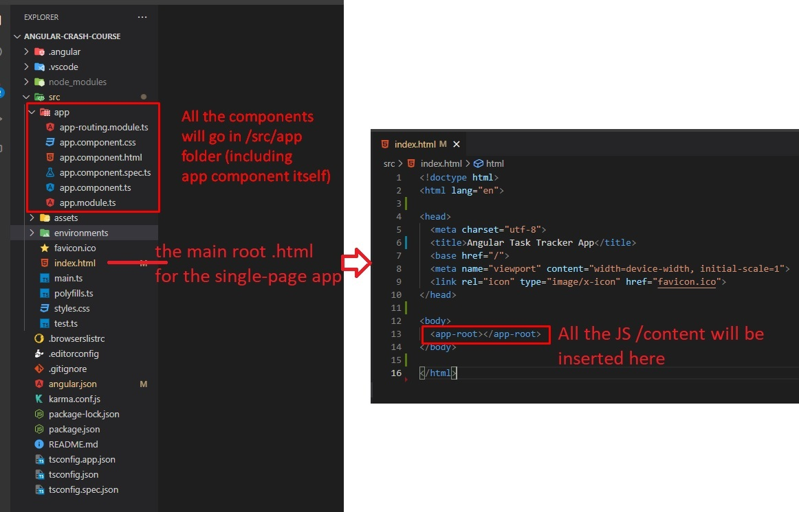
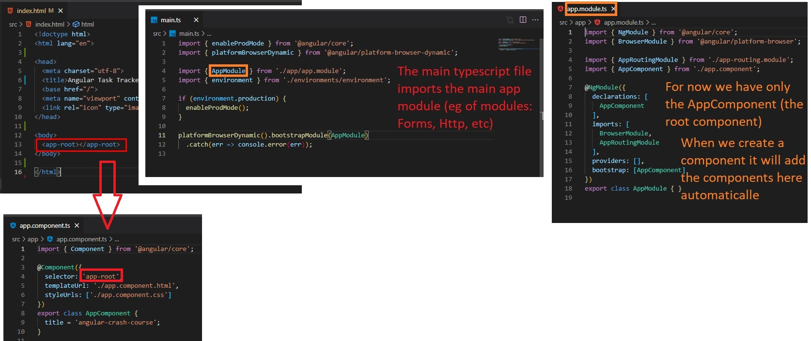
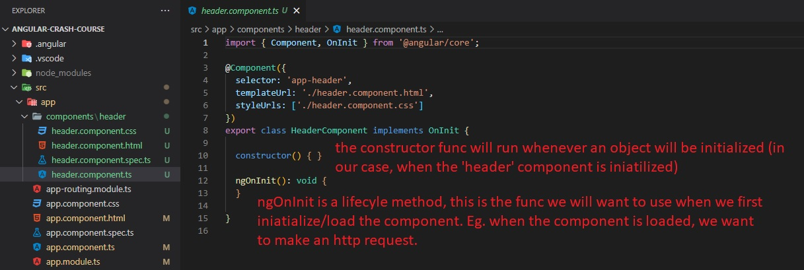
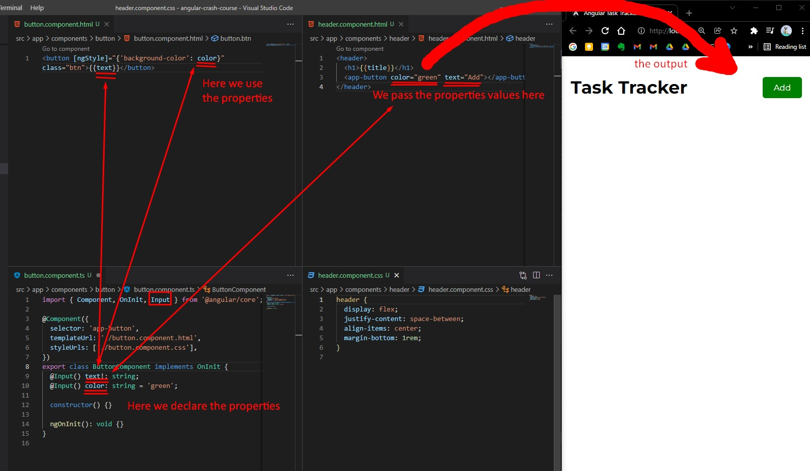
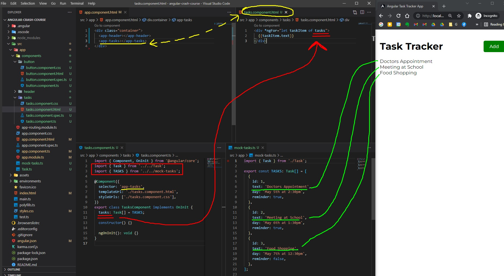

# Angular Crash Course from Traversy Media

**Notes taken from:**

- [Angular Crash Course - Traversy Media - 2h1m](https://www.youtube.com/watch?v=3dHNOWTI7H8)
- https://angular.io/docs
- https://angular.io/guide/what-is-angular

**Other resources:**

- [AngularJS Tutorial from W3Schools](https://www.w3schools.com/angular/default.asp)


<br/>

**Table of Contents:**


<br/>

Angular v1 (or **AngularJS**) is completely different than Angular v2 (up to v13) that uses **TypeScript** instead of JavaScript. As of January 1, 2022, Google no longer updates AngularJS to fix security, browser compatibility, or [jQuery](https://en.wikipedia.org/wiki/JQuery) issues ([wiki](https://en.wikipedia.org/wiki/AngularJS)).

| Version     | Release Date      | Features                                                     |
| ----------- | ----------------- | ------------------------------------------------------------ |
| Angular v2  | May 1, 2016       |                                                              |
| Angular v4  | March 23, 2017    | Introducing HttpClient and router life cycle, conditionally disable   animations |
| Angular v5  | November 1, 2017  | Improve for Progressive Web Apps                             |
| Angular v6  | May 4, 2018       | ng update, ng add, Angular Elements, Angular Material + CDK Components,   Angular Material Starter Components, CLI Workspaces |
| Angular v7  | October 18, 2018  | Updates regarding Application Performance, Angular Material & CDK,   Virtual Scrolling, Improved Accessibility of Selects, now supports Content   Projection |
| Angular v8  | May 28, 2019      |                                                              |
| Angular v9  | February 6, 2020  |                                                              |
| Angular v10 | June 24, 2020     |                                                              |
| Angular v11 | November 11, 2020 |                                                              |
| Angular v12 | May 12, 2021      | Deprecated support for IE11                                  |
| Angular v13 | December 15, 2021 |                                                              |

<br/>

Uses of Angular:

- Full featured Front-End framework (router, http, services, [dependency injection](https://angular.io/guide/what-is-angular#dependency-injection), etc) - although is more difficult to learn than React / Vue / Svelte
- Create dynamic frontend apps & UIs
- Uses TypeScript by default (superset of JavaScript)
- Uses RxJS library (for asynchronous programming) - uses observables
- Test-friendly ([Angular CLI](https://angular.io/guide/what-is-angular#angular-cli) has commands for tests)
- Popular in the large enterprise business (is more strict and standardized than React)
- Uses NPM (Node Package Manager)

<br/>

**First-Party Angular Libraries (preinstalled)**

https://angular.io/guide/what-is-angular#first-party-libraries

| [Angular Router](https://angular.io/guide/router)            | Advanced client-side navigation and routing based on Angular components. Supports lazy-loading, nested routes, custom path matching, and more. |
| ------------------------------------------------------------ | ------------------------------------------------------------ |
| [Angular Forms](https://angular.io/guide/forms-overview)     | Uniform system for form participation and validation.        |
| [Angular HttpClient](https://angular.io/guide/http)          | Robust HTTP client that can power more advanced client-server communication. |
| [Angular Animations](https://angular.io/guide/animations)    | Rich system for driving animations based on application state. |
| [Angular PWA](https://angular.io/guide/service-worker-intro) | Tools for building Progressive Web Applications (PWAs) including a service worker and Web app manifest. |
| [Angular Schematics](https://angular.io/guide/schematics)    | Automated scaffolding, refactoring, and update tools that simplify development at large scale. |

(Saturday, January 29, 2022)

<br/>


## Components Introduction

**Angular is Component Driven**. A component includes a TypeScript class with a `@Component()` decorator, an HTML template, and styles. The `@Component()` decorator specifies the following Angular-specific information:

- A CSS selector that defines how the component is used in a template. HTML elements in your template that match this selector become instances of the component.
- An HTML template that instructs Angular how to render the component.
- An optional set of CSS styles that define the appearance of the template's HTML elements.

The following is a minimal Angular component.

```typescript
import { Component } from '@angular/core';

@Component({
  selector: 'hello-world',
  template: `
    <h2>Hello World</h2>
    <p>This is my first component!</p>
  `
})
export class HelloWorldComponent {
  // The code in this class drives the component's behavior.
}
```

To use this component, you write the following in a template:

```html
<hello-world></hello-world>
```

When Angular renders this component, the resulting DOM looks like this:

```html
<hello-world>
    <h2>Hello World</h2>
    <p>This is my first component!</p>
</hello-world>
```

Angular's component model offers strong encapsulation and an intuitive application structure. Components also make your application painless to unit test and can improve the overall readability of your code.

For more information on what to do with components, see the [Components](https://angular.io/guide/component-overview) section.

**Examples of Components in a Template:**


<br/>

## Services Introduction

https://angular.io/guide/architecture-services

Services are different than Components and they increase modularity and reusability -> Breaking your code into services will clean up your components (the components within the app are more organized - rather than putting all the functions into a single component).

Services are usually used for data fetching from server / API, validating user input, logging directly to the console.

<br/>

Here's an example of a service class that logs to the browser console:

```typescript
export class Logger {
  log(msg: any)   { console.log(msg); }
  error(msg: any) { console.error(msg); }
  warn(msg: any)  { console.warn(msg); }
}
```

<br/>

## Installation

https://angular.io/guide/setup-local

- First, download [Node.js](https://nodejs.org/en/download/) - we need it to use NPM (Node Package Manager)
- [If on Windows 10] Make sure you have `C:\Program Files\nodejs\` path on your `System Properties > Environment Variables > System Variables > Path`. Restart PC.

Then:

- Install the Angular CLI: To install the Angular CLI globally, open a terminal window and run the following command (You will run this only once):

```bash
npm install -g @angular/cli
```

- To create a new project (a new workspace for an app), run the CLI command `ng new` and provide the name `my-app`

```bash
ng new my-app
```

Note that you will be asked if you want to use Angular Router (yes/no), and which stylesheet will the app use (Simple CSS / SCSS / SASS (indented) / Less).

<br/>

The Angular CLI includes a server, for you to build and serve your app locally.

```
cd my-app
ng serve --open
```

The `ng serve` command launches the server, watches your files, and rebuilds the app as you make changes to those files. You can open the folder in Visual Studio Code (run `code .`)

The `--open` (or just `-o`) option automatically opens your browser to `http://localhost:4200/`. You should now see your App's default Landing Page:


<br/>

## Project Structure

https://angular.io/guide/file-structure#application-source-files

| APP SUPPORT FILES | PURPOSE                                                      |
| :---------------- | :----------------------------------------------------------- |
| `app/`            | Contains the component files in which your application logic and data are defined. See details [below](https://angular.io/guide/file-structure#app-src). |
| `assets/`         | Contains image and other asset files to be copied as-is when you build your application. |
| `environments/`   | Contains build configuration options for particular target environments. By default there is an unnamed standard development environment and a production ("prod") environment. You can define additional target environment configurations. |
| `favicon.ico`     | An icon to use for this application in the bookmark bar.     |
| `index.html`      | The main HTML page that is served when someone visits your site. The CLI automatically adds all JavaScript and CSS files when building your app, so you typically don't need to add any `<script>` or` <link>` tags here manually. |
| `main.ts`         | The main entry point for your application. Compiles the application with the [JIT compiler](https://angular.io/guide/glossary#jit) and bootstraps the application's root module (AppModule) to run in the browser. You can also use the [AOT compiler](https://angular.io/guide/aot-compiler) without changing any code by appending the `--aot` flag to the CLI `build` and `serve` commands. |
| `polyfills.ts`    | Provides polyfill scripts for browser support.               |
| `styles.sass`     | Lists CSS files that supply styles for a project. The extension reflects the style preprocessor you have configured for the project. |
| `test.ts`         | The main entry point for your unit tests, with some Angular-specific configuration. You don't typically need to edit this file. |

**Default Angular Project Structure Overview:**






**Note:** **When we create a component (using the Angular CLI), the component will have 4 types of files:**

- `mycomp.component.ts` - The main typescript Class of that component (contains the HTML selector tag for component, the stylesheets path, and methods)
- `mycomp.component.html` - The template (HTML) for that component
- `mycomp.component.css` - Stylesheet for component
- `mycomp.component.spec.ts` - Code for testing the component

<br/>

From https://angular.io/guide/file-structure#application-source-files:

| `src/app/app.component.ts`      | Defines the logic for the application's root component, named `AppComponent`. The view associated with this root component becomes the root of [the view hierarchy](https://angular.io/guide/glossary#view-hierarchy) as you add components and services to your application. |
| :------------------------------ | :----------------------------------------------------------- |
| `src/app/app.component.html`    | Defines the HTML template associated with the root `AppComponent`. |
| `src/app/app.component.css`     | Defines the base CSS stylesheet for the root `AppComponent`. |
| `src/app/app.component.spec.ts` | Defines a unit test for the root `AppComponent`.             |
| `src/app/app.module.ts`         | Defines the root module, named `AppModule`, that tells Angular how to assemble the application. Initially declares only the `AppComponent`. As you add more components to the app, they must be declared here. |

<br/>

In the `component.html` file, you can use **String Interpolation** to insert JavaScript (and access JavaScript properties/variables from the `component.ts` Component's Class):


<br/>

<br/>

**Global Stylesheet**

Styles used for this angular crash course mini-project, in `/src/styles.css` - code from https://github.com/bradtraversy/angular-crash-2021

```css
@import url("https://fonts.googleapis.com/css2?family=Montserrat:ital,wght@0,200;0,300;0,400;0,500;0,600;0,700;0,800;1,200;1,300;1,400;1,500;1,600;1,700&display=swap");
* {
  box-sizing: border-box;
  margin: 0;
  padding: 0;
}
body {
  font-family: "Montserrat", sans-serif;
}
.container {
  max-width: 1200px;
  margin: 1rem auto;
  overflow: auto;
  min-height: 300px;
  padding: 1rem;
}
.btn {
  display: inline-block;
  background: #000;
  color: #fff;
  border: none;
  padding: 10px 20px;
  margin: 5px;
  border-radius: 5px;
  cursor: pointer;
  text-decoration: none;
  font-size: 15px;
  font-family: inherit;
}
.btn:focus {
  outline: none;
}
.btn:active {
  transform: scale(0.98);
}
.btn-block {
  display: block;
  width: 100%;
}
.form-control {
  margin: 20px 0;
}
.form-control label {
  display: block;
}
.form-control input {
  width: 100%;
  height: 40px;
  margin: 5px;
  padding: 3px 7px;
  font-size: 17px;
}
.form-control-check {
  display: flex;
  align-items: center;
  justify-content: space-between;
}
.form-control-check label {
  flex: 1;
}
.form-control-check input {
  flex: 2;
  height: 20px;
}
```

<br/>

# Header and Button Component

**To create a new Component in Angular, we need to open our terminal in the project's folder and type** 

```bash
ng generate component components/header
```

(Note that we can specify to place the component in a new `components` folder):


When we create a new component, we will have the following code in `componentName.component.ts`:



If we want to use the new component in our main app html, we just need to use its html selector (unlike React, we don't need to import anything):


And, we will move the `title` string variable from the `main app component` to the `header component`


<br/>

<br/>

Now, let's generate a **button component** (this button can be used later somewhere else for other functionalities, and will accept properties / passed values)

```bash
ng generate component components/button
```

Now, we want to be able to pass data / properties to the button (like button text, and button color). For this in out `button.component.ts` we need to import `Input` from `@angular/core`:



Note that we used `[ngStyle]="{'cssProperty': 'value'}"` in order to use inline style in Angular.

<br/>

---


**Note:** By default, in Angular / TypeScript all variables/properties within a Class Component needs to have a default value (initialization), if you want to disable the error message thrown when you declare a property without initialization, you need to go **`tsconfig.json`** and set/add `"strictPropertyInitialization": false` (although not recommended). Or you can add a exclamation mark `!` as postfix operator, OR just initialize all your variables with a default value ([source](https://stackoverflow.com/questions/49699067/property-has-no-initializer-and-is-not-definitely-assigned-in-the-construc)).

---

<br/>

Now, if we want to add a simple event to that button, we just need to add in our button html, a `(click)="onClickLogSth()"` prop and then define that method inside component's typescript Class.


<br/>

---

<br/>

`src/app/components/button/button.component.html`

```html
<button [ngStyle]="{'background-color': color}" class="btn" (click)="onClickEvent()">{{text}}</button>
```

**However, we want to make the button reusable (every button could have a different purpose, to trigger a different method) -> we need to add an `EventEmitter` and `Output` the event (the click of the button) in our `button.component.ts`**

`src/app/components/button/button.component.ts`

```typescript
import { Component, OnInit, Input, Output, EventEmitter } from '@angular/core';

@Component({
  selector: 'app-button',
  templateUrl: './button.component.html',
  styleUrls: ['./button.component.css'],
})
export class ButtonComponent implements OnInit {
  @Input() text!: string;
  @Input() color: string = 'green';
  @Output() btnClickEvent = new EventEmitter();

  constructor() {}

  onClickEvent() {
    this.btnClickEvent.emit();
  }

  ngOnInit(): void {}
}
```

Then, in the header component `header.component.html` we to assign to the `<app-button>` what we want to happen (which event to be triggered), eg `(btnClickEvent)="toggleAddTask()"`:

`src/app/components/header/header.component.html`

```html
<header>
  <h1>{{title}}</h1>
  <app-button color="green" text="Add" (btnClickEvent)="toggleAddTask()"></app-button>
</header>
```

And finally we define our wanted event (method) in our `header.component.ts`

`src/app/components/header/header.component.ts`

```typescript
import { Component, OnInit } from '@angular/core';

@Component({
  selector: 'app-header',
  templateUrl: './header.component.html',
  styleUrls: ['./header.component.css'],
})
export class HeaderComponent implements OnInit {
  title: string = 'Task Tracker';

  constructor() {}

  ngOnInit(): void {}

  toggleAddTask() {
    console.log('toggle');
  }
}
```


<br/>

# Mock tasks - Dummy data

Usually a front-end app in Angular will consume some sort of API that serves JSON from a Server (eg. an API App made with Django-Python, or Spring-Java, or Node.js / Express / Next etc).

For now, let's create a basic JavaScript List that will contain some dummy data (objects) as Task Items. So, in `/src/app` folder we can create a `mock-tasks.ts` file:

```typescript
// src/app/mock-tasks.ts
import { Task } from './Task';

export const TASKS: Task[] = [
  {
    id: 1,
    text: 'Doctors Appointment',
    day: 'May 5th at 2:30pm',
    reminder: true,
  },
  {
    id: 2,
    text: 'Meeting at School',
    day: 'May 6th at 1:30pm',
    reminder: true,
  },
  {
    id: 3,
    text: 'Food Shopping',
    day: 'May 7th at 12:30pm',
    reminder: false,
  },
];
```

However, since we are in TypeScript, we would want to also create an **interface** where we will define our types for each data property (key-value pair in each object/item). For this we can create inside `/src/app` a `Tasks.ts` file:

(Then on `mock-tasks.ts` we need to import this `Task` interface and specify to our TASKS constant/variable the type `Task[]` - an array `[]` of `Task` objects)

```typescript
// src/app/Task.ts
export interface Task {
  id?: number;
  text: string;
  day: string;
  reminder: boolean;
}
```

Note that the id has a question mark `?`, which means that this key-value is optional. In this case we made our `id` property optional because when we create a Task via app's form (input from user), the task won't have an ID until we save it the JSON Server (Rest API Server App), therefore it will be empty at first (optional), then it will have the id.

<br/>

# Tasks List Component

First generate the component in Angular CLI (terminal opened in the same path as the main project folder)

```bash
ng generate component components/tasks
```


We can import it immediately in `app.component.html` as `<app-tasks></app-tasks>` HTML tag.

In `tasks.component.ts`, we can import the dummy data (that normally would have come from an Rest API Server) along with the `Task` interface. Here we will define a new variable/property within this class called `tasks` that will have/import all the dummy data.

```typescript
// src/app/components/tasks/task.component.ts
import { Component, OnInit } from '@angular/core';
import { Task } from '../../Task';
import { TASKS } from '../../mock-tasks';

@Component({
  selector: 'app-tasks',
  templateUrl: './tasks.component.html',
  styleUrls: ['./tasks.component.css'],
})
export class TasksComponent implements OnInit {
  tasks: Task[] = TASKS;

  constructor() {}

  ngOnInit(): void {}
}
```

Now, to loop over each item in `tasks` and render it on our main app page, we will call `*ngFor` directive (this `ng` stands for [Next Generation of HTML ... or just a**NG**ular](https://stackoverflow.com/questions/14669322/what-does-the-ng-stand-for-in-angular-js-directives)) in the `tasks.component.html` file:

```html
// src/app/components/tasks/tasks.component.html
<div *ngFor="let taskItem of tasks">
  {{taskItem.text}}
</div>
```



<br/>

However, we don't want to show each rendered Task item in a simple `<div>`. We will create a custom appearance/html for each item, by creating a new `task-item` component.

## Task Item Component

Run:

```bash
ng generate component components/task-item
```

In `task-item.component.ts`, we need to import `Input` from `@angular/core` along with the `Task` interface, then we'll declare an `@Input() task!: Task` property within this task-item component:

```typescript
// src/app/components/task-item/task-item.components.ts
import { Component, OnInit, Input } from '@angular/core';
import { Task } from '../../Task';

@Component({
  selector: 'app-task-item',
  templateUrl: './task-item.component.html',
  styleUrls: ['./task-item.component.css'],
})
export class TaskItemComponent implements OnInit {
  @Input() task!: Task;

  constructor() {}

  ngOnInit(): void {}
}
```

Then our task-item html (the render/template of task-item), we will write:

```html
<!-- src/app/components/task-item/task-item.component.html -->
<div class="task">
  <div class="task__title">{{task.text}}</div>
  <p>{{task.day}}</p>
</div>
```

We can also add some style to this task-item component:

```css
/* src/app/components/task-item/task-item.component.css */
.task {
  background: #f4f4f4;
  margin-bottom: 1rem;
  padding: 0.5rem 1rem;
  cursor: pointer;
}
.task__title {
  display: flex;
  align-items: center;
  justify-content: space-between;
  font-weight: 600;
}
.task__title fa-icon {
  color: rgb(107, 107, 107);
}
.task.reminder {
  border-left: 0.25rem solid green;
}
```

Finally, in `tasks.component.html` list, we will replace the `<div>` with a `<app-task-item>` and we will pass in a property of `[task]="taskItem"`, like so:

```html
<!-- src/app/components/tasks/tasks.component.html -->
<app-task-item *ngFor="let taskItem of tasks" [task]="taskItem"></app-task-item>
```


Note that each task item with the CSS style class of `task` is wrapped within a `<app-task-item>` tag, so you must define your CSS selectors accordingly in the future.


<br/>

---

## FontAwesome in Angular

For each task, we can also add a delete icon (trash bin), for that we can install font-awesome using this command: https://github.com/FortAwesome/angular-fontawesome

```bash
ng add @fortawesome/angular-fontawesome
```

After we install font-awesome, we just need to import and declare the icon we want in the TypeScript file of component and use it on our html component:


This is like 10 times easier than importing and using FontAwesome in React or Next.js ...

---

<br/>

(Sunday, January 30, 2022)

# Task Service

Now, instead of bringing mock tasks (dummy data) into our Task List component, let's assume these tasks will come from an Rest API (JSON Server) and create a **Service** for our mock tasks.

To generate a server called `taskin a folder called `services`, we need to run in Angular CLI:

```bash
ng generate service services/task
```

Now, in the new file `/src/app/services/task.service.ts`, we will import both `Task` interface and `TASKS` dummy list of data, and we will create a method called `getTasks()` that will return a Task Array `Task[]`. 

So, instead of having the TASKS data directly in our Task List component, we will call this `getTasks` method from this `task.service` (as like this service would have brought the data from an API through a http request).

```typescript
// src/app/services/task.service.ts
import { Injectable } from '@angular/core';
import { Task } from '../Task';
import { TASKS } from '../mock-tasks';

@Injectable({
  providedIn: 'root',
})
export class TaskService {
  constructor() {}

  getTasks(): Task[] {
    return TASKS;
  }
}
```

<br/>

Now, in `tasks/tasks.component.ts`, we will obviously replace the `TASKS` in `tasks` property with an empty array, and, in order to use the service, we need to import it and add it as a provider (as parameter) to the constructor. Then, we need to call it in our `ngOnInit` function.


([Angular Crash Course 00:49:00](https://youtu.be/3dHNOWTI7H8?t=2948))

However, this is not really the proper way of using a service. Usually we need to use an **observer** inside the `ngOnInit` method (in order to deal with asynchronous data when fetching from a server).

So, to get the tasks from `taskService` on the Tasks List Component (inside `ngOnInit` method) by using an **observer**, we need to `import { Observable, of } from 'rxjs';`