# Angular Crash Course from Traversy Media

**Notes taken from:**

- [Angular Crash Course - Traversy Media - 2h1m](https://www.youtube.com/watch?v=3dHNOWTI7H8)
- https://angular.io/docs
- https://angular.io/guide/what-is-angular

**Other resources:**

- [Animating Angular’s `*ngIf and *ngFor`](https://medium.com/ngconf/animating-angulars-ngif-and-ngfor-32a6ff26ed2d)
- [AngularJS Tutorial from W3Schools](https://www.w3schools.com/angular/default.asp)

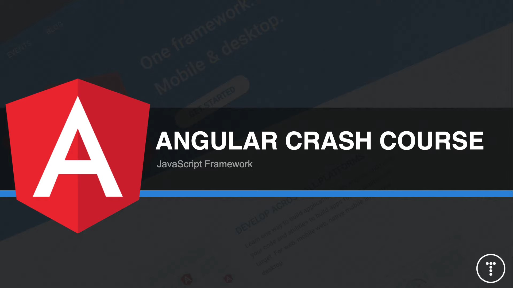

<br/>

**Table of Contents:**

- [Angular Crash Course from Traversy Media](#angular-crash-course-from-traversy-media)
  - [Components Introduction](#components-introduction)
  - [Services Introduction](#services-introduction)
  - [Installation](#installation)
  - [Project Structure](#project-structure)
- [Header and Button Component](#header-and-button-component)
- [Mock tasks - Dummy data](#mock-tasks---dummy-data)
- [Tasks List Component](#tasks-list-component)
  - [Task Item Component](#task-item-component)
  - [FontAwesome in Angular](#fontawesome-in-angular)
- [Task Service](#task-service)
  - [Using Observables](#using-observables)
  - [Using Angular HTTP Client](#using-angular-http-client)
- [Delete task](#delete-task)
  - [Passing event from child to parent component](#passing-event-from-child-to-parent-component)
- [Toggle task state (eg. reminder)](#toggle-task-state-eg-reminder)
- [Create task](#create-task)
  - [Add Task Form](#add-task-form)
  - [Emit event, add to database](#emit-event-add-to-database)
- [Show/Hide Form](#showhide-form)
  - [UI Service](#ui-service)
  - [Angular animation on ngIf](#angular-animation-on-ngif)
- [Angular Router](#angular-router)

<br/>

Angular v1 (or **AngularJS**) is completely different than Angular v2 (up to v13) that uses **TypeScript** instead of JavaScript. As of January 1, 2022, Google no longer updates AngularJS to fix security, browser compatibility, or [jQuery](https://en.wikipedia.org/wiki/JQuery) issues ([wiki](https://en.wikipedia.org/wiki/AngularJS)).

| Version     | Release Date      | Features                                                                                                                                                 |
| ----------- | ----------------- | -------------------------------------------------------------------------------------------------------------------------------------------------------- |
| Angular v2  | May 1, 2016       |                                                                                                                                                          |
| Angular v4  | March 23, 2017    | Introducing HttpClient and router life cycle, conditionally disable animations                                                                           |
| Angular v5  | November 1, 2017  | Improve for Progressive Web Apps                                                                                                                         |
| Angular v6  | May 4, 2018       | ng update, ng add, Angular Elements, Angular Material + CDK Components, Angular Material Starter Components, CLI Workspaces                              |
| Angular v7  | October 18, 2018  | Updates regarding Application Performance, Angular Material & CDK, Virtual Scrolling, Improved Accessibility of Selects, now supports Content Projection |
| Angular v8  | May 28, 2019      |                                                                                                                                                          |
| Angular v9  | February 6, 2020  |                                                                                                                                                          |
| Angular v10 | June 24, 2020     |                                                                                                                                                          |
| Angular v11 | November 11, 2020 |                                                                                                                                                          |
| Angular v12 | May 12, 2021      | Deprecated support for IE11                                                                                                                              |
| Angular v13 | December 15, 2021 |                                                                                                                                                          |

<br/>

Uses of Angular:

- Full featured Front-End framework (router, http, services, [dependency injection](https://angular.io/guide/what-is-angular#dependency-injection), etc) - although is more difficult to learn than React / Vue / Svelte
- Create dynamic frontend apps & UIs
- Uses TypeScript by default (superset of JavaScript)
- Uses RxJS library (for asynchronous programming) - uses observables
- Test-friendly ([Angular CLI](https://angular.io/guide/what-is-angular#angular-cli) has commands for tests)
- Popular in the large enterprise business (is more strict and standardized than React)
- Uses NPM (Node Package Manager)

<br/>

**First-Party Angular Libraries (preinstalled)**

https://angular.io/guide/what-is-angular#first-party-libraries

| [Angular Router](https://angular.io/guide/router)            | Advanced client-side navigation and routing based on Angular components. Supports lazy-loading, nested routes, custom path matching, and more. |
| ------------------------------------------------------------ | ---------------------------------------------------------------------------------------------------------------------------------------------- |
| [Angular Forms](https://angular.io/guide/forms-overview)     | Uniform system for form participation and validation.                                                                                          |
| [Angular HttpClient](https://angular.io/guide/http)          | Robust HTTP client that can power more advanced client-server communication.                                                                   |
| [Angular Animations](https://angular.io/guide/animations)    | Rich system for driving animations based on application state.                                                                                 |
| [Angular PWA](https://angular.io/guide/service-worker-intro) | Tools for building Progressive Web Applications (PWAs) including a service worker and Web app manifest.                                        |
| [Angular Schematics](https://angular.io/guide/schematics)    | Automated scaffolding, refactoring, and update tools that simplify development at large scale.                                                 |

(Saturday, January 29, 2022)

<br/>

## Components Introduction

**Angular is Component Driven**. A component includes a TypeScript class with a `@Component()` decorator, an HTML template, and styles. The `@Component()` decorator specifies the following Angular-specific information:

- A CSS selector that defines how the component is used in a template. HTML elements in your template that match this selector become instances of the component.
- An HTML template that instructs Angular how to render the component.
- An optional set of CSS styles that define the appearance of the template's HTML elements.

The following is a minimal Angular component.

```typescript
import { Component } from "@angular/core";

@Component({
  selector: "hello-world",
  template: `
    <h2>Hello World</h2>
    <p>This is my first component!</p>
  `,
})
export class HelloWorldComponent {
  // The code in this class drives the component's behavior.
}
```

To use this component, you write the following in a template:

```html
<hello-world></hello-world>
```

When Angular renders this component, the resulting DOM looks like this:

```html
<hello-world>
  <h2>Hello World</h2>
  <p>This is my first component!</p>
</hello-world>
```

Angular's component model offers strong encapsulation and an intuitive application structure. Components also make your application painless to unit test and can improve the overall readability of your code.

For more information on what to do with components, see the [Components](https://angular.io/guide/component-overview) section.

**Examples of Components in a Template:**


<br/>

## Services Introduction

https://angular.io/guide/architecture-services

Services are different than Components and they increase modularity and reusability -> Breaking your code into services will clean up your components (the components within the app are more organized - rather than putting all the functions into a single component).

Services are usually used for data fetching from server / API, validating user input, logging directly to the console.

<br/>

Here's an example of a service class that logs to the browser console:

```typescript
export class Logger {
  log(msg: any) {
    console.log(msg);
  }
  error(msg: any) {
    console.error(msg);
  }
  warn(msg: any) {
    console.warn(msg);
  }
}
```

<br/>

## Installation

https://angular.io/guide/setup-local

- First, download [Node.js](https://nodejs.org/en/download/) - we need it to use NPM (Node Package Manager)
- [If on Windows 10] Make sure you have `C:\Program Files\nodejs\` path on your `System Properties > Environment Variables > System Variables > Path`. Restart PC.

Then:

- Install the Angular CLI: To install the Angular CLI globally, open a terminal window and run the following command (You will run this only once):

```bash
npm install -g @angular/cli
```

- To create a new project (a new workspace for an app), run the CLI command `ng new` and provide the name `my-app`

```bash
ng new my-app
```

Note that you will be asked if you want to use Angular Router (yes/no), and which stylesheet will the app use (Simple CSS / SCSS / SASS (indented) / Less).

<br/>

The Angular CLI includes a server, for you to build and serve your app locally.

```
cd my-app
ng serve --open
```

The `ng serve` command launches the server, watches your files, and rebuilds the app as you make changes to those files. You can open the folder in Visual Studio Code (run `code .`)

The `--open` (or just `-o`) option automatically opens your browser to `http://localhost:4200/`. You should now see your App's default Landing Page:


<br/>

## Project Structure

https://angular.io/guide/file-structure#application-source-files

| APP SUPPORT FILES | PURPOSE                                                                                                                                                                                                                                                                                                                                                                                        |
| :---------------- | :--------------------------------------------------------------------------------------------------------------------------------------------------------------------------------------------------------------------------------------------------------------------------------------------------------------------------------------------------------------------------------------------- |
| `app/`            | Contains the component files in which your application logic and data are defined. See details [below](https://angular.io/guide/file-structure#app-src).                                                                                                                                                                                                                                       |
| `assets/`         | Contains image and other asset files to be copied as-is when you build your application.                                                                                                                                                                                                                                                                                                       |
| `environments/`   | Contains build configuration options for particular target environments. By default there is an unnamed standard development environment and a production ("prod") environment. You can define additional target environment configurations.                                                                                                                                                   |
| `favicon.ico`     | An icon to use for this application in the bookmark bar.                                                                                                                                                                                                                                                                                                                                       |
| `index.html`      | The main HTML page that is served when someone visits your site. The CLI automatically adds all JavaScript and CSS files when building your app, so you typically don't need to add any `<script>` or` <link>` tags here manually.                                                                                                                                                             |
| `main.ts`         | The main entry point for your application. Compiles the application with the [JIT compiler](https://angular.io/guide/glossary#jit) and bootstraps the application's root module (AppModule) to run in the browser. You can also use the [AOT compiler](https://angular.io/guide/aot-compiler) without changing any code by appending the `--aot` flag to the CLI `build` and `serve` commands. |
| `polyfills.ts`    | Provides polyfill scripts for browser support.                                                                                                                                                                                                                                                                                                                                                 |
| `styles.sass`     | Lists CSS files that supply styles for a project. The extension reflects the style preprocessor you have configured for the project.                                                                                                                                                                                                                                                           |
| `test.ts`         | The main entry point for your unit tests, with some Angular-specific configuration. You don't typically need to edit this file.                                                                                                                                                                                                                                                                |

**Default Angular Project Structure Overview:**

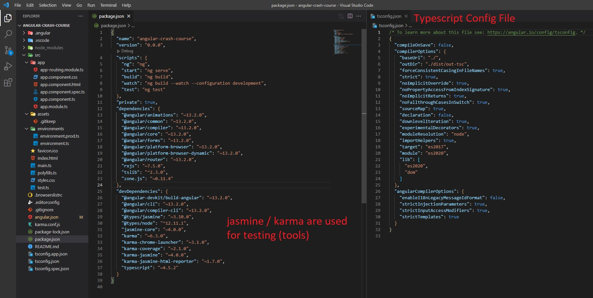


**Note:** **When we create a component (using the Angular CLI), the component will have 4 types of files:**

- `mycomp.component.ts` - The main typescript Class of that component (contains the HTML selector tag for component, the stylesheets path, and methods)
- `mycomp.component.html` - The template (HTML) for that component
- `mycomp.component.css` - Stylesheet for component
- `mycomp.component.spec.ts` - Code for testing the component

<br/>

From https://angular.io/guide/file-structure#application-source-files:

| `src/app/app.component.ts`      | Defines the logic for the application's root component, named `AppComponent`. The view associated with this root component becomes the root of [the view hierarchy](https://angular.io/guide/glossary#view-hierarchy) as you add components and services to your application. |
| :------------------------------ | :---------------------------------------------------------------------------------------------------------------------------------------------------------------------------------------------------------------------------------------------------------------------------- |
| `src/app/app.component.html`    | Defines the HTML template associated with the root `AppComponent`.                                                                                                                                                                                                            |
| `src/app/app.component.css`     | Defines the base CSS stylesheet for the root `AppComponent`.                                                                                                                                                                                                                  |
| `src/app/app.component.spec.ts` | Defines a unit test for the root `AppComponent`.                                                                                                                                                                                                                              |
| `src/app/app.module.ts`         | Defines the root module, named `AppModule`, that tells Angular how to assemble the application. Initially declares only the `AppComponent`. As you add more components to the app, they must be declared here.                                                                |

<br/>

In the `component.html` file, you can use **String Interpolation** to insert JavaScript (and access JavaScript properties/variables from the `component.ts` Component's Class):

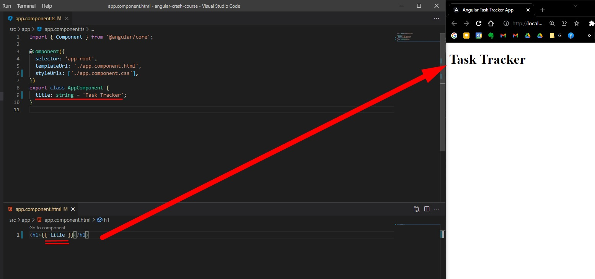

<br/>

<br/>

**Global Stylesheet**

Styles used for this angular crash course mini-project, in `/src/styles.css` - code from https://github.com/bradtraversy/angular-crash-2021

```css
@import url("https://fonts.googleapis.com/css2?family=Montserrat:ital,wght@0,200;0,300;0,400;0,500;0,600;0,700;0,800;1,200;1,300;1,400;1,500;1,600;1,700&display=swap");
* {
  box-sizing: border-box;
  margin: 0;
  padding: 0;
}
body {
  font-family: "Montserrat", sans-serif;
}
.container {
  max-width: 1200px;
  margin: 1rem auto;
  overflow: auto;
  min-height: 300px;
  padding: 1rem;
}
.btn {
  display: inline-block;
  background: #000;
  color: #fff;
  border: none;
  padding: 10px 20px;
  margin: 5px;
  border-radius: 5px;
  cursor: pointer;
  text-decoration: none;
  font-size: 15px;
  font-family: inherit;
}
.btn:focus {
  outline: none;
}
.btn:active {
  transform: scale(0.98);
}
.btn-block {
  display: block;
  width: 100%;
}
.form-control {
  margin: 20px 0;
}
.form-control label {
  display: block;
}
.form-control input {
  width: 100%;
  height: 40px;
  margin: 5px;
  padding: 3px 7px;
  font-size: 17px;
}
.form-control-check {
  display: flex;
  align-items: center;
  justify-content: space-between;
}
.form-control-check label {
  flex: 1;
}
.form-control-check input {
  flex: 2;
  height: 20px;
}
```

<br/>

# Header and Button Component

**To create a new Component in Angular, we need to open our terminal in the project's folder and type**

```bash
ng generate component components/header
```

(Note that we can specify to place the component in a new `components` folder):

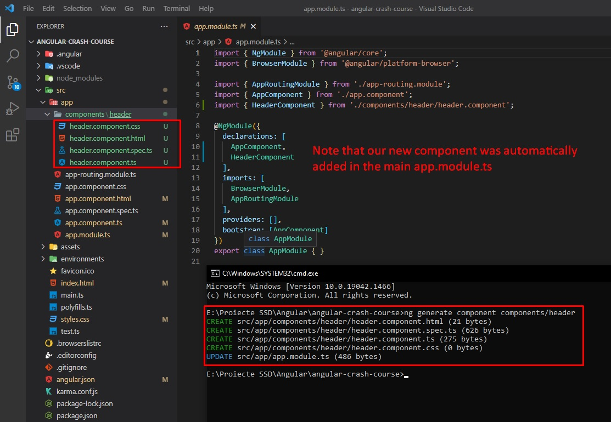

When we create a new component, we will have the following code in `componentName.component.ts`:


If we want to use the new component in our main app html, we just need to use its html selector (unlike React, we don't need to import anything):


And, we will move the `title` string variable from the `main app component` to the `header component`


<br/>

<br/>

Now, let's generate a **button component** (this button can be used later somewhere else for other functionalities, and will accept properties / passed values)

```bash
ng generate component components/button
```

Now, we want to be able to pass data / properties to the button (like button text, and button color). For this in out `button.component.ts` we need to import `Input` from `@angular/core`:


Note that we used `[ngStyle]="{'cssProperty': 'value'}"` in order to use inline style in Angular.

<br/>

---

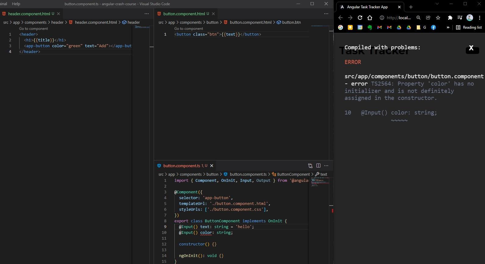

**Note:** By default, in Angular / TypeScript all variables/properties within a Class Component needs to have a default value (initialization), if you want to disable the error message thrown when you declare a property without initialization, you need to go **`tsconfig.json`** and set/add `"strictPropertyInitialization": false` (although not recommended). Or you can add a exclamation mark `!` as postfix operator, OR just initialize all your variables with a default value ([source](https://stackoverflow.com/questions/49699067/property-has-no-initializer-and-is-not-definitely-assigned-in-the-construc)).

---

<br/>

Now, if we want to add a simple event to that button, we just need to add in our button html, a `(click)="onClickLogSth()"` prop and then define that method inside component's typescript Class.

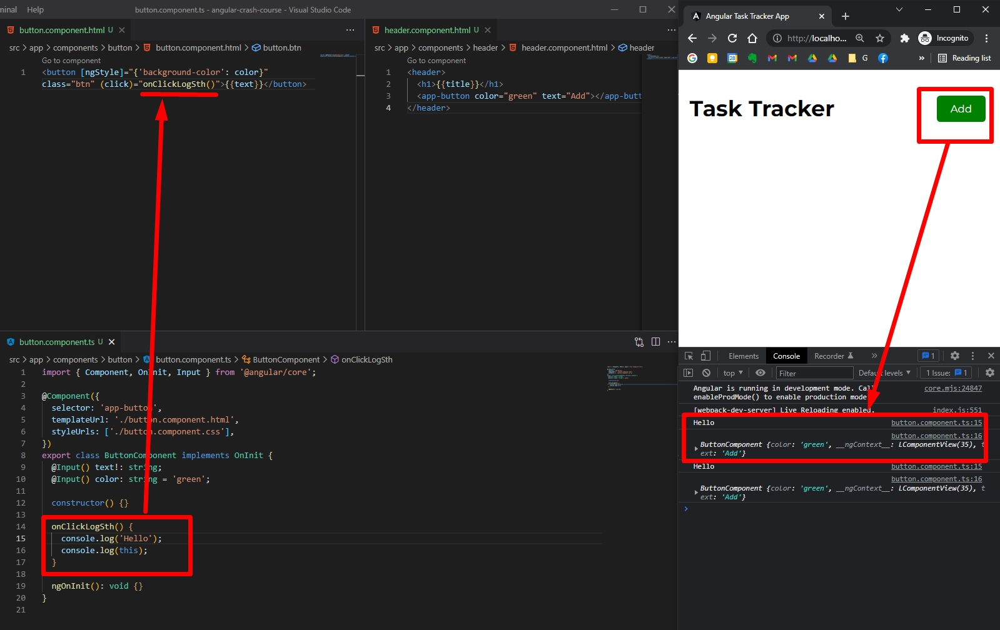

<br/>

---

<br/>

`src/app/components/button/button.component.html`

```html
<button
  [ngStyle]="{'background-color': color}"
  class="btn"
  (click)="onClickEvent()"
>
  {{text}}
</button>
```

**However, we want to make the button reusable (every button could have a different purpose, to trigger a different method) -> we need to add an `EventEmitter` and `Output` the event (the click of the button) in our `button.component.ts`**

`src/app/components/button/button.component.ts`

```typescript
import { Component, OnInit, Input, Output, EventEmitter } from "@angular/core";

@Component({
  selector: "app-button",
  templateUrl: "./button.component.html",
  styleUrls: ["./button.component.css"],
})
export class ButtonComponent implements OnInit {
  @Input() text!: string;
  @Input() color: string = "green";
  @Output() btnClickEvent = new EventEmitter();

  constructor() {}

  onClickEvent() {
    this.btnClickEvent.emit();
  }

  ngOnInit(): void {}
}
```

Then, in the header component `header.component.html` we to assign to the `<app-button>` what we want to happen (which event to be triggered), eg `(btnClickEvent)="toggleAddTask()"`:

`src/app/components/header/header.component.html`

```html
<header>
  <h1>{{title}}</h1>
  <app-button
    color="green"
    text="Add"
    (btnClickEvent)="toggleAddTask()"
  ></app-button>
</header>
```

And finally we define our wanted event (method) in our `header.component.ts`

`src/app/components/header/header.component.ts`

```typescript
import { Component, OnInit } from "@angular/core";

@Component({
  selector: "app-header",
  templateUrl: "./header.component.html",
  styleUrls: ["./header.component.css"],
})
export class HeaderComponent implements OnInit {
  title: string = "Task Tracker";

  constructor() {}

  ngOnInit(): void {}

  toggleAddTask() {
    console.log("toggle");
  }
}
```

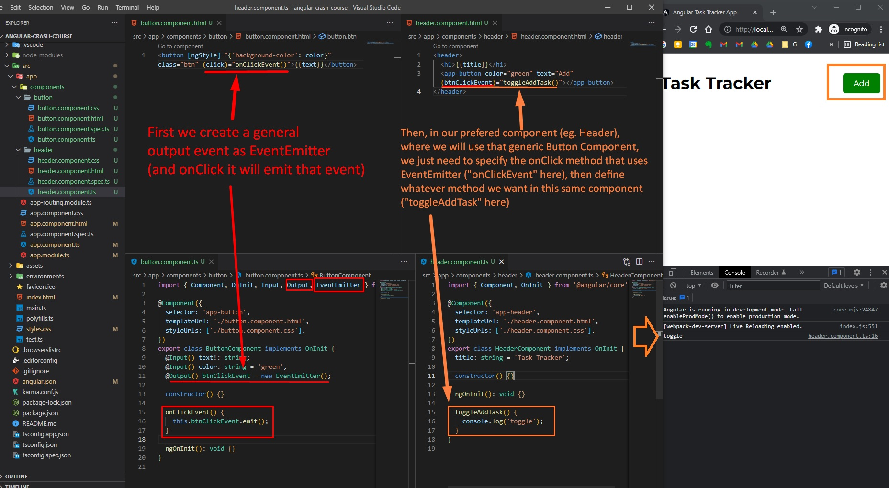

<br/>

# Mock tasks - Dummy data

Usually a front-end app in Angular will consume some sort of API that serves JSON from a Server (eg. an API App made with Django-Python, or Spring-Java, or Node.js / Express / Next etc).

For now, let's create a basic JavaScript List that will contain some dummy data (objects) as Task Items. So, in `/src/app` folder we can create a `mock-tasks.ts` file:

```typescript
// src/app/mock-tasks.ts
import { Task } from "./Task";

export const TASKS: Task[] = [
  {
    id: 1,
    text: "Doctors Appointment",
    day: "May 5th at 2:30pm",
    reminder: true,
  },
  {
    id: 2,
    text: "Meeting at School",
    day: "May 6th at 1:30pm",
    reminder: true,
  },
  {
    id: 3,
    text: "Food Shopping",
    day: "May 7th at 12:30pm",
    reminder: false,
  },
];
```

However, since we are in TypeScript, we would want to also create an **interface** where we will define our types for each data property (key-value pair in each object/item). For this we can create inside `/src/app` a `Tasks.ts` file:

(Then on `mock-tasks.ts` we need to import this `Task` interface and specify to our TASKS constant/variable the type `Task[]` - an array `[]` of `Task` objects)

```typescript
// src/app/Task.ts
export interface Task {
  id?: number;
  text: string;
  day: string;
  reminder: boolean;
}
```

Note that the id has a question mark `?`, which means that this key-value is optional. In this case we made our `id` property optional because when we create a Task via app's form (input from user), the task won't have an ID until we save it the JSON Server (Rest API Server App), therefore it will be empty at first (optional), then it will have the id.

<br/>

# Tasks List Component

First generate the component in Angular CLI (terminal opened in the same path as the main project folder)

```bash
ng generate component components/tasks
```

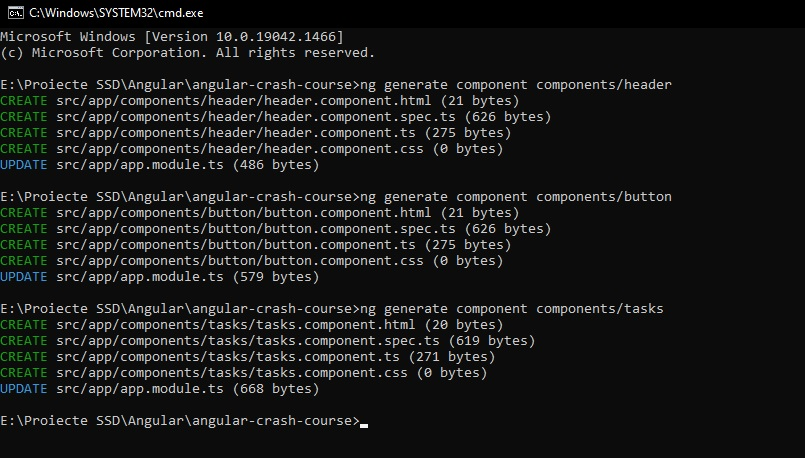

We can import it immediately in `app.component.html` as `<app-tasks></app-tasks>` HTML tag.

In `tasks.component.ts`, we can import the dummy data (that normally would have come from an Rest API Server) along with the `Task` interface. Here we will define a new variable/property within this class called `tasks` that will have/import all the dummy data.

```typescript
// src/app/components/tasks/task.component.ts
import { Component, OnInit } from "@angular/core";
import { Task } from "../../Task";
import { TASKS } from "../../mock-tasks";

@Component({
  selector: "app-tasks",
  templateUrl: "./tasks.component.html",
  styleUrls: ["./tasks.component.css"],
})
export class TasksComponent implements OnInit {
  tasks: Task[] = TASKS;

  constructor() {}

  ngOnInit(): void {}
}
```

Now, to loop over each item in `tasks` and render it on our main app page, we will call `*ngFor` directive (this `ng` stands for [Next Generation of HTML ... or just a**NG**ular](https://stackoverflow.com/questions/14669322/what-does-the-ng-stand-for-in-angular-js-directives)) in the `tasks.component.html` file:

```html
// src/app/components/tasks/tasks.component.html
<div *ngFor="let taskItem of tasks">{{taskItem.text}}</div>
```


<br/>

However, we don't want to show each rendered Task item in a simple `<div>`. We will create a custom appearance/html for each item, by creating a new `task-item` component.

## Task Item Component

Run:

```bash
ng generate component components/task-item
```

In `task-item.component.ts`, we need to import `Input` from `@angular/core` along with the `Task` interface, then we'll declare an `@Input() task!: Task` property within this task-item component:

```typescript
// src/app/components/task-item/task-item.components.ts
import { Component, OnInit, Input } from "@angular/core";
import { Task } from "../../Task";

@Component({
  selector: "app-task-item",
  templateUrl: "./task-item.component.html",
  styleUrls: ["./task-item.component.css"],
})
export class TaskItemComponent implements OnInit {
  @Input() task!: Task;

  constructor() {}

  ngOnInit(): void {}
}
```

Then our task-item html (the render/template of task-item), we will write:

```html
<!-- src/app/components/task-item/task-item.component.html -->
<div class="task">
  <div class="task__title">{{task.text}}</div>
  <p>{{task.day}}</p>
</div>
```

We can also add some style to this task-item component:

```css
/* src/app/components/task-item/task-item.component.css */
.task {
  background: #f4f4f4;
  margin-bottom: 1rem;
  padding: 0.5rem 1rem;
  cursor: pointer;
}
.task__title {
  display: flex;
  align-items: center;
  justify-content: space-between;
  font-weight: 600;
}
.task__title fa-icon {
  color: rgb(107, 107, 107);
}
.task.reminder {
  border-left: 0.25rem solid green;
}
```

Finally, in `tasks.component.html` list, we will replace the `<div>` with a `<app-task-item>` and we will pass in a property of `[task]="taskItem"`, like so:

```html
<!-- src/app/components/tasks/tasks.component.html -->
<app-task-item *ngFor="let taskItem of tasks" [task]="taskItem"></app-task-item>
```

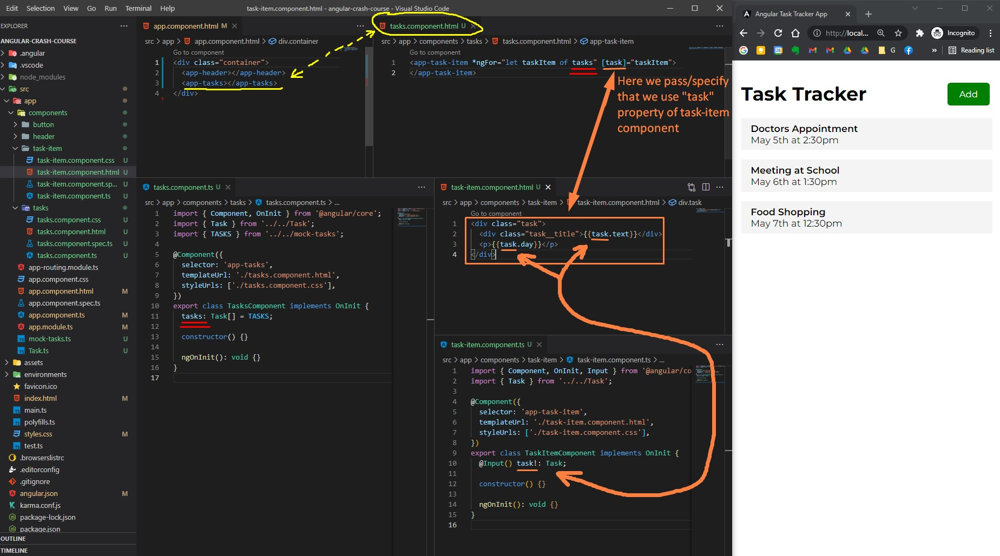

Note that each task item with the CSS style class of `task` is wrapped within a `<app-task-item>` tag, so you must define your CSS selectors accordingly in the future.


<br/>

---

## FontAwesome in Angular

For each task, we can also add a delete icon (trash bin), for that we can install font-awesome using this command: https://github.com/FortAwesome/angular-fontawesome

```bash
ng add @fortawesome/angular-fontawesome
```

After we install font-awesome, we just need to import and declare the icon we want in the TypeScript file of component and use it on our html component:

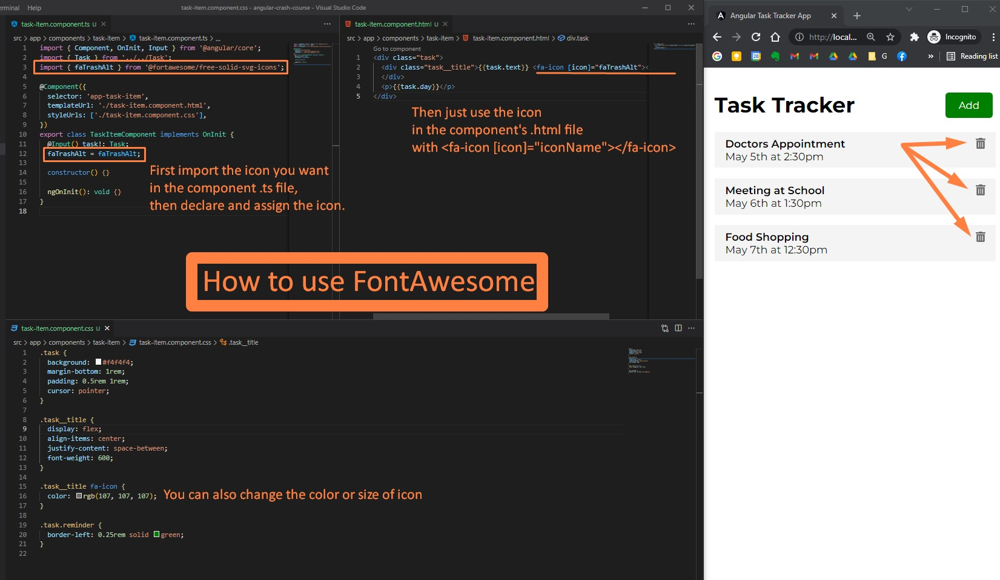

This is like 10 times easier than importing and using FontAwesome in React or Next.js ...

---

<br/>

(Sunday, January 30, 2022)

# Task Service

Now, instead of bringing mock tasks (dummy data) into our Task List component, let's assume these tasks will come from an Rest API (JSON Server) and create a **Service** for our mock tasks.

To generate a server called task in a folder called `services`, we need to run in Angular CLI:

```bash
ng generate service services/task
```

Now, in the new file `/src/app/services/task.service.ts`, we will import both `Task` interface and `TASKS` dummy list of data, and we will create a method called `getTasks()` that will return a Task Array `Task[]`.

So, instead of having the TASKS data directly in our Task List component, we will call this `getTasks` method from this `task.service` (as like this service would have brought the data from an API through a http request).

```typescript
// src/app/services/task.service.ts
import { Injectable } from "@angular/core";
import { Task } from "../Task";
import { TASKS } from "../mock-tasks";

@Injectable({
  providedIn: "root",
})
export class TaskService {
  constructor() {}

  getTasks(): Task[] {
    return TASKS;
  }
}
```

<br/>

Now, in `tasks/tasks.component.ts`, we will obviously replace the `TASKS` in `tasks` property with an empty array, and, in order to use the service, we need to import it and add it as a provider (as parameter) to the constructor. Then, we need to call it in our `ngOnInit` function.

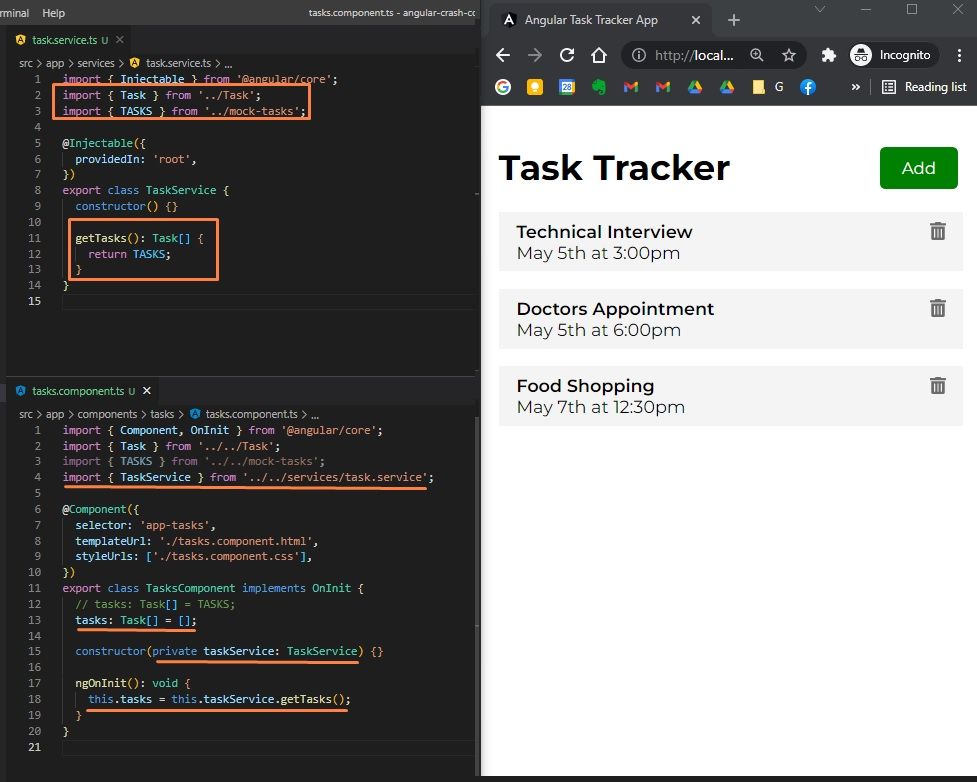

([Angular Crash Course 00:49:00](https://youtu.be/3dHNOWTI7H8?t=2948), Tuesday, February 22, 2022)

## Using Observables

However, this is not really the proper way of using a service. Usually we need to use an **observer** inside the `ngOnInit` method (in order to deal with asynchronous data when fetching from a server).

So, to get the tasks from `taskService` on the Tasks List Component (inside `ngOnInit` method) by using an **observer**, we need to `import { Observable, of } from 'rxjs';`

Then, instead of using `getTasks(): Task[] { return TASKS; }` **(`task.service.ts`)**, we will use an `Observable<Task[]>` as defined return type, and we will return `of(TASKS)`.

```typescript
// src/app/services/task.service.ts
import { Injectable } from "@angular/core";
import { Task } from "../Task";
import { TASKS } from "../mock-tasks";
import { Observable, of } from "rxjs";

@Injectable({
  providedIn: "root",
})
export class TaskService {
  constructor() {}

  getTasks(): Observable<Task[]> {
    return of(TASKS);
  }
}
```

Then (in order to solve the following error `src/app/components/tasks/tasks.component.ts:16:5 - error TS2740: Type 'Observable<Task[]>' is missing the following properties from type 'Task[]': length, pop, push, concat, and 27 more. line 16 this.tasks = this.taskService.getTasks();`), in `ngOnInit(): void{}` function **(`tasks.components.ts`)** we need to call (or "_subscribe_") `this.taskService.getTasks().subscribe((tasks) => (this.tasks = tasks))`.

We can think of this as a _promise_.


## Using Angular HTTP Client

Usually we will work with a Backend REST API, where we will use The Angular HTTP Client.

The Angular HTTP Client actually returns an _observable_ (so we don't need to import `of` from `rxjs` and convert our data).

### Install and configure Fake JSON Server npm

For this tutorial we can use a dummy pre-made back-end service (REST API), namely **[JSON Server npm - a full fake REST API with zero coding in less than 30 seconds](https://www.npmjs.com/package/json-server)**. To install Fake JSON Server:

- in CMD Prompt/Terminal, we need to run `npm i json-server`.
- then, in `package.json`, in `"scripts"` we need to add `"server": "json-server --watch db.json --port 5000"` (we will run this back-end api on port 5000 instead of 3000 as default)
- create `db.json` file (in project root directory, along with `package.json`), and add:

```json
{
  "tasks": [
    {
      "id": 1,
      "text": "Technical Interview",
      "day": "May 5th at 3:00pm",
      "reminder": true
    },
    {
      "id": 2,
      "text": "Doctors Appointment",
      "day": "May 5th at 6:00pm",
      "reminder": true
    },
    {
      "id": 3,
      "text": "Food Shopping",
      "day": "May 7th at 12:30pm",
      "reminder": false
    }
  ]
}
```

- run in CMD Prompt: `npm run server`. Now we will have our Angular Front-End App on http://localhost:4200/, and REST API Back-end on http://localhost:5000/ (where we can make GET/POST/PUT/DELETE requests just like on a real server made with Django/Express.js/Node.js/Spring-Java/etc).

---

### Using Fake JSON Server npm

Now let's refactor our app to use HttpClient (Note that with React/Vue/VanillaJS we would have used Fetch API, async/await or Axios/AJAX), by importing `import { HttpClient, HttpHeaders } from "@angular/common/http";` in `task.service.ts` and importing `import { HttpClientModule } from "@angular/common/http"`

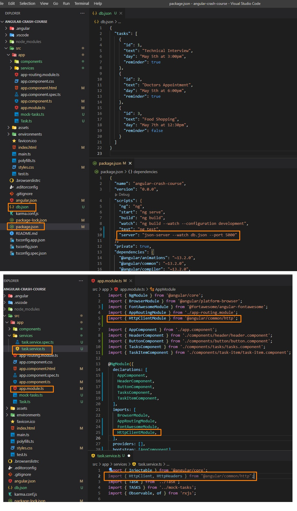

Finally, we can add our http://localhost:5000/tasks as a property `apiURL` in `task.service.ts`, and pass it in our `TaskService` constructor as a HttpClient object (that knows how to do POST/GET/PUT/etc requests), and then, in the `getTasks()` method we return `this.httpClient.get<Task[]>(this.apiURL);` (basically the GET request from that URL, where's our REST API Back-end on port 5000).

Now we get our Tasks from an actual (fake) REST API (with data in `db.json` file):

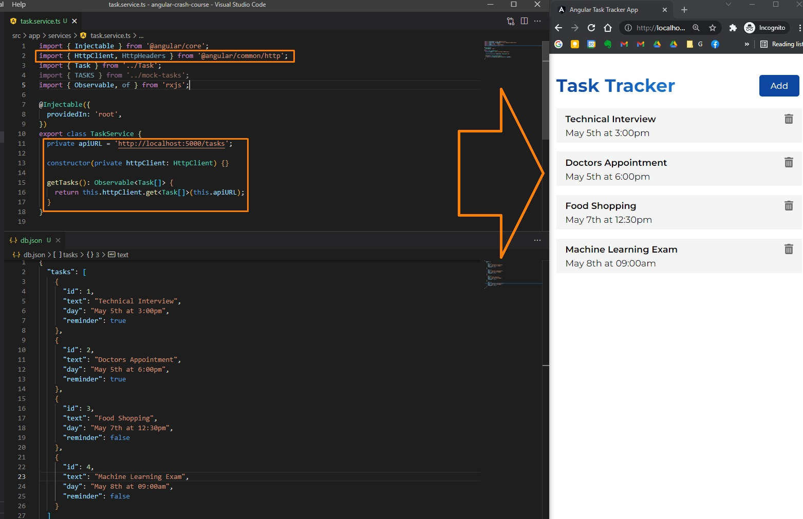

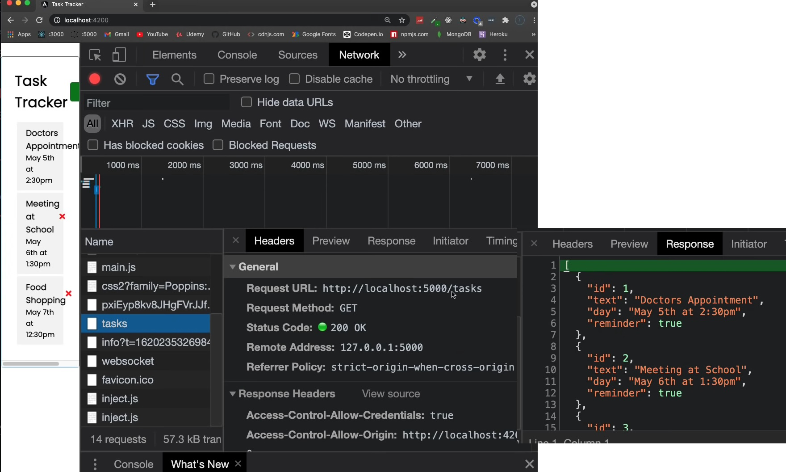

<br/>

# Delete task

Now, when we click on X on a task, we want to call a delete method for that task. In Angular, we can add an event to a HTML tag by adding `(click)="functionNameThatIsTriggered()"`. In our case, in `task-item.component.html` we can have `<fa-icon (click)="onDelete(task)" title="Delete this item" [icon]="faTrashAlt"></fa-icon>` (where we can also pass in the `task` object):

```html
<!-- /app/components/task-item/task-item.component.html -->
<div class="task">
  <div class="task__title">
    {{task.text}}
    <fa-icon
      (click)="onDelete(task)"
      title="Delete this item"
      [icon]="faTrashAlt"
    >
    </fa-icon>
  </div>
  <p class="task__date">{{task.day}}</p>
</div>
```

Then, in `task-item.component.ts`, we just defin our `onDelete` method/function, where we can log the `task`:


Now, to interact with the server (DELETE request), we don't actually want to write all the functionality for requests here (in the actual task-item component's typescript file), but rather in the `tasks` component (that is the parent of `task-item` component). So, here (on child component `task-item.component.ts`), we want to _emmit_ the event to the parent component `task`. For this, we import `Output, EventEmitter`, and then, we define a new property: `@Output() onDeleteTask: EventEmitter<Task> = new EventEmitter();`.

## Passing event from child to parent component

In `tasks.component.html` we add the emitted event from child component `task-item`: `(onDeleteTask)="deleteTask(task)`

```typescript
// /app/components/task-item/task-item.component.ts
import { Component, OnInit, Input, Output, EventEmitter } from "@angular/core";
import { Task } from "../../Task";
import { faTrashAlt } from "@fortawesome/free-solid-svg-icons";

@Component({
  selector: "app-task-item",
  templateUrl: "./task-item.component.html",
  styleUrls: ["./task-item.component.css"],
})
export class TaskItemComponent implements OnInit {
  @Input() task!: Task;
  @Output() onDeleteTask: EventEmitter<Task> = new EventEmitter();

  faTrashAlt = faTrashAlt;

  constructor() {}

  ngOnInit(): void {}

  onDelete(task: Task) {
    this.onDeleteTask.emit(task);
  }
}
```

```html
<!-- /app/components/tasks/tasks.component.html -->
<app-task-item
  *ngFor="let taskItem of tasks"
  [task]="taskItem"
  (onDeleteTask)="deleteTask(task)"
>
</app-task-item>
```

or

```html
<app-task-item
  *ngFor="let taskItem of tasks"
  [task]="taskItem"
  (onDeleteTask)="deleteTask($event)"
>
</app-task-item>
```

And almost finally, we need to actually define `deleteTask` method inside `tasks.component.ts`. But, before that, we need to add the Server Functionality (the Delete request) in `task-service.ts`. For this delete request, we need to have the id of the task we want to delete (for this we can just concatenate the url of http://localhost:5000/tasks with the task.id):

```typescript
// /app/services/task.service.ts
import { Injectable } from "@angular/core";
import { HttpClient, HttpHeaders } from "@angular/common/http";
import { Task } from "../Task";
import { TASKS } from "../mock-tasks";
import { Observable, of } from "rxjs";

@Injectable({
  providedIn: "root",
})
export class TaskService {
  private apiURL = "http://localhost:5000/tasks";

  constructor(private httpClient: HttpClient) {}

  getTasks(): Observable<Task[]> {
    return this.httpClient.get<Task[]>(this.apiURL);
  }

  deleteTasks(task: Task): Observable<Task> {
    const url = `${this.apiURL}/${task.id}`;
    return this.httpClient.delete<Task>(url);
  }
}
```

Now we define `deleteTask` method inside `tasks.component.ts`: here we first call `deleteTask(task)` from `task.service.ts` (so we do the DELETE request to our API and actually delete the task from database), then, inside `subscribe()` method, we re-render / refresh our List, filtering out the deleted task.

We can think of this `.subscribe()` method as a `.then()` method.

```typescript
// src/app/components/tasks/tasks.component.ts
import { Component, OnInit } from "@angular/core";
import { Task } from "../../Task";
import { TaskService } from "../../services/task.service";

@Component({
  selector: "app-tasks",
  templateUrl: "./tasks.component.html",
  styleUrls: ["./tasks.component.css"],
})
export class TasksComponent implements OnInit {
  tasks: Task[] = [];

  constructor(private taskService: TaskService) {}

  ngOnInit(): void {
    this.taskService.getTasks().subscribe((tasks) => (this.tasks = tasks));
  }

  deleteTask(task: Task) {
    this.taskService
      .deleteTask(task)
      .subscribe(
        () => (this.tasks = this.tasks.filter((t) => t.id !== task.id))
      );
  }
}
```


In case of `Property 'task' does not exist on type 'TasksComponent'. Did you mean 'tasks'` error:

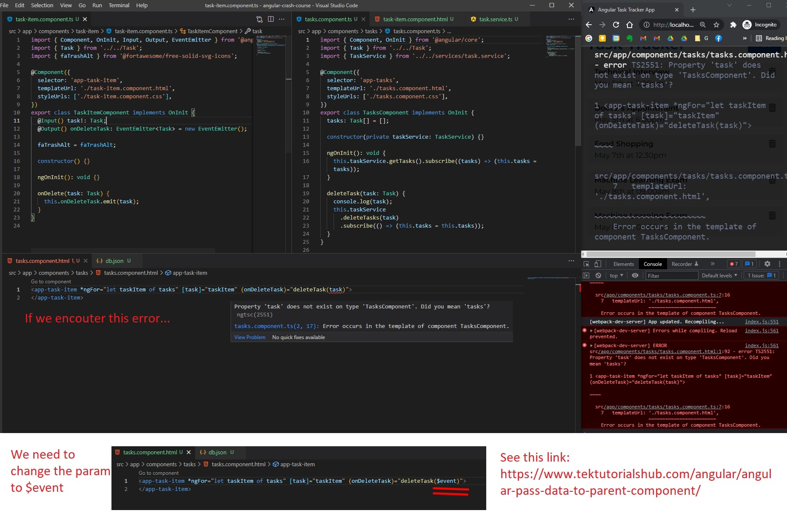

References:

- https://www.tektutorialshub.com/angular/angular-pass-data-to-parent-component/
- https://angular.io/guide/inputs-outputs

<br/>

**Note:** The `db.json` from our Fake REST API **JSON Server (npm)** is actually our database. When we delete a task from front-end, the item gets automatically removed from this `db.json` file. Pretty cool.

**Also note (even if it was mentioned before):** The `HttpClient` Class (instantiated as object in constructor) imported from `@angular/common/http` knows how to make all types of request (has all the methods defined). Here, for a delete request we just called `httpClient.delete<Task>("http://localhost:5000/tasks:id")`.

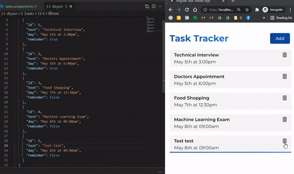

<br/>

# Toggle task state (eg. reminder)

([Angular Crash Course 1h13m](https://youtu.be/3dHNOWTI7H8?t=4380))

When we double-click (double-tap) a task, we want to change the boolean "reminder" value to the opposite of it's current value (toggle its state).

(UI) We will also add a blue border on a task if the reminder is set (we add a CSS class of `reminder`). For this, in `task-item.component.html`, since it's a conditional CSS class, we use the **[ngClass]** Angular directive (that puts "reminder" CSS class when `task.reminder` is true):


We will also add an event (of double-click - `dblClick`) here in `task-item.component.html`:

```html
<!-- /components/task-item/task-item.component.html -->
<div
  [ngClass]="{reminder: task.reminder}"
  class="task"
  (dblclick)="onClickToggleReminder(task)"
>
  <div class="task__title">
    {{task.text}}
    <fa-icon
      (click)="onDelete(task)"
      title="Delete this item"
      [icon]="faTrashAlt"
    >
    </fa-icon>
  </div>
  <p class="task__date">{{task.day}}</p>
</div>
```

<br/>

And now to define `onClickToggleReminder` in `task.item.component.ts`, and also emit a new method (with the occured event) from this child `task-item` component to parent `tasks` component:

```typescript
// task-item.component.ts
import { Component, OnInit, Input, Output, EventEmitter } from "@angular/core";
import { Task } from "../../Task";
import { faTrashAlt } from "@fortawesome/free-solid-svg-icons";

@Component({
  selector: "app-task-item",
  templateUrl: "./task-item.component.html",
  styleUrls: ["./task-item.component.css"],
})
export class TaskItemComponent implements OnInit {
  @Input() task!: Task;
  @Output() onDeleteTask: EventEmitter<Task> = new EventEmitter();
  @Output() onToggleReminder: EventEmitter<Task> = new EventEmitter();

  faTrashAlt = faTrashAlt;

  constructor() {}

  ngOnInit(): void {}

  onClickDelete(task: Task) {
    this.onDeleteTask.emit(task);
  }
  onClickToggleReminder(task: Task) {
    this.onToggleReminder.emit(task);
  }
}
```

On parent component `tasks`, we add `(onToggleReminder)="toggleReminderTask($event)"` in `tasks.component.html`, and define that method in `tasks.component.ts` (here we will also call `updateTaskReminder` method from `task.service.ts`).

```html
<!-- /components/tasks/tasks.component.html -->
<app-task-item
  *ngFor="let taskItem of tasks"
  [task]="taskItem"
  (onDeleteTask)="deleteTask($event)"
  (onToggleReminder)="toggleReminderTask($event)"
>
</app-task-item>
```

```typescript
// task.component.ts
import { Component, OnInit } from "@angular/core";
import { Task } from "../../Task";
import { TaskService } from "../../services/task.service";

@Component({
  selector: "app-tasks",
  templateUrl: "./tasks.component.html",
  styleUrls: ["./tasks.component.css"],
})
export class TasksComponent implements OnInit {
  tasks: Task[] = [];

  constructor(private taskService: TaskService) {}

  ngOnInit(): void {
    this.taskService.getTasks().subscribe((tasks) => (this.tasks = tasks));
  }

  deleteTask(task: Task) {
    this.taskService
      .deleteTask(task)
      .subscribe(
        () => (this.tasks = this.tasks.filter((t) => t.id !== task.id))
      );
  }
  toggleReminderTask(task: Task) {
    task.reminder = !task.reminder;
    this.taskService.updateTaskReminder(task).subscribe();
  }
}
```

And, finally, we need to define / tell our server how to handle this new PUT request. Note that, in `this.httpClient.put<Task>(url, task);` we also added `task` as a second parameter (because along with a PUT/update request we also send the new data to update, unlike the DELETE request that only needs the id specified in URL).

We will also define `const httpOptions = { headers: new HttpHeaders({ 'Content-Type': 'application/json', }), }; ` which will be useful when we will make POST requests (Create).

```typescript
// task.service.ts
import { Injectable } from "@angular/core";
import { HttpClient, HttpHeaders } from "@angular/common/http";
import { Task } from "../Task";
import { TASKS } from "../mock-tasks";
import { Observable, of } from "rxjs";

const httpOptions = {
  headers: new HttpHeaders({
    "Content-Type": "application/json",
  }),
};

@Injectable({
  providedIn: "root",
})
export class TaskService {
  private apiURL = "http://localhost:5000/tasks";

  constructor(private httpClient: HttpClient) {}

  getTasks(): Observable<Task[]> {
    return this.httpClient.get<Task[]>(this.apiURL);
  }

  deleteTask(task: Task): Observable<Task> {
    const url = `${this.apiURL}/${task.id}`;
    return this.httpClient.delete<Task>(url);
  }

  updateTaskReminder(task: Task): Observable<Task> {
    const url = `${this.apiURL}/${task.id}`;
    return this.httpClient.put<Task>(url, task, httpOptions);
  }
}
```

And we're done with updating/toggling the reminder state of a task!


<br/>

(Wednesday, February 23, 2022)

# Create task

So far we can list tasks, toggle and delete them. And we also have a Fake REST API Server:

```bash
ng serve --open # for localhost:4200
npm run server # localhost:5000
```

Let's also create them from front-end UI! ([Angular Crash Course 1h20min](https://youtu.be/3dHNOWTI7H8?t=4843)).

## Add Task Form

Let's create a new component:

```bash
ng generate component components/add-task
```

In `tasks-component.html` we will add this new component `add-task` (so now the `tasks` component will be the parent component of both `task-item` and `add-task`)

```html
<!-- task.component.html -->
<app-add-task></app-add-task>

<app-task-item
  *ngFor="let taskItem of tasks"
  [task]="taskItem"
  (onDeleteTask)="deleteTask($event)"
  (onToggleReminder)="toggleReminderTask($event)"
>
</app-task-item>
```

And in the new `add-task.component.html`

```html
<form class="form-container">
  <div class="form-control">
    <label for="formText">New task name</label>
    <input type="text" id="formText" name="formText" autocomplete="off" />
  </div>
  <div class="form-control">
    <label for="formDatetime">Day &amp; Time</label>
    <input type="datetime-local" id="formDatetime" name="formDatetime" />
  </div>
  <div class="form-control form-control-check">
    <label for="formReminder">Set reminder?</label>
    <input
      type="checkbox"
      id="formReminder"
      name="formReminder"
      title="Toggle check"
    />
  </div>
  <div class="form-control-btn">
    <input type="submit" value="Save Task" class="btn" />
  </div>
</form>
```

Now let's declare these form fields in `add-task.component.ts`

```typescript
import { Component, OnInit } from "@angular/core";

@Component({
  selector: "app-add-task",
  templateUrl: "./add-task.component.html",
  styleUrls: ["./add-task.component.css"],
})
export class AddTaskComponent implements OnInit {
  text!: string;
  date!: string;
  reminder: boolean = false;

  constructor() {}

  ngOnInit(): void {}
}
```

We will also add to our Angular app a `forms` module. In `app.module.ts`, we need to `import { FormsModule } from '@angular/forms';` and also add it in `@NgModule imports`. With this, we can insert in `add-task.component.html` a "two-way data binding": `[(ngModel)]="text"` (Note that brackets `[]` are for input when we are binding something, and paranthesis `()` are events for output), where `text` in the name of the property (variable) in `add-task.component.ts`.


Code for `add.task.component.html` (updated with `ng` directives):

```html
<form class="form-container" (ngSubmit)="onSubmit()">
  <div class="form-control">
    <label for="formText">New task name</label>
    <input
      type="text"
      id="formText"
      name="formText"
      [(ngModel)]="text"
      autocomplete="off"
    />
  </div>
  <div class="form-control">
    <label for="formDatetime">Day &amp; Time</label>
    <input
      type="datetime-local"
      id="formDatetime"
      name="formDatetime"
      [(ngModel)]="date"
    />
  </div>
  <div class="form-control form-control-check">
    <label for="formReminder">Set reminder?</label>
    <input
      type="checkbox"
      id="formReminder"
      name="formReminder"
      title="Toggle check"
      [(ngModel)]="reminder"
    />
  </div>
  <div class="form-control-btn">
    <input type="submit" value="Save Task" class="btn" />
  </div>
</form>
```

Now, usually we would have assigned events for our form (eg. on submit, then add event.preventDefault(), etc), but with Angular, we just need to add in the `<form>` tag the following: `(ngSubmit)="onSubmit()"` and then we just need to define the `onSubmit()` function in `add.task.component.ts`. Note that this `onSubmit()` works because we imported `{ FormsModule } from '@angular/forms'` in `app.module.ts`.

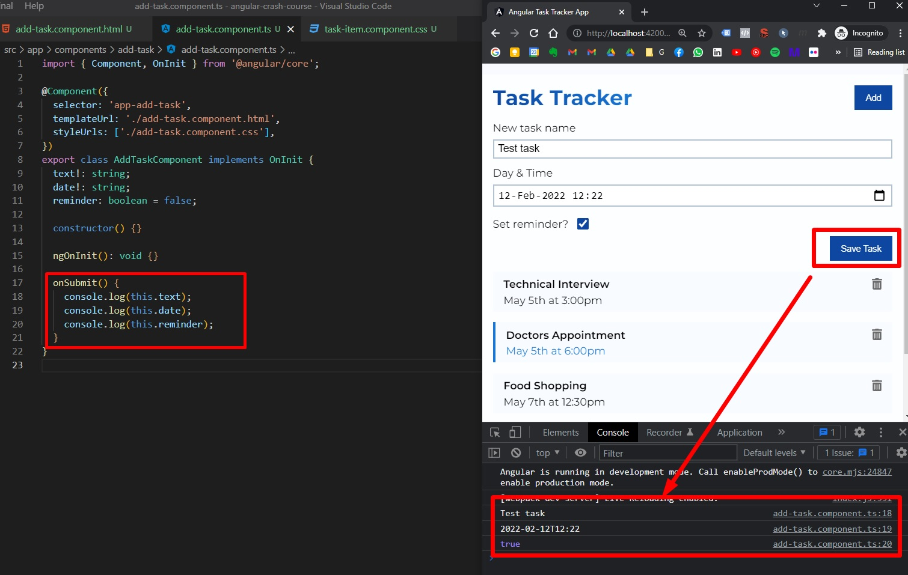

We can also do some simple form validation by writing `if (this.text && this.date)` and clear the form after submit `this.text = ''; this.date = ''; this.reminder = false;`

## Emit event, add to database

Now we need to emit this event, to transmit it further to the parent component `lists`. In `add-task.component.ts`, we need to `import {Output, EventEmitter } from '@angular/core';`. We will emit the event as a function called `onAddTask`.

```typescript
// add-task.component.ts
import { Component, OnInit, Output, EventEmitter } from "@angular/core";
import { Task } from "src/app/Task";

@Component({
  selector: "app-add-task",
  templateUrl: "./add-task.component.html",
  styleUrls: ["./add-task.component.css"],
})
export class AddTaskComponent implements OnInit {
  @Output() onAddTask: EventEmitter<Task> = new EventEmitter();
  text!: string;
  date!: string;
  reminder: boolean = false;

  constructor() {}

  ngOnInit(): void {}

  onSubmit() {
    if (this.text && this.date) {
      // Create new Task object
      const newTaskObj = {
        text: this.text,
        day: this.date,
        reminder: this.reminder,
      };

      // Emit event
      this.onAddTask.emit(newTaskObj);

      // Clear form after submit
      this.text = "";
      this.date = "";
      this.reminder = false;
    }
  }
}
```

In parent's component `tasks.component.html`, we need to pass to `<app-add-task>` the emitted event: `(onAddTask)="addTask($event)"`.

```html
<!-- tasks.component.html -->
<app-add-task (onAddTask)="addTask($event)"></app-add-task>

<app-task-item
  *ngFor="let taskItem of tasks"
  [task]="taskItem"
  (onDeleteTask)="deleteTask($event)"
  (onToggleReminder)="toggleReminderTask($event)"
>
</app-task-item>
```

Then, in `tasks.component.ts` we need to define our new function `addTask`, but before that, in `task.service.ts` we need to actually define our `POST` (Create) request that we will send to our back-end REST API (in this POST request we will include our task object, and our headers).

```typescript
// task.service.ts
import { Injectable } from "@angular/core";
import { HttpClient, HttpHeaders } from "@angular/common/http";
import { Task } from "../Task";
import { TASKS } from "../mock-tasks";
import { Observable, of } from "rxjs";

const httpOptions = {
  headers: new HttpHeaders({
    "Content-Type": "application/json",
  }),
};

@Injectable({
  providedIn: "root",
})
export class TaskService {
  private apiURL = "http://localhost:5000/tasks";

  constructor(private httpClient: HttpClient) {}

  getTasks(): Observable<Task[]> {
    return this.httpClient.get<Task[]>(this.apiURL);
  }
  deleteTask(task: Task): Observable<Task> {
    const url = `${this.apiURL}/${task.id}`;
    return this.httpClient.delete<Task>(url);
  }
  updateTaskReminder(task: Task): Observable<Task> {
    const url = `${this.apiURL}/${task.id}`;
    return this.httpClient.put<Task>(url, task, httpOptions);
  }
  addTask(task: Task): Observable<Task> {
    return this.httpClient.post<Task>(this.apiURL, task, httpOptions);
  }
}
```

Now, back to `tasks.component.ts`, in our function `addTask` we will call the addTask from service (that makes the POST request), then, in the subscribe method (our similar `.then()` method), we will push the last added task to our already rendered list:

```typescript
import { Component, OnInit } from "@angular/core";
import { Task } from "../../Task";
import { TaskService } from "../../services/task.service";

@Component({
  selector: "app-tasks",
  templateUrl: "./tasks.component.html",
  styleUrls: ["./tasks.component.css"],
})
export class TasksComponent implements OnInit {
  tasks: Task[] = [];

  constructor(private taskService: TaskService) {}

  ngOnInit(): void {
    this.taskService.getTasks().subscribe((tasks) => (this.tasks = tasks));
  }

  deleteTask(task: Task) {
    this.taskService
      .deleteTask(task)
      .subscribe(
        () => (this.tasks = this.tasks.filter((t) => t.id !== task.id))
      );
  }
  toggleReminderTask(task: Task) {
    task.reminder = !task.reminder;
    this.taskService.updateTaskReminder(task).subscribe();
  }
  addTask(task: Task) {
    this.taskService.addTask(task).subscribe((task) => this.tasks.push(task));
  }
}
```

Here's our logic schema as usual:

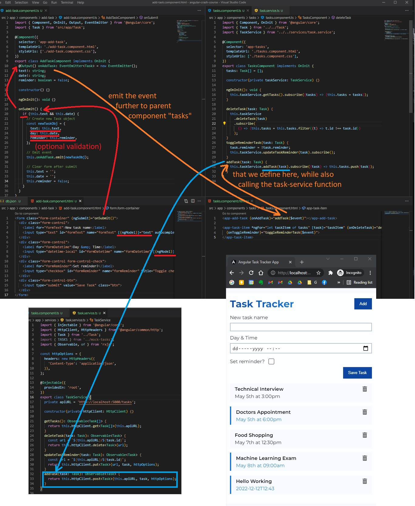

Demo:


We can also use this article to reformat our dates:

- https://css-tricks.com/everything-you-need-to-know-about-date-in-javascript/

It will get a bit complicated but...

```typescript
// add-task.component.ts
import { Component, OnInit, Output, EventEmitter } from "@angular/core";
import { UiService } from "src/app/services/ui.service";
import { Subscription } from "rxjs";
import { Task } from "src/app/Task";

import {
  trigger,
  state,
  style,
  animate,
  transition,
} from "@angular/animations";

@Component({
  selector: "app-add-task",
  templateUrl: "./add-task.component.html",
  styleUrls: ["./add-task.component.css"],
  animations: [
    trigger("inOutAnimation", [
      transition(":enter", [
        style({ height: 0, opacity: 0 }),
        animate("200ms ease-out", style({ height: 200, opacity: 1 })),
      ]),
      transition(":leave", [
        style({ height: 200, opacity: 1 }),
        animate("200ms ease-in", style({ height: 0, opacity: 0 })),
      ]),
    ]),
  ],
})
export class AddTaskComponent implements OnInit {
  @Output() onAddTask: EventEmitter<Task> = new EventEmitter();
  text!: string;
  date!: string;
  reminder: boolean = false;
  showAddTask: boolean = false;
  subscription!: Subscription;

  // Date formats (optional)
  months = [
    "Jan",
    "Feb",
    "Mar",
    "Apr",
    "May",
    "Jun",
    "Jul",
    "Aug",
    "Sep",
    "Oct",
    "Nov",
    "Dec",
  ];
  days = ["Sun", "Mon", "Tue", "Wed", "Thu", "Fri", "Sat"];

  constructor(private uiService: UiService) {
    this.subscription = this.uiService
      .onToggle()
      .subscribe((value) => (this.showAddTask = value));
  }

  ngOnInit(): void {}

  onSubmit() {
    if (this.text && this.date) {
      // Date formats (optional)
      let dateTmp = new Date(this.date);
      let dayName = this.days[dateTmp.getDay()];
      let dayNumber = dateTmp.getDate();
      let monthName = this.months[dateTmp.getMonth()];
      let year = dateTmp.getFullYear();
      let hour = `${String(dateTmp.getHours()).padStart(2, "0")}:${String(
        dateTmp.getMinutes()
      ).padStart(2, "0")}`;
      let formattedTime = `${dayName}, ${dayNumber} ${monthName} ${year} at ${hour}`;

      // Create new Task object
      const newTaskObj = {
        text: this.text,
        day: formattedTime,
        reminder: this.reminder,
      };

      // Emit event
      this.onAddTask.emit(newTaskObj);

      // Clear form after submit
      this.text = "";
      this.date = "";
      this.reminder = false;
    }
  }
}
```

<br/>

# Show/Hide Form

Let's toggle the Add Form visibility by clicking the Add Task button (show / hide the form). For this, we want that, when we click the button, we need to transmit 2 different actions to 2 different components:

- on that button click we want to toggle form visibility
- we want to change the label and the color of the button

Instead of passing events around all components (like Prop Drilling in React), we are going to create an Angular UI Service with a boolean property called ShowAddTask, and we will set up a subject which is similar to Observable. Reference: https://ncjamieson.com/understanding-subjects/#whats-the-use-case-for-subjects.

Documentation on subjects: https://rxjs.dev/guide/subject

<br/>

## UI Service

For now, let's generate a new service called `ui`

```bash
ng generate service services/ui
```

Where we'll add a boolean `showAddTask` property, a `subject`, and a function to toggle AddTask form (the subject will keep a refence of the boolean `showAddTask` by using the `next` method). And we'll add another method `onToggle` that will fire off whenever we will toggle.

```typescript
// ui.service.ts
import { Injectable } from "@angular/core";
import { Observable, Subject } from "rxjs";

@Injectable({
  providedIn: "root",
})
export class UiService {
  constructor() {}
  private showAddTask: boolean = false;
  private subject = new Subject<any>();

  toggleAddTask(): void {
    this.showAddTask = !this.showAddTask;
    this.subject.next(this.showAddTask);
  }

  onToggle(): Observable<any> {
    return this.subject.asObservable();
  }
}
```

Now, remember that we have the button (`button` component) emitting the click event to our `header` component (here we console.log in `toggleAddTask()` whenever the button is pressed). Here (in `header.component.ts`) we'll `import { UiService } from 'src/app/services/ui.service';` and `import { Subscription } from 'rxjs';`. We will also declare here:

- `showAddTask!: boolean;`
- `subscribtion!: Subscription;`
- `constructor(private uiService: UiService) {}`

Now we want to handle whatever happens when we click the button (our button is inside the `header` component). Here in `header.component.ts` we import `Subscription` and our `UiService`. We will also define here a boolean of `showAddTask: boolean` and `subscription!: Subscription`, and finally in this header's constructor we will call `onToggle` method from our recently created `ui` service, and _then_ we `.subscribe((value) => (this.showAddTask = value));` (namely we update the _showAddTask boolean value from ui.service.ts_ from the _local value of the boolean showAddTask here in header.component.ts_).

```typescript
// header.component.ts
import { Component, OnInit } from "@angular/core";
import { UiService } from "src/app/services/ui.service";
import { Subscription } from "rxjs";

@Component({
  selector: "app-header",
  templateUrl: "./header.component.html",
  styleUrls: ["./header.component.css"],
})
export class HeaderComponent implements OnInit {
  title: string = "Task Tracker";
  showAddTask: boolean = false;
  subscription!: Subscription;

  constructor(private uiService: UiService) {
    this.subscription = this.uiService
      .onToggle()
      .subscribe((value) => (this.showAddTask = value));
  }

  ngOnInit(): void {}

  toggleAddTask() {
    this.uiService.toggleAddTask();
  }
}
```

Also, we need to update/condition the button from `header.component.html` with some ternary operators (in order to change the color and the text of button based on `showAddTask` boolean variable). Also we will bind to this button our `toggleAddTask()` function from `header.component.ts`.

```html
<!-- header.component.html -->
<header>
  <h1 class="gradient-text">{{title}}</h1>
  <app-button
    color="{{ showAddTask ? '#599CDF' : ' #0D47A1'}}"
    text="{{ showAddTask ? 'Close' : 'Add Task'}}"
    (btnClickEvent)="toggleAddTask()"
  >
  </app-button>
</header>
```

We are also going to trasmit the toggle event further to the whole `add-task.component.ts` (where we have our `<form>`) in order to show/hide (toggle) this section on this event.

So, in `add-task.component.ts` we also need to:

- `import { UiService } from 'src/app/services/ui.service'; import { Subscription } from 'rxjs';`
- and we will define the same `showAddTask: boolean = false;` and `subscription!: Subscription;` variables (properties of `AddTaskComponent` Class)
- and do the same thing in our constructor: `constructor(private uiService: UiService) { this.subscription = this.uiService.onToggle().subscribe((value) => (this.showAddTask = value));`

```typescript
// add-task.component.ts
import { Component, OnInit, Output, EventEmitter } from "@angular/core";
import { UiService } from "src/app/services/ui.service";
import { Subscription } from "rxjs";
import { Task } from "src/app/Task";

@Component({
  selector: "app-add-task",
  templateUrl: "./add-task.component.html",
  styleUrls: ["./add-task.component.css"],
})
export class AddTaskComponent implements OnInit {
  @Output() onAddTask: EventEmitter<Task> = new EventEmitter();
  text!: string;
  date!: string;
  reminder: boolean = false;
  showAddTask: boolean = false;
  subscription!: Subscription;

  // Date formats (optional)
  months = [
    "Jan",
    "Feb",
    "Mar",
    "Apr",
    "May",
    "Jun",
    "Jul",
    "Aug",
    "Sep",
    "Oct",
    "Nov",
    "Dec",
  ];
  days = ["Sun", "Mon", "Tue", "Wed", "Thu", "Fri", "Sat"];

  constructor(private uiService: UiService) {
    this.subscription = this.uiService
      .onToggle()
      .subscribe((value) => (this.showAddTask = value));
  }

  ngOnInit(): void {}

  onSubmit() {
    if (this.text && this.date) {
      // Date formats (optional)
      let dateTmp = new Date(this.date);
      let dayName = this.days[dateTmp.getDay()];
      let dayNumber = dateTmp.getDate();
      let monthName = this.months[dateTmp.getMonth()];
      let year = dateTmp.getFullYear();
      let hour = `${String(dateTmp.getHours()).padStart(2, "0")}:${String(
        dateTmp.getMinutes()
      ).padStart(2, "0")}`;
      let formattedTime = `${dayName}, ${dayNumber} ${monthName} ${year} at ${hour}`;

      // Create new Task object
      const newTaskObj = {
        text: this.text,
        day: formattedTime,
        reminder: this.reminder,
      };

      // Emit event
      this.onAddTask.emit(newTaskObj);

      // Clear form after submit
      this.text = "";
      this.date = "";
      this.reminder = false;
    }
  }
}
```

And finally in `add-task.component.html` we will just add within the main `<form>` html tag, the `*ngIf="showAddTask"` directive.

```html
<!-- add-task.component.html -->
<form *ngIf="showAddTask" class="form-container" (ngSubmit)="onSubmit()">
  <div class="form-control">
    <label for="formText">New task name</label>
    <input
      type="text"
      id="formText"
      name="formText"
      [(ngModel)]="text"
      autocomplete="off"
    />
  </div>
  <div class="form-control">
    <label for="formDatetime">Day &amp; Time</label>
    <input
      type="datetime-local"
      id="formDatetime"
      name="formDatetime"
      [(ngModel)]="date"
    />
  </div>
  <div class="form-control form-control-check">
    <label for="formReminder">Set reminder?</label>
    <input
      type="checkbox"
      id="formReminder"
      name="formReminder"
      title="Toggle check"
      [(ngModel)]="reminder"
    />
  </div>
  <div class="form-control-btn">
    <input type="submit" value="Save Task" class="btn" />
  </div>
</form>
```

Now when we will click the `Add Task` button:

- we will toggle between button text and color in `header.component` and
- we will also toggle the hide/show form within `add-task.component` (Note that the toggle will actually remove/add the entire `<form>` element from DOM / from HTML page, this will not set a CSS property like `display: none` or `visibility: hidden`, so it's impossible to animate or add a fade in transition, unless we use Angular Animations)


<br/>

## Angular animation on ngIf

(completely optional)

If we want to get fancy, we can animate (fade in / fade out) the `<form>` component (from `add-task.component`) when we click on button toggle.

References:

- https://stackoverflow.com/questions/36417931/angular-2-ngif-and-css-transition-animation (second response)
- https://angular.io/guide/animations

First, we need to import in `app.module.ts` the `BrowserAnimationsModule`, and add it to `@NgModule` > Imports.

```typescript
...
import { BrowserAnimationsModule } from '@angular/platform-browser/animations';
...
@NgModule({
  declarations: [
    ...
  ],
  imports: [
    ...
    BrowserAnimationsModule,
  ],
  providers: [],
  bootstrap: [AppComponent],
})
export class AppModule {}
```

In `add-task.component.ts` we need to `import {trigger,state,style,animate,transition} from '@angular/animations';`, and in the main `@Component` we need to define the `animations` property, like so:

```typescript
// add-task.component.ts
import { Component, OnInit, Output, EventEmitter } from "@angular/core";
import { UiService } from "src/app/services/ui.service";
import { Subscription } from "rxjs";
import { Task } from "src/app/Task";

import {
  trigger,
  state,
  style,
  animate,
  transition,
} from "@angular/animations";

@Component({
  selector: "app-add-task",
  templateUrl: "./add-task.component.html",
  styleUrls: ["./add-task.component.css"],
  animations: [
    trigger("inOutAnimation", [
      transition(":enter", [
        style({ height: 0, opacity: 0 }),
        animate("200ms ease-out", style({ height: 200, opacity: 1 })),
      ]),
      transition(":leave", [
        style({ height: 200, opacity: 1 }),
        animate("200ms ease-in", style({ height: 0, opacity: 0 })),
      ]),
    ]),
  ],
})
export class AddTaskComponent implements OnInit {
  @Output() onAddTask: EventEmitter<Task> = new EventEmitter();
  text!: string;
  date!: string;
  reminder: boolean = false;
  showAddTask: boolean = false;
  subscription!: Subscription;

  // Date formats (optional)
  months = [
    "Jan",
    "Feb",
    "Mar",
    "Apr",
    "May",
    "Jun",
    "Jul",
    "Aug",
    "Sep",
    "Oct",
    "Nov",
    "Dec",
  ];
  days = ["Sun", "Mon", "Tue", "Wed", "Thu", "Fri", "Sat"];

  constructor(private uiService: UiService) {
    this.subscription = this.uiService
      .onToggle()
      .subscribe((value) => (this.showAddTask = value));
  }

  ngOnInit(): void {}

  onSubmit() {
    if (this.text && this.date) {
      // Date formats (optional)
      let dateTmp = new Date(this.date);
      let dayName = this.days[dateTmp.getDay()];
      let dayNumber = dateTmp.getDate();
      let monthName = this.months[dateTmp.getMonth()];
      let year = dateTmp.getFullYear();
      let hour = `${String(dateTmp.getHours()).padStart(2, "0")}:${String(
        dateTmp.getMinutes()
      ).padStart(2, "0")}`;
      let formattedTime = `${dayName}, ${dayNumber} ${monthName} ${year} at ${hour}`;

      // Create new Task object
      const newTaskObj = {
        text: this.text,
        day: formattedTime,
        reminder: this.reminder,
      };

      // Emit event
      this.onAddTask.emit(newTaskObj);

      // Clear form after submit
      this.text = "";
      this.date = "";
      this.reminder = false;
    }
  }
}
```

Now in `add-task.component.html` we need to pass in `<form>` (the main element that appears/dissapears from DOM based on boolean variable from `ngIf` on toggle), we need to pass `[@inOutAnimation]`, like this:

```html
<form
  *ngIf="showAddTask"
  class="form-container"
  [@inOutAnimation]
  (ngSubmit)="onSubmit()"
>
  <div class="form-control">
    <label for="formText">New task name</label>
    <input
      type="text"
      id="formText"
      name="formText"
      [(ngModel)]="text"
      autocomplete="off"
    />
  </div>
  <div class="form-control">
    <label for="formDatetime">Day &amp; Time</label>
    <input
      type="datetime-local"
      id="formDatetime"
      name="formDatetime"
      [(ngModel)]="date"
    />
  </div>
  <div class="form-control form-control-check">
    <label for="formReminder">Set reminder?</label>
    <input
      type="checkbox"
      id="formReminder"
      name="formReminder"
      title="Toggle check"
      [(ngModel)]="reminder"
    />
  </div>
  <div class="form-control-btn">
    <input type="submit" value="Save Task" class="btn" />
  </div>
</form>
```

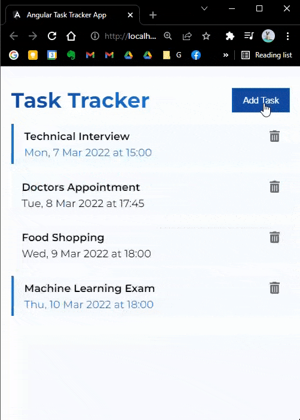

<br/>

# Angular Router

([Angular Crash Course 1h51m](https://youtu.be/3dHNOWTI7H8?t=6688))

In `app.module.ts` we need to `import { RouterModule, Routes } from '@angular/router';`, then, after all imports, create an array with objects with paths.

Then, in `@NgModule` > `imports`, we include `RouterModule.forRoot(appRoutes, {enableTracing: true})` (`enableTracing: true` is for debuggin our routes, by default it's set to false)

Note: We can put our `appRoutes` list in a separate file if we want.

```typescript
// app.module.ts
import { NgModule } from "@angular/core";
import { BrowserModule } from "@angular/platform-browser";
import { FontAwesomeModule } from "@fortawesome/angular-fontawesome";
import { AppRoutingModule } from "./app-routing.module";
import { HttpClientModule } from "@angular/common/http";
import { FormsModule } from "@angular/forms";
import { BrowserAnimationsModule } from "@angular/platform-browser/animations";
import { RouterModule, Routes } from "@angular/router";

import { AppComponent } from "./app.component";
import { HeaderComponent } from "./components/header/header.component";
import { ButtonComponent } from "./components/button/button.component";
import { TasksComponent } from "./components/tasks/tasks.component";
import { TaskItemComponent } from "./components/task-item/task-item.component";
import { AddTaskComponent } from "./components/add-task/add-task.component";

const appRoutes: Routes = [
  { path: "", component: TasksComponent },
  { path: "about", component: AboutComponent },
];

@NgModule({
  declarations: [
    AppComponent,
    HeaderComponent,
    ButtonComponent,
    TasksComponent,
    TaskItemComponent,
    AddTaskComponent,
  ],
  imports: [
    BrowserModule,
    AppRoutingModule,
    FontAwesomeModule,
    HttpClientModule,
    FormsModule,
    BrowserAnimationsModule,
    RouterModule.forRoot(appRoutes, { enableTracing: true }),
  ],
  providers: [],
  bootstrap: [AppComponent],
})
export class AppModule {}
```

Now in `app.component.html`, instead of having our main `app-task` component (main component for this app), we can add `<router-outlet></router-outlet>`.

So instead of this:

```html
<!-- app.component.html -->
<div class="container">
  <app-header></app-header>
  <app-tasks></app-tasks>
</div>
```

We will have this

```html
<!-- app.component.html -->
<div class="container">
  <app-header></app-header>
  <router-outlet></router-outlet>
</div>
```

And we will see no difference (the app will remain the same), because we specified in `app.module.ts` that the root path (root url `/`), the component used is `TasksComponent` (that has the `<app-tasks>` selector / html tag). This `<router-outlet>` will render whatever component we have on our current path / link.

<br/>

Now let's create another route (with another component), namely an "About" page. Let's run in project root folder:

```bash
ng generate component components/pages/about
```

In `/src/app/components/pages/about.component.html`, we can add some content, and then, for anchors, we'll use `<a routerLink="">` (we don't use `<a href="">` because that will refresh the page).

```html
<!-- about.component.html -->
<section>
  <h2>About page</h2>
  <div>
    <p>Author: <a href="https://radubulai.com" target="_blank">Radu B.</a></p>
    <p>Version: 1.0.0</p>
    <p>
      Documentation
      <a
        href="https://github.com/radualexandrub/Study/blob/master/Angular/README.md"
        target="_blank"
        >link</a
      >
    </p>
  </div>
  <div>
    <a routerLink="/">Back to homepage</a>
  </div>
</section>
```

And we just need to add the object with this `about` route with this about component:

```typescript
// app.module.ts
const appRoutes: Routes = [
  { path: "", component: TasksComponent },
  { path: "about", component: AboutComponent },
];
```

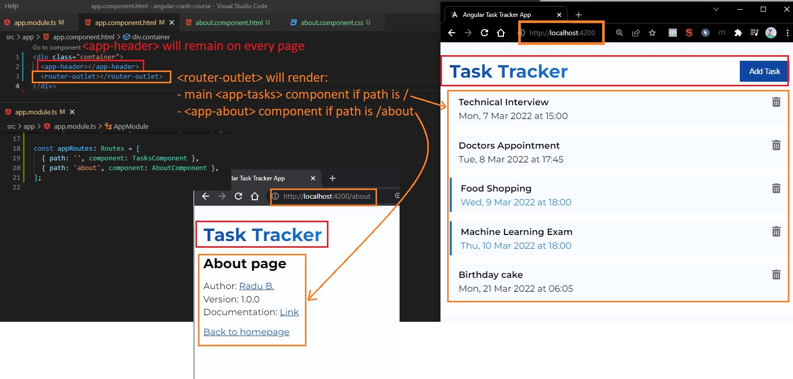

<br/>

Let's also generate a `footer` component that will have link to the home page/tasks-component.html (`/`) and about page/component (`/about`):

```bash
ng generate component components/footer
```

```html
<!-- footer.component.html -->
<footer>
  <p>Copyright 2022 &copy; Radu B.</p>
  <a routerLink="/">Home</a> | <a routerLink="/about">About</a>
</footer>
```

And we can embed this footer component in `app.component.html`

```html
<!-- app.component.html -->
<div class="container">
  <app-header></app-header>
  <router-outlet></router-outlet>
  <app-footer></app-footer>
</div>
```

<br/>

We can also try to hide the button of adding a task when we are on the "about" page.

For this we will limit the button to the homepage, we'll go to `header.component.ts` and we'll:

- `import { Router } from '@angular/router';` (so in this component we will have acces to what route we are currently on)
- add this route as a "provider" in this components constructor: `constructor(private router: Router)`
- create a new function `hasRoute(route: string) {return this.route.url === route}` (that'll return true or false)

```typescript
// header.component.ts
import { Component, OnInit } from "@angular/core";
import { UiService } from "src/app/services/ui.service";
import { Subscription } from "rxjs";
import { Router } from "@angular/router";

@Component({
  selector: "app-header",
  templateUrl: "./header.component.html",
  styleUrls: ["./header.component.css"],
})
export class HeaderComponent implements OnInit {
  title: string = "Task Tracker";
  showAddTask: boolean = false;
  subscription!: Subscription;

  constructor(private uiService: UiService, private router: Router) {
    this.subscription = this.uiService
      .onToggle()
      .subscribe((value) => (this.showAddTask = value));
  }

  ngOnInit(): void {}

  toggleAddTask() {
    this.uiService.toggleAddTask();
  }

  hasRoute(route: string): boolean {
    return this.router.url === route;
  }
}
```

Now, with this `hasRoute` function, we'll go to `header.component.html`, and just add a `*ngIf` on our button component.

```html
<!-- header.component.html -->
<header>
  <h1 class="gradient-text">{{title}}</h1>
  <app-button
    *ngIf="hasRoute('/')"
    color="{{ showAddTask ? '#599CDF' : ' #0D47A1'}}"
    text="{{ showAddTask ? 'Close' : 'Add Task'}}"
    (btnClickEvent)="toggleAddTask()"
  >
  </app-button>
</header>
```

Now the "Add Task" button will appear only on `/` route.

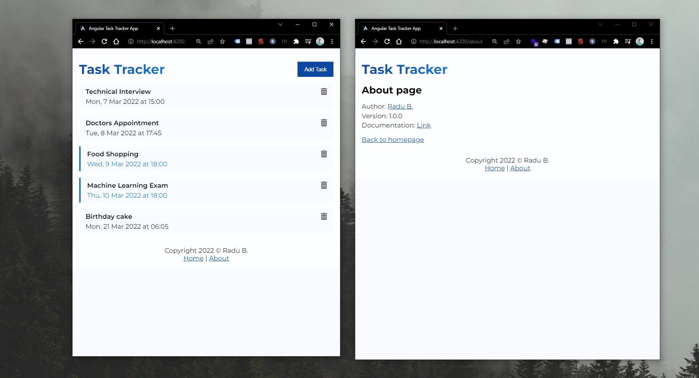
