# Build a Responsive Website | HTML, CSS Grid, Flexbox & More

## Credits / Notes taken from:

- [Build a Responsive Website - Brad Traversy](https://youtu.be/p0bGHP-PXD4)

Don't forget to have [Live Server](https://marketplace.visualstudio.com/items?itemName=ritwickdey.LiveServer) extension installed on Visual Code (access website after with http://127.0.0.1:5500/).

https://stackoverflow.com/questions/30557915/is-it-good-idea-to-make-separate-css-file-for-each-html-page - actually no :cry:.

## Contents

- [Build a Responsive Website | HTML, CSS Grid, Flexbox & More](#build-a-responsive-website--html-css-grid-flexbox--more)
  - [Credits / Notes taken from:](#credits--notes-taken-from)
  - [Contents](#contents)
  - [HTML Template, Boilerplate](#html-template-boilerplate)
  - [CSS File](#css-file)
    - [CSS Boilerplate](#css-boilerplate)
    - [Styling the Navbar](#styling-the-navbar)
- [Index.html page](#indexhtml-page)
  - [Showcase section](#showcase-section)
    - [Form Card Layout](#form-card-layout)
    - [Form Customize Inputs](#form-customize-inputs)
    - [Customize Buttons](#customize-buttons)
    - [Add Details Personality to the page](#add-details-personality-to-the-page)
  - [Stats section](#stats-section)
  - [Steps CLI section](#steps-cli-section)
  - [Banner section](#banner-section)
  - [Technologies section](#technologies-section)
  - [Footer section](#footer-section)
  - [Media Queries for Mobile](#media-queries-for-mobile)
- [Solutions.html page](#solutionshtml-page)
  - [Solutions Head Hero section](#solutions-head-hero-section)
  - [Solutions Sub-Head Sub-Hero section](#solutions-sub-head-sub-hero-section)
  - [Solutions-Main section](#solutions-main-section)
- [Documentation html page](#documentation-html-page)
  - [New utility classes](#new-utility-classes)
  - [CSS for docs page](#css-for-docs-page)
- [Media Queries for Solutions and Docs page](#media-queries-for-solutions-and-docs-page)
- [Homepage Animation](#homepage-animation)
- [Complete Code](#complete-code)
  - [index.html](#indexhtml)
  - [solutions.html](#solutionshtml)
  - [docs.html](#docshtml)
  - [utilities.css](#utilitiescss)
  - [style.css](#stylecss)

## HTML Template, Boilerplate

We can use [cdnjs.com](https://cdnjs.com/) to insert all our links (css, javascript) to utilities/libraries (like Font-Awesome).

[Link to Google Fonts](https://fonts.google.com/) - Preferable font: Light 300.

[Best 30 Google Fonts for a Website](https://www.justinmind.com/blog/best-google-web-fonts-website/)

```html
<!DOCTYPE html>
<html lang="en">
  <head>
    <meta charset="UTF-8" />
    <meta name="viewport" content="width=device-width, initial-scale=1.0" />
    <link rel="stylesheet" href="css/style.css" />
    <link
      rel="stylesheet"
      href="https://cdnjs.cloudflare.com/ajax/libs/font-awesome/5.15.1/css/all.min.css"
      integrity="sha512-+4zCK9k+qNFUR5X+cKL9EIR+ZOhtIloNl9GIKS57V1MyNsYpYcUrUeQc9vNfzsWfV28IaLL3i96P9sdNyeRssA=="
    />
    <title>Qualia Soft | Software Solutions for Everyone</title>
  </head>
  <body>
    <!-- Navbar: Logo and Navigation -->
    <div class="navbar">
      <div class="container">
        <h1 class="logo">Qualia Soft</h1>
        <nav>
          <ul>
            <li><a href="index.html">Home</a></li>
            <li><a href="solutions.html">Solutions</a></li>
            <li><a href="docs.html">Documentation</a></li>
          </ul>
        </nav>
      </div>
    </div>

    <!-- Showcase -->
    <section class="showcase">
      <div class="container grid"></div>
    </section>

    <!-- Stats -->
    <section class="stats">
      <div class="container"></div>
    </section>

    <!-- Solutions -->
    <section></section>

    <!-- Technologies -->
    <section></section>

    <!-- Footer -->
    <footer></footer>
  </body>
</html>
```

## CSS File

### CSS Boilerplate

First thing we need to do in our `style.css`

```css
* {
  box-sizing: border-box;
  padding: 0;
  margin: 0;
}
```

`box-sizing` allows us to add padding, borders without having to add `width` to the elements. Also, by default HTML has padding and margin in our `body` and a lot of other elements... so we need to overwrite them with zero first.

Then we need to set our font family to our body:

```css
body {
  font-family: "Montserrat", sans-serif;
  color: #333;
  line-height: 1.6;
}
```

Then we must make sure we don't have any bullet points for lists (eg. navbar), and we also need to get rid of the ugly underlines for links:

```css
ul {
  list-style-type: none;
}

a {
  text-decoration: none;
  color: #333;
}
```

And we also modify

- the headings and paragraphs (margin top and bottom 10px, left and right 0px)
- images size so they'll be kept within their containers (even if it's a large image)

```css
h1,
h2 {
  font-weight: 300;
  line-height: 1.2;
  margin: 10px 0;
}

p {
  margin: 10px 0;
}

img {
  width: 100%;
}
```

### Styling the Navbar

HTML:

```html
<div class="navbar">
  <div class="container flex">
    <h1 class="logo">Qualia Soft</h1>
    <nav>
      <ul>
        <li><a href="index.html">Home</a></li>
        <li><a href="solutions.html">Solutions</a></li>
        <li><a href="docs.html">Documentation</a></li>
      </ul>
    </nav>
  </div>
</div>
```

CSS:

```css
/* Navbar */
.navbar {
  background-color: #047aed;
  color: #fff;
  height: 70px;
}

.container {
  max-width: 1100px;
  margin: 0 auto;
  overflow: auto;
  padding: 0 40px;
}
```

`max-width: 1100px;` will retain the navbar in the center (so it doesn't get stretched out to the edge of the screen)

Because the `h1` header has a margin top of 10px (we set that earlier), our navbar will not be at the top of the page, we can fix that with `overflow: auto;`

We also add ` padding: 0 40px;` (0px for top and bottom, 40px for top and right)


Now we'll use flexbox to arrange our navbar links. But we don't want to apply `flexbox` to the whole container itself, so we added another CSS class in our HTML called "flex" (`<div class="container flex">`) which we are going to create a CSS class for.

```css
.flex {
  display: flex;
}
```

If we want our navbar to be centered (logo centered and links) we can add `justify-content: center;`, and if we want to align them vertically: `align-items: center;`

However, we'll use the `.flex` class as a general purpose flexbox container (where we keep `justify-content: center;`), so we'll make another declarations for navbar, like this:

```css
/* Navbar */
.navbar {
  background-color: #047aed;
  color: #fff;
  height: 70px;
}

.navbar .flex {
  justify-content: space-between;
}

.container {
  max-width: 1100px;
  margin: 0 auto;
  overflow: auto;
  padding: 0 40px;
}

.flex {
  display: flex;
  justify-content: center;
  align-items: center;
  height: 100%;
}
```

<br/>

**Now, time to work on the links:**

```css
.navbar ul {
  display: flex;
}
```

`.navbar ul { display: flex; }` will display the links in the navbar horizontally (as we wanted)

```css
.navbar ul {
  display: flex;
}

.navbar a {
  color: #fff;
  padding: 10px;
  margin: 0 5px;
}

.navbar a:hover {
  border-bottom: 2px #fff solid;
}
```

Already looks good:


**Note:** So far we will make the website responsive for desktop first.

# Index.html page

## Showcase section

```html
<!-- Showcase | Hero Section -->
<section class="showcase">
  <div class="container grid">
    <div class="showcase-text">
      <h1>Bring Alive Ideas Seamlessly</h1>
      <p>
        We create applications of all kinds, from small static websites for
        individuals to large scale enterprise software. Fill out the form bellow
        to be in queue for a Live Demonstration of your own idea
      </p>
      <a href="solutions.html" class="btn btn-outline">Read More</a>
    </div>

    <div class="showcase-form card">
      <h2>Request a Demo</h2>
      <form>
        <div class="form-control">
          <input
            type="text"
            name="first_name"
            placeholder="First Name"
            required
          />
        </div>
        <div class="form-control">
          <input
            type="text"
            name="last_name"
            placeholder="Last Name"
            required
          />
        </div>
        <div class="form-control">
          <input
            type="text"
            name="company_name"
            placeholder="Company Name (optional)"
          />
        </div>
        <div class="form-control">
          <input type="email" name="email" placeholder="Email" required />
        </div>
        <input type="submit" value="Send" class="btn btn-primary" />
      </form>
    </div>
  </div>
</section>
```

**Now, time to add some CSS:** (Sunday, January 10, 2021, 17:20)

```css
.showcase {
  height: 400px;
  background-color: var(--primary-color);
  color: #fff;
  position: relative;
}
```

We use `position: relative;` so that we can place elements inside that have a position of `absolute`

```css
/* Showcase | Hero Section*/
.showcase {
  height: 400px;
  background-color: var(--primary-color);
  color: #fff;
  position: relative;
}

.showcase h1 {
  font-size: 40px;
}

.showcase p {
  margin: 20px 0;
}
```

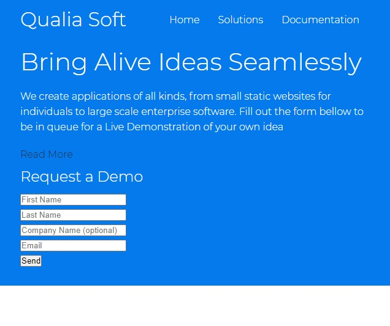

For our two items (`<div class="showcase-text">` and `<div class="showcase-form card">`) within our `<section class="showcase"> <div class="container grid">`, we want to display them in grid on two separate columns (for desktop view, we will later adjust them to display as rows for mobile).

```css
.grid {
  display: grid;
  grid-template-columns: 1fr 1fr;
  gap: 20px;
  justify-content: center;
  align-items: center;
  height: 100%;
}
```

**Note** that `align-items: center;` with a grid will not align items vertically (yet) unless we mention a `height` property.

We can now customize our grid even further for by adding a new CSS grid class within `.showcase`:

```css
.showcase .grid {
  grid-template-columns: 60% 40%;
  gap: 30px;
}
```


<br/>

### Form Card Layout

**Now let's make a card like layout for our form**

```html
<!-- HMTL -->
<div class="showcase-form card"></div>
```

```css
.card {
  background-color: #fff;
  color: var(--font-color);
  border-radius: 30px;
  box-shadow: 0 3px 10px rgba(0, 0, 0, 0.2);
  padding: 20px;
  margin: 10px;
}
```

Perfect.

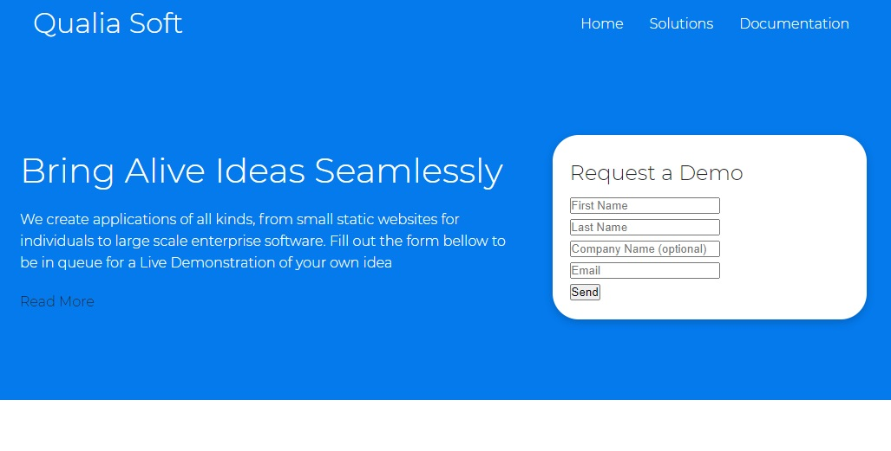

<br/>

**Now let's customize our Form**

First, we need to set `position: relative;` to our form in order to use `top` (or `right`, `bottom`, `left`) properties. We are going to push down the form 60px by setting `top: 60px;`

Then we can set `height: 350px;` to have the form going outside the container, but we'll need to also set in our `.showcase .grid` class the `overflow: visible;` in order to hide the scrollbar that will appear for that form.

```css
.showcase .grid {
  grid-template-columns: 60% 40%;
  gap: 30px;
  overflow: visible;
}

.showcase-form {
  position: relative;
  top: 60px;
  height: 350px;
}
```


We can also add `z-index: 100;` to make sure our form will always show in front of other elements (it is useful for the time we will use animations and keyframes, for having the both items `showcase-text` and `showcase-form` coming from sides - for left and from right).

We also add `justify-self: flex-end` to push the form to the right.

```css
.showcase-form {
  position: relative;
  top: 60px;
  height: auto;
  width: 100%;
  padding: 20px 40px;
  z-index: 100;
  justify-self: flex-end;
}
```

<br/>

### Form Customize Inputs

**Continuing to customize our Form**

We'll add `margin: 30px 0;` (margin top and bottom to 30px) to separate (horizontally) each input in our form

However, if we target `showcase-form input` we will also target the button, so in order to style our inputs, we'll put `input[type='text']`

```css
.showcase-form .form-control {
  margin: 30px 0;
}

.showcase-form input[type="text"],
.showcase-form input[type="email"] {
  border: 0;
  border-bottom: 1px solid #b4becb;
  width: 100%;
  padding: 3px;
  font-size: 16px;
}

.showcase-form input:focus {
  outline: none;
}
```

We overwrite the default border cassettes around each input with `border: 0;`, but we add a `border-bottom` to have a nice separation. We'll set `width: 100%;` to make sure the inputs don't go outside the container (card).

We'd also want to get rid of the default border that appears when user clicks the form (focus): `.showcase-form input:focus {outline: none;}`


<br/>

### Customize Buttons

**Now, styling the buttons** - Sunday, January 10, 2021, 18:23

```html
<!-- HTML -->
<a href="solutions.html" class="btn btn-outline">Read More</a>
<input type="submit" value="Send" class="btn btn-primary" />
```

We will add `.btn` class (the base button style for the webpage) as our CSS utility classes

`display: inline-block;` will work for both buttons and links, in order to make arrange them as inline blocks.

We'll set `cursor: pointer;` to show a pointer when user is hovering over the button (or link with `btn` class)

We'll get rid of default border around it

We'll also add a separate class `btn-outline` that we can apply to other buttons (customize them)

```css
.btn {
  display: inline-block;
  padding: 10px 30px;
  cursor: pointer;
  background-color: var(--primary-color);
  color: #fff;
  border: none;
  border-radius: 5px;
  transition: all 100ms;
}

.btn-outline {
  background-color: transparent;
  border: 1px #fff solid;
}

.btn:hover {
  transform: scale(0.97);
}
```

We also add some hover effect with `.btn:hover { transform: scale(0.97); }` which will animate with a `transition: all 100ms;`

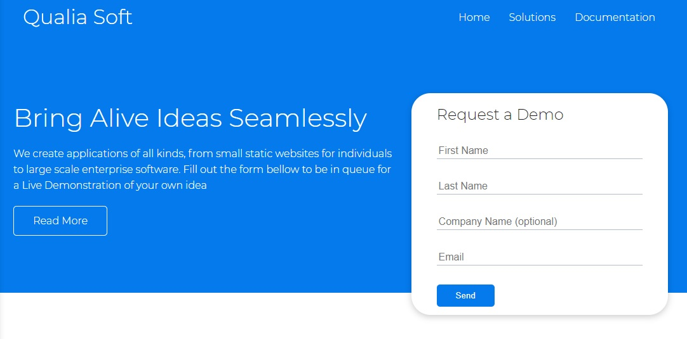

<br/>

### Add Details Personality to the page

**Let's add a slant (angled edge, sloped line) to our showcase section**

For this, we'll use the `:before` and `:after` pseudo-selector classes. We can use `position: absolute` here because we specified position relative in our main `.showcase` class.

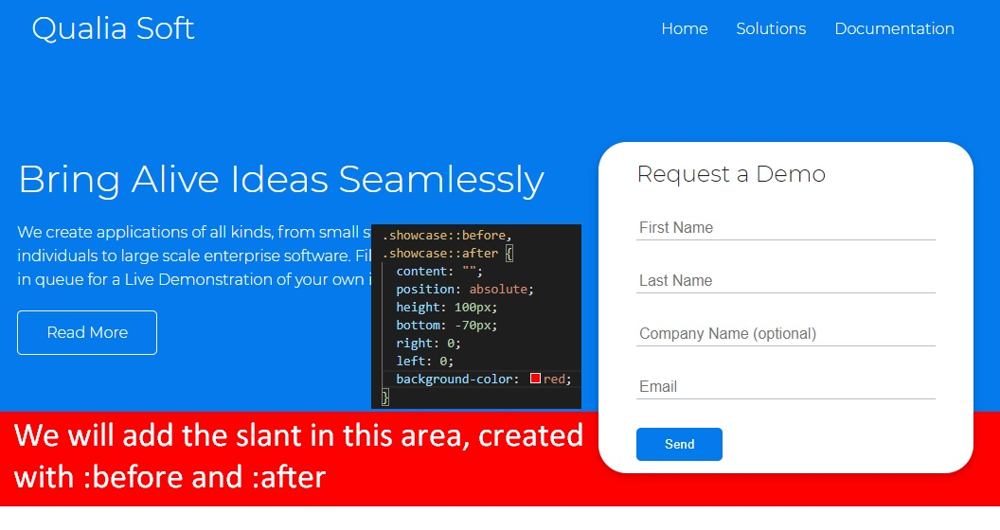

We'll create the angled edge using `transform: skewY(-3deg);`, and we'll switch back our background color to white (instead of red, as shown in example ^^)

Also, to make sure this will work on every browser, we will add `-webkit-transform` (Chrome and Safari), `-moz-transform` (Mozilla Firefox) and `-ms-transform` (Internet Explorer)

```css
.showcase::before,
.showcase::after {
  content: "";
  position: absolute;
  height: 100px;
  bottom: -70px;
  right: 0;
  left: 0;
  background: #fff;
  transform: skewY(-2deg);
  -webkit-transform: skewY(-2deg);
  -moz-transform: skewY(-2deg);
  -ms-transform: skewY(-2deg);
}
```


<br/>

**_All CSS Code So far_**

```css
@import url("https://fonts.googleapis.com/css2?family=Montserrat:wght@300&display=swap");

:root {
  --font-color: #222;
  --primary-color: #047aed;
}

/* Overwrite HTML Defaults */
* {
  box-sizing: border-box;
  padding: 0;
  margin: 0;
}

body {
  font-family: "Montserrat", sans-serif;
  color: var(--font-color);
  line-height: 1.6;
}

ul {
  list-style-type: none;
}

a {
  text-decoration: none;
  color: var(--font-color);
}

h1,
h2 {
  font-weight: 300;
  line-height: 1.2;
  margin: 10px 0;
}

p {
  margin: 10px 0;
}

img {
  width: 100%;
}

/* Navbar */
.navbar {
  background-color: var(--primary-color);
  color: #fff;
  height: 70px;
}

.navbar .flex {
  justify-content: space-between;
}

.navbar ul {
  display: flex;
}

.navbar a {
  color: #fff;
  padding: 10px;
  margin: 0 5px;
}

.navbar a:hover {
  border-bottom: 2px #fff solid;
}

/* Utilities: Classes for reuse */
.container {
  max-width: 1100px;
  margin: 0 auto;
  overflow: auto;
  padding: 0 40px;
}

.flex {
  display: flex;
  justify-content: center;
  align-items: center;
  height: 100%;
}

.grid {
  display: grid;
  grid-template-columns: 1fr 1fr;
  gap: 20px;
  justify-content: center;
  align-items: center;
  height: 100%;
}

.card {
  background-color: #fff;
  color: var(--font-color);
  border-radius: 30px;
  box-shadow: 0 3px 10px rgba(0, 0, 0, 0.2);
  padding: 20px;
  margin: 10px;
}

.btn {
  display: inline-block;
  padding: 10px 30px;
  cursor: pointer;
  background-color: var(--primary-color);
  color: #fff;
  border: none;
  border-radius: 5px;
  transition: all 100ms;
}

.btn-outline {
  background-color: transparent;
  border: 1px #fff solid;
}

.btn:hover {
  transform: scale(0.97);
}

/* Showcase | Hero Section */
.showcase {
  position: relative;
  height: 400px;
  background-color: var(--primary-color);
  color: #fff;
}

.showcase h1 {
  font-size: 40px;
}

.showcase p {
  margin: 20px 0;
}

.showcase .grid {
  grid-template-columns: 60% 40%;
  gap: 30px;
  overflow: visible;
}

.showcase-form {
  position: relative;
  top: 60px;
  height: auto;
  width: 100%;
  padding: 20px 40px;
  z-index: 100;
  justify-self: flex-end;
}

.showcase-form .form-control {
  margin: 30px 0;
}

.showcase-form input[type="text"],
.showcase-form input[type="email"] {
  border: 0;
  border-bottom: 1px solid #b4becb;
  width: 100%;
  padding: 3px;
  font-size: 16px;
}

.showcase-form input:focus {
  outline: none;
}

.showcase::before,
.showcase::after {
  content: "";
  position: absolute;
  height: 100px;
  bottom: -70px;
  right: 0;
  left: 0;
  background: #fff;
  transform: skewY(-2deg);
  -webkit-transform: skewY(-2deg);
  -moz-transform: skewY(-2deg);
  -ms-transform: skewY(-2deg);
}
```

**_---_**

## Stats section

```html
<!-- HTML -->
<!-- Stats -->
<section class="stats">
  <div class="container">
    <h3 class="stats-heading text-center my-1">
      Achievements we've reached so far
    </h3>

    <div class="grid grid-3 text-center my-4">
      <div>
        <i class="fas fa-server fa-3x"></i>
        <h3>174</h3>
        <p class="text-secondary">Deployed Software Applications</p>
      </div>
      <div>
        <i class="far fa-building fa-3x"></i>
        <h3>58</h3>
        <p class="text-secondary">Registered Software Companies</p>
      </div>
      <div>
        <i class="far fa-smile-beam fa-3x"></i>
        <h3>131</h3>
        <p class="text-secondary">Happy Clients</p>
      </div>
    </div>
  </div>
</section>
```

`text-center` will be a class for centering text only.`my-1` will be a class for margin in top and bottom (`y` name is for `y-axis`, vertically). These will be all utility classes in order to help with css and reduce manually adding margin and padding to each css of an element (remember that `rem` units represent the current text-size multiplied by specified number - _relative to font-size of the root element_).

We'll also have a separate `grid-3` class

Note: we can seamlessly create font-awesome icons with Emmet, just by writing `i.fas.fa-server.fa-3x` which will autocomplete to `<i class="fas fa-server fa-3x"></i>`

We'll create a `text-secondary` class

**Let's get into CSS**

```css
/* Utilities: Classes for reuse */
.grid-3 {
  grid-template-columns: repeat(3, 1fr);
}

.text-center {
  text-align: center;
}

/* Utilities: Margins */
/* Margins for top and bottom */
.my-1 {
  margin: 1rem 0;
}
.my-2 {
  margin: 1.5rem 0;
}
.my-3 {
  margin: 2rem 0;
}
.my-4 {
  margin: 3rem 0;
}
.my-5 {
  margin: 4rem 0;
}

/* Margins for all around */
.m-1 {
  margin: 1rem;
}
.m-2 {
  margin: 1.5rem;
}
.m-3 {
  margin: 2rem;
}
.m-4 {
  margin: 3rem;
}
.m-5 {
  margin: 4rem;
}

/* Paddings for top and bottom */
.py-1 {
  padding: 1rem 0;
}
.py-2 {
  padding: 1.5rem 0;
}
.py-3 {
  padding: 2rem 0;
}
.py-4 {
  padding: 3rem 0;
}
.py-5 {
  padding: 4rem 0;
}

/* Paddings for all around */
.p-1 {
  padding: 1rem;
}
.p-2 {
  padding: 1.5rem;
}
.p-3 {
  padding: 2rem;
}
.p-4 {
  padding: 3rem;
}
.p-5 {
  padding: 4rem;
}
```

Ok we almost created our own framework with these utility classes.

**Note** that we can separate the `style.css` file into two files: `style.css` and `utilities.css`, and add it into our `index.html` with `<link rel="stylesheet" href="css/utilities.css" />`. But **beware** that the order of classes in CSS matters, so, when we are adding the two files to `index.html` we need to import these in this order (the utilities will be first, because we will sometimes overwrite over them!)

```html
<head>
  <link rel="stylesheet" href="css/utilities.css" />
  <link rel="stylesheet" href="css/style.css" />
</head>
```

**Now for the Stats Section:**

```css
/* Stats Section */
.stats {
  padding-top: 100px;
}

.stats-heading {
  max-width: 500px;
  margin: auto;
}

.stats .grid h3 {
  font-size: 35px;
}

.stats .grid p {
  font-size: 20px;
  font-weight: bold;
}
```

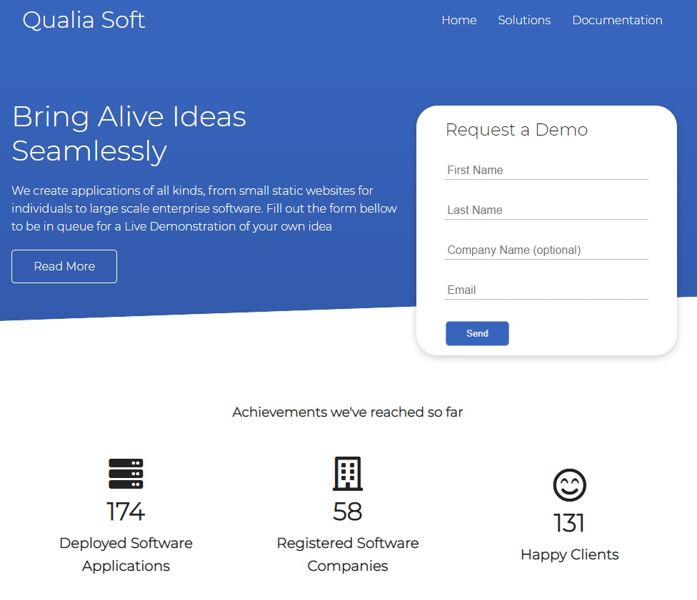

<br/>

## Steps CLI section

```html
<!-- HTML -->
<!-- Solutions -->
<section class="steps">
  <div class="container grid">
    
    <div class="card">
      <h3>Pick the right app that suits your idea</h3>
    </div>
    <div class="card">
      <h3>Get weekly updates on your app development</h3>
    </div>
    <div class="card">
      <h3>Deploy and see live metrics about yout app</h3>
    </div>
  </div>
</section>
```

For this section, we want two have a grid with 2 columns, but then each column (on the right) will have multiple rows. So, we want to have two columns, 3 rows, but we the first column to span over the 3 rows.

One solution for this can be to actually make multiple items as grid themselves, then we would have a grid within a grid. However, we can also just select the first item (as first child) to span over the entire first column.

... However we can make this even interesting: we will have 3 columns and 3 rows, and we'd want to span (extend) the first child over the first two columns, and over the three rows.

```css
/* Solutions CLI Section */
.steps .grid {
  grid-template-columns: repeat(3, 1fr);
  grid-template-rows: repeat(3, 1fr);
}

.steps .grid > *:first-child {
  grid-column: 1 / span 2;
  grid-row: 1 / span 3;
}
```

So here's the result - Sunday, January 10, 2021, 21:58

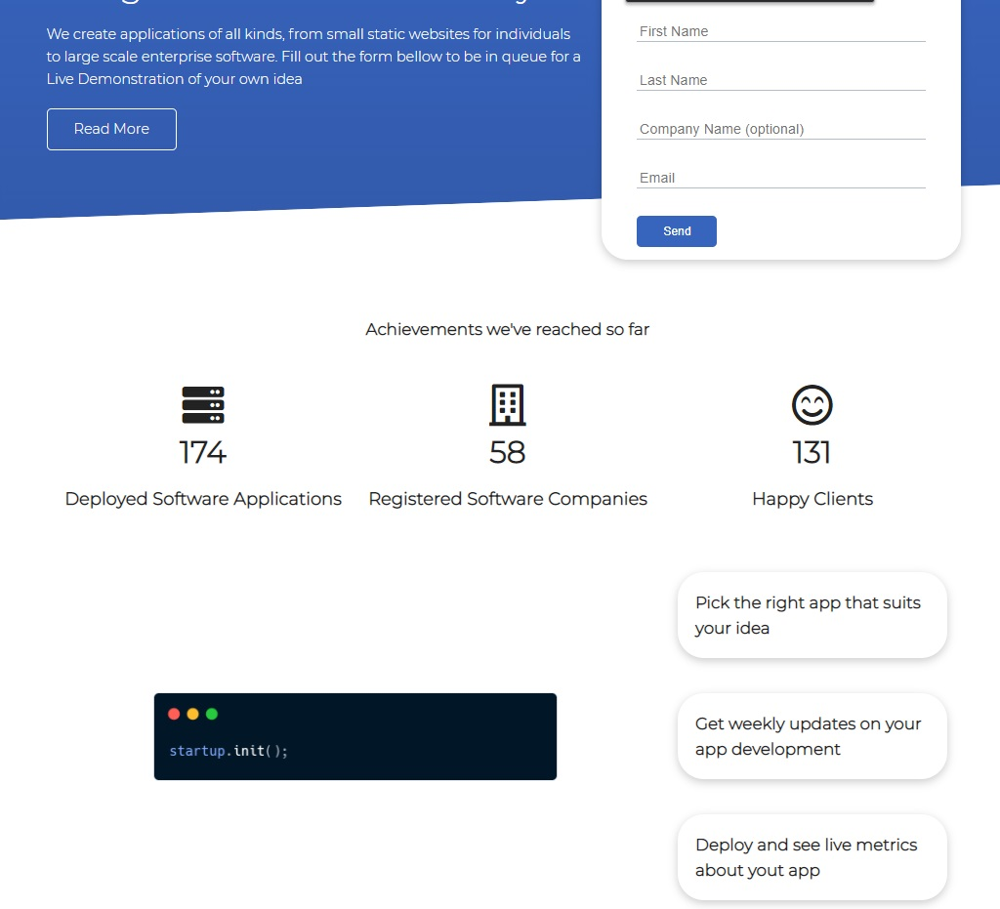

**_CSS Grid really makes everything easier_**

<br/>

## Banner section

Here we'll make a new class called `bg-primary` where we'll put our primary color as background

We'll also used the already created utility CSS classes `my-2` and `py-2`, and `my-1`

We'll introduce a new utility class called `lg` (that stands for _large_) and another class called `lead` for bigger paragraphs; as well as `sm` (for small text-size, which will be 1rem == 16px in HTML's default), `md` as medium (2rem or 32px), `lg` (3rem) and `xl` (4rem)

We'll add another class for `btn-dark`

```html
<!-- Banner -->
<section class="banner bg-primary my-2 py-2">
  <div class="container grid">
    <div class="text-center">
      <h2 class="lg">Discover Our Digital Capabilities</h2>
      <p class="lead my-1">
        With an acumulated experience from a talented team of developers, we
        deliver beautiful apps right on time
      </p>
      <a href="solutions.html" class="btn btn-dark">Read More</a>
    </div>
    
  </div>
</section>
```

**Now for the CSS part**

We can also have the following variables for our colors:

```css
/* style.css */
:root {
  --font-color: #222;
  --primary-color: #3764bd;
  --secondary-color: #325aac;
  --dark-color: #011627;
  --light-color: #83bceb;
}
```

Utility classes:

```css
/* utilities.css */
/* Backgrounds & colored buttons */
.bg-primary,
.btn-primary {
  background-color: var(--primary-color);
  color: #fff;
}

.btn-secondary,
.bg-secondary {
  background-color: var(--secondary-color);
  color: #fff;
}

.bg-dark,
.btn-dark {
  background-color: var(--dark-color);
  color: #fff;
}

.btn-light,
.bg-light {
  background-color: var(--light-color);
  color: var(--font-color);
}

/* Text sizes */
.lead {
  font-size: 20px;
}
.sm {
  font-size: 1rem;
}
.md {
  font-size: 2rem;
}
.lg {
  font-size: 3rem;
}
.xl {
  font-size: 4rem;
}
.text-center {
  text-align: center;
}
```

Our section's CSS

```css
/* style.css */
/* Banner Section */
.banner .grid {
  grid-template-columns: 4fr 3fr;
}
```

And voila:

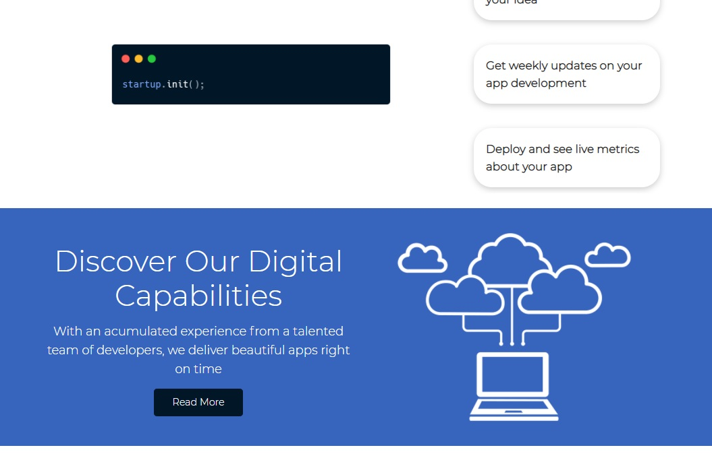

<br/>

Even if the [tutorial at 1h5m](https://youtu.be/p0bGHP-PXD4?t=3936) ends here with this section... I've decided to go a step further and and a slant (angled edge) like we did on the Showcase / Hero section.

**Let's add slant (angled edge) here too**


Here's the entire CSS part for our Banner Section

```css
/* style.css */
/* Banner Section */
.banner .grid {
  grid-template-columns: 4fr 3fr;
}

.banner {
  position: relative;
}

.banner::before,
.banner::after {
  content: "";
  position: absolute;
  height: 75px;
  bottom: -60px;
  right: 0;
  left: 0;
  background: #fff;
  transform: skewY(2deg);
  -webkit-transform: skewY(2deg);
  -moz-transform: skewY(2deg);
  -ms-transform: skewY(2deg);
}
```

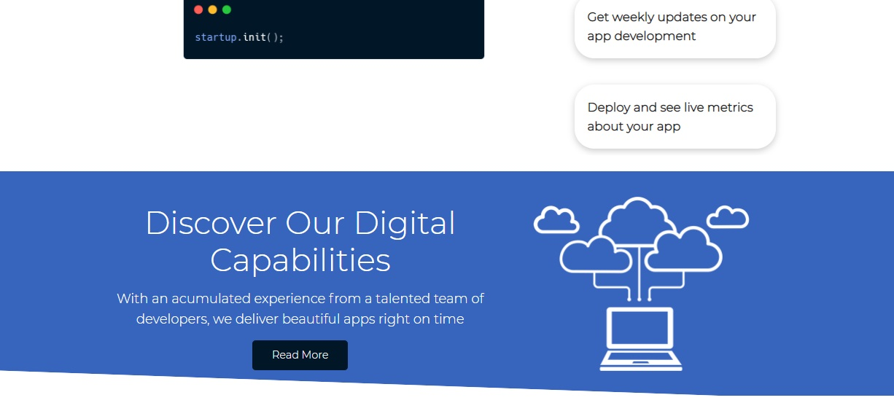

Oook or maybe we can put the sloped edge before our section (replace bottom with top):

```css
.banner::before,
.banner::after {
  content: "";
  position: absolute;
  height: 65px;
  top: -45px;
  right: 0;
  left: 0;
  background: #fff;
  transform: skewY(2deg);
  -webkit-transform: skewY(2deg);
  -moz-transform: skewY(2deg);
  -ms-transform: skewY(2deg);
}
```

Oke done!

<br/>

## Technologies section

```html
<!-- Technologies -->
<section class="technologies">
  <h2 class="md text-center my">Tech Stack we use</h2>
  <div class="container flex">
    <div class="card">
      <h4>Django</h4>
      
    </div>
    <div class="card">
      <h4>Node.js</h4>
      
    </div>
    <div class="card">
      <h4>Go</h4>
      
    </div>
    <div class="card">
      <h4>Ruby</h4>
      
    </div>
    <div class="card">
      <h4>C#</h4>
      
    </div>
    <div class="card">
      <h4>PHP</h4>
      
    </div>
    <div class="card">
      <h4>Scala</h4>
      
    </div>
  </div>
</section>
```

**Now for the CSS**

```css
/* Technologies Section */
.technologies .flex {
  flex-wrap: wrap;
}

.technologies .card {
  text-align: center;
  margin: 18px 10px 40px;
  transition: transform 100ms ease-in;
}

.technologies .card .h4 {
  font-size: 20px;
  margin-bottom: 10px;
}

.technologies .card:hover {
  transform: translateY(-15px);
}
```

We used `transform: translateY(-15px);` so when the user is hovering over a card, the card goes up 10px. (We don't forget adding `transition: transform 100ms;` to seem more interactive / have a smoother transition)

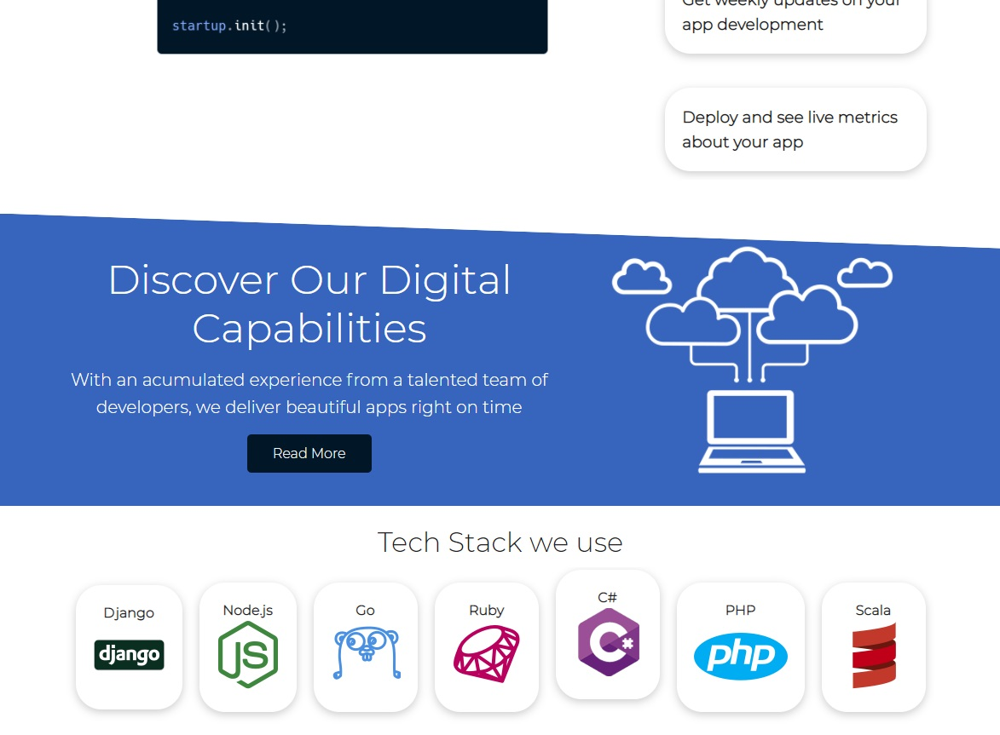

And with transition:


...

Wait.

I have a crazy idea.

What if, instead of using a simple hover that moves the card up... what if we do an infinite bounce while the user hovers it?

After a bit of playing with animations (without any luck on finding the code already on the Internet), I came up with this:

```css
/* Technologies Section */
.technologies .flex {
  flex-wrap: wrap;
}

.technologies .card {
  text-align: center;
  margin: 18px 10px 40px;
}

.technologies .card .h4 {
  font-size: 20px;
  margin-bottom: 10px;
}

.technologies .card:hover {
  animation-name: bounce;
  animation-duration: 250ms;
  animation-iteration-count: infinite;
  animation-direction: alternate;
  animation-timing-function: ease-out;
}

@keyframes bounce {
  0% {
    transform: translateY(0px);
  }
  100% {
    transform: translateY(-15px);
  }
}
```


Wonderful. (Monday, January 11, 2021, 00:00)

<br/>

## Footer section

```html
<!-- Footer -->
<footer class="footer bg-dark py-5">
  <div class="container grid grid-3">
    <div>
      <h1>Qualia Soft</h1>
      <p>
        Copyright &copy; 2021<br />
        Made by Radu-Alexandru Bulai
      </p>
    </div>

    <nav>
      <ul>
        <li><a href="index.html">Home</a></li>
        <li><a href="solutions.html">Solutions</a></li>
        <li><a href="docs.html">Documentation</a></li>
      </ul>
    </nav>

    <div class="social">
      <a target="_blank" rel="noopener noreferrer" href="https://radubulai.com"
        ><i class="fas fa-globe fa-2x"></i
      ></a>
      <a
        target="_blank"
        rel="noopener noreferrer"
        href="https://github.com/radualexandrub"
        title="GitHub"
        ><i class="fab fa-github fa-2x"></i
      ></a>
      <a
        target="_blank"
        rel="noopener noreferrer"
        href="https://www.linkedin.com/in/radu-alexandru-bulai"
        ><i class="fab fa-linkedin fa-2x"></i
      ></a>
      <a
        target="_blank"
        rel="noopener noreferrer"
        href="https://dev.to/radualexandrub"
        title="Dev.to"
        ><i class="fab fa-dev fa-2x"></i
      ></a>
    </div>
  </div>
</footer>
```

So far our links in the footer are black (on a dark/black background), so we need to overwrite links color in our `utilities.css`

```css
/* utilities.css */
.bg-primary a,
.btn-primary a,
.btn-secondary a,
.bg-secondary a,
.bg-dark a,
.btn-dark a {
  color: #fff;
}
```

And our footer's CSS in `style.css`:

```css
/* Footer */
.footer .social a {
  margin: 0 10px;
}

.footer a:hover {
  color: #ddd;
}

.footer .social i {
  transition: transform 100ms;
}

.footer .social i:hover {
  transform: scale(1.1);
}
```

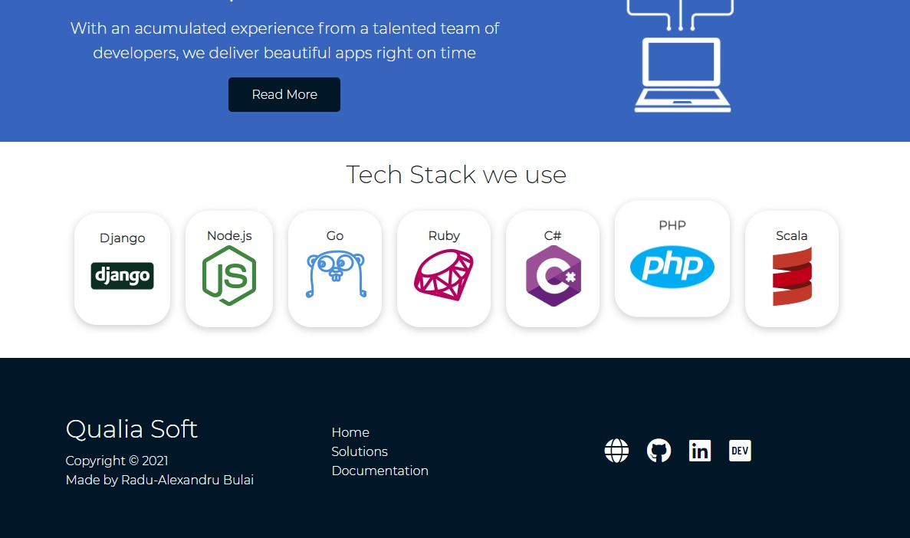

<br/>

## Media Queries for Mobile

Also, for mobile (smaller screens), we'll set the direction of the navbar vertically (`flex-direction: column;`) and add additional properties to make it responsive (eg, hide potentially scrollbar on navbar links that could appear, add transparent background, padding etc.)

For the mobile part, we'll just set for _all the grids_ that we used: `grid-template-columns: 1fr;`

In our showcase (hero section), we'll set the height to auto in order to not overlap the whole hero section (with the form included) over the next section (Stats section). We can also center everything here for tablet and mobile screens. On the form part, we'll use `justify-self: center;` to align only this item (the form) on the center, and we also add `margin: auto;` to make sure it stays in the middle. We can also reduce the form's size.

```css
/* Tablets and under */
@media (max-width: 768px) {
  .grid,
  .showcase .grid,
  .stats .grid,
  .steps .grid,
  .banner .grid {
    grid-template-columns: 1fr;
    grid-template-rows: 1fr;
  }

  .showcase {
    height: auto;
  }

  .showcase-text {
    text-align: center;
    margin-top: 40px;
  }

  .showcase-form {
    justify-self: center;
    margin: auto;
    max-width: 500px;
  }
}

/* Mobile */
@media (max-width: 550px) {
  .navbar {
    height: 90px;
  }

  .navbar .flex {
    flex-direction: column;
    overflow: visible;
    justify-content: center;
  }

  .navbar ul {
    padding: 10px;
    background-color: rgba(0, 0, 0, 0.1);
  }
}
```

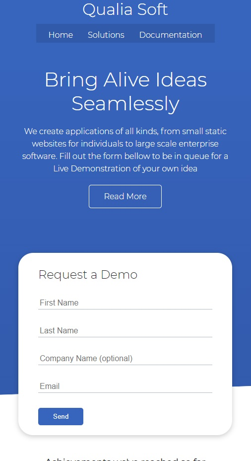

However, we need to reset the Steps (CLI) Section, because the spanning part of the first element over the other ones really messes up things in mobile (because we've set `grid-template-columns: 1fr;` and `grid-template-rows: 1fr;`).


So, in order to reset the previous grid arrangement, we add:

```css
.steps .grid > *:first-child {
  grid-column: 1;
  grid-row: 1;
}
```

<br/>


# Solutions.html page

## Solutions Head Hero section

Monday, January 11, 2021, 13:32

```html
<!DOCTYPE html>
<html lang="en">
  <head>
    <meta charset="UTF-8" />
    <meta name="viewport" content="width=device-width, initial-scale=1.0" />
    <link rel="stylesheet" href="css/utilities.css" />
    <link rel="stylesheet" href="css/style.css" />
    <link
      rel="stylesheet"
      href="https://cdnjs.cloudflare.com/ajax/libs/font-awesome/5.15.1/css/all.min.css"
    />
    <title>Qualia Soft | Software Solutions for Everyone</title>
  </head>
  <body>
    <!-- Navbar: Logo and Navigation -->
    <div class="navbar">
      <div class="container flex">
        <h1 class="logo">Qualia Soft</h1>
        <nav>
          <ul>
            <li><a href="index.html">Home</a></li>
            <li><a href="solutions.html">Solutions</a></li>
            <li><a href="docs.html">Documentation</a></li>
          </ul>
        </nav>
      </div>
    </div>

    <!-- Head / Hero -->
    <section class="solutions-head bg-primary py-3">
      <div class="container grid">
        <div>
          <h1 class="xl">Solutions</h1>
          <p class="lead">
            Check out the solutions we offer that separate us from the
            competition
          </p>
        </div>
        
      </div>
    </section>

    <!-- Footer -->
    <footer class="footer bg-dark py-5">
      <div class="container grid grid-3">
        <div>
          <h1>Qualia Soft</h1>
          <p>
            Copyright &copy; 2021<br />
            Made by
            <a
              target="_blank"
              rel="noopener noreferrer"
              href="https://radubulai.com"
              >Radu-Alexandru Bulai</a
            >
          </p>
        </div>

        <nav>
          <ul>
            <li><a href="index.html">Home</a></li>
            <li><a href="solutions.html">Solutions</a></li>
            <li><a href="docs.html">Documentation</a></li>
          </ul>
        </nav>

        <div class="social">
          <a
            target="_blank"
            rel="noopener noreferrer"
            href="https://radubulai.com"
            ><i class="fas fa-globe fa-2x"></i
          ></a>
          <a
            target="_blank"
            rel="noopener noreferrer"
            href="https://github.com/radualexandrub"
            title="GitHub"
            ><i class="fab fa-github fa-2x"></i
          ></a>
          <a
            target="_blank"
            rel="noopener noreferrer"
            href="https://www.linkedin.com/in/radu-alexandru-bulai"
            ><i class="fab fa-linkedin fa-2x"></i
          ></a>
          <a
            target="_blank"
            rel="noopener noreferrer"
            href="https://dev.to/radualexandrub"
            title="Dev.to"
            ><i class="fab fa-dev fa-2x"></i
          ></a>
        </div>
      </div>
    </footer>
  </body>
</html>
```

**Note** that we will continuingly use the CSS classes created in `utilities.css` in other pages too!

Now, for the little CSS part (we'll create that `.solutions-head` class)

```css
/******************/
/* solutions.html */
/******************/

/* Solutions Head / Hero section */
.solutions-head img {
  width: 200px;
  justify-self: flex-end;
}
```

We used `justify-self: flex-end;` to push the image item (within the flexbox container) to the end.


## Solutions Sub-Head Sub-Hero section

```html
<!-- SubHead / SubHero -->
<section class="solutions-sub-head bg-light py-3">
  <div class="container grid">
    
    <div>
      <h2 class="md">Embrace New Opportunities</h2>
      <p>
        Lorem ipsum dolor sit amet, consectetur adipisicing elit. Sit veniam
        porro eius illo nisi autem in ea consectetur molestias! Fugiat pariatur
        aperiam omnis voluptates cumque.
      </p>
    </div>
  </div>
</section>
```

And a little CSS:

```css
.solutions-sub-head img {
  width: 300px;
}
```

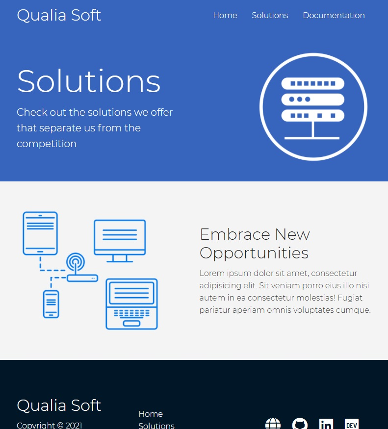

## Solutions-Main section

Monday, January 11, 2021, 14:10

```html
<!-- Solutions-Main -->
<section class="solutions-main my-2">
  <div class="container grid grid-3">
    <div class="card flex">
      <i class="fas fa-server fa-3x"></i>
      <p>
        Lorem, ipsum dolor sit amet consectetur adipisicing elit. Nobis, ex?
      </p>
    </div>
    <div class="card flex">
      <i class="fas fa-network-wired fa-3x"></i>
      <p>
        Lorem, ipsum dolor sit amet consectetur adipisicing elit. Nobis, ex?
      </p>
    </div>
    <div class="card flex">
      <i class="fas fa-laptop-code fa-3x"></i>
      <p>
        Lorem, ipsum dolor sit amet consectetur adipisicing elit. Nobis, ex?
      </p>
    </div>
    <div class="card flex">
      <i class="fas fa-database fa-3x"></i>
      <p>
        Lorem, ipsum dolor sit amet consectetur adipisicing elit. Nobis, ex?
      </p>
    </div>
    <div class="card flex">
      <i class="fas fa-power-off fa-3x"></i>
      <p>
        Lorem, ipsum dolor sit amet consectetur adipisicing elit. Nobis, ex?
      </p>
    </div>
    <div class="card flex">
      <i class="fas fa-upload fa-3x"></i>
      <p>
        Lorem, ipsum dolor sit amet consectetur adipisicing elit. Nobis, ex?
      </p>
    </div>
  </div>
</section>
```

Now, for the CSS part, we want some items to span over the 3 column grid:

- the first item will span over 3 columns, occupying the whole first row
- the second item will span over 2 columns, occupying 2/3 of the second row
- and the next items will just follow in line

```css
/* Solutions-Main section */
.solutions-main .grid {
  padding: 30px;
  gap: 20px;
}

.solutions-main .card > i {
  margin-right: 20px;
}

.solutions-main .grid > *:first-child {
  grid-column: 1 / span 3;
}

.solutions-main .grid > *:nth-child(2) {
  grid-column: 1 / span 2;
}
```


# Documentation html page

Entire `docs.html`

```html
<!DOCTYPE html>
<html lang="en">
  <head>
    <meta charset="UTF-8" />
    <meta name="viewport" content="width=device-width, initial-scale=1.0" />
    <link rel="stylesheet" href="css/utilities.css" />
    <link rel="stylesheet" href="css/style.css" />
    <link
      rel="stylesheet"
      href="https://cdnjs.cloudflare.com/ajax/libs/font-awesome/5.15.1/css/all.min.css"
    />
    <title>Qualia Soft | Software Solutions for Everyone</title>
  </head>
  <body>
    <!-- Navbar: Logo and Navigation -->
    <div class="navbar">
      <div class="container flex">
        <h1 class="logo">Qualia Soft</h1>
        <nav>
          <ul>
            <li><a href="index.html">Home</a></li>
            <li><a href="solutions.html">Solutions</a></li>
            <li><a href="docs.html">Docs</a></li>
          </ul>
        </nav>
      </div>
    </div>

    <!-- Head / Hero -->
    <section class="docs-head bg-primary py-3">
      <div class="container grid">
        <div>
          <h1 class="xl">Documentation</h1>
          <p class="lead">
            Learn how to use our analytics software to see your App perfoms in
            the real world
          </p>
        </div>
        
      </div>
    </section>

    <section class="docs-main my-4">
      <div class="container grid">
        <!-- First Grid Item, Sidebar -->
        <div class="card bg-light p-3">
          <h3 class="my-2">Essentials</h3>
          <nav>
            <ul>
              <li><a href="#" class="text-primary">Introduction</a></li>
              <li><a href="#">Login Information</a></li>
              <li><a href="#">Get Started</a></li>
            </ul>
          </nav>

          <h3 class="my-2">Navigation</h3>
          <nav>
            <ul>
              <li><a href="#">Types of Metrics</a></li>
              <li><a href="#">Clients Analytics</a></li>
              <li><a href="#">App Ratings</a></li>
              <li><a href="#">Preferences</a></li>
            </ul>
          </nav>
        </div>

        <!-- Second Grid Item, Context -->
        <div class="card">
          <h2>Introduction</h2>
          <p>
            Lorem ipsum dolor sit, amet consectetur adipisicing elit. Soluta
            tenetur error amet nesciunt ipsam esse ipsa at molestias, maxime
            numquam, modi a voluptatibus dolore, debitis magnam unde sint
            officiis facere?
          </p>

          <div class="alert alert-success">
            <i class="fas fa-info">
              Lorem ipsum, dolor sit amet consectetur adipisicing elit. Quo,
              minima.
            </i>
          </div>

          <h3>Using our Web Application</h3>
          <p>
            Lorem ipsum dolor, sit amet consectetur adipisicing elit. Explicabo
            hic debitis iste velit error totam deserunt quos facere? Cumque,
            veniam?
          </p>
          <a href="#" class="btn btn-primary">Go to our Web App</a>

          <h3>Requirements</h3>
          <ul>
            <li>Confirmed Registration Email</li>
            <li>Received Login Information</li>
            <li>Affirmative Deployment Status</li>
          </ul>

          <h3>Using our Custom Software</h3>
          <p>
            Lorem ipsum dolor, sit amet consectetur adipisicing elit. Iusto
            quibusdam dolorum quis recusandae? Nostrum, omnis?
          </p>
          <a href="#" class="btn btn-primary">Download Software</a>

          <h3>Additional Commands</h3>
          <p>Mac (Homebrew)</p>
          <pre><code>$ brew install qualia-metrics</code></pre>
          <p>Linux (apt)</p>
          <pre><code>$ sudo apt install qualia-metrics</code></pre>
          <p>Linux (yum)</p>
          <pre><code>$ sudo yum install qualia-metrics</code></pre>
        </div>
      </div>
    </section>

    <!-- Footer -->
    <footer class="footer bg-dark py-5">
      <div class="container grid grid-3">
        <div>
          <h1>Qualia Soft</h1>
          <p>
            Copyright &copy; 2021<br />
            Made by
            <a
              target="_blank"
              rel="noopener noreferrer"
              href="https://radubulai.com"
              >Radu-Alexandru Bulai</a
            >
          </p>
        </div>

        <nav>
          <ul>
            <li><a href="index.html">Home</a></li>
            <li><a href="solutions.html">Solutions</a></li>
            <li><a href="docs.html">Docs</a></li>
          </ul>
        </nav>

        <div class="social">
          <a
            target="_blank"
            rel="noopener noreferrer"
            href="https://radubulai.com"
            ><i class="fas fa-globe fa-2x"></i
          ></a>
          <a
            target="_blank"
            rel="noopener noreferrer"
            href="https://github.com/radualexandrub"
            title="GitHub"
            ><i class="fab fa-github fa-2x"></i
          ></a>
          <a
            target="_blank"
            rel="noopener noreferrer"
            href="https://www.linkedin.com/in/radu-alexandru-bulai"
            ><i class="fab fa-linkedin fa-2x"></i
          ></a>
          <a
            target="_blank"
            rel="noopener noreferrer"
            href="https://dev.to/radualexandrub"
            title="Dev.to"
            ><i class="fab fa-dev fa-2x"></i
          ></a>
        </div>
      </div>
    </footer>
  </body>
</html>
```

First things first, for our Documentation page we'll actually have a two columned grid, where first item will be the sidebar itself, then the second item will be the context where information will be displayed. We need to set up our grid to be `grid-template-columns: 1fr 2fr;`, so the context will occupy 2/3 of the whole grid space.

We also need to align the sidebar (docs navigation as first grid item) to the top, for this we'll just use `align-items: flex-start;` which will align all items on the top (all items will start from the top).

```css
/******************/
/* docs.html */
/******************/
.docs-head img {
  width: 230px;
  justify-self: flex-end;
}

.docs-main h3 {
  margin: 20px;
}

.docs-main .grid {
  grid-template-columns: 1fr 2fr;
  align-items: flex-start;
}
```

So far so good:

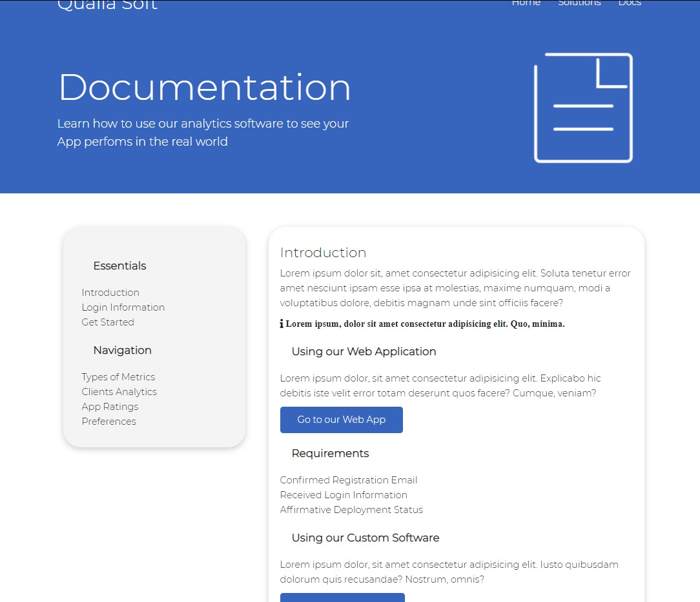

## New utility classes

We'll also add the new classes to our `utilities.css`, namely: `.alert` , `alert-success` and `alert-danger` as well as some text-color (for our navigation sidebar)

```css
/* utilities.css */
/* Alerts */
.alert {
  background-color: var(--light-color);
  padding: 10px 20px;
  font-weight: bold;
  margin: 15px 0;
}

.alert i {
  /* icon */
  margin-right: 10px;
}

.alert-success {
  background-color: var(--success-color);
  color: #fff;
}

.alert-danger {
  background-color: var(--danger-color);
  color: #fff;
}

/* Text colors */
.text-primary {
  color: var(--primary-color);
}

.text-secondary {
  color: var(--secondary-color);
}

.text-dark {
  color: var(--dark-color);
}

.text-light {
  color: var(--light-color);
}
```

And also add these new colors in our `root` in main `style.css`

```css
/* style.css */
:root {
  --font-color: #222;
  --primary-color: #3764bd;
  --secondary-color: #325aac;
  --dark-color: #011627;
  --light-color: #f4f4f4;
  --success-color: #5cb85c;
  --danger-color: #dc3545;
}
```

## CSS for docs page

We can also make a highlight for the currently selected item in our nav / sidebar: we'll add in our `docs.html`, a class `text-primary`

Now we will style our links in our navigation sidebar, and our `<code>` style.

```css
/* style.css */
/* Overwrite HTML Defaults */
code,
pre {
  background-color: #333;
  color: #fff;
  padding: 10px;
}

/******************/
/* docs.html */
/******************/
.docs-head img {
  width: 230px;
  justify-self: flex-end;
}

.docs-main h3 {
  margin: 20px;
}

.docs-main .grid {
  grid-template-columns: 1fr 2fr;
  align-items: flex-start;
}

.docs-main nav li {
  padding-top: 5px;
  padding-bottom: 3px;
  margin-bottom: 4px;
  border-bottom: 1px #ccc solid;
}

.docs-main nav a:hover {
  font-weight: bold;
}
```

<br/>

# Media Queries for Solutions and Docs page

Monday, January 11, 2021, 16:18

We'll just add the new classes (from each new page created: `solutions.html` and `docs.html`) to our current media queries (that we created earlier). We can also place them at the bottom of our `style.css` file.

**Note** that we actually did a OK job with our naming conventions:

- navbar section
- `index.html`
  - section with class `.showcase`
  - section with class `.stats`
  - section with class `.steps`
  - section with class `.banner`
  - section with class `.technologies`
- `solutions.html`
  - `.solutions-head`
  - `.solutions-sub-head`
  - `.solutions-main`
- `docs.html`
  - `.docs-head`
  - `.docs-main`
- footer section

<br/>

Okay, so first we add all those classes to the properties of `grid-template-columns: 1fr;` and `grid-template-rows: 1fr;`.

Then, we align the texts to the center using:

```css
.solutions-head,
.solutions-sub-head,
.docs-head {
  text-align: center;
}
```

Note that our images will not center yet by using this... so in order to align our images, we need to create separate classes, like this:

```css
.solutions-head img,
.solutions-sub-head img,
.docs-head img {
  justify-self: center;
}
```

<br/>

Now, just like the last time, we need to solve this thing in our `solutions.html`:


So, we'll reset again the properties of grid that we set earlier (note that we only modified columns, not both column and row), so we can simply write:

```css
.solutions-main .grid > *:first-child,
.solutions-main .grid > *:nth-child(2) {
  grid-column: 1;
}
```

And Done.

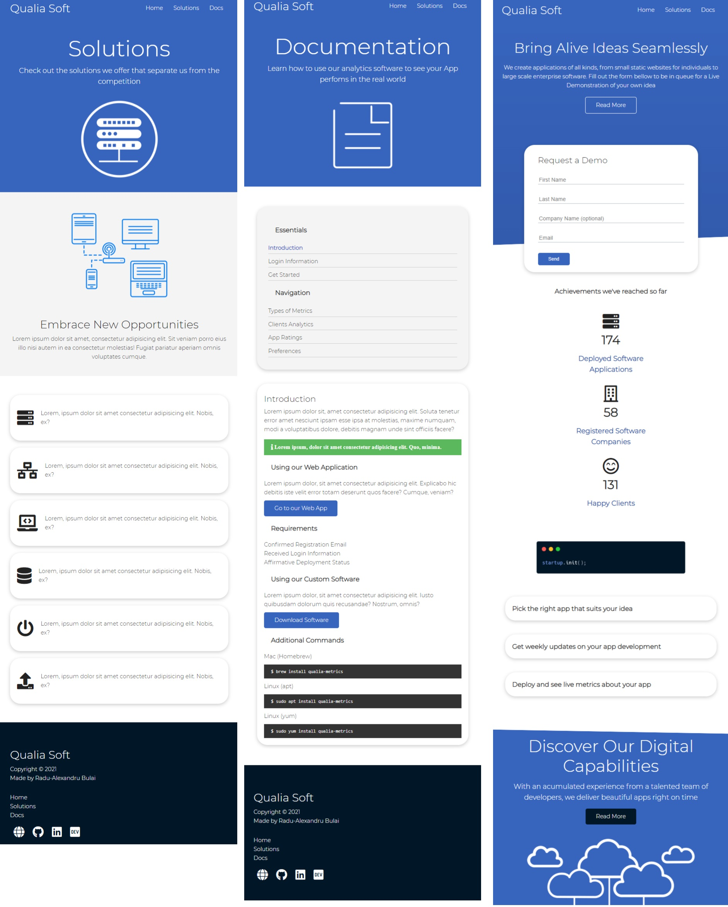

(Note, you can take long screenshot within Desktop Browser using [FireShot Chrome Extension](https://chrome.google.com/webstore/detail/take-webpage-screenshots/mcbpblocgmgfnpjjppndjkmgjaogfceg?hl=en))

Here's the code for all the `@media` queries of those 3 pages (`index.html`, `solutions.html`, `docs.html`):

```css
/****************************/
/* Media Queries for Mobile */
/****************************/

/* Tablets and under */
@media (max-width: 768px) {
  .grid,
  .showcase .grid,
  .stats .grid,
  .steps .grid,
  .banner .grid,
  .solutions-head .grid,
  .solutions-sub-head .grid,
  .solutions-main .grid,
  .docs-head .grid,
  .docs-main .grid {
    grid-template-columns: 1fr;
    grid-template-rows: 1fr;
  }

  .showcase {
    height: auto;
  }

  .showcase-text {
    text-align: center;
    margin-top: 40px;
  }

  .showcase-form {
    justify-self: center;
    margin: auto;
    max-width: 500px;
  }

  .steps .grid > *:first-child {
    grid-column: 1;
    grid-row: 1;
  }

  .steps .grid {
    padding-bottom: 30px;
  }

  .solutions-head,
  .solutions-sub-head,
  .docs-head {
    text-align: center;
  }

  .solutions-head img,
  .solutions-sub-head img,
  .docs-head img {
    justify-self: center;
  }

  .solutions-main .grid > *:first-child,
  .solutions-main .grid > *:nth-child(2) {
    grid-column: 1;
  }
}

/* Mobile */
@media (max-width: 550px) {
  .navbar {
    height: 90px;
  }

  .navbar .flex {
    flex-direction: column;
    overflow: visible;
    justify-content: center;
  }

  .navbar ul {
    padding: 10px;
    background-color: rgba(0, 0, 0, 0.1);
  }
}
```

<br/>

# Homepage Animation

First, we will make the following keyframes in our `style.css` (they are basically translating whichever element from the complete outreach/outside of the page, namely `-100%` and `100%` to the actual visible page `0%`, for `Y` axis and `X` axis):

```css
@keyframes slideInFromLeft {
  0% {
    transform: translateX(-100%);
  }
  100% {
    transform: translate(0);
  }
}

@keyframes slideInFromRight {
  0% {
    transform: translateX(100%);
  }
  100% {
    transform: translate(0);
  }
}

@keyframes slideInFromTop {
  0% {
    transform: translateY(-100%);
  }
  100% {
    transform: translate(0);
  }
}

@keyframes slideInFromBottom {
  0% {
    transform: translateY(100%);
  }
  100% {
    transform: translate(0);
  }
}
```

Now we'll integrate those keyframes into `animations`, in our `showcase` / hero section from `index.html`:

```css
/* Intro Animations */
.showcase-text {
  animation: slideInFromLeft 500ms ease-out;
}

.showcase-form {
  animation: slideInFromRight 500ms ease-out;
}

/* Stats Section */
.stats {
  padding-top: 100px;
  animation: slideInFromBottom 500ms ease-out;
}

/* Steps CLI Section */
.steps {
  animation: slideInFromBottom 500ms ease-out;
}
```

Cute. That was actually a lot easier to make than I've expected.


You can also make different animations just for mobile screens by just overwriting them in the `@media` queries... For example:

```css
/* Intro Animations for mobile screens */
@media (max-width: 768px) {
  .showcase-text {
    animation: slideInFromTop 500ms ease-out;
  }

  .showcase-form {
    animation: slideInFromBottom 500ms ease-out;
  }

  .stats {
    animation: slideInFromBottom 500ms ease-out;
  }

  .steps {
    animation: slideInFromBottom 500ms ease-out;
  }
}
```


<br/>

# Complete Code

Project File Tree:

```
ResponsiveWebsiteTutorial/
┣ css/
┃ ┣ style.css
┃ ┗ utilities.css
┣ images/
┃ ┣ logos/
┃ ┃ ┣ csharp.png
┃ ┃ ┣ django.png
┃ ┃ ┣ go.png
┃ ┃ ┣ node.png
┃ ┃ ┣ php.png
┃ ┃ ┣ python.png
┃ ┃ ┣ ruby.png
┃ ┃ ┗ scala.png
┃ ┣ cli.png
┃ ┣ cloud.png
┃ ┣ docs.png
┃ ┣ server.png
┃ ┗ server2.png
┣ docs.html
┣ index.html
┗ solutions.html
```

## index.html

```html
<!DOCTYPE html>
<html lang="en">
  <head>
    <meta charset="UTF-8" />
    <meta name="viewport" content="width=device-width, initial-scale=1.0" />
    <link rel="stylesheet" href="css/utilities.css" />
    <link rel="stylesheet" href="css/style.css" />
    <link
      rel="stylesheet"
      href="https://cdnjs.cloudflare.com/ajax/libs/font-awesome/5.15.1/css/all.min.css"
    />
    <title>Qualia Soft | Software Solutions for Everyone</title>
  </head>
  <body>
    <!-- Navbar: Logo and Navigation -->
    <div class="navbar">
      <div class="container flex">
        <h1 class="logo">Qualia Soft</h1>
        <nav>
          <ul>
            <li><a href="index.html">Home</a></li>
            <li><a href="solutions.html">Solutions</a></li>
            <li><a href="docs.html">Docs</a></li>
          </ul>
        </nav>
      </div>
    </div>

    <!-- Showcase | Hero Section -->
    <section class="showcase">
      <div class="container grid">
        <div class="showcase-text">
          <h1>Bring Alive Ideas Seamlessly</h1>
          <p>
            We create applications of all kinds, from small static websites for
            individuals to large scale enterprise software. Fill out the form
            bellow to be in queue for a Live Demonstration of your own idea
          </p>
          <a href="solutions.html" class="btn btn-outline">Read More</a>
        </div>

        <div class="showcase-form card">
          <h2>Request a Demo</h2>
          <form>
            <div class="form-control">
              <input
                type="text"
                name="first_name"
                placeholder="First Name"
                required
              />
            </div>
            <div class="form-control">
              <input
                type="text"
                name="last_name"
                placeholder="Last Name"
                required
              />
            </div>
            <div class="form-control">
              <input
                type="text"
                name="company_name"
                placeholder="Company Name (optional)"
              />
            </div>
            <div class="form-control">
              <input type="email" name="email" placeholder="Email" required />
            </div>
            <input type="submit" value="Send" class="btn btn-primary" />
          </form>
        </div>
      </div>
    </section>

    <!-- Stats -->
    <section class="stats">
      <div class="container">
        <h3 class="stats-heading text-center my-1">
          Achievements we've reached so far
        </h3>

        <div class="grid grid-3 text-center my-4">
          <div>
            <i class="fas fa-server fa-3x"></i>
            <h3>174</h3>
            <p class="text-secondary">Deployed Software<br />Applications</p>
          </div>
          <div>
            <i class="far fa-building fa-3x"></i>
            <h3>58</h3>
            <p class="text-secondary">Registered Software<br />Companies</p>
          </div>
          <div>
            <i class="far fa-smile-beam fa-3x"></i>
            <h3>131</h3>
            <p class="text-secondary">Happy Clients</p>
          </div>
        </div>
      </div>
    </section>

    <!-- Steps -->
    <section class="steps">
      <div class="container grid">
        
        <div class="card">
          <h3>Pick the right app that suits your idea</h3>
        </div>
        <div class="card">
          <h3>Get weekly updates on your app development</h3>
        </div>
        <div class="card">
          <h3>Deploy and see live metrics about your app</h3>
        </div>
      </div>
    </section>

    <!-- Banner -->
    <section class="banner bg-primary my-2 py-2">
      <div class="container grid">
        <div class="text-center">
          <h2 class="lg">Discover Our Digital Capabilities</h2>
          <p class="lead my-1">
            With an acumulated experience from a talented team of developers, we
            deliver beautiful apps right on time
          </p>
          <a href="solutions.html" class="btn btn-dark">Read More</a>
        </div>
        
      </div>
    </section>

    <!-- Technologies -->
    <section class="technologies">
      <h2 class="md text-center my">Tech Stack we use</h2>
      <div class="container flex">
        <div class="card">
          <h4>Django</h4>
          
        </div>
        <div class="card">
          <h4>Node.js</h4>
          
        </div>
        <div class="card">
          <h4>Go</h4>
          
        </div>
        <div class="card">
          <h4>Ruby</h4>
          
        </div>
        <div class="card">
          <h4>C#</h4>
          
        </div>
        <div class="card">
          <h4>PHP</h4>
          
        </div>
        <div class="card">
          <h4>Python</h4>
          
        </div>
      </div>
    </section>

    <!-- Footer -->
    <footer class="footer bg-dark py-5">
      <div class="container grid grid-3">
        <div>
          <h1>Qualia Soft</h1>
          <p>
            Copyright &copy; 2021<br />
            Made by
            <a
              target="_blank"
              rel="noopener noreferrer"
              href="https://radubulai.com"
              >Radu-Alexandru Bulai</a
            >
          </p>
        </div>

        <nav>
          <ul>
            <li><a href="index.html">Home</a></li>
            <li><a href="solutions.html">Solutions</a></li>
            <li><a href="docs.html">Docs</a></li>
          </ul>
        </nav>

        <div class="social">
          <a
            target="_blank"
            rel="noopener noreferrer"
            href="https://radubulai.com"
            ><i class="fas fa-globe fa-2x"></i
          ></a>
          <a
            target="_blank"
            rel="noopener noreferrer"
            href="https://github.com/radualexandrub"
            title="GitHub"
            ><i class="fab fa-github fa-2x"></i
          ></a>
          <a
            target="_blank"
            rel="noopener noreferrer"
            href="https://www.linkedin.com/in/radu-alexandru-bulai"
            ><i class="fab fa-linkedin fa-2x"></i
          ></a>
          <a
            target="_blank"
            rel="noopener noreferrer"
            href="https://dev.to/radualexandrub"
            title="Dev.to"
            ><i class="fab fa-dev fa-2x"></i
          ></a>
        </div>
      </div>
    </footer>
  </body>
</html>
```

<br/>

## solutions.html

```html
<!DOCTYPE html>
<html lang="en">
  <head>
    <meta charset="UTF-8" />
    <meta name="viewport" content="width=device-width, initial-scale=1.0" />
    <link rel="stylesheet" href="css/utilities.css" />
    <link rel="stylesheet" href="css/style.css" />
    <link
      rel="stylesheet"
      href="https://cdnjs.cloudflare.com/ajax/libs/font-awesome/5.15.1/css/all.min.css"
    />
    <title>Qualia Soft | Software Solutions for Everyone</title>
  </head>
  <body>
    <!-- Navbar: Logo and Navigation -->
    <div class="navbar">
      <div class="container flex">
        <h1 class="logo">Qualia Soft</h1>
        <nav>
          <ul>
            <li><a href="index.html">Home</a></li>
            <li><a href="solutions.html">Solutions</a></li>
            <li><a href="docs.html">Docs</a></li>
          </ul>
        </nav>
      </div>
    </div>

    <!-- Head / Hero -->
    <section class="solutions-head bg-primary py-3">
      <div class="container grid">
        <div>
          <h1 class="xl">Solutions</h1>
          <p class="lead">
            Check out the solutions we offer that separate us from the
            competition
          </p>
        </div>
        
      </div>
    </section>

    <!-- SubHead / SubHero -->
    <section class="solutions-sub-head bg-light py-3">
      <div class="container grid">
        
        <div>
          <h2 class="md">Embrace New Opportunities</h2>
          <p>
            Lorem ipsum dolor sit amet, consectetur adipisicing elit. Sit veniam
            porro eius illo nisi autem in ea consectetur molestias! Fugiat
            pariatur aperiam omnis voluptates cumque.
          </p>
        </div>
      </div>
    </section>

    <!-- Solutions-Main -->
    <section class="solutions-main my-2">
      <div class="container grid grid-3">
        <div class="card flex">
          <i class="fas fa-server fa-3x"></i>
          <p>
            Lorem, ipsum dolor sit amet consectetur adipisicing elit. Nobis, ex?
          </p>
        </div>
        <div class="card flex">
          <i class="fas fa-network-wired fa-3x"></i>
          <p>
            Lorem, ipsum dolor sit amet consectetur adipisicing elit. Nobis, ex?
          </p>
        </div>
        <div class="card flex">
          <i class="fas fa-laptop-code fa-3x"></i>
          <p>
            Lorem, ipsum dolor sit amet consectetur adipisicing elit. Nobis, ex?
          </p>
        </div>
        <div class="card flex">
          <i class="fas fa-database fa-3x"></i>
          <p>
            Lorem, ipsum dolor sit amet consectetur adipisicing elit. Nobis, ex?
          </p>
        </div>
        <div class="card flex">
          <i class="fas fa-power-off fa-3x"></i>
          <p>
            Lorem, ipsum dolor sit amet consectetur adipisicing elit. Nobis, ex?
          </p>
        </div>
        <div class="card flex">
          <i class="fas fa-upload fa-3x"></i>
          <p>
            Lorem, ipsum dolor sit amet consectetur adipisicing elit. Nobis, ex?
          </p>
        </div>
      </div>
    </section>

    <!-- Footer -->
    <footer class="footer bg-dark py-5">
      <div class="container grid grid-3">
        <div>
          <h1>Qualia Soft</h1>
          <p>
            Copyright &copy; 2021<br />
            Made by
            <a
              target="_blank"
              rel="noopener noreferrer"
              href="https://radubulai.com"
              >Radu-Alexandru Bulai</a
            >
          </p>
        </div>

        <nav>
          <ul>
            <li><a href="index.html">Home</a></li>
            <li><a href="solutions.html">Solutions</a></li>
            <li><a href="docs.html">Docs</a></li>
          </ul>
        </nav>

        <div class="social">
          <a
            target="_blank"
            rel="noopener noreferrer"
            href="https://radubulai.com"
            ><i class="fas fa-globe fa-2x"></i
          ></a>
          <a
            target="_blank"
            rel="noopener noreferrer"
            href="https://github.com/radualexandrub"
            title="GitHub"
            ><i class="fab fa-github fa-2x"></i
          ></a>
          <a
            target="_blank"
            rel="noopener noreferrer"
            href="https://www.linkedin.com/in/radu-alexandru-bulai"
            ><i class="fab fa-linkedin fa-2x"></i
          ></a>
          <a
            target="_blank"
            rel="noopener noreferrer"
            href="https://dev.to/radualexandrub"
            title="Dev.to"
            ><i class="fab fa-dev fa-2x"></i
          ></a>
        </div>
      </div>
    </footer>
  </body>
</html>
```

<br/>

## docs.html

```html
<!DOCTYPE html>
<html lang="en">
  <head>
    <meta charset="UTF-8" />
    <meta name="viewport" content="width=device-width, initial-scale=1.0" />
    <link rel="stylesheet" href="css/utilities.css" />
    <link rel="stylesheet" href="css/style.css" />
    <link
      rel="stylesheet"
      href="https://cdnjs.cloudflare.com/ajax/libs/font-awesome/5.15.1/css/all.min.css"
    />
    <title>Qualia Soft | Software Solutions for Everyone</title>
  </head>
  <body>
    <!-- Navbar: Logo and Navigation -->
    <div class="navbar">
      <div class="container flex">
        <h1 class="logo">Qualia Soft</h1>
        <nav>
          <ul>
            <li><a href="index.html">Home</a></li>
            <li><a href="solutions.html">Solutions</a></li>
            <li><a href="docs.html">Docs</a></li>
          </ul>
        </nav>
      </div>
    </div>

    <!-- Head / Hero -->
    <section class="docs-head bg-primary py-3">
      <div class="container grid">
        <div>
          <h1 class="xl">Documentation</h1>
          <p class="lead">
            Learn how to use our analytics software to see your App perfoms in
            the real world
          </p>
        </div>
        
      </div>
    </section>

    <section class="docs-main my-4">
      <div class="container grid">
        <!-- First Grid Item, Sidebar -->
        <div class="card bg-light p-3">
          <h3 class="my-2">Essentials</h3>
          <nav>
            <ul>
              <li>
                <a href="#" class="text-primary text-bold">Introduction</a>
              </li>
              <li><a href="#">Login Information</a></li>
              <li><a href="#">Get Started</a></li>
            </ul>
          </nav>

          <h3 class="my-2">Navigation</h3>
          <nav>
            <ul>
              <li><a href="#">Types of Metrics</a></li>
              <li><a href="#">Clients Analytics</a></li>
              <li><a href="#">App Ratings</a></li>
              <li><a href="#">Preferences</a></li>
            </ul>
          </nav>
        </div>

        <!-- Second Grid Item, Context -->
        <div class="card">
          <h2>Introduction</h2>
          <p>
            Lorem ipsum dolor sit, amet consectetur adipisicing elit. Soluta
            tenetur error amet nesciunt ipsam esse ipsa at molestias, maxime
            numquam, modi a voluptatibus dolore, debitis magnam unde sint
            officiis facere?
          </p>

          <div class="alert alert-success">
            <i class="fas fa-info">
              Lorem ipsum, dolor sit amet consectetur adipisicing elit. Quo,
              minima.
            </i>
          </div>

          <h3>Using our Web Application</h3>
          <p>
            Lorem ipsum dolor, sit amet consectetur adipisicing elit. Explicabo
            hic debitis iste velit error totam deserunt quos facere? Cumque,
            veniam?
          </p>
          <a href="#" class="btn btn-primary">Go to our Web App</a>

          <h3>Requirements</h3>
          <ul>
            <li>Confirmed Registration Email</li>
            <li>Received Login Information</li>
            <li>Affirmative Deployment Status</li>
          </ul>

          <h3>Using our Custom Software</h3>
          <p>
            Lorem ipsum dolor, sit amet consectetur adipisicing elit. Iusto
            quibusdam dolorum quis recusandae? Nostrum, omnis?
          </p>
          <a href="#" class="btn btn-primary">Download Software</a>

          <h3>Additional Commands</h3>
          <p>Mac (Homebrew)</p>
          <pre><code>$ brew install qualia-metrics</code></pre>
          <p>Linux (apt)</p>
          <pre><code>$ sudo apt install qualia-metrics</code></pre>
          <p>Linux (yum)</p>
          <pre><code>$ sudo yum install qualia-metrics</code></pre>
        </div>
      </div>
    </section>

    <!-- Footer -->
    <footer class="footer bg-dark py-5">
      <div class="container grid grid-3">
        <div>
          <h1>Qualia Soft</h1>
          <p>
            Copyright &copy; 2021<br />
            Made by
            <a
              target="_blank"
              rel="noopener noreferrer"
              href="https://radubulai.com"
              >Radu-Alexandru Bulai</a
            >
          </p>
        </div>

        <nav>
          <ul>
            <li><a href="index.html">Home</a></li>
            <li><a href="solutions.html">Solutions</a></li>
            <li><a href="docs.html">Docs</a></li>
          </ul>
        </nav>

        <div class="social">
          <a
            target="_blank"
            rel="noopener noreferrer"
            href="https://radubulai.com"
            ><i class="fas fa-globe fa-2x"></i
          ></a>
          <a
            target="_blank"
            rel="noopener noreferrer"
            href="https://github.com/radualexandrub"
            title="GitHub"
            ><i class="fab fa-github fa-2x"></i
          ></a>
          <a
            target="_blank"
            rel="noopener noreferrer"
            href="https://www.linkedin.com/in/radu-alexandru-bulai"
            ><i class="fab fa-linkedin fa-2x"></i
          ></a>
          <a
            target="_blank"
            rel="noopener noreferrer"
            href="https://dev.to/radualexandrub"
            title="Dev.to"
            ><i class="fab fa-dev fa-2x"></i
          ></a>
        </div>
      </div>
    </footer>
  </body>
</html>
```

<br/>

## utilities.css

```css
/* Utilities: Classes for reuse */
.container {
  max-width: 1200px;
  margin: 0 auto;
  overflow: auto;
  padding: 0 40px;
}

.flex {
  display: flex;
  justify-content: center;
  align-items: center;
  height: 100%;
}

.grid {
  display: grid;
  grid-template-columns: 1fr 1fr;
  gap: 20px;
  justify-content: center;
  align-items: center;
  height: 100%;
}

.grid-3 {
  grid-template-columns: repeat(3, 1fr);
}

.card {
  background-color: #fff;
  color: var(--font-color);
  border-radius: 30px;
  box-shadow: 0 3px 10px rgba(0, 0, 0, 0.2);
  padding: 20px;
  margin: 10px;
}

.btn {
  display: inline-block;
  padding: 10px 30px;
  cursor: pointer;
  background-color: var(--primary-color);
  color: #fff;
  border: none;
  border-radius: 5px;
  transition: transform 100ms, opacity 100ms;
}

.btn-outline {
  background-color: transparent;
  border: 1px #fff solid;
}

.btn:hover {
  transform: scale(0.97);
  opacity: 0.95;
}

/* Backgrounds & colored buttons */
.bg-primary,
.btn-primary {
  background-color: var(--primary-color);
  color: #fff;
}

.btn-secondary,
.bg-secondary {
  background-color: var(--secondary-color);
  color: #fff;
}

.bg-dark,
.btn-dark {
  background-color: var(--dark-color);
  color: #fff;
}

.btn-light,
.bg-light {
  background-color: var(--light-color);
  color: var(--font-color);
}

.bg-primary a,
.btn-primary a,
.btn-secondary a,
.bg-secondary a,
.bg-dark a,
.btn-dark a {
  color: #fff;
}

/* Text colors */
.text-bold {
  font-weight: bold;
}

.text-primary {
  color: var(--primary-color);
}

.text-secondary {
  color: var(--secondary-color);
}

.text-dark {
  color: var(--dark-color);
}

.text-light {
  color: var(--light-color);
}

/* Alerts */
.alert {
  background-color: var(--light-color);
  padding: 10px 20px;
  font-weight: bold;
  margin: 15px 0;
}

.alert i {
  /* icon */
  margin-right: 10px;
}

.alert-success {
  background-color: var(--success-color);
  color: #fff;
}

.alert-danger {
  background-color: var(--danger-color);
  color: #fff;
}

/* Text sizes */
.lead {
  font-size: 20px;
}

.sm {
  font-size: 1rem;
}

.md {
  font-size: 2rem;
}

.lg {
  font-size: 3rem;
}

.xl {
  font-size: 4rem;
}

.text-center {
  text-align: center;
}

/* Utilities: Margins */
/* Margins for top and bottom */
.my-1 {
  margin: 1rem 0;
}
.my-2 {
  margin: 1.5rem 0;
}
.my-3 {
  margin: 2rem 0;
}
.my-4 {
  margin: 3rem 0;
}
.my-5 {
  margin: 4rem 0;
}

/* Margins for all around */
.m-1 {
  margin: 1rem;
}
.m-2 {
  margin: 1.5rem;
}
.m-3 {
  margin: 2rem;
}
.m-4 {
  margin: 3rem;
}
.m-5 {
  margin: 4rem;
}

/* Paddings for top and bottom */
.py-1 {
  padding: 1rem 0;
}
.py-2 {
  padding: 1.5rem 0;
}
.py-3 {
  padding: 2rem 0;
}
.py-4 {
  padding: 3rem 0;
}
.py-5 {
  padding: 4rem 0;
}

/* Paddings for all around */
.p-1 {
  padding: 1rem;
}
.p-2 {
  padding: 1.5rem;
}
.p-3 {
  padding: 2rem;
}
.p-4 {
  padding: 3rem;
}
.p-5 {
  padding: 4rem;
}
```

<br/>

## style.css

```css
@import url("https://fonts.googleapis.com/css2?family=Montserrat:wght@300&display=swap");

:root {
  --font-color: #222;
  --primary-color: #3764bd;
  --secondary-color: #325aac;
  --dark-color: #011627;
  --light-color: #f4f4f4;
  --success-color: #5cb85c;
  --danger-color: #dc3545;
}

/* Overwrite HTML Defaults */
* {
  box-sizing: border-box;
  padding: 0;
  margin: 0;
}

::selection {
  color: #fff;
  background: var(--primary-color);
}

body {
  font-family: "Montserrat", sans-serif;
  color: var(--font-color);
  line-height: 1.6;
}

ul {
  list-style-type: none;
}

a {
  text-decoration: none;
  color: var(--font-color);
}

h1,
h2 {
  font-weight: 300;
  line-height: 1.2;
  margin: 10px 0;
}

p {
  margin: 10px 0;
}

img {
  width: 100%;
}

code,
pre {
  background-color: #333;
  color: #fff;
  padding: 10px;
}

.hidden {
  visibility: hidden;
  height: 0;
}

/* Navbar */
.navbar {
  background-color: var(--primary-color);
  color: #fff;
  height: 70px;
}

.navbar .flex {
  justify-content: space-between;
  overflow: visible;
}

.navbar ul {
  display: flex;
}

.navbar a {
  color: #fff;
  padding: 10px;
  margin: 0 5px;
}

.navbar a:hover {
  border-bottom: 2px #fff solid;
}

/******************/
/*** index.html ***/
/******************/

/* Showcase | Hero Section */
.showcase {
  position: relative;
  height: 400px;
  background: linear-gradient(
    180deg,
    var(--primary-color),
    var(--secondary-color)
  );
  color: #fff;
}

.showcase h1 {
  font-size: 40px;
}

.showcase p {
  margin: 20px 0;
}

.showcase .grid {
  grid-template-columns: 60% 40%;
  gap: 30px;
  overflow: visible;
}

.showcase-form {
  position: relative;
  top: 60px;
  height: auto;
  width: 100%;
  padding: 20px 40px;
  z-index: 100;
  justify-self: flex-end;
}

.showcase-form .form-control {
  margin: 30px 0;
}

.showcase-form input[type="text"],
.showcase-form input[type="email"] {
  border: 0;
  border-bottom: 1px solid #b4becb;
  width: 100%;
  padding: 3px;
  font-size: 16px;
}

.showcase-form input:focus {
  outline: none;
}

.showcase::before,
.showcase::after {
  content: "";
  position: absolute;
  height: 100px;
  bottom: -70px;
  right: 0;
  left: 0;
  background: #fff;
  transform: skewY(-2deg);
  -webkit-transform: skewY(-2deg);
  -moz-transform: skewY(-2deg);
  -ms-transform: skewY(-2deg);
}

/* Intro Animations */
.showcase-text {
  animation: slideInFromLeft 500ms ease-out;
}

.showcase-form {
  animation: slideInFromRight 500ms ease-out;
}

/* Stats Section */
.stats {
  padding-top: 100px;
  animation: slideInFromBottom 500ms ease-out;
}

.stats-heading {
  max-width: 500px;
  margin: auto;
}

.stats .grid h3 {
  font-size: 35px;
}

.stats .grid p {
  font-size: 20px;
  font-weight: bold;
}

/* Steps CLI Section */
.steps {
  animation: slideInFromBottom 500ms ease-out;
}

.steps .grid {
  grid-template-columns: repeat(3, 1fr);
  grid-template-rows: repeat(3, 1fr);
}

.steps .grid > *:first-child {
  grid-column: 1 / span 2;
  grid-row: 1 / span 3;
}

/* Banner Section */
.banner .grid {
  grid-template-columns: 4fr 3fr;
}

.banner {
  position: relative;
  margin-top: 40px;
}

.banner::before,
.banner::after {
  content: "";
  position: absolute;
  height: 65px;
  top: -45px;
  right: 0;
  left: 0;
  background: #fff;
  transform: skewY(1deg);
  -webkit-transform: skewY(1deg);
  -moz-transform: skewY(1deg);
  -ms-transform: skewY(1deg);
}

/* Technologies Section */
.technologies .flex {
  flex-wrap: wrap;
}

.technologies .card {
  text-align: center;
  margin: 18px 10px 40px;
}

.technologies .card .h4 {
  font-size: 20px;
  margin-bottom: 10px;
}

.technologies .card:hover {
  animation-name: bounce;
  animation-duration: 250ms;
  animation-iteration-count: infinite;
  animation-direction: alternate;
  animation-timing-function: ease-out;
}

@keyframes bounce {
  0% {
    transform: translateY(0px);
  }
  100% {
    transform: translateY(-15px);
  }
}

/* Footer */
.footer .social a {
  margin: 0 10px;
}

.footer a:hover {
  color: #ddd;
}

.footer .social i {
  transition: transform 100ms;
}

.footer .social i:hover {
  transform: scale(1.1);
}

/******************/
/* solutions.html */
/******************/

/* Solutions Head / Hero section */
.solutions-head img {
  width: 240px;
  justify-self: flex-end;
}

.solutions-sub-head img {
  width: 300px;
}

/* Solutions-Main section */
.solutions-main .grid {
  padding: 30px;
  gap: 20px;
}

.solutions-main .card > i {
  margin-right: 20px;
}

.solutions-main .grid > *:first-child {
  grid-column: 1 / span 3;
}

.solutions-main .grid > *:nth-child(2) {
  grid-column: 1 / span 2;
}

/*************/
/* docs.html */
/*************/

.docs-head img {
  width: 230px;
  justify-self: flex-end;
}

.docs-main h3 {
  margin: 20px;
}

.docs-main .grid {
  grid-template-columns: 1fr 2fr;
  align-items: flex-start;
}

.docs-main nav li {
  padding-top: 5px;
  padding-bottom: 3px;
  margin-bottom: 4px;
  border-bottom: 1px #ccc solid;
}

.docs-main nav a:hover {
  font-weight: bold;
}

/**************/
/* Animations */
/**************/

@keyframes slideInFromLeft {
  0% {
    transform: translateX(-100%);
  }
  100% {
    transform: translate(0);
  }
}

@keyframes slideInFromRight {
  0% {
    transform: translateX(100%);
  }
  100% {
    transform: translate(0);
  }
}

@keyframes slideInFromTop {
  0% {
    transform: translateY(-100%);
  }
  100% {
    transform: translate(0);
  }
}

@keyframes slideInFromBottom {
  0% {
    transform: translateY(100%);
  }
  100% {
    transform: translate(0);
  }
}

/****************************/
/* Media Queries for Mobile */
/****************************/

/* Tablets and under */
@media (max-width: 768px) {
  .grid,
  .showcase .grid,
  .stats .grid,
  .steps .grid,
  .banner .grid,
  .solutions-head .grid,
  .solutions-sub-head .grid,
  .solutions-main .grid,
  .docs-head .grid,
  .docs-main .grid {
    grid-template-columns: 1fr;
    grid-template-rows: 1fr;
  }

  .showcase {
    height: auto;
  }

  .showcase-text {
    text-align: center;
    margin-top: 40px;
  }

  .showcase-form {
    justify-self: center;
    margin: auto;
    max-width: 500px;
  }

  .steps .grid > *:first-child {
    grid-column: 1;
    grid-row: 1;
  }

  .steps .grid {
    padding-bottom: 30px;
  }

  .solutions-head,
  .solutions-sub-head,
  .docs-head {
    text-align: center;
  }

  .solutions-head img,
  .solutions-sub-head img,
  .docs-head img {
    justify-self: center;
  }

  .solutions-main .grid > *:first-child,
  .solutions-main .grid > *:nth-child(2) {
    grid-column: 1;
  }
}

/* Mobile */
@media (max-width: 550px) {
  .navbar {
    height: 90px;
  }

  .navbar .flex {
    flex-direction: column;
    overflow: visible;
    justify-content: center;
  }

  .navbar ul {
    padding: 10px;
    background-color: rgba(0, 0, 0, 0.1);
  }
}

/* Intro Animations for mobile screens */
@media (max-width: 768px) {
  .showcase-text {
    animation: slideInFromTop 500ms ease-out;
  }

  .showcase-form {
    animation: slideInFromBottom 500ms ease-out;
  }
}
```
