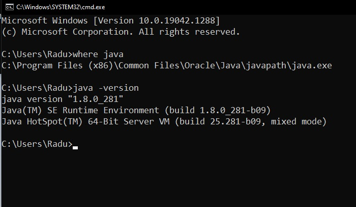
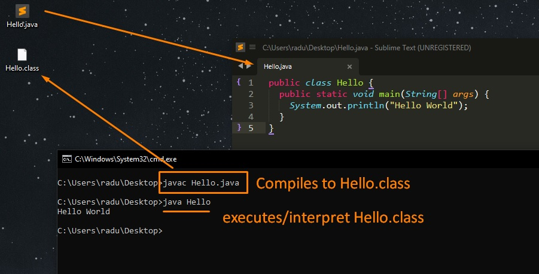
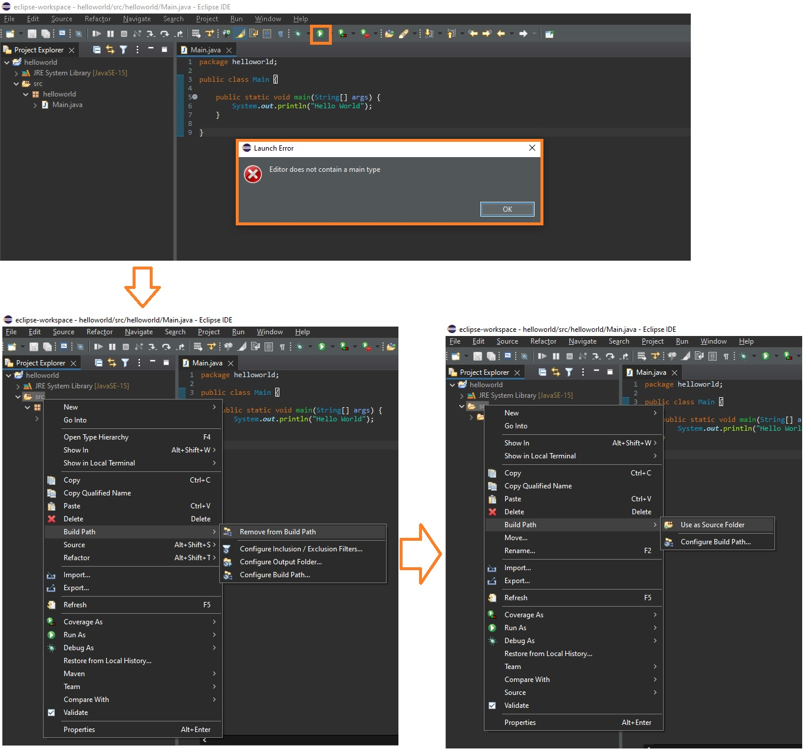

# Java Tutorial

Credits / Notes taken from:

- [Learn Java 8 - Full Tutorial for Beginners 8-Aug-2018 - 9h32m - freeCodeCamp](https://youtu.be/grEKMHGYyns)
- [Java - W3Schools](https://www.w3schools.com/java/default.asp)
- [Intro to Java Programming - Course for Absolute Beginners - 21-May-2019 - 3h48m](https://youtu.be/GoXwIVyNvX0)

Table of Contents:

## Java Introduction

[to be updated]

- **Java Frameworks**
  - [Spring](https://spring.io/) - lightweight web application development framework used for Enterprise Java (JEE)
  - [Hibernate](https://hibernate.org/) - object-relational mapping framework for relational database management systems (RDBMS)
  - [JSF (JavaServer Faces)](https://www.oracle.com/java/technologies/javaserverfaces.html)
  - [GWT (Google Web Toolkit)](http://www.gwtproject.org/)
  - See also: [10 of the Most Popular Java Frameworks of 2020](https://stackify.com/10-of-the-most-popular-java-frameworks-of-2020/) and [Top 10 Java Frameworks You Should Know](https://www.edureka.co/blog/java-frameworks/)

<br/>

## First Java Project

- You should theoretically have Java already installed if on Windows Machine:



However, the "javac" command won't work (we can't compile java to binary classes with Command Prompt using the default Windows's Java)

(Recommended) You can download the JDK (Java Development Toolkit) separately from here: https://www.oracle.com/java/technologies/downloads/#jdk17-windows

**[Setup Java for Windows (Command Prompt) - w3schools](https://www.w3schools.com/java/java_getstarted.asp)**

1. Go to "System Properties" (Can be found on Control Panel > System and Security > System > Advanced System Settings)
2. Click on the "Environment variables" button under the "Advanced" tab
3. Then, select the "Path" variable in System variables and click on the "Edit" button
4. Click on the "New" button and add the path where Java is installed, followed by **\bin**. By default, Java is installed in C:\Program Files\Java\jdk-11.0.1 (If nothing else was specified when you installed it). In that case, You will have to add a new path with: **C:\Program Files\Java\jdk-11.0.1\bin**
   Then, click "OK", and save the settings
5. Restart PC
6. Open Command Prompt (cmd.exe) and type **java -version** to see if Java is running on your machine


Now we can also run "javac" command.



<br/>

**Eclipse IDE:**

- Install Eclipse IDE from here: https://www.eclipse.org/downloads/ (it will be installed to `C:\Users\your_name\eclipse\java-2021-09\eclipse`)


- To create a new Java Project, go to File -> New -> Other -> Java -> Java Project


- We can delete the module that is automatically created
- On our new project, right click on "src" (source) folder -> new -> package. The first package (or the main package of the project) should be the same name as the project.


- Inside our package, we right click again -> new -> class -> we can name it "Main" (class names starts with Capital letters)


- Write "Hello World" and, to fix "Editor Does Not Contain Main Type" error, follow these steps (Right click on "src" folder):



- Click again on "Run Main" icon and... congrats, you successfully ran your first "Hello World" app in Java.

<br/>


# Java Syntax / Keywords

## Classes

https://www.w3schools.com/java/java_classes.asp

Everything in Java is associated with classes and objects, along with its attributes and methods. For example: in real life, a car is an object. The car has **attributes**, such as weight and color, and **methods**, such as drive and brake.

A Class is like an object constructor, or a "blueprint" for creating objects.

**Every Java program has a `class` name which must match the filename.**


## Package

https://www.w3schools.com/java/java_packages.asp

A java package is **a group of similar types of classes, interfaces and sub-packages**. 

Think of it as **a folder in a file directory**. We use packages to avoid name conflicts, and to write a better maintainable code. Packages are divided into two categories:

- Built-in Packages (packages from the Java API), such as java, lang, awt, javax, swing, net, io, util, sql etc.
- User-defined Packages (create your own packages)

<br/>

To use a class or a package from the library, you need to use the `import` keyword:

```java
import package.name.Class;   // Import a single class
import package.name.*;   // Import the whole package
```


<br/>

**The main Method**

The `main()` method is required and you will see it in every Java program:

```java
public static void main(String[] args) {
  String userName = "Alex";
  System.out.println("Hello " + userName); // Hello Alex
  
  int x = 1, y = 2, z = 3;
	System.out.println(x + y + z); // 6
}
```

Any code inside the `main()` method will be executed.


## Final variables

You can add the `final` keyword if you don't want others (or yourself) to overwrite existing values (this will declare the variable as "final" or "constant", which means unchangeable and read-only):

```java
int myNum = 15;
myNum = 20;
System.out.println(myNum); // 20

final int myNumFinal = 15;
myNumFinal = 20;  // will generate an error: cannot assign a value to a final variable

/* The final local variable myNumFinal cannot be assigned. It must be blank and not using a compound assignment */
```


# Java Data Types and Operators

Source: https://www.w3schools.com/java/java_data_types.asp

<br/>

## Primitive Data Types

**Primitive Data Types**

| Data Type | Size           | Description                                                  |
| :-------- | :------------- | :----------------------------------------------------------- |
| byte      | 1 byte         | Stores whole numbers from -128 to 127                        |
| short     | 2 bytes        | Stores whole numbers from -32,768 to 32,767                  |
| int       | 4 bytes        | Stores whole numbers from -2,147,483,648 to 2,147,483,647    |
| long      | 8 bytes        | Stores whole numbers from -9,223,372,036,854,775,808 to 9,223,372,036,854,775,807 |
| float     | 4 bytes        | Stores fractional numbers. Sufficient for storing 6 to 7 decimal digits |
| double    | 8 bytes        | Stores fractional numbers. Sufficient for storing 15 decimal digits |
| boolean   | 1 bit / 1 byte | Stores true or false values                                  |
| char      | 2 bytes        | Stores a single character/letter or ASCII values             |

<br/>

Code Examples:

```java
int myNum = 5;               // Integer (whole number)
float myFloatNum = 5.99f;    // Floating point number
double myDouble = 5.99d;      // Double

char myLetter = 'D';         // Character
String myText = "Hello";     // String

boolean myBool = true;       // Boolean
```


```java
double x = 0.2;
float y = .1f;
System.out.println(x + y); // 0.30000000149011613
```

<br/>

**Non-primitive data types**:

| Data Type | Size | Description                                                  |
| :-------- | :--- | :----------------------------------------------------------- |
| String    |      | Store a sequence of characters (text). String values must be surrounded by double quotes. Strings are immutable. |
| Array     |      | Store multiple values in a single variable                   |
| Class     |      |                                                              |
| Interface |      |                                                              |


Code Examples:

```java
String[] cars = {"Volvo", "BMW", "Ford", "Mazda"};

// get type of data in cars variable (works only for non-primitive data)
System.out.println(cars.getClass().getName()); // [Ljava.lang.String;
System.out.println(cars.getClass().getSimpleName()); // String[]

// ? Get type of data in cars variable and hashcode (it's not the memory address)
System.out.println(cars); // [Ljava.lang.String;@182decdb

// Loop through Array
for (int i = 0; i < cars.length; i++) {
  System.out.print(cars[i] + " "); // Volvo BMW Ford Mazda 
}
```

<br/>

**Java constants**

Java doesn't have built-in constants like PHP. However you can create a "constant" (a `final` variable).

Example:

```java
public class Main {
	public static final int MAX_SECONDS = 25;
  
	public static void main(String[] args) {
		System.out.println(MAX_SECONDS); // 25
	}
}
```

🟠 Note that Java doesn't have a `const` keyword. (Article [Why the const keyword in Java is not implemented?](Why the const keyword in Java is not implemented))

<br/>


## Type Casting

https://www.w3schools.com/java/java_type_casting.asp

- **Widening Casting** (automatically) - converting a smaller type to a larger type size
  `byte` -> `short` -> `char` -> `int` -> `long` -> `float` -> `double`
- **Narrowing Casting** (manually) - converting a larger type to a smaller size type
  `double` -> `float` -> `long` -> `int` -> `char` -> `short` -> `byte`

<br/>

<u>**Widening Casting**</u>

Widening casting is done automatically when passing a smaller size type to a larger size type:

```java
public class Main {
  public static void main(String[] args) {
    int myInt = 9;
    double myDouble = myInt; // Automatic casting: int to double

    System.out.println(myInt);      // Outputs 9
    System.out.println(myDouble);   // Outputs 9.0
  }
}
```

**<u>Narrowing Casting</u>**

Narrowing casting must be done manually by placing the type in parentheses in front of the value:

```java
public class Main {
  public static void main(String[] args) {
    double myDouble = 9.78d;
    int myInt = (int) myDouble; // Manual casting: double to int

    System.out.println(myDouble);   // Outputs 9.78
    System.out.println(myInt);      // Outputs 9
  }
}
```


<br/>

## Java Operators

Source: https://www.w3schools.com/java/java_operators.asp

**Java Arithmetic Operators**

| Operator | Name           | Description                      | Example |
| :------- | :------------- | :------------------------------- | :------ |
| +        | Addition       | Adds together two values         | x + y   |
| -        | Subtraction    | Subtracts one value from another | x - y   |
| *        | Multiplication | Multiplies two values            | x * y   |
| /        | Division       | Divides one value by another     | x / y   |
| %        | Modulus        | Returns the division remainder   | x % y   |

Increment / Decrement:

| Operator | Name           | Description                         |
| :------- | :------------- | :---------------------------------- |
| ++x      | Pre-increment  | Increments x by one, then returns x |
| x++      | Post-increment | Returns x, then increments x by one |
| --x      | Pre-decrement  | Decrements x by one, then returns x |
| x--      | Post-decrement | Returns x, then decrements x by one |

<br/>

**Assignment operators**

| Operator | Example | Same As    |
| :------- | :------ | :--------- |
| =        | x = 5   | x = 5      |
| +=       | x += 3  | x = x + 3  |
| -=       | x -= 3  | x = x - 3  |
| *=       | x *= 3  | x = x * 3  |
| /=       | x /= 3  | x = x / 3  |
| %=       | x %= 3  | x = x % 3  |
| &=       | x &= 3  | x = x & 3  |
| \|=      | x \|= 3 | x = x \| 3 |
| ^=       | x ^= 3  | x = x ^ 3  |
| >>=      | x >>= 3 | x = x >> 3 |
| <<=      | x <<= 3 | x = x << 3 |

<br/>

**Java Comparison Operators to compare two values**

| Operator | Name                     | Example | Try it                                                       |
| :------- | :----------------------- | :------ | :----------------------------------------------------------- |
| ==       | Equal to                 | x == y  | [Try it »](https://www.w3schools.com/java/tryjava.asp?filename=demo_oper_compare1) |
| !=       | Not equal                | x != y  | [Try it »](https://www.w3schools.com/java/tryjava.asp?filename=demo_oper_compare2) |
| >        | Greater than             | x > y   | [Try it »](https://www.w3schools.com/java/tryjava.asp?filename=demo_oper_compare3) |
| <        | Less than                | x < y   | [Try it »](https://www.w3schools.com/java/tryjava.asp?filename=demo_oper_compare4) |
| >=       | Greater than or equal to | x >= y  | [Try it »](https://www.w3schools.com/java/tryjava.asp?filename=demo_oper_compare5) |
| <=       | Less than or equal to    | x <= y  | [Try it »](https://www.w3schools.com/java/tryjava.asp?filename=demo_oper_compare6) |

<br/>

**Java Logical Operators**

| Operator | Name        | Description                                             | Example            | Try it                                                       |
| :------- | :---------- | :------------------------------------------------------ | :----------------- | :----------------------------------------------------------- |
| &&       | Logical and | Returns true if both statements are true                | x < 5 && x < 10    | [Try it »](https://www.w3schools.com/java/tryjava.asp?filename=demo_oper_logical1) |
| \|\|     | Logical or  | Returns true if one of the statements is true           | x < 5 \|\| x < 4   | [Try it »](https://www.w3schools.com/java/tryjava.asp?filename=demo_oper_logical2) |
| !        | Logical not | Reverse the result, returns false if the result is true | !(x < 5 && x < 10) | [Try it »](https://www.w3schools.com/java/tryjava.asp?filename=demo_oper_logical3) |

<br/>

## Java Math functions


# Java Input and Scanners


# Java Conditionals and Loops


# Java Strings and String Methods


# Java Functions


## Lambda functions


# Non-primitive types

## Java Arrays


## LinkedList


## HashMap


