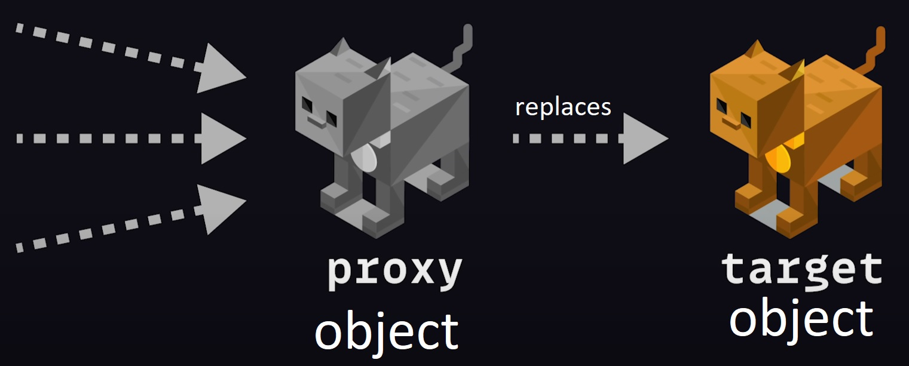
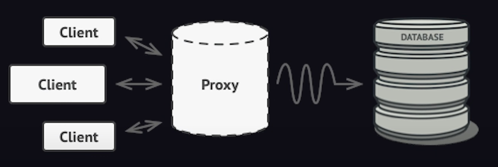

# Fireship/Neetcode - 10 Design Patterns - using TypeScript/Python

Resources used / Credits:

- [10 Design Patterns in 10 minutes by FiresShip - 10min](https://www.youtube.com/watch?v=tv-_1er1mWI)
  - https://fireship.io/lessons/typescript-design-patterns/
  - https://refactoring.guru/design-patterns/catalog
- [8 Design Patterns by NeetCode - 10min](https://www.youtube.com/watch?v=tAuRQs_d9F8)

Based on the book: ["Design Patterns: Elements of Reusable Object-Oriented Software"](http://www.javier8a.com/itc/bd1/articulo.pdf) by Erich Gamma, Richard Helm, Ralph Johnson, John Vlissides (Year 1994).


Table of Contents:

- [Fireship/Neetcode - 10 Design Patterns - using TypeScript/Python](#fireshipneetcode---10-design-patterns---using-typescriptpython)
  - [Creational Patterns](#creational-patterns)
    - [Singleton](#singleton)
    - [Prototype Pattern (Clone)](#prototype-pattern-clone)
    - [Factory](#factory)
    - [Builder Pattern](#builder-pattern)
  - [Structural Patterns](#structural-patterns)
    - [Adapter](#adapter)
    - [Facade](#facade)
    - [Proxy (Substitute)](#proxy-substitute)
  - [Behavioral Patterns](#behavioral-patterns)
    - [Iterator](#iterator)
    - [Strategy Pattern](#strategy-pattern)
    - [Observer (PubSub)](#observer-pubsub)
    - [Mediator behavior](#mediator-behavior)
    - [State behavior](#state-behavior)

<hr/>

## Creational Patterns

(Saturday, September 09, 2023)

### Singleton

> _Ensure a class only has one instance, and provide a global point of access to it._

A type of object instanciated only once. Example from [10 Design Patterns in 10 minutes by FiresShip - 10min](https://www.youtube.com/watch?v=tv-_1er1mWI)

```ts
// TypeScript
class Settings {
  static instance: Settings;
  public readonly theme = "dark";

  // prevent instanciation with "new" keyword
  // by using a private constructor
  private constructor() {}

  static getInstance(): Settings {
    // check if instance has already been created
    // if not, create a new instance
    // to ensure only one object can be created
    if (!Settings.instance) {
      Settings.instance = new Settings();
    }
    return Settings.instance;
  }
}

const settings = new Settings(); // ❌
// will raise "Constructor of class 'Settings'
// is private and only accessible within the class declaration"

const settings = Settings.getInstance(); // ✅
console.log(settings); // Settings { theme: 'dark' }
```

> Note: `.ts` files can be run with `npx ts-node index.ts` command ([reference](https://stackoverflow.com/questions/33535879/how-to-run-typescript-files-from-command-line))

<br/>

```js
// JavaScript
class Settings {
  static instance;
  mode = "dark";

  // prevent instanciation with "new" keyword
  // by using a private constructor
  constructor() {}

  static getInstance() {
    // check if instance has already been created
    // if not, create a new instance
    // to ensure only one object can be created
    if (!Settings.instance) {
      Settings.instance = new Settings();
    }

    return Settings.instance;
  }
}

// const settings = new Settings();
// will raise "Constructor of class 'Settings'
// is private and only accessible within the class declaration"

const settings = Settings.getInstance();
const settings2 = Settings.getInstance();
console.log(settings); // Settings { mode: 'dark' }
console.log(settings2); // Settings { mode: 'dark' }

settings.mode = "light";
console.log(settings); // Settings { mode: 'light' }
console.log(settings2); // Settings { mode: 'light' }
```

> Note: `.js` files can be run with `node index.js` command

<hr/>

Another example from [8 Design Patterns by NeetCode](https://www.youtube.com/watch?v=tAuRQs_d9F8): maintaining a single copy of an application state

- we want to know if a user is logged in or not
- we will use a static `getAppState` method instead of a constructor in order to instantiate the application state
- static `getAppState` method will check if there is an already existing instance of application state, if not then it will instanciate one
  - if we get the app's state for the first time, the `isLoggedIn` value is False
  - if we get again the app state it will still be the same instance (`isLoggedIn` value is still False)
  - but if we modify the first instance, the `isLoggedIn` value is True for both instances

```py
class ApplicationState:
    instance = None

    def __init__(self):
        self.isLoggedIn = False

    @staticmethod
    def getAppState():
        if not ApplicationState.instance:
            ApplicationState.instance = ApplicationState()
        return ApplicationState.instance

appState1 = ApplicationState.getAppState()
print(appState1.isLoggedIn) # False

appState2 = ApplicationState.getAppState()
print(appState2.isLoggedIn) # False

appState1.isLoggedIn = True

print(appState1.isLoggedIn) # True
print(appState2.isLoggedIn) # True
```

<br/>

### Prototype Pattern (Clone)


Source: https://refactoring.guru/design-patterns/prototype

> _Specify the kinds of objectsto create using a prototypical instance, and create new objects by copying this prototype._

> _Prototype ("fancy name for `clone`") allows objects to be clones of other objects, rather then extended via inheritance._

One problem with inheritance that it can lead to a complex hierarchy of code - Prototype pattern is an alternative way to implement inheritance: Instead of inheriting functionality from a class, it inherits properties from an object already created. Example:

- we want to create a new object, that has a new property of `name`, based on an already existing object: we can achieve that in JS with `Object.create(originalObject, newPropertiesOfTheNewObject)`
- however if we only print the new object, we won't see directly the inherited methods/properties, instead we can use `Object.getPrototypeOf()` to see any methods/properties on the parent object

```js
const zombie = {
  eatBrains() {
    return "yum 🧠";
  },
};

const corporateZombie = Object.create(zombie, { name: { value: "Jimmy" } });
console.log(corporateZombie); // {}
console.log(Object.getPrototypeOf(corporateZombie)); // { eatBrains: [Function: eatBrains] }
```

<br/>

<hr/>

Prototype Design Pattern example from ChatGPT in Java:

Scenario: Creating Game Characters

- Let's say you are developing a video game, and you need to create multiple characters with similar properties and abilities. However, each character can have slight variations in their attributes. In this case, you can use the Prototype Pattern to create new characters based on existing prototypes.
- We have defined two concrete prototypes: `Warrior` and `Mage`. These prototypes implement the `CharacterPrototype` interface, which includes the `clone` method.
- The `CharacterManager` class is responsible for managing the prototypes and creating new characters based on them.
- Using the Prototype Pattern allows you to create new characters efficiently by cloning the prototypes and customizing them as needed while reusing common attributes and behaviors.

```java
package PrototypeGameExample;
import java.util.HashMap;
import java.util.Map;

// Prototype interface
interface CharacterPrototype {
    CharacterPrototype clone();

    void display();
}

// Concrete prototype 1
class Warrior implements CharacterPrototype {
    private String name;
    private int health;
    private int damage;

    public Warrior(String name, int health, int damage) {
        this.name = name;
        this.health = health;
        this.damage = damage;
    }

    @Override
    public CharacterPrototype clone() {
        return new Warrior(name, health, damage);
    }

    public void display() {
        System.out.println("Warrior - Name: " + name + ", Health: " + health + ", Damage: " + damage);
    }
}

// Concrete prototype 2
class Mage implements CharacterPrototype {
    private String name;
    private int mana;
    private int spellPower;

    public Mage(String name, int mana, int spellPower) {
        this.name = name;
        this.mana = mana;
        this.spellPower = spellPower;
    }

    @Override
    public CharacterPrototype clone() {
        return new Mage(name, mana, spellPower);
    }

    public void display() {
        System.out.println("Mage - Name: " + name + ", Mana: " + mana + ", Spell Power: " + spellPower);
    }
}

// Prototype manager
class CharacterManager {
    private Map<String, CharacterPrototype> prototypes = new HashMap<>();

    public void addPrototype(String key, CharacterPrototype prototype) {
        prototypes.put(key, prototype);
    }

    public CharacterPrototype getPrototype(String key) {
        return prototypes.get(key).clone();
    }
}

public class Game {
    public static void main(String[] args) {
        // Create prototype manager
        CharacterManager manager = new CharacterManager();

        // Create and register character prototypes
        Warrior warriorPrototype = new Warrior("Aragorn", 100, 20);
        Mage magePrototype = new Mage("Gandalf", 80, 30);

        manager.addPrototype("Warrior", warriorPrototype);
        manager.addPrototype("Mage", magePrototype);

        // Create new characters based on prototypes
        CharacterPrototype newWarrior = manager.getPrototype("Warrior");
        CharacterPrototype newMage = manager.getPrototype("Mage");

        newWarrior.display();
        newMage.display();
    }
}

// Output after compile "javac Game.java" and run "java Game.class":
// Warrior - Name: Aragorn, Health: 100, Damage: 20
// Mage - Name: Gandalf, Mana: 80, Spell Power: 30
```

<br/>

<hr/>

Prototype Design Pattern example from ChatGPT in Python:

Scenario: Creating Documents

- Imagine you are building a document processing system, and you want to create various types of documents like letters, memos, and reports. These documents share some common structure and formatting but have unique content and details. You can use the Prototype Pattern to efficiently create new documents based on prototype templates.
- In this example, we have defined three concrete prototypes: `Letter`, `Memo`, and `Report`.
- Each of these prototypes implements the `DocumentPrototype` interface, which includes the `clone` and `display` methods. The `DocumentManager` class is responsible for managing the prototypes and creating new documents based on them.
- Using the Prototype Pattern in this context allows you to efficiently create new documents with customized content while reusing the common structure and formatting provided by the prototypes.

```py
import copy

# Prototype base class
class DocumentPrototype:
    def clone(self):
        return copy.deepcopy(self)

    def display(self):
        pass

# Concrete prototype 1: Letter
class Letter(DocumentPrototype):
    def __init__(self, recipient, content):
        self.recipient = recipient
        self.content = content

    def display(self):
        print("Letter to:", self.recipient)
        print("Content:", self.content)

# Concrete prototype 2: Memo
class Memo(DocumentPrototype):
    def __init__(self, subject, content):
        self.subject = subject
        self.content = content

    def display(self):
        print("Memo - Subject:", self.subject)
        print("Content:", self.content)

# Concrete prototype 3: Report
class Report(DocumentPrototype):
    def __init__(self, title, data):
        self.title = title
        self.data = data

    def display(self):
        print("Report - Title:", self.title)
        print("Data:", self.data)

# Prototype manager
class DocumentManager:
    def __init__(self):
        self.prototypes = {}

    def add_prototype(self, name, prototype):
        self.prototypes[name] = prototype

    def get_document(self, name):
        return self.prototypes[name].clone()

if __name__ == "__main__":
    manager = DocumentManager()

    # Create and register document prototypes
    letter_proto = Letter("John Doe", "Hello, John!")
    memo_proto = Memo("Meeting Agenda", "Discuss project progress.")
    report_proto = Report("Quarterly Report", "Sales data and analysis.")

    manager.add_prototype("Letter", letter_proto)
    manager.add_prototype("Memo", memo_proto)
    manager.add_prototype("Report", report_proto)

    # Create new documents based on prototypes
    new_letter = manager.get_document("Letter")
    new_memo = manager.get_document("Memo")
    new_report = manager.get_document("Report")

    # Display the created documents
    new_letter.display()
    new_memo.display()
    new_report.display()

# Output
# Letter to: John Doe
# Content: Hello, John!

# Memo - Subject: Meeting Agenda
# Content: Discuss project progress.

# Report - Title: Quarterly Report
# Data: Sales data and analysis.
```

<br/>

### Factory


Source: https://refactoring.guru/design-patterns/factory-method

> _Define an interface for creating an object,but let subclasses decide which class to instantiate. Factory Method lets a class defer instantiation to subclasses._

> A factory is a method or function that creates an object, or a set of objects, without exposing the creation logic to the client.

Example building a crossplatform app on both IOS and Android without Factory:

- they both can have the same interface
- we need to have conditional checking whenever we need to determine which button to show

```ts
class IOSButton {}

class AndroidButton {}

// Without Factory
const button1 = os === "ios" ? new IOSButton() : new AndroidButton();
const button2 = os === "ios" ? new IOSButton() : new AndroidButton();
```

Example building a crossplatform app on both IOS and Android with Factory:

- we can create a subclass/function that could determine which object to instantiate
- instead of repeating the same logic, we use the factory to determine which button should be rendered

```ts
class ButtonFactory {
  createButton(os: string): IOSButton | AndroidButton {
    if (os === "ios") {
      return new IOSButton();
    } else {
      return new AndroidButton();
    }
  }
}

// With Factory
const factory = new ButtonFactory();
const btn1 = factory.createButton(os);
const btn2 = factory.createButton(os);
```

<br/>

<hr/>

Another example from [8 Design Patterns by NeetCode](https://www.youtube.com/watch?v=tAuRQs_d9F8)

If it takes a list of "ingredients" to create a product (e.g. burger), we can use a factory to instantiate the burger in the form that we want:

```python
class Burger:
    def __init__(self, ingredients):
        self.ingredients = ingredients

    def print(self):
        print(self.ingredients)

class BurgerFactory:
    def createCheeseBurger(self):
        ingredients = ["bun", "cheese", "beef-patty"]
        return Burger(ingredients)

    def createDeluxeCheeseBurger(self):
        ingredients = ["bun", "tomato", "lettuce", "cheese", "beef-patty"]
        return Burger(ingredients)

    def createVeganBurger(self):
        ingredients = ["bun", "vegan-sauce", "veffie-patty"]
        return Burger(ingredients)

burgerFactory = BurgerFactory()

burgerFactory.createCheeseBurger().print()
# ['bun', 'cheese', 'beef-patty']

burgerFactory.createDeluxeCheeseBurger().print()
# ['bun', 'tomato', 'lettuce', 'cheese', 'beef-patty']

burgerFactory.createVeganBurger().print()
# ['bun', 'vegan-sauce', 'veffie-patty']
```

<br/>

### Builder Pattern


Source: https://refactoring.guru/design-patterns/builder

> _Separate the construction of a complex object from its representation so that the same construction process can create different representations._

> The builder pattern is a creational design pattern that lets you construct complex objects step by step (instead of using the constructor).

In JavaScript, we can achieve this with method chaining.

```ts
class HotDog {
  constructor(
    public bread: string,
    public ketchup?: boolean,
    public mustard?: boolean,
    public kraut?: boolean
  ) {}

  addKetchup() {
    this.ketchup = true;
    return this;
  }
  addMustard() {
    this.mustard = true;
    return this;
  }
  addKraut() {
    this.kraut = true;
    return this;
  }
}

// we can use the constructor to create an object
const myHardToKeepTrackOfOptionsLunch = new HotDog("wheat", false, true, true);

// or we can create the object step by step using methods
const myLunch = new HotDog("gluten free").addKetchup().addMustard().addKraut();
console.log(myLunch);
// HotDog {
//   bread: 'gluten free',
//   ketchup: true,
//   mustard: true,
//   kraut: true
// }
```

<hr/>

Another example from [8 Design Patterns by NeetCode](https://www.youtube.com/watch?v=tAuRQs_d9F8)

However, if we want more control, we don't immediately pass all the parameters (in the constructor) and we will have/call individual methods to add each property for the object

```python
# Example in Python
class Burger:
    def __init__(self):
        self.buns = None
        self.patty = None
        self.cheese = None

    def setBuns(self, bunStyle):
        self.buns = bunStyle
    def setPatty(self, pattyStyle):
        self.patty = pattyStyle
    def setCheese(self, cheeseStyle):
        self.cheese = cheeseStyle

    def __str__(self):
        return f"Burger {{buns={self.buns}, patty={self.patty}, cheese={self.cheese}}}"

class BurgerBuilder:
    def __init__(self):
        self.burger = Burger()

    # Each method will return a reference
    # of the BurgerBuilder
    def addBuns(self, bunStyle):
        self.burger.setBuns(bunStyle)
        return self

    def addPatty(self, pattyStyle):
        self.burger.setPatty(pattyStyle)
        return self

    def addCheese(self, cheeseStyle):
        self.burger.setCheese(cheeseStyle)
        return self

    def build(self):
        return self.burger

burger = BurgerBuilder() \
            .addBuns("sesame") \
            .addPatty("fish-patty") \
            .addCheese("mozzarella") \
            .build()
print(burger)
# Burger {buns=sesame, patty=fish-patty, cheese=mozzarella}
```

<br/>

<hr/>

## Structural Patterns

### Adapter


Source: https://refactoring.guru/design-patterns/adapter

<br/>

### Facade


Source: https://refactoring.guru/design-patterns/facade

> _Provide a unified interface to a set of interfacesin a subsystem. Facade defines a higher-level interface that makesthe subsystem easier to use._

> A facade is a class that provides a simplified API for larger body of code. It is often to used to hide low-level details of a subsystem.

```ts
class PlumbingSystem {
  // low evel access to plumbing system
  setPressure(v: number) {}
  turnOn() {}
  turnOff() {}
}

class ElectricalSystem {
  // low evel access to electrical system
  setVoltage(v: number) {}
  turnOn() {}
  turnOff() {}
}

class House {
  private plumbing = new PlumbingSystem();
  private electrical = new ElectricalSystem();

  public turnOnSystems() {
    this.electrical.setVoltage(120);
    this.electrical.turnOn();
    this.plumbing.setPressure(500);
    this.plumbing.turnOn();
  }

  public shutDown() {
    this.plumbing.turnOff();
    this.electrical.turnOff();
  }
}

const client = new House();
client.turnOnSystems();
client.shutDown();
```

<br/>

### Proxy (Substitute)




Source: https://refactoring.guru/design-patterns/proxy

(October 23, 2023, 21:51)

Equivalent for/Also known as "Substitute" Design Pattern.

> Proxy is a structural design pattern that lets you provide a substitute or placeholder for another object. A proxy controls access to the original object, allowing you to perform something either before or after the request gets through to the original object.

Example from [Fireship](https://youtu.be/tv-_1er1mWI?t=347): Reactivity System in Vue.js

- The [VueJS framework uses a Proxy](https://vuejs.org/guide/extras/reactivity-in-depth.html#how-reactivity-works-in-vu) to intercept and modify the data on the UI whenever that data changes
- Vue handles this by replacing the original object with a `Proxy` (a substitute): 1st argument is the original object, the 2nd argument is a handler (where we can override methods such as get and set)

```js
const original = { name: "jeff" };

const reactive = new Proxy(original, {
  get(target, key) {
    console.log("Tracking: ", key);
    return target[key];
  },
  set(target, key, value) {
    // Rerender components in UI
    console.log("updating UI...");
    // Use Reflect to update the data on the original object
    return Reflect.set(target, key, value);
  },
});

// Work with the proxy as an original object
reactive.name; // 'Tracking: name'

// Behind the scene, modifying the proxy will also trigger the rerenders
reactive.name = "bob"; // 'updating UI...'
```

Proxy are commonly used when you have a very large object that would be expensive to duplicate in the memory.



<br/>
<hr/>

Example 1 from ChatGPT 3.5 (2023-10-23):

> You are an expert system architect and senior developer. Can you please give me a real world example of Proxy Design Pattern in JavaScript?

The Proxy Design Pattern in JavaScript is a structural pattern that provides a surrogate or placeholder for another object to control access to it. This can be useful in various real-world scenarios, such as implementing lazy loading, access control, logging, and more. Here's a real-world example of how you can use the Proxy pattern in JavaScript:

Let's consider implementing access control for a sensitive resource - you want to restrict access to a file based on user permissions:

```js
// Real subject: Represents a sensitive file
class SensitiveFile {
  constructor(filename) {
    this.filename = filename;
  }
  access() {
    console.log(`Accessing sensitive file: ${this.filename}`);
  }
}

// Proxy: Controls access to the sensitive file based on user permissions
class FileProxy {
  constructor(filename, user) {
    this.filename = filename;
    this.user = user;
    this.file = null;
  }

  access() {
    if (this.file === null) {
      if (this.user.hasPermission(this.filename)) {
        this.file = new SensitiveFile(this.filename);
      } else {
        console.log(`Access denied for file: ${this.filename}`);
        return;
      }
    }
    this.file.access();
  }
}

// User class to manage permissions
class User {
  constructor(name) {
    this.name = name;
    this.permissions = new Set();
  }
  grantPermission(filename) {
    this.permissions.add(filename);
  }
  hasPermission(filename) {
    return this.permissions.has(filename);
  }
}

// Example usage
const user1 = new User("User1");
const user2 = new User("User2");

user1.grantPermission("sensitive_data.txt");

const file1 = new FileProxy("sensitive_data.txt", user1);
const file2 = new FileProxy("confidential_info.txt", user2);

file1.access(); // Accessing sensitive file: sensitive_data.txt
file2.access(); // Access denied for file: confidential_info.txt
```

---

Example 2 from ChatGPT:

We'll create a simple banking system where a Bank class acts as a proxy for accessing a user's bank account. The proxy controls access to the actual bank account object and performs some security checks.

```java
// Java
import java.util.Objects;

// Subject: Represents the bank account
class BankAccount {
    private int accountNumber;
    private double balance;

    public BankAccount(int accountNumber, double balance) {
        this.accountNumber = accountNumber;
        this.balance = balance;
    }
    public void deposit(double amount) {
        balance += amount;
        System.out.println("Deposited $" + amount + " into account " + accountNumber);
    }
    public void withdraw(double amount) {
        if (balance >= amount) {
            balance -= amount;
            System.out.println("Withdrawn $" + amount + " from account " + accountNumber);
        } else {
            System.out.println("Insufficient balance in account " + accountNumber);
        }
    }
    public double getBalance() {
        return balance;
    }
}

// Proxy: Controls access to the bank account
class Bank {
    private BankAccount account;
    private String username;
    private String password;

    public Bank(String username, String password, BankAccount account) {
        this.username = username;
        this.password = password;
        this.account = account;
    }
    public void authenticate(String username, String password) {
        if (Objects.equals(this.username, username) && Objects.equals(this.password, password)) {
            System.out.println("Authentication successful.");
        } else {
            System.out.println("Authentication failed.");
        }
    }
    public void deposit(double amount) {
        if (account != null) {
            account.deposit(amount);
        } else {
            System.out.println("Please authenticate to access your account.");
        }
    }
    public void withdraw(double amount) {
        if (account != null) {
            account.withdraw(amount);
        } else {
            System.out.println("Please authenticate to access your account.");
        }
    }
    public double getBalance() {
        if (account != null) {
            return account.getBalance();
        } else {
            System.out.println("Please authenticate to access your account.");
            return 0.0;
        }
    }
}

public class ProxyExample {
    public static void main(String[] args) {
        BankAccount bankAccount = new BankAccount(12345, 1000);
        Bank bank = new Bank("user123", "password123", bankAccount);

        // Access without authentication (Proxy controls access)
        bank.deposit(500.0);
        bank.withdraw(200.0);
        System.out.println("Balance: $" + bank.getBalance());
        /* Output:
         * Please authenticate to access your account.
         * Please authenticate to access your account.
         * Please authenticate to access your account.
         * Balance: $0.0
         */

        // Authenticate and access the bank account
        bank.authenticate("user123", "password123");
        bank.deposit(500.0);
        bank.withdraw(200.0);
        System.out.println("Balance: $" + bank.getBalance());
        /* Output:
         * Authentication successful.
         * Deposited $500.0 into account 12345
         * Withdrawn $200.0 from account 12345
         * Balance: $1300.0
        */
    }
}
// Run using:
// javac .\ProxyExample.java
// java ProxyExample
```

## Behavioral Patterns

### Iterator


Source: https://refactoring.guru/design-patterns/iterator

> Iterator is a behavioral design pattern that lets you traverse elements of a collection without exposing its underlying representation (list, stack, tree, etc.).

<br/>

Example from [Fireship](https://youtu.be/tv-_1er1mWI?t=408):

The iterator pattern is used to traverse a collection of elements/objects. Most programming languages provide abstrations for iteration like the `for` loop - e.g. in JS you can use `for (const item of items) {lonsole.log(item);}`.

However, you can create your own iterators in JavaScript by using the `Symbol.iterator` property. The code below creates a custom range function that can be used in a regular for loop.

```ts
function range(start: number, end: number, step = 1) {
  return {
    // Symbol.iterator allow us to use this in a ES6 "for ... of" loop
    [Symbol.iterator]() {
      return this;
    },
    /* next() returns the current value in the loop */
    next() {
      if (start < end) {
        start += step;
        return { value: start, done: false };
      }
      return { value: end, done: true };
    },
  };
}

for (const n of range(0, 20, 5)) {
  console.log(n); // 5 10 15 20
}
```

> Note: `.ts` files can be run with `npx ts-node IteratorExample.ts` command ([reference](https://stackoverflow.com/questions/33535879/how-to-run-typescript-files-from-command-line))

<br/>
<hr/>

Example from [8 Design Patterns by NeetCode](https://www.youtube.com/watch?v=tAuRQs_d9F8)

```py
# By default an array in Python includes an iterator
myList = [1, 2, 3]
for n in myList:
   print(n)
```

```py
# Example for a LinkedList
class ListNode:
    def __init__(self, val):
        self.val = val
        self.next = None

class LinkedList:
    def __init__(self, head):
        self.head = head
        self.current = None

    # Define Iterator
    def __iter__(self):
        self.current = self.head
        return self # return a reference to the LinkedList

    # Iterate
    def __next__(self):
        if self.current:
            val = self.current.val
            self.current = self.current.next
            return val
        else:
            raise StopIteration

# Initialize LinkedList
head = ListNode(1)
head.next = ListNode(2)
head.next.next = ListNode(3)

```

<br/>

### Strategy Pattern

Example from [8 Design Patterns by NeetCode](https://www.youtube.com/watch?v=tAuRQs_d9F8)

<br/>

### Observer (PubSub)


Source: https://refactoring.guru/design-patterns/observer

> Observer is a behavioral design pattern that lets you define a subscription mechanism to notify multiple objects about any events that happen to the object they’re observing.

<br/>

Example from [Fireship](https://youtu.be/tv-_1er1mWI?t=475)

<br/>
<hr/>

Another example from [8 Design Patterns by NeetCode](https://www.youtube.com/watch?v=tAuRQs_d9F8)

- we want multiple observes/subscribers to be notified

```py
class YoutubeChannel:
    def __init__(self, name):
        self.name = name
        self.subscribers = []

    def subscribe(self, sub):

```

<br/>

### Mediator behavior

<br/>

### State behavior
