# JavaScript DOM (Document Object Model)

Credits/Notes from:

- [[2h] JavaScript DOM Crash Course 2017 - from Traversy Media](https://www.youtube.com/playlist?list=PLillGF-RfqbYE6Ik_EuXA2iZFcE082B3s)
- [JS HTML DOM - from w3schools](https://www.w3schools.com/js/js_htmldom.asp)

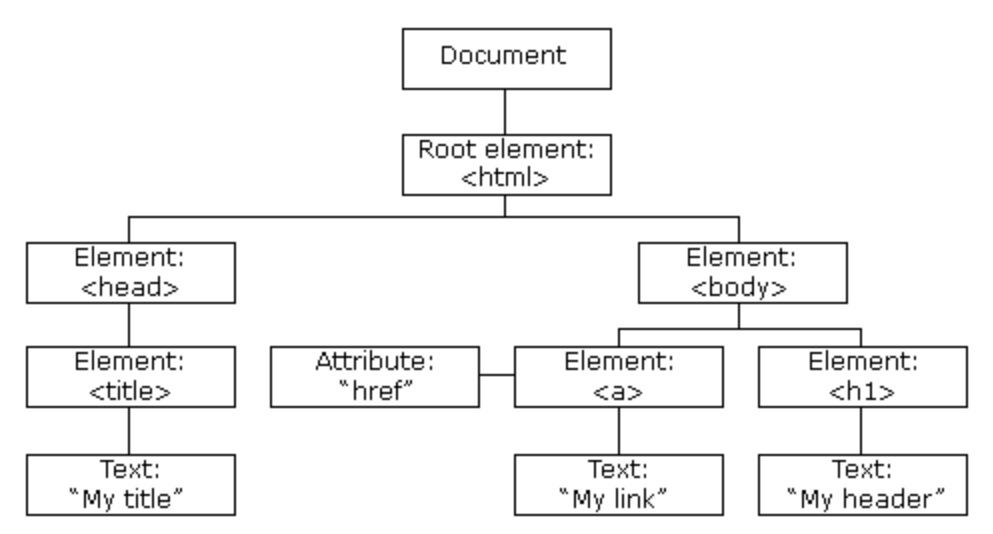

With the object model, [JavaScript gets all the power it needs to create dynamic HTML](https://www.w3schools.com/js/js_htmldom.asp):

- JavaScript can change all the HTML elements in the page
- JavaScript can change all the HTML attributes in the page
- JavaScript can change all the CSS styles in the page
- JavaScript can remove existing HTML elements and attributes
- JavaScript can add new HTML elements and attributes
- JavaScript can react to all existing HTML events in the page
- JavaScript can create new HTML events in the page

<br/>

The HTML DOM is a standard **object** model and **programming interface** for HTML. It defines:

- The HTML elements as **objects**
- The **properties** of all HTML elements
- The **methods** to access all HTML elements
- The **events** for all HTML elements

In other words: **The HTML DOM is a standard for how to get, change, add, or delete HTML elements.**

---

Example we will use:

```HTML
<!DOCTYPE html>
<html lang="en">

<head>
  <meta charset="UTF-8">
  <meta http-equiv="X-UA-Compatible" content="IE=edge">
  <meta name="viewport" content="width=device-width, initial-scale=1.0">
  <link href="https://cdn.jsdelivr.net/npm/bootstrap@5.0.0-beta2/dist/css/bootstrap.min.css" rel="stylesheet"
    integrity="sha384-BmbxuPwQa2lc/FVzBcNJ7UAyJxM6wuqIj61tLrc4wSX0szH/Ev+nYRRuWlolflfl" crossorigin="anonymous">
  <title>JavaScript DOM Tutorial</title>
</head>

<body>
  <header id="main-header" class="bg-success text-white p-4 mb-3">
    <h1 id="header-title">Item Lister</h1>
  </header>

  <div class="container">
    <div id="main" class="card card-body">
      <h2 class="title">Add Items</h2>
      <form class="mb-3">
        <input type="text" class="form-control mb-2">
        <input type="submit" class="btn btn-dark" value="Submit">
      </form>

      <h2 class="title">Items</h2>
      <ul id="items" class="list-group">
        <li class="list-group-item">Item 1</li>
        <li class="list-group-item">Item 2</li>
        <li class="list-group-item">Item 3</li>
        <li class="list-group-item">Item 4</li>
      </ul>
    </div>
  </div>
  
  <script src="dom.js"></script>
</body>

</html>
```

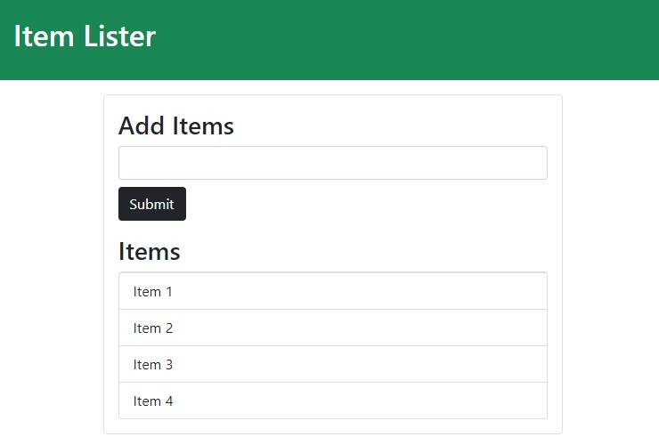

---

## DOM Elements

**Show all the properties and methods attached to the document object by passing the `document` object**

```js
console.dir(document);
```

<br/>

**Get the domain name, URL, title of the document object**

```js
console.log(document.domain);
console.log(document.URL);
console.log(document.title);

// We can also change the title in our browser
document.title = "Hello World";
```

<br/>

**Grab the entire Head or Body element**

```js
console.log(document.head);
console.log(document.body);
```

<br/>

**Get all the forms, links, images on the page**

```js
console.log(document.forms);
console.log(document.links);
console.log(document.images);

/* The returned objects are HTML Collections, which are different from JS Arrays (you can't use Arrays methods on HTML Collections, you need to convert the HTML Collections to JS Arrays first) */
```

Select the first form:

```js
console.log(document.forms[0]);
```


## DOM Selector Methods

### getElementById Method

```js
console.log(document.getElementById('header-title'));
```

will return: `<h1 id="header-title">Item Lister</h1>`

#### textContent, innerText and innerHTML

**We can also use methods like textContent or innerText to change the text/html inside the element with that class**

```js
let headerTitle = document.getElementById('header-title');
headerTitle.textContent = "Hello";
/* textContent it's disregarding the style of an element inside the selected element... eg. if within that <h1> selected tag we have another element like a span with a class hidden with display:none, textContent will show the cntent of the hidden span within selected h1 tag. */

headerTitle.innerText = "Hello";
/* innerText will pay attention to the style */
```

Or we can put HTML inside that element with `innerHTML`

```js
headerTitle.innerHTML = "<span>Hello</span>";
```


(See the differences between [innerHTML, innerText and textContent](https://medium.com/better-programming/whats-best-innertext-vs-innerhtml-vs-textcontent-903ebc43a3fc))

<br/>

#### Change style of selected element

```js
headerTitle.style.fontWeight = 'bold';

let header = document.getElementById('main-header');
header.style.borderBottom = 'solid 3px #000';
```

#### Change class to selected element

We can also change the class to a selected HTML element with `setAttribute()`

```js
let containerMain = document.getElementById('main');
console.log(containerMain); // <div id="main" class="card card-body">
containerMain.setAttribute('class', 'bg-info');
// Note that this will replace class="card card-body" with class="bg-info"
```

<br/>

### document.getElementsByClassName

*Note that Elements is in plural, the method will retrieve all the elements with the specified class name.*

```js
let items = document.getElementsByClassName('list-group-item');
console.log(items);
```


<br/>

#### Add style to selected elements

We can loop through the selected items and change the style of each one:

```js
let items = document.getElementsByClassName('list-group-item');
for (let i = 0; i < items.length; i++) {
  items[i].style.backgroundColor = '#f4f4f4';
}
```


### getElementsByTagName

Get all list items (`<li>`):

```js
let li = document.getElementsByTagName('li');
```

<br/>

### querySelector

`querySelector` will only grab the first element (if we want to grab element by the class of 'title' but there are multiple elements with class 'title' on the page, it will grab just the first one),

With `querySelector` we can use everything we want (tags, classes, ids)

```js
var header = document.querySelector('header'); // grab by tag
var header = document.querySelector('#main-header'); // grab by id
var header = document.querySelector('.header'); // grab by class
```

Another example (add value to the input in form):

```js
let input = document.querySelector('input');
console.log(input); // <input type="text" class="form-control mb-2">
input.value = "Hi";
```

Change the button text:

```js
let submitBtn = document.querySelector('input[type="submit"]');
console.log(submitBtn); // <input type="submit" class="btn btn-dark" value="Submit">
submitBtn.value = "Send";
```

<br/>

Get the first item and last item of a list based on its style (using CSS pseudo-selectors):

```js
let firstItem = document.querySelector('.list-group-item');
firstItem.style.color = 'red';

let secondItem = document.querySelector('.list-group-item:nth-child(2)');
secondItem.style.color = 'purple';

let lastItem = document.querySelector('.list-group-item:last-child');
lastItem.style.color = 'blue';
```


### querySelectorAll

```js
let titles = document.querySelectorAll('.title');
console.log(titles);
/* 
NodeList(2) [h2.title, h2.title]
0: h2.title
1: h2.title
length: 2
__proto__: NodeList */

// Change the title of the first h2 tag with class .title
titles[0].textContent = 'Hello';
```

<br/>

Another example: Alternate background color of elements in a list:

```js
let odd = document.querySelectorAll('li:nth-child(odd)');
let even = document.querySelectorAll('li:nth-child(even)');
for (let i = 0; i < odd.length; i++) {
  odd[i].style.backgroundColor = "#f4f4f4";
  even[i].style.backgroundColor = "#bbb";
}
```


<br/>

# JavaScript DOM Events

Examples of [HTML events](https://www.w3schools.com/js/js_htmldom_events.asp):

- When a user clicks the mouse
- When a web page has loaded
- When an image has been loaded
- When the mouse moves over an element
- When an input field is changed
- When an HTML form is submitted
- When a user strokes a key

## onclick method

A JavaScript can be executed when an event occurs, like when a user clicks on an HTML element. Example (we can actually run javascript code in `onclick` method:

```html
<h1 onclick="this.innerHTML = 'Ooops!'">Click on this text!</h1>

<!-- or -->
<button onClick="alert('You clicked')" class="btn btn-dark" id="button">Click Me</button>

<!-- or we can set onclick to a functin -->
<button onClick="buttonClick()" id="button">Click Me</button>
<script>
  function buttonClick() {
    console.log("Button Clicked");
  }
</script>

<!-- Note that there is no difference between onclick and onClick because we are in HTML and it is case insensitive -->
```

However, using `onclick` method is the old way of doing managing events... 

It's better to use an event listener to keep the markup separate from the javascript scripts.

<br/>

[Other methods / HTML events](https://www.w3schools.com/js/js_htmldom_events.asp)

- onload / onunload

The `onload` and `onunload` events are triggered when the user enters or leaves the page.<br/>The `onload` event can be used to check the visitor's browser type and browser version, and load the proper version of the web page based on the information.

The `onload` and `onunload` events can be used to deal with cookies.

```html
<body onload="checkCookies()">
```

<br/>

- onchange Event

The `onchange` event is often used in combination with validation of input fields.

Below is an example of how to use the onchange. The `upperCase()` function will be called when a user changes the content of an input field.

```html
<input type="text" id="fname" onchange="upperCase()">
```

<br/>

- onmouseover and onmouseout Events

The `onmouseover` and `onmouseout` events can be used to trigger a function when the user mouses over, or out of, an HTML element:

```html
<div onmouseover="mOver(this)" onmouseout="mOut(this)">
Mouse Over Me</div>

<script>
function mOver(obj) {
  obj.innerHTML = "Thank You"
}
function mOut(obj) {
  obj.innerHTML = "Mouse Over Me"
}
</script>
```

<br/>

- onmousedown, onmouseup and onclick Events combined

```html
<div onmousedown="mDown(this)" onmouseup="mUp(this)">
Click and Hold Me</div>

<script>
function mDown(obj) {
  obj.style.backgroundColor = "#1ec5e5";
  obj.innerHTML = "Release Me";
}

function mUp(obj) {
  obj.style.backgroundColor="#D94A38";
  obj.innerHTML="Thank You";
}
</script
```

| HTML Event  | Description                                        |
| ----------- | -------------------------------------------------- |
| onchange    | An HTML element has been changed                   |
| onclick     | The user clicks an HTML element                    |
| onmouseover | The user moves the mouse over an HTML element      |
| onmouseout  | The user moves the mouse away from an HTML element |
| onkeydown   | The user pushes a keyboard key                     |
| onload      | The browser has finished loading the page          |
| onunload    | User leaves the page                               |

Table from [JS Events on w3schools](https://www.w3schools.com/js/js_events.asp).

<br/>

## addEventListener

The ideal way of listening to events is with `addEventListener()`

```html
<button class="btn btn-dark" id="button">Click Me</button>
```

```js
let button = document.getElementById('button').addEventListener('click', function() {
  console.log("Clicked!");
});
```

<br/>

We can also manipulate the DOM by clicking buttons:

```js
let button = document.getElementById('button').addEventListener('click', buttonClick);

function buttonClick() {
  document.getElementById('header-title').textContent = 'Changed';
  document.querySelector('#main').style.backgroundColor = "#ccc";
} // if we click the button the header is changed and bg is changed
```

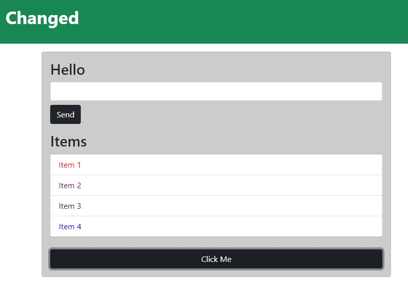

<br/>

### The event parameter

When you are running an event (like using `addEventListener` on a button element on `'click'`), we can pass an `event` argument to our function.

```js
let button = document.getElementById('button').addEventListener('click', buttonClick);

function buttonClick(e) {
  console.log(e);
}
```

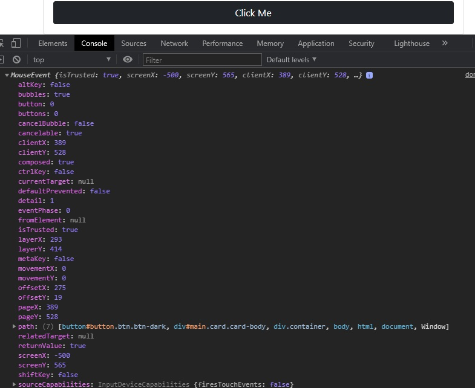

<br/>

From the event object, we can get a lot of information like:

- className of the elements, id's, position of the mouse in browser (`clientX`, `clientY`)
- `e.target` will give the actual element that was clicked (for `'click'` event we get `<button class="btn" id="button">Click Me</button>`)
- `e.target.id` will return `button`
- `e.target.className` will return the string of `btn btn-dark`
- `e.target.classList` will return a DOMTokenList object that looks like an array of the CSS classes
- `e.type` will return the kind of event (in this case will return `click`)
- we can also check if the button was clicked while holding down Alt, Control or Shift key with `e.altKey`, `e.ctrlLey` or `e.shiftKey` (there will return true / false)


### Other Types of events

**[Complete List of JavaScript Events](https://www.w3schools.com/jsref/dom_obj_event.asp)**

```js
let button = document.getElementById('button');
button.addEventListener('click', buttonClick);

button.addEventListener('dblclick', buttonClick); // double click
button.addEventListener('mousedown', buttonClick); // when mouse is clicked
button.addEventListener('mouseup', buttonClick); // when click is released
```

More examples on a div:

```html
<div id="box" style="width:400px;height:200px;background-color:#eee;"></div>
```

```js
let box = document.querySelector("#box");

box.addEventListener('mouseenter', runEvent); // triggered when hover over div
box.addEventListener('mouseleave', runEvent);


box.addEventListener('mouseover', runEvent); /* triggered and retriggered when hovering over the element and over child element within the element */
box.addEventListener('mouseout', runEvent);

function runEvent(e) {
  console.log(e.type); // mouseenter, mouseleave, etc..
}
```

<br/>

## Form events

### Keyboard input events. Inputs

HTML:

```html
<div class="container">
  <div id="main" class="card card-body">
    <h2 class="title">Add Items</h2>
    <form class="mb-3">
      <input type="text" class="form-control mb-2">
      <input type="submit" class="btn btn-dark" value="Submit">
    </form>
    <span id="output"></span>
  </div>
</div>
```

JS (we will use `keydown` event, so every time user presses a key on that form, the `runEvent` function will be triggered):

```js
let itemInput = document.querySelector('input[type="text"]');
let form = document.querySelector('form');

itemInput.addEventListener('keydown', runEvent);

function runEvent(e) {
  console.log(e.type);
  // we can get the value the user is typing with e.target.value
  
  // we can also output to our page the typed string on each keypress
  document.getElementById('output').innerHTML = `<h3>${e.target.value}</h3>`;
}
```

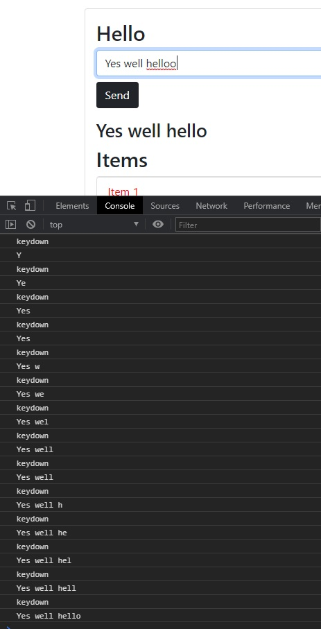

Other keyboard events:

- keydown
- keyup
- keypress

<br/>

**Other events attached to an input form**

- `focus` - triggered when we click *inside* an input
- `blur` - triggered when we are in focus but **then** we click *outside* the input

```js
let itemInput = document.querySelector('input[type="text"]');
let form = document.querySelector('form');

itemInput.addEventListener('focus', runEvent);
itemInput.addEventListener('blur', runEvent);
```

<br/>

- `cut` - the event is triggered when we cut (`CTRL`+`C`) a text from input
- `paste` - the event is triggered when we paste (`CTRL` + `V`) to an input
- `copy` - (`CTRL` + `C`)

```js
itemInput.addEventListener('cut', runEvent);
itemInput.addEventListener('paste', runEvent);
itemInput.addEventListener('copy', runEvent);
```

Or, we can use `input` event:

- `input` - event is triggered if the user types, cuts, copies, or pastes a text to input form (every change to the input will fire off the event).

### Trigger from a Form Selector

We can have a `select` tag in our HTML form:

```html
<form class="mb-3">
  <input type="text" class="form-control mb-2">
  <select class="form-control mb-2">
    <option value="1">1</option>
    <option value="2">2</option>
    <option value="3">3</option>
  </select>
  <input type="submit" class="btn btn-dark" value="Submit">
</form>
```

If we want a function to fire off (trigger) when we chose from our selector from the form, we can use the `change` event:

```js
let select = document.querySelector('select');
select.addEventListener('change', runEvent);
function runEvent(e) {
  console.log(e.type); // change
  console.log(e.target.value);
}
```

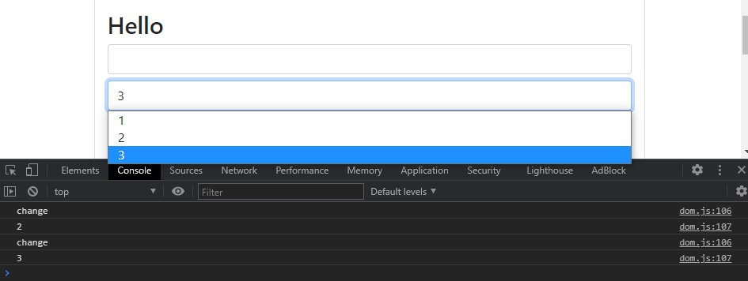

<br/>

### Submit event, preventDefault

```js
let form = document.querySelector('form');
form.addEventListener('submit', runEvent)
```

However, if we click the submit button, nothing will happen (because the page will refresh) &rarr; it will work like a HTML form by sending the data to a "server" &rarr; we need to prevent that from happening:

```js
function runEvent(e) {
  e.preventDefault();
  console.log(e.type); // submit
}
```


<br/>

<br/>

# JavaScript ToDo with Search and delete

**Credits:**

- [22min JavaScript DOM Crash Course Part 4 - Brad Traversy](https://youtu.be/i37KVt_IcXw)

## HTML

```html
<!DOCTYPE html>
<html lang="en">

<head>
  <meta charset="UTF-8">
  <meta http-equiv="X-UA-Compatible" content="IE=edge">
  <meta name="viewport" content="width=device-width, initial-scale=1.0">
  <link href="https://cdn.jsdelivr.net/npm/bootstrap@5.0.0-beta2/dist/css/bootstrap.min.css" rel="stylesheet"
    integrity="sha384-BmbxuPwQa2lc/FVzBcNJ7UAyJxM6wuqIj61tLrc4wSX0szH/Ev+nYRRuWlolflfl" crossorigin="anonymous">
  <title>JavaScript DOM Tutorial</title>
</head>

<body>
  <header id="main-header" class="header bg-info text-white p-4 mb-3">
    <div class="container">
      <div class="row">
        <div class="col-md-6">
          <h1 class="header-title">Item Lister</h1>
        </div>

        <div class="col-md-6 align-self-center">
          <input type="text" class="form-control" id="filter" placeholder="Search Items...">
        </div>
      </div>
    </div>
  </header>

  <div class="container">
    <div id="main" class="card card-body">
      <h2 class="title">Add Items</h2>
      <form id="addItemForm" class="mb-3">
        <input id="itemInput" type="text" class="form-control mb-2" />
        <input type="submit" class="btn btn-dark" value="Submit" />
      </form>

      <h2 class="title">Items</h2>
      <ul id="itemList" class="list-group">
        <li class="list-group-item">Item 1 <button class="btn btn-danger btn-sm float-end delete">X</button></li>
        <li class="list-group-item">Item 2 <button class="btn btn-danger btn-sm float-end delete">X</button></li>
        <li class="list-group-item">Item 3 <button class="btn btn-danger btn-sm float-end delete">X</button></li>
      </ul>
    </div>
  </div>

  <script src="main.js"></script>
</body>

</html>
```

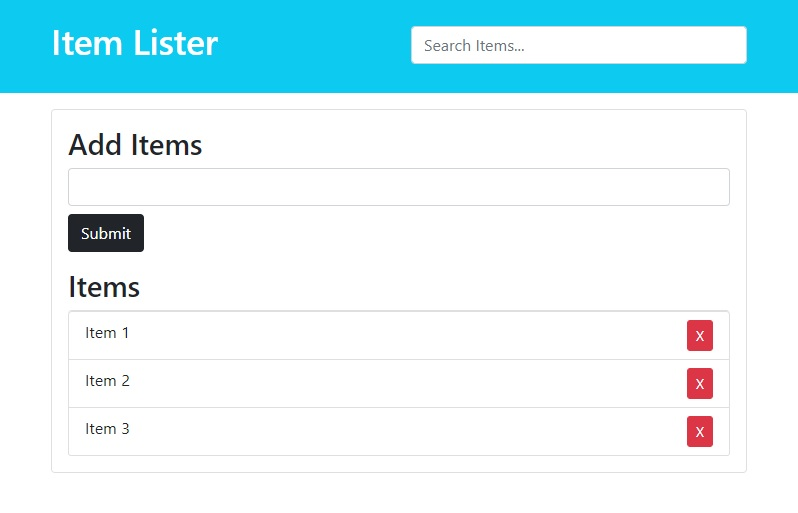

<br/>

## Adding items

### Initialize and addEventListener

On `submit` we call the `addItem()` function. Also, when we submit to a form we need to prevent the default behavior (refresh to submit with HTML to a server).

```js
let form = document.getElementById("addItemForm");
let itemList = document.getElementById("itemList");

form.addEventListener('submit', addItem);

function addItem(e) {
  e.preventDefault();
}
```

### Create `<li>` and Retrieve the value from form 

Note that we can only retrieve values from the `input[type="text"]` itself !! (not from the entire form)... in this case, our `input[type="text"]` has an id of `itemInput`.

We create a new `<li>` HTML element using `document.createElement()`. We also create a CSS class to the new `<li>` element with the `.className` property.

```js
function addItem(e) {
  e.preventDefault();

  // Get input value and create li element
  let newItem = document.getElementById('itemInput');
  let li = document.createElement('li');
  li.className = 'list-group-item';

  console.log(li);
  console.log(newItem);
  console.log(newItem.value);
}
```

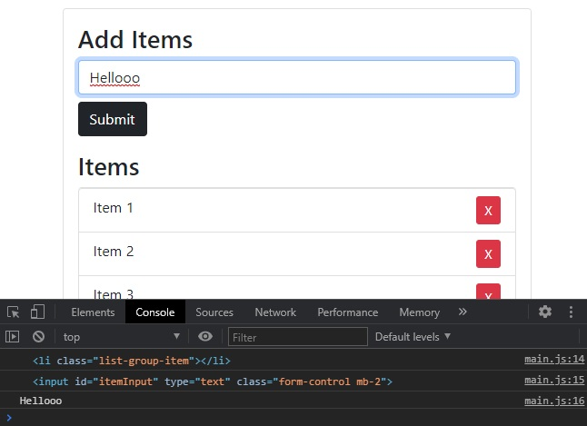

<br/>

Now we will append to the new `<li>` element a text node with the input value.

We will also append our `<li>` to our `<ul>` HTML list.

```js
function addItem(e) {
  e.preventDefault();

  // Get input value and create li element
  let newItem = document.getElementById('itemInput').value;
  let li = document.createElement('li');
  li.className = 'list-group-item';

  // Append text node with input value to li
  li.appendChild(document.createTextNode(newItem));
  
  // Append li to ul list
  itemList.appendChild(li);
}
```

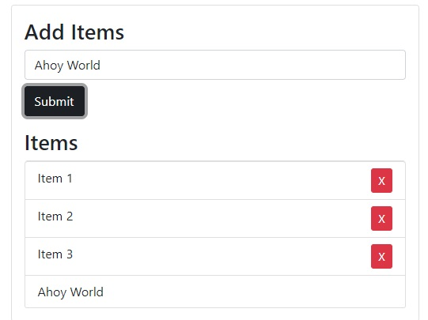

### Create Delete btn within li

Now we need to create the delete button with all its corresponding CSS classes. We will also append the text node `"X"` to this button.

After we create the delete button element, we need to append it to out `<li>` created element. **Complete JS code so far:**

```js
let form = document.getElementById('addItemForm');
let itemList = document.getElementById('itemList');

form.addEventListener('submit', addItem);

function addItem(e) {
  e.preventDefault();

  // Get input value and create li element
  let newItem = document.getElementById('itemInput').value;
  let li = document.createElement('li');
  li.className = 'list-group-item';

  // Append text node with input value to li
  li.appendChild(document.createTextNode(newItem));

  // Create and Append delete Button to li
  let btnDelete = document.createElement('button');
  btnDelete.className = 'btn btn-danger btn-sm float-end delete';
  btnDelete.appendChild(document.createTextNode('X'));
  li.appendChild(btnDelete);

  // Append li to ul list
  itemList.appendChild(li);
}
```

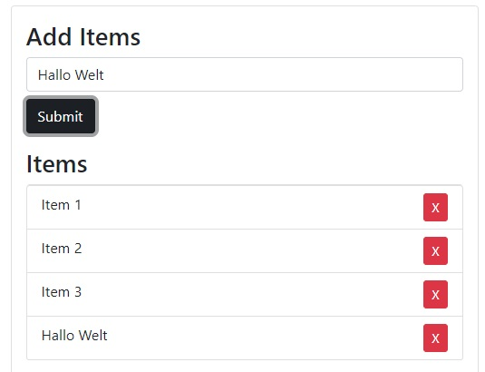

<br/>

We can tweak a little bit this function in order to not add an item if the user didn't complete the input form, and also clear the input after adding an element. **Complete JS code so far:**

```js
let form = document.getElementById('addItemForm');
let itemList = document.getElementById('itemList');

form.addEventListener('submit', addItem);
itemList.addEventListener('click', removeItem);

function addItem(e) {
  e.preventDefault();

  // Get input value and create li element
  let newItemValue = document.getElementById('itemInput').value;
  let li = document.createElement('li');
  li.className = 'list-group-item';

  // Append text node with input value to li
  if (newItemValue !== "") {
    li.appendChild(document.createTextNode(newItemValue));
    document.getElementById('itemInput').value = "";

    // Create and Append delete Button to li
    let btnDelete = document.createElement('button');
    btnDelete.className = 'btn btn-danger btn-sm float-end delete';
    btnDelete.appendChild(document.createTextNode('X'));
    li.appendChild(btnDelete);
  
    // Append li to ul list
    itemList.appendChild(li);
  }
}
```

<br/>

## Removing items

We will add a new event listener on our `itemList` that will listen on a `click` event and calls a new function `removeItem(e)`:

```js
let form = document.getElementById('addItemForm');
let itemList = document.getElementById('itemList');

form.addEventListener('submit', addItem);
itemList.addEventListener('click', removeItem);
```

However, we only want our function to be triggered when we click the delete button (not inside our `<ul>` element)... for this, we will add an IF statement inside our `removeItem` function to check if the clicked element inside our list is an element that contains a `delete` className.

We can also add an alert with confirm.

So, when we click a specific button, we want to remove the `<li>` item that is the parent of that delete button. We retrieve that `<li`> element, and we perform the deletion within `itemList` `<ul>` element with `removeChild(li)`:

 ```js
function removeItem(e) {
  if (e.target.classList.contains('delete')) {
    if (confirm('Confirm delete?')) {
      let li = e.target.parentElement;
      itemList.removeChild(li);
    }
  }
}
 ```


### Complete code so far:

```js
let form = document.getElementById('addItemForm');
let itemList = document.getElementById('itemList');

form.addEventListener('submit', addItem);
itemList.addEventListener('click', removeItem);

function addItem(e) {
  e.preventDefault();

  // Get input value and create li element
  let newItemValue = document.getElementById('itemInput').value;
  let li = document.createElement('li');
  li.className = 'list-group-item';

  // Append text node with input value to li
  if (newItemValue !== "") {
    li.appendChild(document.createTextNode(newItemValue));
    document.getElementById('itemInput').value = "";

    // Create and Append delete Button to li
    let btnDelete = document.createElement('button');
    btnDelete.className = 'btn btn-danger btn-sm float-end delete';
    btnDelete.appendChild(document.createTextNode('X'));
    li.appendChild(btnDelete);
  
    // Append li to ul list
    itemList.appendChild(li);
  }
}

function removeItem(e) {
  if (e.target.classList.contains('delete')) {
    let li = e.target.parentElement;
    itemList.removeChild(li);
  }
}
```

## Filter / Search items

HTML for the filter:

```html
<input id="filter" type="text" class="form-control" placeholder="Search Items...">
```

JS:

```js
let filter = document.getElementById('filter');

filter.addEventListener('keyup', filterItems);
```

First, we want to convert to lowercase everything the user inputs and also the items values from the itemList.

Note that now we directly targeted the `<input>` element itself (not the form that contained an `<input>` element), so now we directly get the value of the input field with `event.target.value`.

```js
function filterItems(e) {
  let text = e.target.value.toLowerCase();
  console.log(text);
}
```

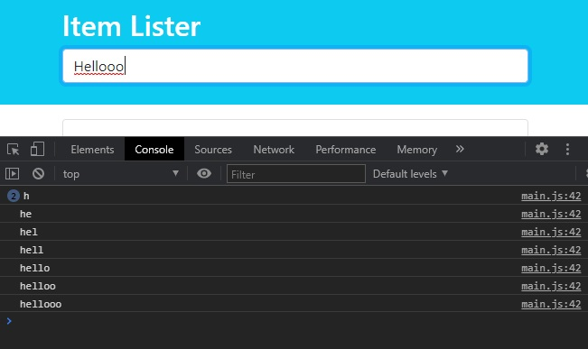

Now we will grab all the `<li>` elements from the `<ul>` list (`itemList`) with `getEmenetsByTagName('li')`. However, now we need to turn the returned `HTMLCollection` into a `JS array` by using `Array.from(collectionName).forEach(function {item.firstChild});`... then we will compare each item with the retrieved value from search bar (input).

```js
function filterItems(e) {
  let text = e.target.value.toLowerCase();
  
  let allItems = itemList.getElementsByTagName('li');
  Array.from(allItems).forEach((item) => {
    let itemName = item.firstChild.textContent;
    if (itemName.toLocaleLowerCase().indexOf(text) !== -1) {
      item.style.display = 'block';
    } else {
      item.style.display = 'none';
    }
  });
}
```

Recap: `indexOf()` returns a value of `-1` if we don't have a match.

```js
"Please locate where 'locate' occurs!".indexOf("locate"); // 7
"Please locate where 'locate' occurs!".lastIndexOf("locate"); // 21
"Please locate where 'locate' occurs!".IndexOf("NotInString"); // -1
```


<br/>

## Complete JS code simple ToDo List

```js
let form = document.getElementById('addItemForm');
let itemList = document.getElementById('itemList');
let filter = document.getElementById('filter');

form.addEventListener('submit', addItem);
itemList.addEventListener('click', removeItem);
filter.addEventListener('keyup', filterItems);

function addItem(e) {
  e.preventDefault();

  // Get input value and create li element
  let newItemValue = document.getElementById('itemInput').value;
  let li = document.createElement('li');
  li.className = 'list-group-item';

  // Append text node with input value to li
  if (newItemValue !== "") {
    li.appendChild(document.createTextNode(newItemValue));
    document.getElementById('itemInput').value = "";

    // Create and Append delete Button to li
    let btnDelete = document.createElement('button');
    btnDelete.className = 'btn btn-danger btn-sm float-end delete';
    btnDelete.appendChild(document.createTextNode('X'));
    li.appendChild(btnDelete);
  
    // Append li to ul list
    itemList.appendChild(li);
  }
}

function removeItem(e) {
  if (e.target.classList.contains('delete')) {
    let li = e.target.parentElement;
    itemList.removeChild(li);
  }
}

function filterItems(e) {
  let text = e.target.value.toLowerCase();
  
  let allItems = itemList.getElementsByTagName('li');
  Array.from(allItems).forEach((item) => {
    let itemName = item.firstChild.textContent;
    if (itemName.toLocaleLowerCase().indexOf(text) !== -1) {
      item.style.display = 'block';
    } else {
      item.style.display = 'none';
    }
  });
}
```


<br/>

<br/>

# [JavaScript Promises](https://www.freecodecamp.org/learn/javascript-algorithms-and-data-structures/es6/create-a-javascript-promise)

We use promises to do something asynchronously. When a task completes, you either fulfill your promise or fail to do so.<br/>
`Promise` is a constructor function that is created with `new` keyword. It takes a function as its argument, with two parameters: `resolve` and `reject`. These are methods used to determine the outcome of the promise.

```js
const myPromise = new Promise((resolve, reject) => {

});
```

A promise has three states: `pending`, `fulfilled`, and `rejected`: 
- `resolve` is used when you want your promise to succeed
- `reject` is used when you want it to fail.

```js
const myPromise = new Promise((resolve, reject) => {
  if(condition) {
    resolve("Promise was fulfilled or Data Acquired");
  } else {
    reject("Promise was rejected or Data not received");
  }
});
```

The example above uses strings for the argument of these functions, but it can really be anything. Often, it might be an object, that you would use data from, to put on your website or elsewhere.

## [Handle a Fulfilled Promise with `then`](https://www.freecodecamp.org/learn/javascript-algorithms-and-data-structures/es6/handle-a-fulfilled-promise-with-then)

Promises are most useful when you have a process that takes an unknown amount of time in your code (i.e. something asynchronous), often a server request. When you make a server request it takes some amount of time, and after it completes you usually want to do something with the response from the server. This can be achieved by using the `then` method. The `then` method is executed immediately after your promise is fulfilled with `resolve`:

```js
const makeServerRequest = new Promise((resolve, reject) => {   
  if(responseFromServer) {
    resolve("We got the data");
  } else {  
    reject("Data not received");
  }
});

makeServerRequest.then(result => {
  console.log(result);
});
```

## [Handle a Rejected Promise with `catch`](https://www.freecodecamp.org/learn/javascript-algorithms-and-data-structures/es6/handle-a-rejected-promise-with-catch)

`catch` is the method used when your promise has been rejected and it's executed immediately after a promise's reject method is called.

```js
makeServerRequest.catch(error => {
  console.log(error);
});
```

- More on **promises**:
	- [from web.dev](https://web.dev/promises/) 
	- [from developer.mozilla](https://developer.mozilla.org/en-US/docs/Web/JavaScript/Reference/Global_Objects/Promise).


