Credits / All these notes are taken from:

- [Dynamic Programming - Learn to Solve Algorithmic Problems & Coding Challenges - 5h10m - freeCodeCamp](https://www.youtube.com/watch?v=oBt53YbR9Kk)


<br/>

Table of Contents:


<br/>


# Memoization

## Fibonacci Problem

### Recursive function

🟠 **Exercise:** Write a function `fib(n`) that takes in a number as an argument and returns the n-th number of Fibonacci sequence.

```
n:      1, 2, 3, 4, 5, 6, 7,  8,  9,  10, 11, 12,  ...
fib(n): 1, 1, 2, 3, 5, 8, 13, 21, 34, 55, 89, 144, ...
```

Classic Recursive Solution:

```js
// JavaScript
const fib_recursive = (n) => {
  if (n <= 2) return 1;
  return fib_recursive(n - 1) + fib_recursive(n - 2);
};

console.log(fib_recursive(9));
```

However, if we time this function for a larger number:

```js
// Node.js
const { performance } = require("perf_hooks");

const fib_recursive = (n) => {
  if (n <= 2) return 1;
  return fib_recursive(n - 1) + fib_recursive(n - 2);
};

var startTime = performance.now();
console.log(fib_recursive(50)); // 12586269025
var endTime = performance.now();
console.log(`Call took ${endTime - startTime} milliseconds`); 
// Call took 74329.61549999565 milliseconds
```

Our function is correct, but it lacks efficiency (its time complexity it's `O(2^n)`). We can vizualize a function call (as `fib(7)`) as a Binary Tree:


### Time and space complexity

(Monday, August 01, 2022)

Note, we know that the time complexity is `O(2^n)` because, if we take a similar function that calls itself twice recursively, it forms a binary tree, where:
- on 1st level we have 1 node
- on 2nd level we have 2 nodes
- on 3rd level we have 4 nodes
- on 4th level we have 8 nodes
- on 5th level we have 16 nodes


Also note that the space complexity will not be the same as `O(2^n)`, because when we add "a frame" to the call stack, we also remove them when the functions returns (the frame is popped from the stack).

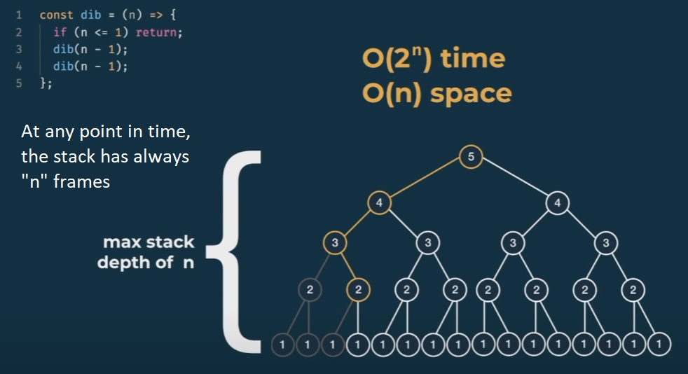

And, back to Fibonacci time complexity, when we compute `fib(50)` we actually make roughly `2^50 = 1,125,899,906,842,626` (1 quadrilion and 125 trillion) steps.

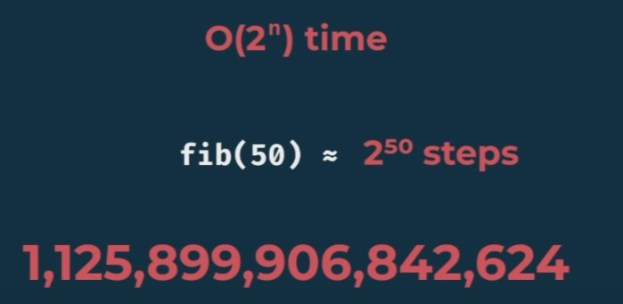

### Fibonacci Memoization

How can I reduce the number of steps on the Fibonacci Recusive function? [Dynamic Programming at 0h23m](https://youtu.be/oBt53YbR9Kk?t=1426).

We see that we compute the same Fibonacci numbers multiple times (we do the same steps), therefore we want to reuse these calculations (by storing them/these overlaping structures). That's what Dynamic Programming consists of: we have some larger problem (eg. Fibonacci) and we can decompose this problem into smaller instances.


<br/>

So, we can memorize all the previously calculated Fibonacci numbers inside a structural data of type **hashmap**, or **dictionary**, or, in JavaScript's case, **a JS Object**.

- First, the javascript object will be placed as an argument for the Fibonacci function (object will be empty by default if the argument is not provided): `const fib_recursive = (n, memo = {}) => {}`

- If the hashmap contains already the answer for the Fibonacci sequence calculation (for a specific number n), we just return that value stored in hashmap: `if (n in memo) return memo[n];`

- Instead of returning the recursive calls of Fibonacci numbers `fib_recursive(n - 1) + fib_recursive(n - 2);`, we store that value in our hashmap/js object, and we also pass in the memo object: `memo[n] = fib_recursive(n - 1) + fib_recursive(n - 2);`

- We return the computed value `return memo[n];`

```js
// memoization
//   with a js object, keys will be arg to function, value will be the return value

const { performance } = require("perf_hooks");

const fib_recursive = (n, memo = {}) => {
  if (n in memo) return memo[n];
  if (n <= 2) return 1;
  memo[n] = fib_recursive(n - 1, memo) + fib_recursive(n - 2, memo);
  return memo[n];
};

var startTime = performance.now();
console.log(fib_recursive(42));
var endTime = performance.now();
console.log(`Call took ${endTime - startTime} milliseconds`);
```

```
- With memoization
267914296
Call took 6.480700001120567 milliseconds

- Without memoization
267914296
Call took 1794.6477999985218 milliseconds
```

The memo dictionary/object will look like this:

```js
memo {
    3: 2,
    4: 3,
    5: 5,
    6: 8,
    7: 13,
    8: 21,
    9: 34,
    ...
}
```

If we try to draw the tree for the Memoized Fibonacci Algorithm, it will look like this. We reduced the time complexity from `O(2^n)` to `O(n)` and we kept the same space complexity.


<br/>

## Grid Traveler Problem

🟠 Exercise:

You are a traveler on a 2D grid. You begin in the top-left corner and your goal is yo travel to the bottom-right corner. You may only move down or right. ***In how many ways can you travel to the goal on the grid with dimensions `m * n`?*** Write a `gridTraveler(m, n)` function that calculates this.

Here are a few examples and edge cases.

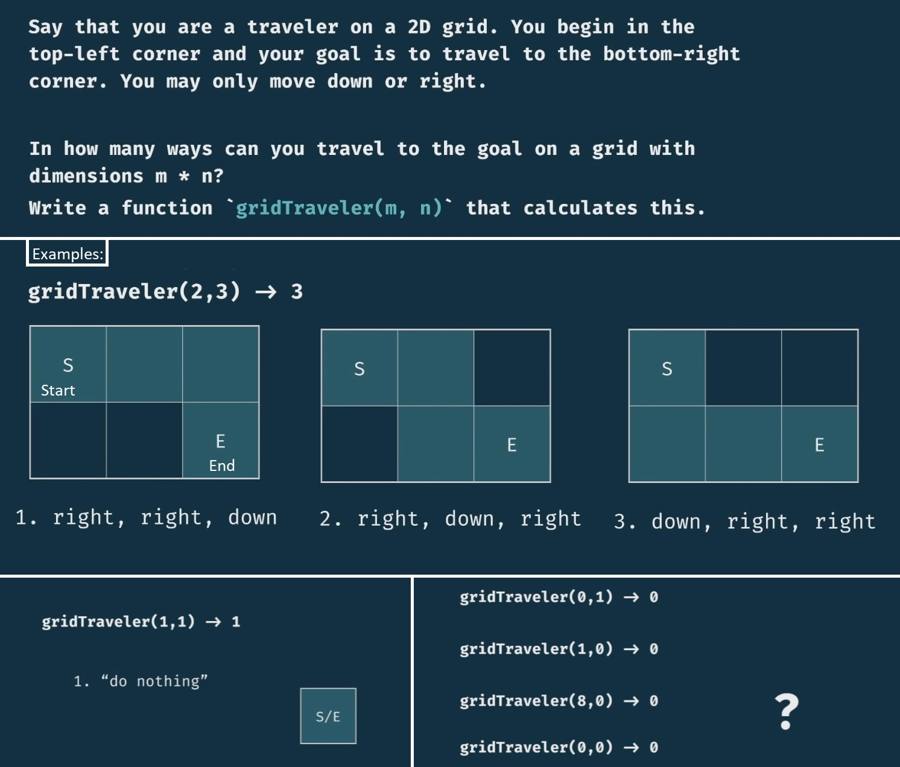

<br/>

Note that one idea is to know/reduce the "playable" area by each move (shrink the problem size):

- starting from 3x3, if we move down (knowing that we can't go back up/left), we will reduce the area to 2x3 grid
- then if we move the right, we will have a 2x2 grid
- the if we move down, we have an area of 1x2 grid
- and finally if we move right again, we will have a base case scenario of 1x1 grid area


<br/>

Note that every recursive problem can be visualised as a structured tree.

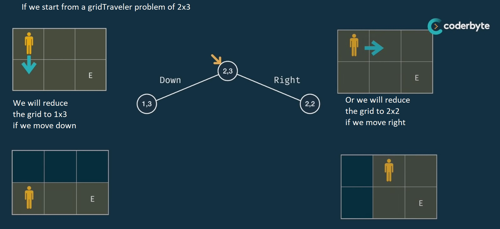


<br/>

Implementation:

- First we start with the conditions for the base cases (where we either have one dimension equal to zero, or both dimensions equal to 1x1): `if (m === 1 && n === 1) return 1; if (m === 0 || n === 0) return 0;`

- The return value is the sum of going down or going right

    - If I'm going down, I decrease the number of rows `gridTraveler(m - 1, n)`
    - If I'm going right, I decrease the number of column `gridTraveler(m, n - 1)`

```js
const { performance } = require("perf_hooks");

const gridTraveler = (m, n) => {
  if (m === 1 && n === 1) return 1;
  if (m === 0 || n === 0) return 0;
  return gridTraveler(m - 1, n) + gridTraveler(m, n - 1);
};

console.log(gridTraveler(3, 2)); // 3
console.log(gridTraveler(3, 3)); // 6
console.log(gridTraveler(16, 16)); // 155117520
```

And if we time it:

```js
const { performance } = require("perf_hooks");

const gridTraveler = (m, n) => {
  if (m === 1 && n === 1) return 1;
  if (m === 0 || n === 0) return 0;
  return gridTraveler(m - 1, n) + gridTraveler(m, n - 1);
};

var startTime = performance.now();
console.log(gridTraveler(17, 17));
var endTime = performance.now();
console.log(`Call took ${endTime - startTime} milliseconds`);

// 601080390
// Call took 10401.025900006294 milliseconds
```

<br/>

The time and space complexity will be:

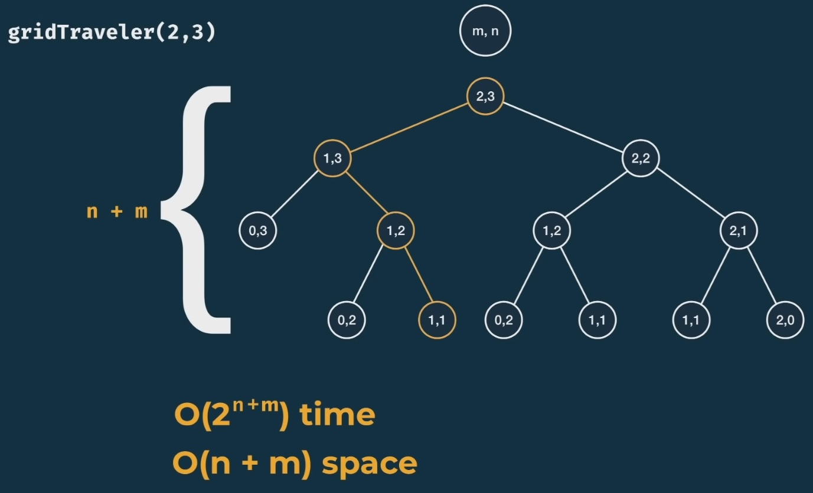

We can use memoization for this problem as well. Note that we already compute some of the problems/nodes (eg. `gridTraveler(1,2)`). But we can do more than that.

We also know that `gridTraveler(1,2)` is the same as `gridTraveler(2,1)` (as in `gridTraveler(a,b)` = `gridTraveler(b,a)`) !!! So we can implement this into memoization.


<br/>

The memoization implementation:

- First, the javascript object will be placed as an argument (object will be empty by default if the argument is not provided): `const gridTraveler = (m, n, memo={})`

- Since we can have only one key-value pair (and not a key-key-value pair), we will concatenate the arguments as a single key in our JS object/dictionary/hashmap: `const key = m + "," + n;`

- Check if the arguments are in the memo object: `if (key in memo) return memo[key];`

- Instead of returning the recursive calls, we store that value in our hashmap/js object, and we also pass in the memo object: `memo[key] = gridTraveler(m - 1, n, memo) + gridTraveler(m, n - 1, memo);`

- We return the computed value: `return memo[key];`

```js
const { performance } = require("perf_hooks");

const gridTraveler = (m, n, memo = {}) => {
  const key = m + "," + n;
  if (key in memo) return memo[key];

  if (m === 1 && n === 1) return 1;
  if (m === 0 || n === 0) return 0;

  memo[key] = gridTraveler(m - 1, n, memo) + gridTraveler(m, n - 1, memo);
  return memo[key];
};

var startTime = performance.now();
console.log(gridTraveler(17, 17));
var endTime = performance.now();
console.log(`Call took ${endTime - startTime} milliseconds`);
```

```md
- gridTraveler(17, 17) without memoization
601080390
Call took 10401.025900006294 milliseconds

- gridTraveler(17, 17) with memoization
601080390
Call took 6.348799988627434 milliseconds
```

<br/>

The new time complexity is based on the possible number of combinations that we first have to compute to have them memorized.


<br/>

# The Memoization Recipe/Principle

(Tuesday, August 02, 2022)

In dynamic programming, in the most cases we will have a bigger problem that can be visualized into smaller problems (we can visualize the problem as nodes of a trees).

We should always think of the base cases (last nodes of the tree, the smallest problems).

It's more important at first to have the recurssion program working and be correct, than making it efficient. Get a brute recurssion version of the program working. After the correctness of the program is 100%, then we make it efficient with memoization.

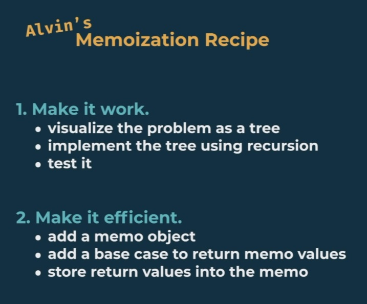


<br/>

## canSum/targetSum Problem

[Dynamic Programming - 01h10m](https://youtu.be/oBt53YbR9Kk?t=4198)

🟠 **Exercise:** 

Write a function `canSum(targetSum, numbers)` that thakes in a targetSum and an array of numbers as arguments.

The function should **return a boolean** indicating whether or not it is possible to generate the targetSum using numbers from the provided array.

You may use an element of the array as many times as needed. You may assume that all input numbers are nonnegative.


Let's view the problem as a tree:


Another example:

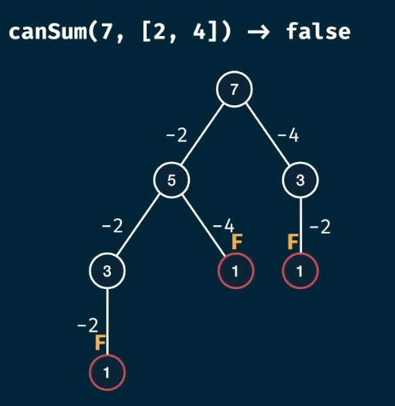

<br/>

Recursive implementation (not optimized):

```js
const canSum = (targetSum, numbers) => {
  if (targetSum === 0) return true;
  if (targetSum < 0) return false;

  for (let num of numbers) {
    const remainder = targetSum - num;
    if (canSum(remainder, numbers) === true) {
      return true;
    }
  }
  return false;
};

console.log(canSum(7, [2, 3]));       // true
console.log(canSum(7, [5, 3, 4, 7])); // true
console.log(canSum(7, [2, 4]));       // false
console.log(canSum(8, [2, 3, 5]));    // true
```

Our first basecase will be:
- when the node is zero (`targetSum === 0 `), we `return true`.

Then:
- we iterate over the numbers in the given array (for each *node/the new targetSum (or `remainder`)* we will substract each number from array) - Note that, unlike the previous problems, because of this we will not have a *binary* tree (now each node can have any numbers of child nodes)
- if the remainder (`remainder = targetSum - num`) on which we will recursively call `canSum` will return `true`, then we `return true`.
- after we iterated over the given array of numbers and the function didn't return true, we will return false.

Now:
- we also need to stop (`return false`) when the remainder (`remainder = targetSum - num`) becomes negative (or else the program will never stop, on JavaScript `RangeError: Maximum call stack size exceeded`): `if (targetSum < 0) return false;`

<br/>

But, if we try a bigger targetSum number (with small numbers given in our array that summed up should give the targetSum), the algorithm will take a lot of time:

```js
const { performance } = require("perf_hooks");

const canSum = (targetSum, numbers) => {
  if (targetSum === 0) return true;
  if (targetSum < 0) return false;

  for (let num of numbers) {
    const remainder = targetSum - num;
    if (canSum(remainder, numbers) === true) {
      return true;
    }
  }
  return false;
};

var startTime = performance.now();
console.log(canSum(300, [7, 14])); // false
var endTime = performance.now();
console.log(`Call took ${endTime - startTime} milliseconds`);
// Call took 10559.359300002456 milliseconds
```

<br/>
<br/>

Let's see the time and space complexity:

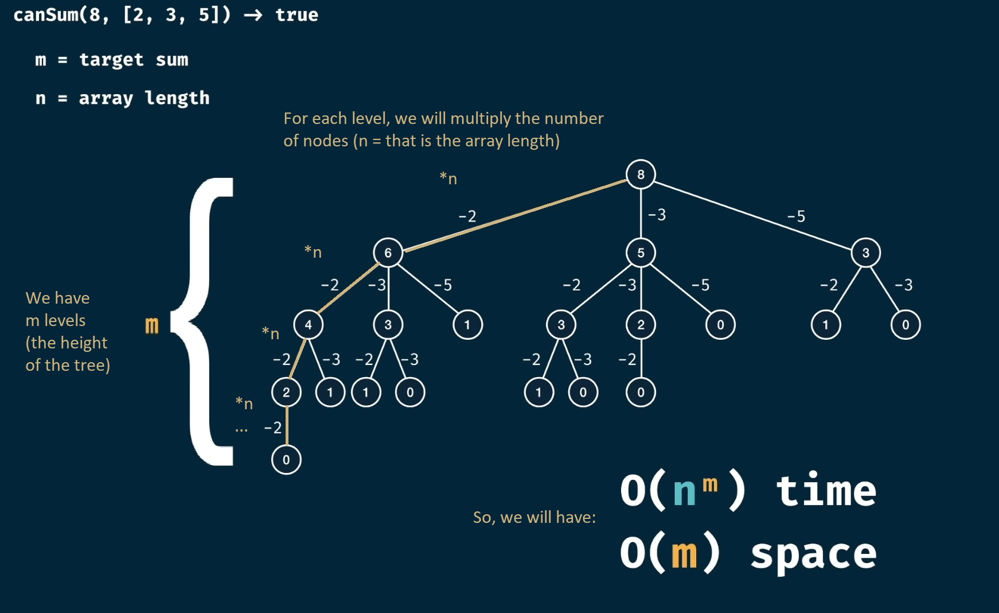

<br/><br/>

Let's see how we can optimize/memoize the problem:


- First we will have our `memo` hashmap/JS object as a parameter. The key for this memo will be the `targetSum` (we know that the other parameter `numbers` that consists of the given array does not change when making a recursive function call): `if (targetSum in memo) return memo[targetSum];`
- Now we will look at all the return values that are not the base-cases.
- Instead of directly returning the values that are not base-cases, we will store them in the `memo` hashmap.
  - `memo[targetSum] = true; return memo[targetSum];`
  - `memo[targetSum] = false; return memo[targetSum];`

```js
const { performance } = require("perf_hooks");

const canSum = (targetSum, numbers, memo = {}) => {
  if (targetSum in memo) return memo[targetSum];
  if (targetSum === 0) return true;
  if (targetSum < 0) return false;

  for (let num of numbers) {
    const remainder = targetSum - num;
    if (canSum(remainder, numbers, memo) === true) {
      memo[targetSum] = true;
      return memo[targetSum];
    }
  }
  memo[targetSum] = false;
  return memo[targetSum];
};

var startTime = performance.now();
console.log(canSum(300, [7, 14])); // false
var endTime = performance.now();
console.log(`Call took ${endTime - startTime} milliseconds`);
// Call took 0.17489999532699585 milliseconds
```

Nice, now the call of `canSum(300, [7, 14])` took *0.17489999532699585 milliseconds* instead of *10559.359300002456 milliseconds*.

Let's see how the time complexity improved:

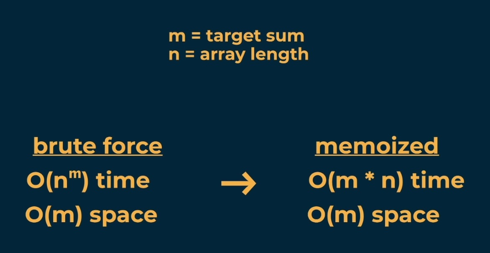

<br/>

## howSum Problem

[Dynamic Programming - 01h29m](https://youtu.be/oBt53YbR9Kk?t=5378)

(Sunday, August 07, 2022)

🟠 **Exercise:** 

Write a function `howSum(targetSum, numbers)` that takes in a targetSum and an array of numbers as arguments.

The function should **return an array** containing any combinations of elements that add up to exactly the targetSum. If there is no combination that adds up to the targetSum, then return null.

If there are multiple combinations possible, you may return any single one of those.

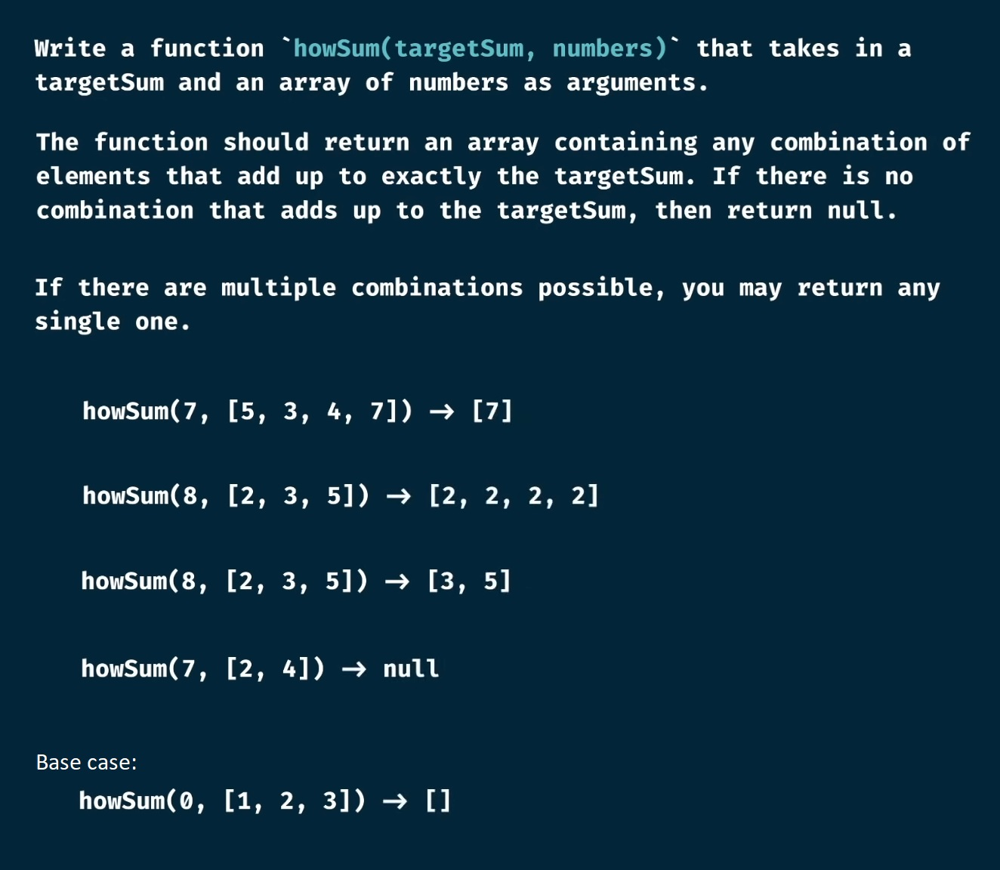

Problem visualized as a tree:

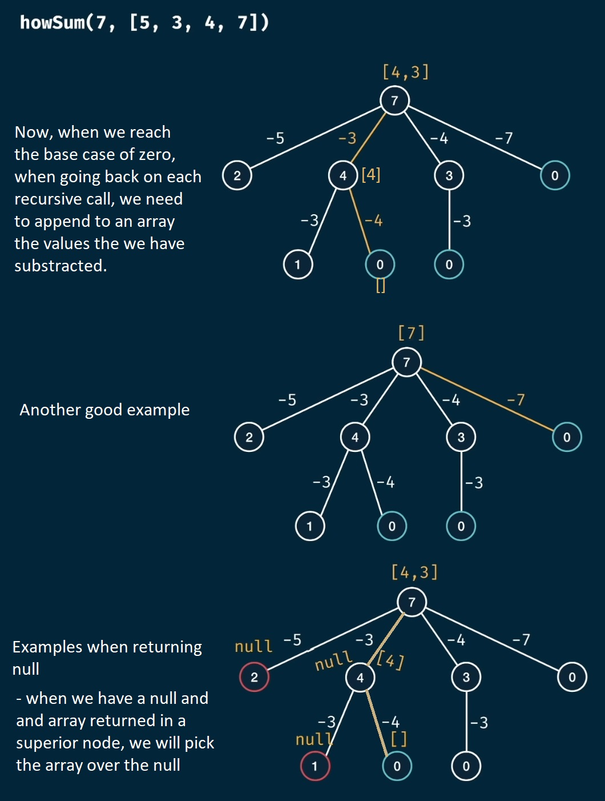

Implementation in JavaScript:

```js
const { performance } = require("perf_hooks");

const howSum = (targetSum, numbers) => {
  if (targetSum === 0) return [];
  if (targetSum < 0) return null;

  for (let num of numbers) {
    const remainder = targetSum - num;
    const remainderResult = howSum(remainder, numbers);
    if (remainderResult !== null) {
      return [...remainderResult, num];
    }
  }
  return null;
};

console.log(howSum(7, [2, 3])); // [3, 2, 2]
console.log(howSum(7, [5, 3, 4, 7])); // [4, 3]
console.log(howSum(7, [2, 4])); // null
console.log(howSum(8, [2, 3, 5])); // [2, 2, 2, 2]
```

First, our basecases:
- when the targetSum is zero, we return an empty array on which we will append the numbers we have substracted (recursively) from targetSum (remainder): `if (targetSum === 0) return [];`
- when targetSum is negative (below zero), we return null (because that combination of numbers used recursively can't add up to the target sum): `if (targetSum < 0) return null;`

Then:
- we iterate over the numbers in the given array and we substract recursively each number from the targetSum (into a remainder: `const remainder = targetSum - num;`)
- we can reuse the numbers from the given array, so we will just recall `howSum(remainder, numbers)`
- after calling `howSum(remainder, numbers)`, we will either get a `null` value, or an `array`
- `if (remainderResult !== null)`, then we return all of the elements in that array, on which we will append the `num` (number from array) that was substracted: `if (remainderResult !== null) { return [...remainderResult, num]; }`
- else, if we never found a combination of numbers that adds up to the targetSum, we will `return null` (placed outside of the for loop through the numbers of given array)

```js
var startTime = performance.now();
console.log(howSum(300, [7, 14])); // null
var endTime = performance.now();
console.log(`Call took ${endTime - startTime} milliseconds`);
// Call took 10470.970599994063 milliseconds
```

Note that, just like `canSum` problem, the algorithm is really slow when having a bigger targetSum (that needs to use a lot of numbers in order to sum up to that targetSum).

<br/><br/>

The brute force time and space complexity for this problem is almost the same as the last `canSum` problem:
- m = targetSum
- n = numbers.length

However, this the operation of copying an array `[...remainderResult, num]` will also take `m` linear steps (the height of the tree). So:
- the time complexity: `O(n^m * m)` (but it can still be considered the same as before `O(n^m)`)
- the space complexity: `O(m)`

<br/>
<br/>

Let's see how we can optimize/memoize the problem:
- First we will have our memo hashmap/JS object as a parameter. The key for this memo will be the targetSum (we know that the other parameter numbers that consists of the given array does not change when making a recursive function call): `if (targetSum in memo) return memo[targetSum]`;
- Instead of directly returning the values that are not base-cases, we will store them in the memo hashmap.
  - `memo[targetSum] = [...remainderResult, num]; return memo[targetSum];`
  - `memo[targetSum] = null; return null;`

```js
const { performance } = require("perf_hooks");

const howSum = (targetSum, numbers, memo = {}) => {
  if (targetSum in memo) return memo[targetSum];

  if (targetSum === 0) return [];
  if (targetSum < 0) return null;

  for (let num of numbers) {
    const remainder = targetSum - num;
    const remainderResult = howSum(remainder, numbers, memo);
    if (remainderResult !== null) {
      memo[targetSum] = [...remainderResult, num];
      return memo[targetSum];
    }
  }
  memo[targetSum] = null;
  return null;
};
```

```js
var startTime = performance.now();
console.log(howSum(300, [7, 14])); // null
var endTime = performance.now();
console.log(`Call took ${endTime - startTime} milliseconds`);
// Call took 0.14459998905658722 milliseconds
```

<br/>
<br/>

Previous notations:
- m = targetSum (height of the tree)
- n = numbers.length

The memoized time and space complexity will be:
- Time Complexity: `O(n*m*m)` or `O(n*m^2)`
- Space Complexity: `O(m*m)` or `O(m^2)` (now we also consider all the space used in the memo object, where the keys will be all the unique values of the targetSum, namely `m`.) So the space complexity will be `m*m` because we have `m` keys and each key will have an array that is (at worst) composed of `m` values.


<br/>

However, let's see some more inputs (memoized):

```js
console.log(howSum(7, [5, 3, 4, 7])); // [ 4, 3 ]
console.log(howSum(8, [2, 3, 4])); // [ 2, 2, 2, 2 ]
console.log(howSum(8, [1, 4, 5])); // [ 1, 1, 1, 1, 1, 1, 1, 1 ]

var startTime = performance.now();
console.log(howSum(100, [1, 2, 5, 25])); // shortest array would be [25,25,25,25]
var endTime = performance.now();
console.log(`Call took ${endTime - startTime} milliseconds`);
/*
[
  1, 1, 1, 1, 1, 1, 1, 1, 1, 1, 1, 1,
  1, 1, 1, 1, 1, 1, 1, 1, 1, 1, 1, 1,
  1, 1, 1, 1, 1, 1, 1, 1, 1, 1, 1, 1,
  1, 1, 1, 1, 1, 1, 1, 1, 1, 1, 1, 1,
  1, 1, 1, 1, 1, 1, 1, 1, 1, 1, 1, 1,
  1, 1, 1, 1, 1, 1, 1, 1, 1, 1, 1, 1,
  1, 1, 1, 1, 1, 1, 1, 1, 1, 1, 1, 1,
  1, 1, 1, 1, 1, 1, 1, 1, 1, 1, 1, 1,
  1, 1, 1, 1
]
Call took 3.6037999987602234 milliseconds
*/
```

<br/>

## bestSum Problem

[Dynamic Programming - 01h52m](https://youtu.be/oBt53YbR9Kk?t=6728)

🟠 **Exercise:** 

Write a function `bestSum(targetSum, numbers)` that takes in a targetSum and an array of numbers as arguments.

The function should **return an array** containing **the shortest combination of numbers** that add up to exactly the targetSum.

If there is a tie for the shortest combination, you may return any of the shortest.


Let's try to visualize the problem as a tree.

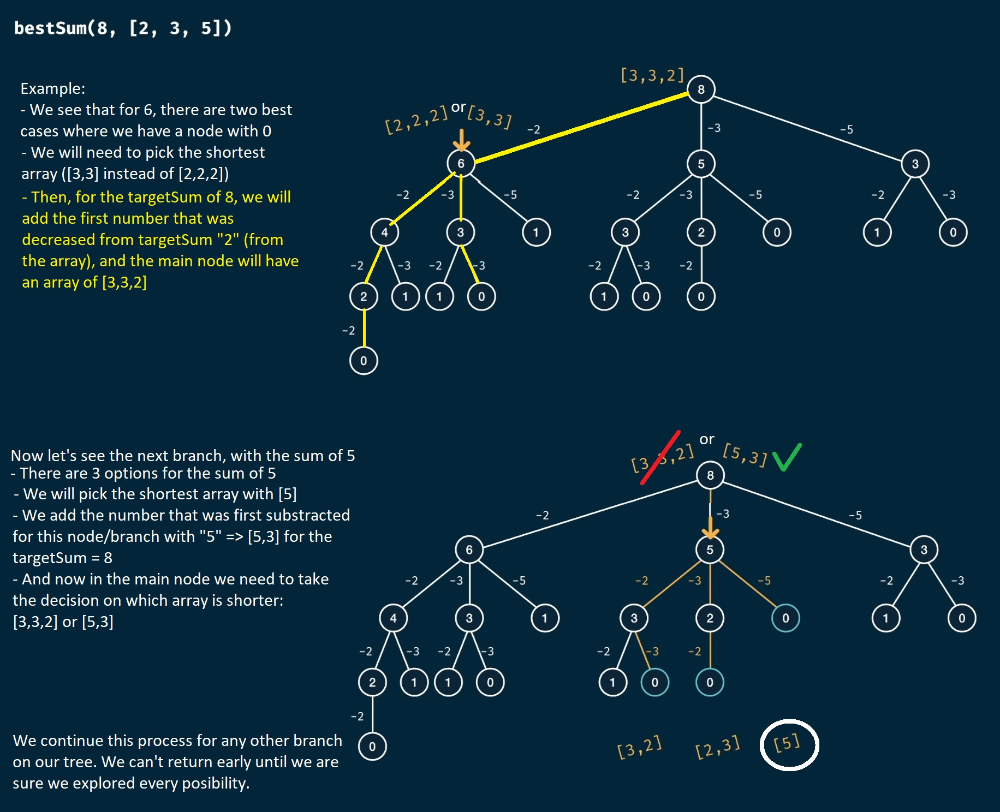

<br/><br/>

Implementation in JavaScript:

```js
const { performance } = require("perf_hooks");

const bestSum = (targetSum, numbers) => {
  if (targetSum === 0) return [];
  if (targetSum < 0) return null;

  let shortestCombination = null;

  for (let num of numbers) {
    const remainder = targetSum - num;
    const remainderCombination = bestSum(remainder, numbers);
    if (remainderCombination !== null) {
      const combination = [...remainderCombination, num];

      // if the combination is shorter than the current "shortest", update it
      if (
        shortestCombination === null ||
        combination.length < shortestCombination.length
      ) {
        shortestCombination = combination;
      }
    }
  }
  return shortestCombination;
};

console.log(bestSum(7, [5, 3, 4, 7])); // [7]
console.log(bestSum(8, [2, 3, 5])); // [5, 3]
console.log(bestSum(8, [1, 4, 5])); // [4, 4]
```

First, our base cases:
- when the targetSum is zero, we return an empty array on which we will append the numbers we have substracted (recursively) from targetSum (remainder): `if (targetSum === 0) return [];`
- when targetSum is negative (below zero), we return null (because that combination of numbers used recursively can't add up to the target sum): `if (targetSum < 0) return null;`

Then:
- we iterate over the numbers in the given array and we substract recursively each number from the targetSum (into a remainder: `const remainder = targetSum - num;`)
- we can reuse the numbers from the given array, so we will just recall `bestSum(remainder, numbers)`
- after calling `bestSum(remainder, numbers)`, we will either get a `null` value, or an `array`, we will save the returned value on a `remainderCombination` variable
- `if (remainderCombination !== null)`, then we save all of the elements in that array, on which we will append the `num` (number from array) that was substracted: `if (remainderCombination !== null) { const combination = [...remainderCombination, num]; }`

Everything above was just for saving every combination possible (like the last `howSum` problem). Now we need a way to save the shortest combination/array:
- we will have `let shortestCombination = null;` variable (that will be also returned at the end, outside the numbers iterations). Note that if this variable will remain null, we will return it as null (as no combination of numbers was found to add to obtain the targetSum value)
- now we need to check if the combination is shorter than the current "shortest" (current combination), and update it: `if (combination.length < shortestCombination.length) { shortestCombination = combination; }`
- note that if the `shortestCombination` will be null, we can't do `shortestCombination.length` in JavaScript, so we will add an additional condition: `if (shortestCombination === null || combination.length < shortestCombination.length)`, namely, if the shortestCombination is null anyway, just take whatever combination we have (don't try to compare null's length with the current combination)

<br/>

Now, if we try a bigger targetSum value...

```js
var startTime = performance.now();
console.log(bestSum(100, [1, 2, 5, 25])); // [25, 25, 25, 25]
var endTime = performance.now();
console.log(`Call took ${endTime - startTime} milliseconds`);
// This takes forever and consumes a lot of power, I could not run it
```

<br/><br/>

Notations for time and space complexity:

- m = targetSum (height of tree)
- n = numbers.length

The brute force time and space complexity for this problem:

- Time complexity: `O(n^m * m)` - we also have the operation of copying an array `[...remainderCombination, num]` that will also take m linear steps (the height of the tree)
- Space complexity: `O(m * m)` or `O(m^2)` - we also have the `shortestCombination` array that can have the worst case of m elements.

<br/><br/>

Let's see how we can optimize/memoize the problem:

- First we will have our memo hashmap/JS object as a parameter. The key for this memo will be the targetSum: `if (targetSum in memo) return memo[targetSum]`
- Instead of directly returning the values that are not base-cases, we will store them in the memo hashmap.
  - `memo[targetSum] = shortestCombination; return memo[targetSum];`
- Note that the return is not in the for loop anymore (in the last problem `howSum`, it was there in order to return early the first combination that returned the tagetSum).

```js
const { performance } = require("perf_hooks");

const bestSum = (targetSum, numbers, memo = {}) => {
  if (targetSum in memo) return memo[targetSum];
  if (targetSum === 0) return [];
  if (targetSum < 0) return null;

  let shortestCombination = null;

  for (let num of numbers) {
    const remainder = targetSum - num;
    const remainderCombination = bestSum(remainder, numbers, memo);
    if (remainderCombination !== null) {
      const combination = [...remainderCombination, num];

      // if the combination is shorter than the current "shortest", update it
      if (
        shortestCombination === null ||
        combination.length < shortestCombination.length
      ) {
        shortestCombination = combination;
      }
    }
  }
  memo[targetSum] = shortestCombination;
  return memo[targetSum];
};

console.log(bestSum(7, [5, 3, 4, 7])); // [7]
console.log(bestSum(8, [2, 3, 5])); // [5, 3]
console.log(bestSum(8, [1, 4, 5])); // [4, 4]

var startTime = performance.now();
console.log(bestSum(100, [1, 2, 5, 25])); // [25, 25, 25, 25]
var endTime = performance.now();
console.log(`Call took ${endTime - startTime} milliseconds`);
// Call took 1.1414999961853027 milliseconds
```

<br/><br/>

Previous notations:
- m = targetSum (height of the tree)
- n = numbers.length

The memoized time and space complexity will be:
- Time Complexity: `O(n*m*m)` or `O(n*m^2)`
- Space Complexity: `O(m*m)` or `O(m^2)` (now we also consider all the space used in the **memo** object, where the keys will be all the unique values of the targetSum, namely `m`.) So the space complexity will be `m*m` because we have `m` keys and each key will have an array that is (at worst) composed of `m` values.


<br/><br/>

Recap of `canSum`, `howSum`, and `bestSum` problems:


<br/><br/>

## canConstruct String Problem

[Dynamic Programming - 02h13m](https://youtu.be/oBt53YbR9Kk?t=7981)

🟠 **Exercise:** 

Write a function `canConstruct(target, wordBank)` that accepts a target string and an array of strings.

The function should return a boolean indication whether or not the `target` can be constructed by concatenating elements of the `wordBank` array.

You may reuse elements of `wordBank` as many times as needed.

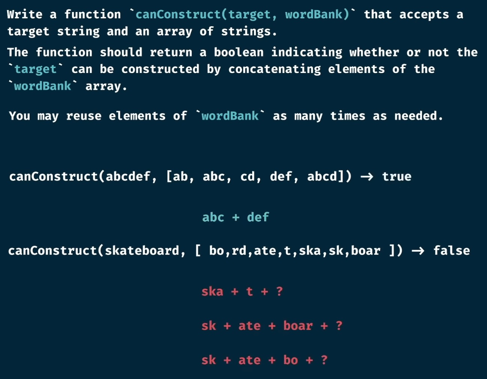

Base case: to generate an empty string, we can just take zero elements from the array.


<br/>

Let's try to visualize the problem as a tree.

