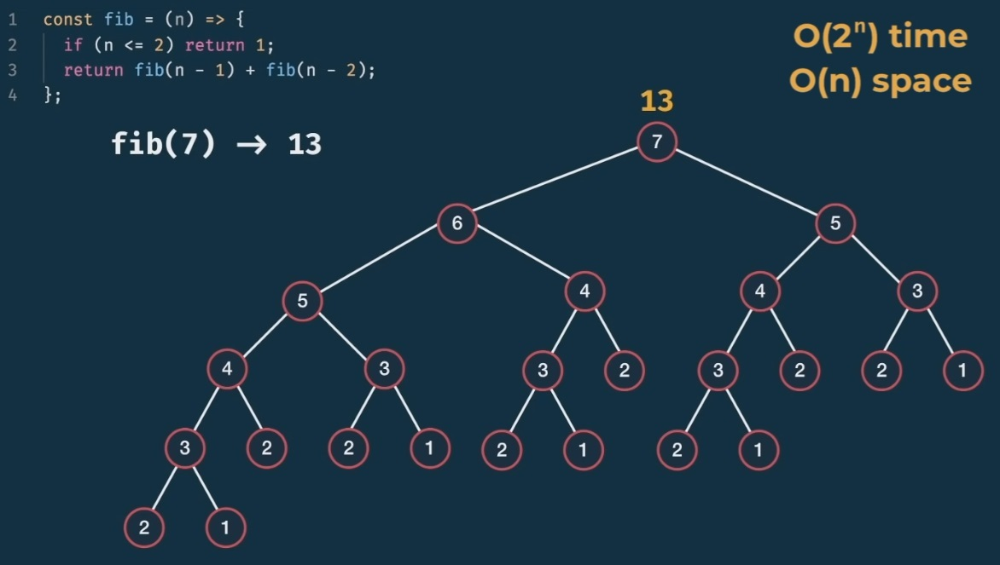
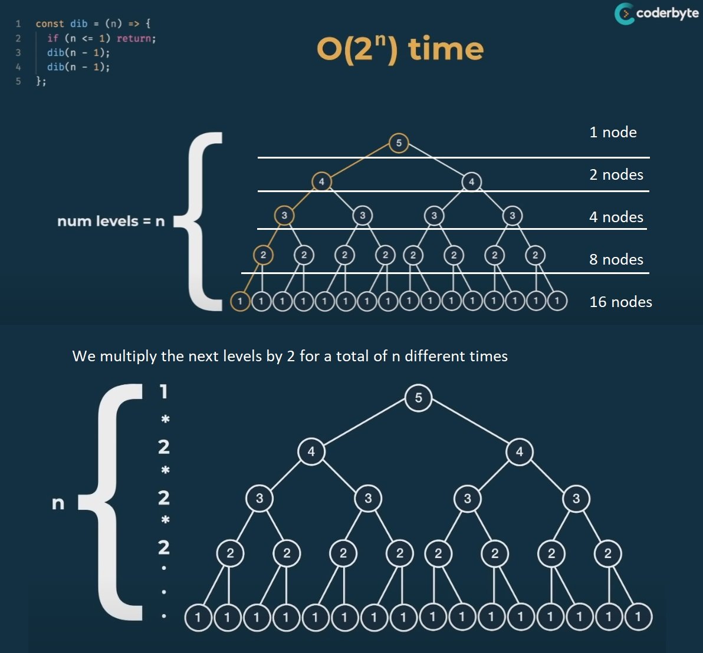
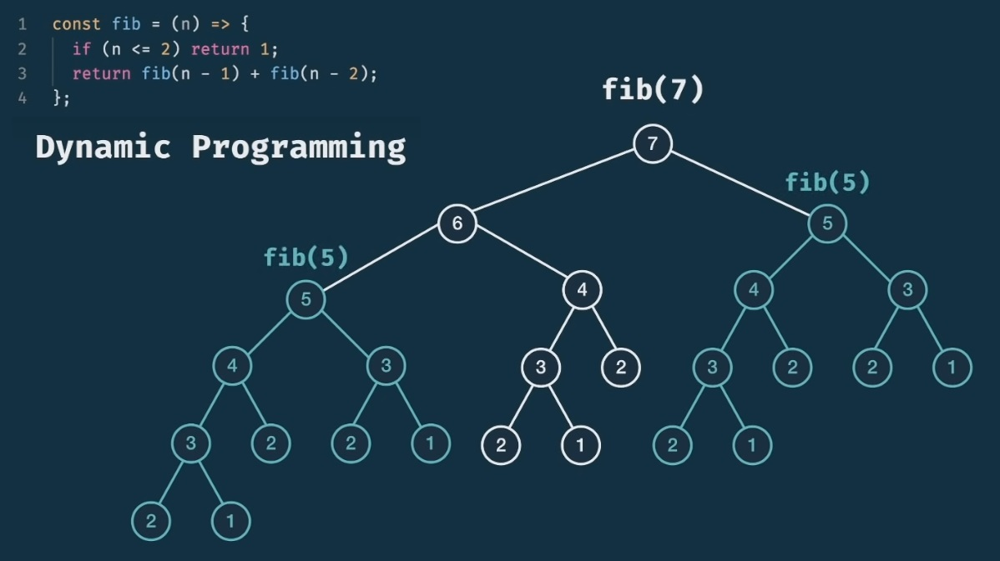
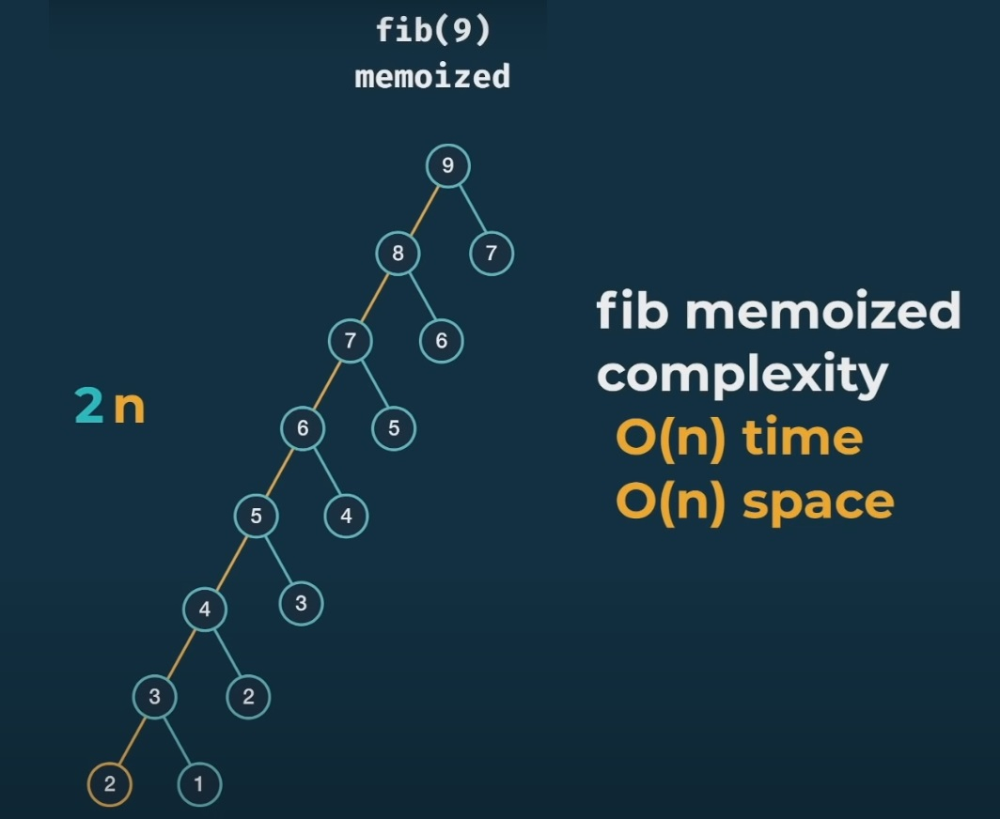
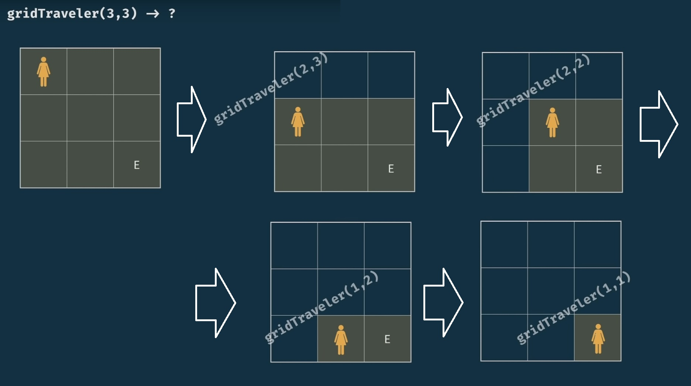

Credits / All these notes are taken from:

- [Dynamic Programming - Learn to Solve Algorithmic Problems & Coding Challenges - 5h10m - freeCodeCamp](https://www.youtube.com/watch?v=oBt53YbR9Kk)


<br/>

Table of Contents:


<br/>


# Memoization

## Fibonacci Problem

### Recursive function

🟠 **Exercise:** Write a function `fib(n`) that takes in a number as an argument and returns the n-th number of Fibonacci sequence.

```
n:      1, 2, 3, 4, 5, 6, 7,  8,  9,  10, 11, 12,  ...
fib(n): 1, 1, 2, 3, 5, 8, 13, 21, 34, 55, 89, 144, ...
```

Classic Recursive Solution:

```js
// JavaScript
const fib_recursive = (n) => {
  if (n <= 2) return 1;
  return fib_recursive(n - 1) + fib_recursive(n - 2);
};

console.log(fib_recursive(9));
```

However, if we time this function for a larger number:

```js
// Node.js
const { performance } = require("perf_hooks");

const fib_recursive = (n) => {
  if (n <= 2) return 1;
  return fib_recursive(n - 1) + fib_recursive(n - 2);
};

var startTime = performance.now();
console.log(fib_recursive(50)); // 12586269025
var endTime = performance.now();
console.log(`Call took ${endTime - startTime} milliseconds`); 
// Call took 74329.61549999565 milliseconds
```

Our function is correct, but it lacks efficiency (its time complexity it's `O(2^n)`). We can vizualize a function call (as `fib(7)`) as a Binary Tree:



### Time and space complexity

(Monday, August 01, 2022)

Note, we know that the time complexity is `O(2^n)` because, if we take a similar function that calls itself twice recursively, it forms a binary tree, where:
- on 1st level we have 1 node
- on 2nd level we have 2 nodes
- on 3rd level we have 4 nodes
- on 4th level we have 8 nodes
- on 5th level we have 16 nodes



Also note that the space complexity will not be the same as `O(2^n)`, because when we add "a frame" to the call stack, we also remove them when the functions returns (the frame is popped from the stack).


And, back to Fibonacci time complexity, when we compute `fib(50)` we actually make roughly `2^50 = 1,125,899,906,842,626` (1 quadrilion and 125 trillion) steps.


### Fibonacci Memoization

How can I reduce the number of steps on the Fibonacci Recusive function? [Dynamic Programming at 0h23m](https://youtu.be/oBt53YbR9Kk?t=1426).

We see that we compute the same Fibonacci numbers multiple times (we do the same steps), therefore we want to reuse these calculations (by storing them/these overlaping structures). That's what Dynamic Programming consists of: we have some larger problem (eg. Fibonacci) and we can decompose this problem into smaller instances.



<br/>

So, we can memorize all the previously calculated Fibonacci numbers inside a structural data of type **hashmap**, or **dictionary**, or, in JavaScript's case, **a JS Object**.

- First, the javascript object will be placed as an argument for the Fibonacci function (object will be empty by default if the argument is not provided): `const fib_recursive = (n, memo = {}) => {}`

- If the hashmap contains already the answer for the Fibonacci sequence calculation (for a specific number n), we just return that value stored in hashmap: `if (n in memo) return memo[n];`

- Instead of returning the recursive calls of Fibonacci numbers `fib_recursive(n - 1) + fib_recursive(n - 2);`, we store that value in our hashmap/js object, and we also pass in the memo object: `memo[n] = fib_recursive(n - 1) + fib_recursive(n - 2);`

- We return the computed value `return memo[n];`

```js
// memoization
//   with a js object, keys will be arg to function, value will be the return value

const { performance } = require("perf_hooks");

const fib_recursive = (n, memo = {}) => {
  if (n in memo) return memo[n];
  if (n <= 2) return 1;
  memo[n] = fib_recursive(n - 1, memo) + fib_recursive(n - 2, memo);
  return memo[n];
};

var startTime = performance.now();
console.log(fib_recursive(42));
var endTime = performance.now();
console.log(`Call took ${endTime - startTime} milliseconds`);
```

```
- With memoization
267914296
Call took 6.480700001120567 milliseconds

- Without memoization
267914296
Call took 1794.6477999985218 milliseconds
```

The memo dictionary/object will look like this:

```js
memo {
    3: 2,
    4: 3,
    5: 5,
    6: 8,
    7: 13,
    8: 21,
    9: 34,
    ...
}
```

If we try to draw the tree for the Memoized Fibonacci Algorithm, it will look like this. We reduced the time complexity from `O(2^n)` to `O(n)` and we kept the same space complexity.




<br/>

## Grid Traveler Problem

🟠 Exercise:

You are a traveler on a 2D grid. You begin in the top-left corner and your goal is yo travel to the bottom-right corner. You may only move down or right. ***In how many ways can you travel to the goal on the grid with dimensions `m * n`?*** Write a `gridTraveler(m, n)` function that calculates this.

Here are a few examples and edge cases.


<br/>

Note that one idea is to know/reduce the "playable" area by each move (shrink the problem size):

- starting from 3x3, if we move down (knowing that we can't go back up/left), we will reduce the area to 2x3 grid
- then if we move the right, we will have a 2x2 grid
- the if we move down, we have an area of 1x2 grid
- and finally if we move right again, we will have a base case scenario of 1x1 grid area



<br/>

Note that every recursive problem can be visualised as a structured tree.


<br/>

Implementation:

- First we start with the conditions for the base cases (where we either have one dimension equal to zero, or both dimensions equal to 1x1): `if (m === 1 && n === 1) return 1; if (m === 0 || n === 0) return 0;`

- The return value is the sum of going down or going right

    - If I'm going down, I decrease the number of rows `gridTraveler(m - 1, n)`
    - If I'm going right, I decrease the number of column `gridTraveler(m, n - 1)`

```js
const { performance } = require("perf_hooks");

const gridTraveler = (m, n) => {
  if (m === 1 && n === 1) return 1;
  if (m === 0 || n === 0) return 0;
  return gridTraveler(m - 1, n) + gridTraveler(m, n - 1);
};

console.log(gridTraveler(3, 2)); // 3
console.log(gridTraveler(3, 3)); // 6
console.log(gridTraveler(16, 16)); // 155117520
```

And if we time it:

```js
const { performance } = require("perf_hooks");

const gridTraveler = (m, n) => {
  if (m === 1 && n === 1) return 1;
  if (m === 0 || n === 0) return 0;
  return gridTraveler(m - 1, n) + gridTraveler(m, n - 1);
};

var startTime = performance.now();
console.log(gridTraveler(17, 17));
var endTime = performance.now();
console.log(`Call took ${endTime - startTime} milliseconds`);

// 601080390
// Call took 10401.025900006294 milliseconds
```

<br/>

The time and space complexity will be:


We can use memoization for this problem as well. Note that we already compute some of the problems/nodes (eg. `gridTraveler(1,2)`). But we can do more than that.

We also know that `gridTraveler(1,2)` is the same as `gridTraveler(2,1)` (as in `gridTraveler(a,b)` = `gridTraveler(b,a)`) !!! So we can implement this into memoization.


<br/>

The memoization implementation:

- First, the javascript object will be placed as an argument (object will be empty by default if the argument is not provided): `const gridTraveler = (m, n, memo={})`

- Since we can have only one key-value pair (and not a key-key-value pair), we will concatenate the arguments as a single key in our JS object/dictionary/hashmap: `const key = m + "," + n;`

- Check if the arguments are in the memo object: `if (key in memo) return memo[key];`

- Instead of returning the recursive calls, we store that value in our hashmap/js object, and we also pass in the memo object: `memo[key] = gridTraveler(m - 1, n, memo) + gridTraveler(m, n - 1, memo);`

- We return the computed value: `return memo[key];`

```js
const { performance } = require("perf_hooks");

const gridTraveler = (m, n, memo = {}) => {
  const key = m + "," + n;
  if (key in memo) return memo[key];

  if (m === 1 && n === 1) return 1;
  if (m === 0 || n === 0) return 0;

  memo[key] = gridTraveler(m - 1, n, memo) + gridTraveler(m, n - 1, memo);
  return memo[key];
};

var startTime = performance.now();
console.log(gridTraveler(17, 17));
var endTime = performance.now();
console.log(`Call took ${endTime - startTime} milliseconds`);
```

```md
- gridTraveler(17, 17) without memoization
601080390
Call took 10401.025900006294 milliseconds

- gridTraveler(17, 17) with memoization
601080390
Call took 6.348799988627434 milliseconds
```

<br/>

The new time complexity is based on the possible number of combinations that we first have to compute to have them memorized.


<br/>

## The Memoization Recipe/Principle

(Tuesday, August 02, 2022)

In dynamic programming, in the most cases we will have a bigger problem that can be visualized into smaller problems (we can visualize the problem as nodes of a trees).

We should always think of the base cases (last nodes of the tree, the smallest problems).

It's more important at first to have the recurssion program working and be correct, than making it efficient. Get a brute recurssion version of the program working. After the correctness of the program is 100%, then we make it efficient with memoization.


<br/>

## canSum/targetSum Problem

[Dynamic Programming - 01h10m](https://youtu.be/oBt53YbR9Kk?t=4198)

🟠 **Exercise:** 

Write a function `canSum(targetSum, numbers)` that thakes in a targetSum and an array of numbers as arguments.

The function should return a boolean indicating whether or not it is possible to generate the targetSum using numbers from the provided array.

You may use an element of the array as many times as needed. You may assume that all input numbers are nonnegative.


