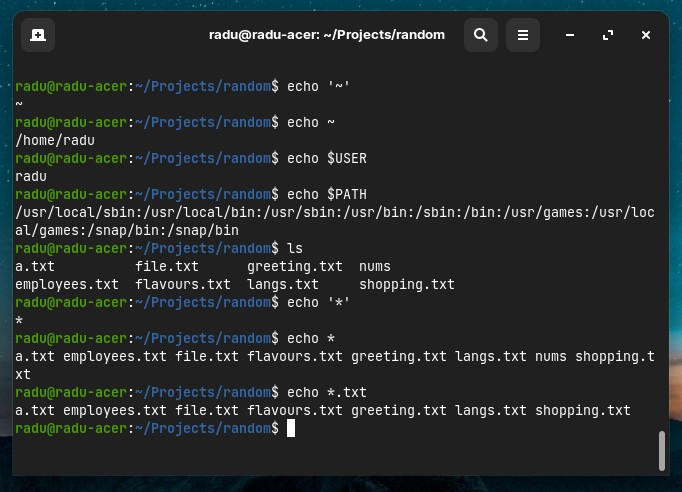
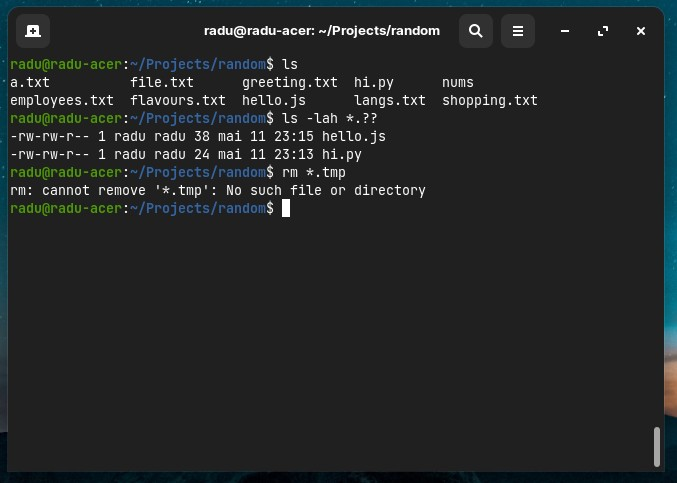
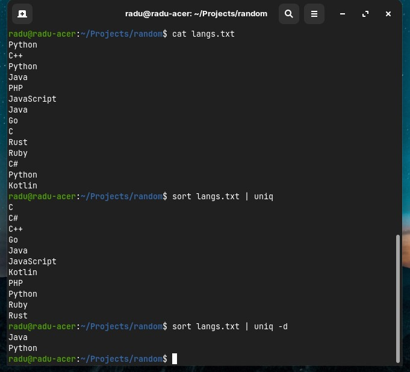
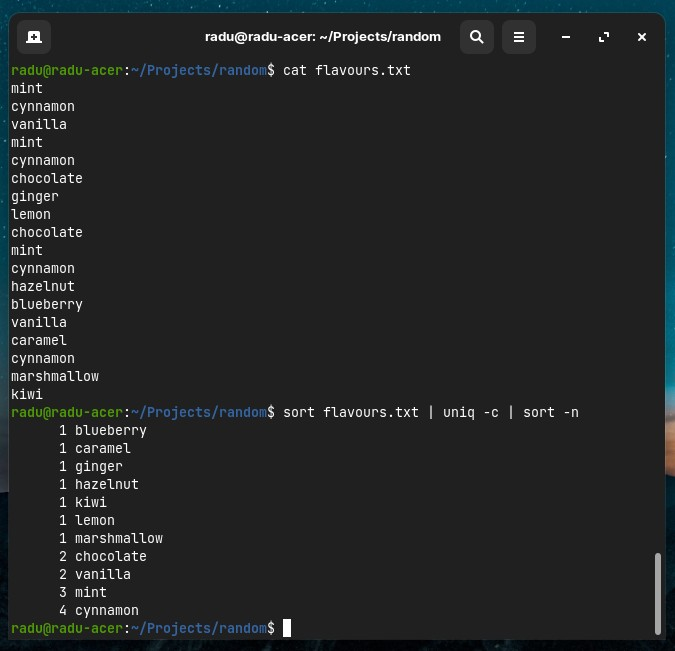
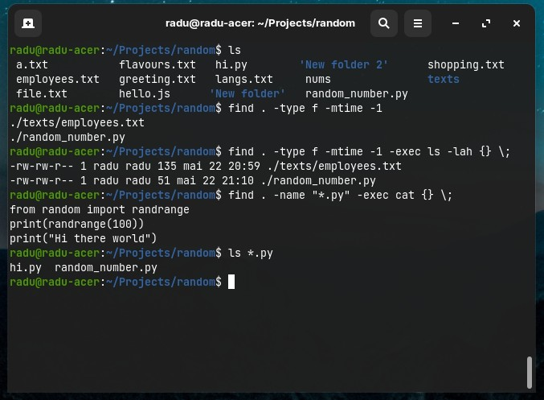
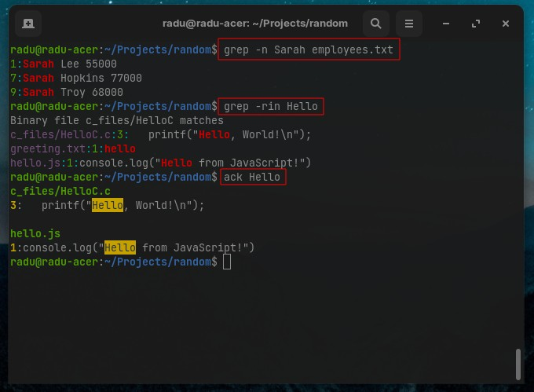
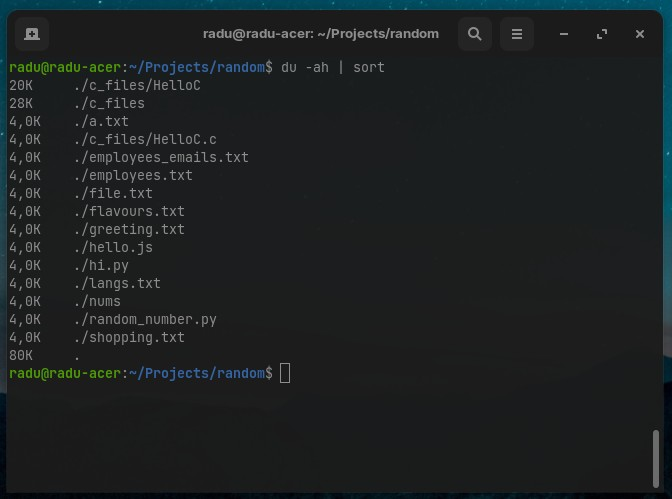
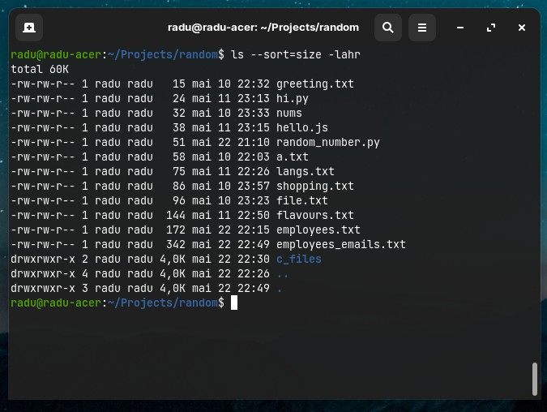

**The Most Popular Linux & Terminal Commands**

See the tutorial on "WSL Tutorial and Basic Linux commands" first:

- [Install Windows Subsystem for Linux (WSL) and Learn these first basic Linux commands](./WSL-Tutorial-and-Linux-Commands.md)

<br/>

Notes taken from:

- [The 50 Most Popular Linux & Terminal Commands - freeCodeCamp, 5h Course](https://youtu.be/ZtqBQ68cfJc)

<br/>

Table of Contents:


<br/>

# Basic Linux Commands

## touch, echo, cat, head, tail, less

Create files with `touch` - Note that `touch` is mainly used to alter the "modified" timestamp of a file:

```bash
touch myfile.txt

# You can create multiple files
nano file1.txt markdownFile.md script.py
```

You can create and edit files with `nano` editor (after entering nano editor, you will have multiple options like "save" `CTRL+O`, or "exit" `CTRL+X`):

```bash
nano hello.py
```

You can also create a file with content already in it by using `echo "your_string"` and direct the content to the file using `>` operator (redirect standard output):

```bash
echo "This is my text file" > myfile.txt
echo "print("hi there")" > hi.py
python3 hi.py
```

You can also add content to the bottom of a file that already has content in it (append more content to end of file) by using `>>` operator. Note: you can also view the content of a file using `cat file.txt`

```bash
echo "My first text line" > myfile.txt
echo "My second text line on the same file" >> myfile.txt
cat myfile.txt

# will output
# My first text line
# My second text line on the same file
```

```bash
# Concatenate multiple files with cat
cat butcher.txt groceries.txt > shoppingList.txt

# Show line numbers with cat
cat -n pythonScript.py
```

- We can print current date and time with `date` (`man date`)

```bash
date
# will print Tue 10 May 2022, 21:44:47 +0300

date > today.txt
```

Both `>` and `>>` operators create a file if the mentioned file is not existent in current folder (https://linuxhint.com/difference-arrow-double-arrow-bash/), and:

- `>` redirect standard output operator overwrites anything in a file
- `>>` appends to the existing file

<br/>

Note: You can see the content of a file by using `cat`. Or, you can see the first 10 lines of a files by running `head` command (`head myfile.txt`), and if you want to see the last 10 lines from a file, run `tail` (`tail myfile.txt`). There are also `more` and `less` commands in order to see the content of a file "page by page" (`more myfile.txt`) or line by line (`less myfile.txt`).

```bash
# Show the first 100 lines of a file
head song_lyrics.txt -n 100

# Show the last 50 lines of a file
tail scripts.sh -n 50
```

With `less` command, we also find strings by writing `/mysearchedstring` while we have a file opened:

```bash
less myfile.txt
# press / and search your string
```

<br/>
<br/>

You can also use other text editor like `gedit`, or `vim` (that is almost used as an IDE) - you can run `vimtutor` command for a complete `vim` editor walkthrough.

```bash
vim myfile.txt
```

With `touch` (`man touch` for manual) we can manipulate the "modified" timestamp of files. Here we can mention the timestamp in any way we want, even as "2 hours ago" (with `-d` flag).

```bash
touch -d "09:00" myfile.txt
touch -d "2 hours ago" myfile.txt
touch -d "2022-02-24 13:23:40" myfile.txt
touch -d "next Wednesday" myfile.txt
touch -d "last Monday" myfile.txt
touch -d "last Thursday 16:21:32" myfile.txt
touch -d "Sun, 29 Feb 2020 16:21:42" myfile.txt
touch -d '1 June 2018 11:02' file1

# you can also touch multiple files
touch myfile1.txt myfile2.txt myfile3.txt
```


<br/>

## mkdir, rmdir, rm

- To create a directory/folder:

```bash
mkdir myfolder
```

- To remove a directory/folder that is not empty (if is not empty, will receive error: `rmdir: failed to remove 'ubuntu/': Directory not empty`):

```bash
rmdir myfolder
```

- To remove a directory that has files in it (Use `rm` with caution! ⚠⚠⚠) - `-r` stands for `recursive`, `remove directories and their contents recursively`

```bash
rm -r myfolder
```

- To create a directory within a directory (`-p, --parents - make parent directories as needed`):

```bash
mkdir -p mydir/mysubdir
cd mydir/mysubdir
```

- To remove a directory that has files in it (Use `rm` with caution! ⚠⚠⚠) - `-r` stands for `recursive`, `remove directories and their contents recursively`

```bash
rm -r myfolder
```

- You can also delete multiple files with `rm`

```bash
rm file1.txt file2.txt file3.md
```

<br/>

## ls, cd, open

- To see current directory you're in, write `pwd` (print working/current directory):

```bash
pwd
```

- To list/view all the files within a folder, eg use flags to see detailed view (`man ls`):

```bash
ls
ls ./myfolder/mysubfolder
ls /pathFromRoot/to/folder

ls -lah
```

`ls` flags:

- `-a, --all` - do not ignore entries starting with . (hidden files)
- `-l` - use long listing format (display as list with 1 file and its details per row)
- `-h` - human-readable, print sizes like 1K, 234M, 2G, etc
- `-d, --directory` - list only directories
- `-c` - used with `-lt`, sort by ctime (time of last modification)
- `-C` - list entries by columns
- `--sort` - sort by WORD instead of name, eg `size (-S)`, `time (-t)`, `version (-v)`, `extension (-X)`

For example, to sort files by size within a folder, run `ls --sort=size -lah` ("sort by size").

<br/>

- To navigate to a folder within current path (`ls`), use "change directory" with `cd`. To go to the previous folder use `cd ..`, to go to previous previous directory `cd ../..` (go 2 levels back) and so on.

```bash
cd mydir/myotherdir
cd ..
cd ../..
```

<br/>

- To open files with your current File Explorer/Applications (in your Desktop Environment), use `xdg-open` command (For MacOS we can just use `open`). If `xdg-open` is not installed, run `sudo apt install xdg-utils` (Debian).

```bash
xdg-open filename.txt
xdg-open folder_name

# open current directory in Finder/Dolphin/File explorer etc
xdg-open .
```

<br/>

## mv, cp

(Tuesday, 10 May 2022)

- Move a file to another location (`man mv`, `mv /path/to/sourcefile /path/to/targetlocationfile`)

```bash
mv hi.py ../hi.py  # move one folder up
mv ../hi.py ./hi.py  # move file from one folder up to current folder/path

# You can also move multiple files (ex. within a directory)
mv file1 file2 file3 DestFolder/
```

<br/>

- Changing filenames (renaming files) are also done with `mv`

```bash
mv currentFileName.txt newFileName.txt
mv hi.py hello.py
```

<br/>

- Copy files (either in same location, or other locations, with/withourt different names, etc) with `cp`

```bash
cp file_2.txt file_3.txt
cp hello.py ../hello2.py

# to copy a folder that has files in it
cp -r folder folder_copy

# If folder does not exist
cp hello.py /v2/hello.py  # cp: cannot create regular file '/v2/hello2.py': No such file or directory
mkdir -p ./v2 && cp hello.py $_
```

https://stackoverflow.com/questions/1529946/linux-copy-and-create-destination-dir-if-it-does-not-exist

Copy all `.txt` files from a folder into another foder:

```bash
mkdir ./random/texts_folder
cp -rv ./random/*.txt ./random/texts_folder
```

<br/>

Also, `cp` is often used for backups

```bash
cp file_2.txt{,.bkp}

cp hello.py{,.bkp}
cp hello.py hello.py.bkp #  the equivalent command
```

<br/>

## wc

- Word Count: Find number of lines, words and bytes of a file (`man wc`)

```bash
wc LongTextFiles.txt
# 1757 15767 87022
# lines words bytes
```

```bash
echo -e "cat\ndog\nmouse\nrabbit\nfish" | wc -l
# 5 lines
```

Note: The `echo -e` option enables interpretion of backslash, meaning `/n` will tell echo to write each string to a new line.

<br/>

# Piping commands

We can take the output of a command, and pass it as an input to another command. Examples:

- Find how many words are in a string

```bash
echo "How many words are here" | wc
# 1 line, 5 words, 24 bytes

echo "Hello" > greeting.txt
echo "How are you?" >> greeting.txt
wc -l greeting.txt
# 2 lines
```

- Count the number of files by piping ls and wc (Note that `ls -l | wc -l` will count *number of files + 1* because `ls -l` will also add a line of size in kbytes... or we can just print the number of lines in wc command `ls | wc -l`)

```bash
ls | wc -l

ls /etc | echo "There are $(wc -l) files"

# include/count hidden files as well
ls -a | wc -l
```

- Combine content of 2-3-4 files and count number of lines

```bash
cat appliances.txt groceris.txt | wc -l

cat server1.log server2.log server3.log | wc -l
```

<br/>

# Expansions

Note that in Linux, some strings are interpreted as other strings (just like aliases or hotstrings). For example, whenever we write `~` it is expanded to `/home/username` path.

```bash
echo ~
# will print /home/username
```

We can also see some popular Environment Variables (variables in bash start with `$`).

Another example is `*`, that is an expansion to every filename in current directory (`pwd`). And, we can also narrow down to `*.txt` (shows every filename that matches with `.txt` at end). Other use-case of using `*` alias, is listing all files that ends with an extension: `ls -lah *.txt`.

```bash
echo $USER
echo $SHELL
echo $PATH
```



<br/>

Another useful alias is `?` (question mark), that matches every single character. Two `??` will match two any-characters in a row, three `???` will match 3 characters and so on.

```bash
# example: match any filename that ends with an extension of exactly 2 characters
ls -lah *.??
```



<br/>

Another extension is use of curly braces `{}`, where bash will expand to the values within curly braces (separated by `,` comma). 

```bash
echo {a,b,c}.txt
# a.txt b.txt c.txt

echo a{d,c,b}e
# ade ace abe

touch app.{html,css,js,py}
# will create 4 files: app.html app.css app.js app.py
ls app.*
# app.css app.html app.js app.py
```

We can also expand into ranges, like `{1..10}`, or `{a..z}`.

```bash
echo {1..10}
# 1 2 3 4 5 6 7 8 9 10

echo file{01..05}.txt
# file01.txt file02.txt file03.txt file04.txt file05.txt

touch file{01..10}.txt 
# will create 10 files
```

```bash
echo {Z..A}
# Z Y X W V U T S R Q P O N M L K J I H G F E D C B A
```

More on expansions here: https://linuxcommand.org/lc3_lts0080.php


<br/>

# Searching and Sorting

## sort

[The 50 Most Popular Linux Commands - 1h56min](https://youtu.be/ZtqBQ68cfJc?t=7016)

- We can sort the lines from a file. Note that `sort` will not change the content of file, it will just print to console. `sort` is also case sensitive, use `sort -f` to ignore case.


```bash
sort file.txt

sort file.txt > file_sorted_lines.txt
```


- Sort lines numerically in files that contains numbers (by default is not doing a numeric sort). We can also use `sort -nu` to get only the unique numbers (get lines/numbers without repetition)

```bash
sort -n nums.

sort -nur nums.txt # -r option to sort in reverse order
```

More on `sort` here: https://www.geeksforgeeks.org/sort-command-linuxunix-examples/


- We can also pipe the content of files into sort

```bash
cat logsWithTimestamps01.log logsWithTimestamps02.log | sort

cat logsWithTimestamps01.log logsWithTimestamps02.log | sort > allLogsSorted.log
```

- Sort by second/third column (eg. alphabetically or numerically `-n`) using `-k <column_number>` option

```bash
sort -gk 2 shopping.txt

sort -nrk 3 employees.txt
```


See more about sorting floating point numbers (`general sorting`) here: https://unix.stackexchange.com/questions/459257/how-to-sort-lines-by-float-number.

<br/>

## uniq

If we have a text files that has duplicated lines, we can use `uniq` to print out the content of that file without adjacent duplicates lines (consecutive duplicated lines one after another):

```bash
uniq logs.log
```

If we want to remove all duplicated lines, we can use `uniq` in combination with `sort`:

```bash
sort langs.txt | uniq

# this is same as running sort -u langs.txt
sort -u langs.txt
```

However, if we only want to show us the dupliacated in a file, we can run `sort langs.txt | uniq -d`. And if we want only the lines that appear once (non-duplicates), we can run `sort langs.txt | uniq -u`.



And, if we want to count how many times each line is repeating, we can use the count option: `sort langs.txt | uniq -c`. And we can even sort that numerically:

```bash
sort flavours.txt | uniq -c | sort -n
```



<br/>

## find

[The Most Popular Linux Commands: find - 2h21m](https://youtu.be/ZtqBQ68cfJc?t=8470)

To find files in the entire system (`/` - the root directory) or in current path (`.`) and folders inside (recursively), we can use `find` (`man find`) - it will output the path(s) to the searched file:

```bash
find path_name

find / -name "host.conf"
find . -name "docker-compose.yml"
```

- We can find files based on filename, modification time, file type / directory, size, etc.

```bash
# show all .py files in current path and folders inside (recursively)
find . -name "*.py"  # same as ls *.py

# find a file that has the exact math of "myfile.txt"
find /path/to/a/folder -name "myfile.txt"

# find by type
find . -type d  # eg find all directories (d)
find . -type f  # find only files, not directories
```

- Note that `find some/path -name` is case-sensitive. For case insensitive we use `-iname`

```bash
find . -type d -name '*new*'  # find all directories that contain 'new' in their name
find . -type d -iname '*new*'  # find all directories that contain 'new' or 'New' in their name
``` 

- We can also use `-or` operator:

```bash
# eg Find directories under the current tree matching name "node_modules" or "public"
find . -type d -name "node_modules" -or -name "public"
```

- We can also exclude a path with `-not` when searching for a file:

```bash
find . -name "*.md" -not -path "node_modules"
```

More examples:

- Search for files that have more than 100 characters (bytes) in them:

```bash
find . -type f -size +100c
```

- Search files bigger than 100KB but smaller than 2MB:

```bash
find . -type f -size +100k -size -2M
```

- Search files edited more than 3 days ago, or edited in the last 24hours

```bash
find . -type f -mtime +3
find . -type f -mtime -1
```

<br/>

With the found files, youn can run another command on them with `-exec` (just like piping, however piping is not supported with `find` command, you can't run something like `find -name "F*.txt" | ls -lah`, but instead you can run `find -name "F*.txt" -exec ls -lah \;`). Note that every command after `-exec` should end with `\;`

- List with details all the files edited in the last 24hours:

```bash
find . -type f -mtime -1 -exec ls -lah {} \;
```

- See all the content from the found files with `cat` (Note that `{}` is filled/replaced with the file names at execution time)

```bash
find . -name "*.py" -exec cat {} \;  # {} will be replaced with "file1.py file2.py" etc
```



<br/>

## ack

To search for strings inside files (and output their path), use `ack` (`man ack`), is just as powerful, but easier than `grep`. Note, it is possible that `ack` needs to be installed (`sudo apt install ack` for Debian based distros).

```bash
ack -i 'stringpattern'

# or grep equivalent
grep -rni '/path/to/somewhere/' -e 'stringpattern'
# -r or -R is recursive
# -n is to show line number in file
# -w stands for match the whole word
# -l (lower-case L) can be added to just give the file name of matching files (show the file name, not the result itself)
# -e is the pattern used during the search
# -i for ignore case
```

https://stackoverflow.com/questions/16956810/how-do-i-find-all-files-containing-specific-text-on-linux

<br/>

## grep

[The Most Popular Linux Commands: grep - 2h32m](https://youtu.be/ZtqBQ68cfJc?t=9145)

`grep` (global regular expression print) is used to search for text inside files.

- Show the lines (with the line number `-n`) that contains the searched word:

```bash
grep -n Sarah employees.txt

# see some Context related to found words (eg show 2 before and 2 lines after)
grep -nc 2 Sarah employees.txt
```

- Search recursively in current directory (in all nested subdirectories) with `-r` and case-insensitive with `-i`

```bash
grep -ri "hello"
```



<br/>

To use regular expressions in grep, we need to use `-E` flag ("Extended regular expressions", by default it's using `-G` for basic regex)

```bash
# Search by emails in all files in current directory
grep -rE -o "\b[A-Za-z0-9._%+-]+@[A-Za-z0-9.-]+\.[A-Za-z]{2,6}\b" .
```


<br/>

# Other file commands

## du

- Find size of files and directories (`-h` option for human-readable file sizes)

```bash
du -h .  # will show all the sizes of directories within current path tree
```

- We use `-a` if we want to show file sizes too (not just directories)

```bash
du -ah .
```

- And we if want to see all directories (and files with `-a`) "sort by size", we can pipe the command with `sort`

```bash
du -ah | sort -h

# we can also use
ls --sort=size -lahr

# and if we want top 5 largest files
ls --sort=size -lahr | tail -n 5

# or top 10 largest files using du (and reversing the list)
du -ah | sort -hr | head
```





<br/>

## df

- `df` is used for **mounted** disk usage (like "partitions" on Windows OS) information (is not about files/directories in the mentioned/current path) - `-h` for human-readable sizes.

```bash
df -h
```

See the disk usage of the filesystem (like a "partition" but not really) where `~/Desktop` is located

```bash
df -h ~/Desktop

# will prind something like
# Filesystem      Size  Used Avail Use% Mounted on
# /dev/sda5       439G   39G  378G  10% /
```

<br/>

# history

[The Most Popular Linux Commands: history - 2h44m](https://youtu.be/ZtqBQ68cfJc?t=9853)

