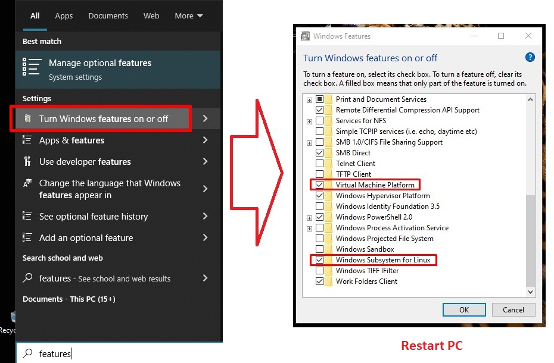
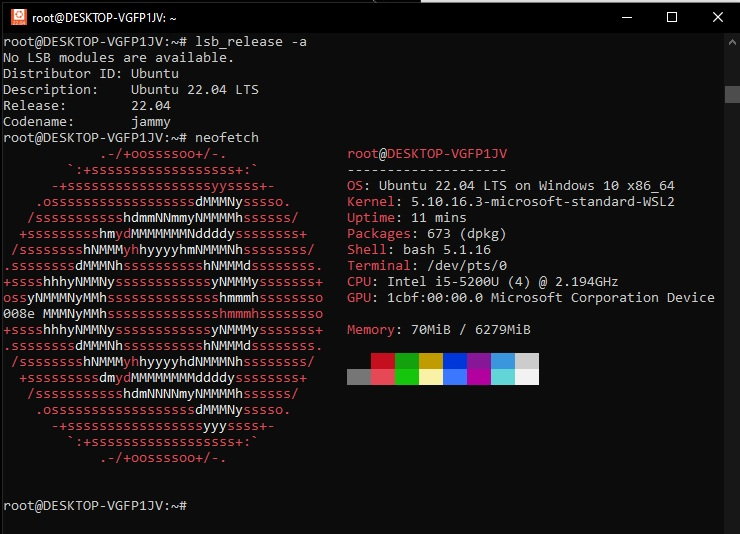
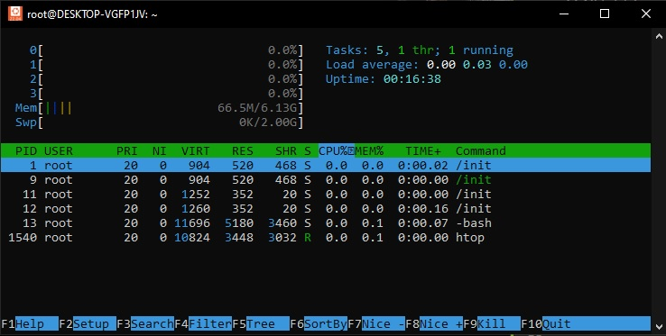
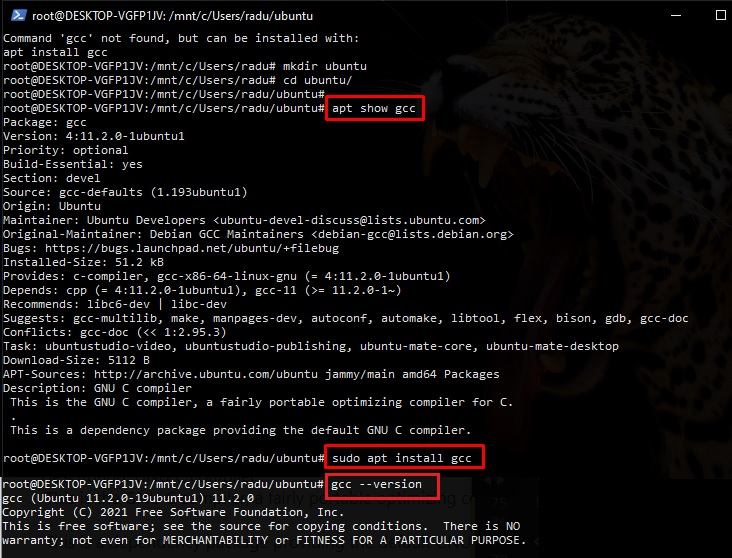

**Install Windows Subsystem for Linux (WSL) and Learn these first basic Linux commands**

---

Table of Contents:


Resources used:

- [WSL 2: Getting started - David Bombal](https://www.youtube.com/watch?v=_fntjriRe48)
- [Windows 10 tutorial: install WSL2 — Windows Subsystem for Linux 2](https://www.youtube.com/watch?v=n-J9438Mv-s) 


# WSL Tutorial

(Friday, April 29, 2022)

## WSL Installation

In order to install WSL (Windows Subsystem for Linux), we need to follow these steps:

- Open Start, search for "Turn Windows Features" and check `Virtual Machine Platform` and `Windows Subsystem for Linux`. Click OK, wait for features to install, then **restart your Windows PC**.



- Open PowerShell with Admin rights, run `wsl --install`. After installation, **restart PC again**.


- Open PowerShell with Admin rights, run `wsl --set-default-version 2`


- Open Windows Store, and download ("Get") "Ubuntu 22.04 LTS" (or "Ubuntu 20.04 LTS"). After download is finished, click on "Open"/"Launch" from Windows Store.


- Complete Ubuntu Installation Process in the new window (only using keyboard) - also press ENTER after the "mounting options" screen. *If "Provide a new UNIX username" (that only contains lowercase letters, underscore `_`, and dash `-`)* is asked, just press CTRL+C (the user was already created when you provided an username and a pass).

- You can now run Ubuntu 22.04 LTS directly from start -> Run "Ubuntu 22.04 LTS"

- In a separate PowerShell, check for installed Linux subsystems by running `wsl --list --verbose` (or `wls -l -v` for short). You should see "Ubuntu-22.04" in RUNNING state with WSL Version 2.


Congratulations, you officially have GNU/Linux Ubuntu 22.04 (based on Debian Distribution) installed on your system!

You can run `lsb_release -a` command on your Ubuntu Shell... and you can also install any package like `neofetch` (`sudo apt install neofetch`) - note that neofetch will download A LOT of additional packages automatically (like bzip2 fonts ghostscript jp2a etc... don't know any of these either).



You can run `htop` as well:



<br/>

Now, if you just close the Ubuntu Terminal, the container for Ubuntu subsystem will still run in background (you can check again by running in `wsl -l -v` in a PowerShell window).

From `wsl --help`, we can see the following commands:

- `wsl --shutdown` - terminates/shutdowns all distributions in "running" state -> This will put our Ubuntu 22.04 in "Stopped" state.
- `wsl --set-default Ubuntu-22.04` - sets our Ubuntu-22.04 distribution as default, namely, if you have multiple other distributions, "Ubuntu-22.04" will start if you just type/run `wsl` command directly from PoweShell.

So, we can run our Ubuntu 22.04 subsystem from PowerShell by running `wsl` command (instead of opening it from Start menu).

<br/>

Note that the current path in Ubuntu is `/mnt/c/Users/YOUR_USERNAME/`, so our main `C: (system)` partition is mounted as a drive in Linux... so you can theoretically access/remove/modify all Windows System Files ⚠⚠⚠.

<br/>

Note, that even if Ubuntu (or any other Linux) is in "Stopped" state (eg. after `wsl --shutdown`), you can still run any linux command *inside* that Linux subsystem by writing `wsl <Linux command>` in PowerShell, and the output will be printed in PowerShell, and Ubuntu/Linux subsystem will still remain offline after 🟠 (so any `wsl <command>` from PowerShell will start/boot the Linux Subsystem Container, run the command, then shuts it down if it was in "Stopped" state). You will often see commands like `wsl docker` when working with Docker or any other Linux applications on Windows that runs with the help of WSL.


<br/>

## Run Python from Linux Subsystem

It's kind of amazing how fast we can transition from Powershell to Linux Subsystem terminal. For example, even if our Ubuntu subsystem is in "stopped" state, we can run `wsl python3` directly from PowerShell, and, we are actually running Python inside Linux in "PowerShell" (that's actually Ubuntu's Terminal). And, if we open another Ubuntu Terminal and run `htop`, we can see that our Ubuntu subsystem contains our previous Python "Task".


<br/>

## Compile C/C++ from Linux Subsystem

This could be also really useful if we want to compile `.c` or `.cpp` (C/C++) programs directly from PowerShell, by using our Linux Subsystem! Let's try it, by running the following from Ubuntu terminal:

```bash
apt show gcc
sudo apt install gcc
gcc --version
```

Since we are on Ubuntu (Debian based), we can install the *GNU C Compiler* (GCC) using *Advanced Packaging Tool* (APT).



Create a new file using Nano editor:

```bash
nano hello.c
```

```c
#include <stdio.h>

int main() {
    printf("Hello there\n");
    return 0;
}
```

Press CTRL+O (Nano editor for "Write Out", meaning "Save"), CTRL+X to exit Nano editor. Run:

```bash
gcc -o hello hello.c
./hello
```

We should see our "Hello there" output. We can also find the created files in Windows File Explorer:


<br/>

# Command Line Crash Course

Notes taken from:
- [Command Line Crash Course - freeCodeCamp (35m)](https://youtu.be/yz7nYlnXLfE)

## Intro to Bash

**Bash Shortcuts**

Most used shortcuts in bash (More [here](https://www.makeuseof.com/linux-bash-terminal-shortcuts/)):

- `CTRL+R` - search through commands history - based on your before-used commands, you can re-run a command by searching part of it (`history`)
- `CTRL+A` / `CTRL+E` - while you write a command, `CTRL+A` will move your cursor to the start of the command line, `CTRL+E` will move your cursor to the end
- `Ctrl+U` - Deletes before the cursor until the start of the command
- `CTRL+L` - clears the command line (`clear`)
- `Ctrl+D` - Closes the current terminal

Bash Control/Processes

- `Ctrl+S` - Stops command output to the screen
- `Ctrl+C` - Sends SIGI signal and kills currently executing command
- `Ctrl+Z` - Suspends current command execution and moves it to the background
- `Ctrl+Q` - Resumes suspended command

<br/>

**Bash Manual**

Each argument given to `man` command is normaly the name of the program, utility or function, then the information/documentation about that is displayed.

```bash
man bash
man <command>
man git
man gcc
man python3
```

<br/>

## Very basic Bash commands


