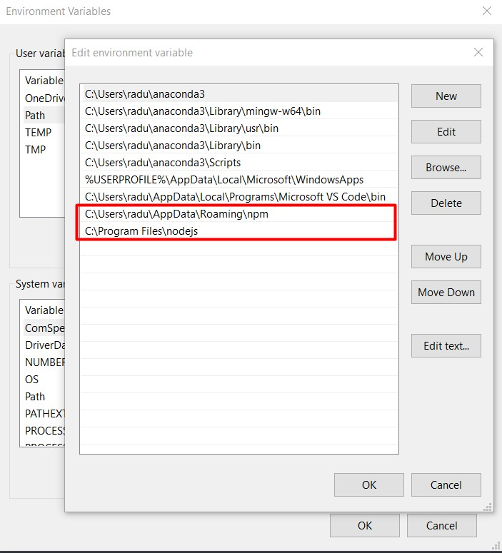
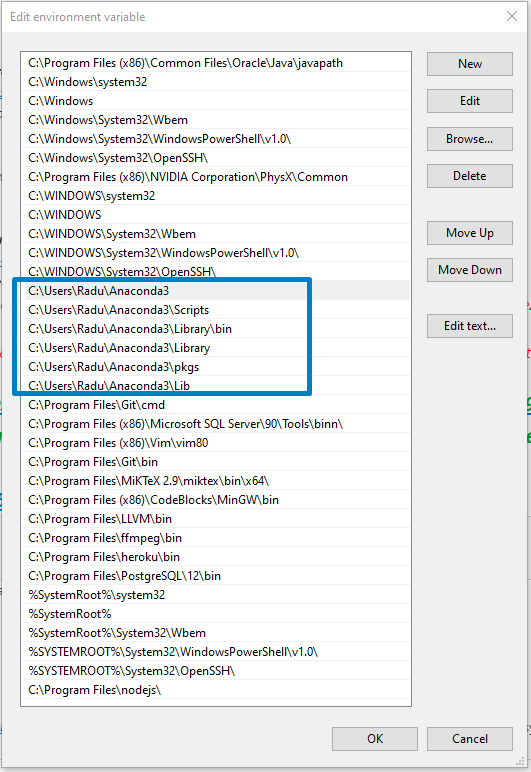
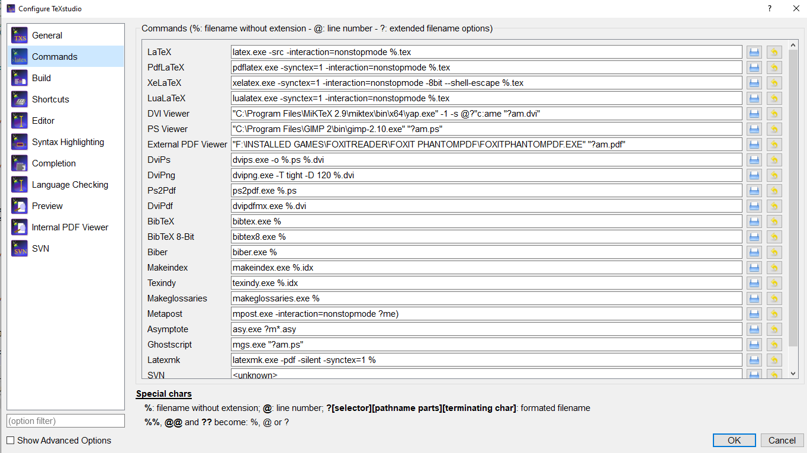
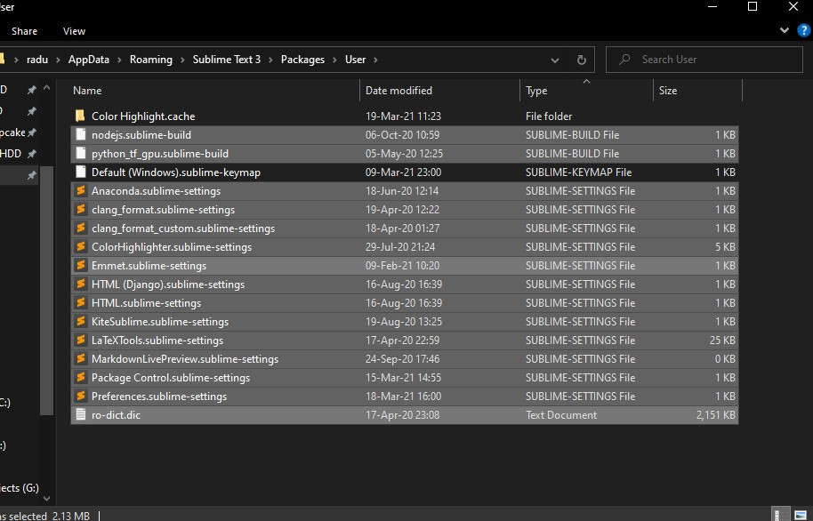

# Windows 10 Complete Backup Guide for myself

> Last Update: Sunday, March 21, 2021
>
> Update: Tuesday, November 17, 2020

## Applications

### Programs/Utilities

- [7zip](https://www.7-zip.org/) or [WinRar](https://www.win-rar.com/start.html?&L=0)
- Winamp: https://www.winamp.com/
- f.lux: https://justgetflux.com/
- LightShot: https://app.prntscr.com/en/download.html
- Windirstat: https://windirstat.net/download.html
- CCleaner: https://www.ccleaner.com/
- Microsoft Power Toys: https://github.com/microsoft/PowerToys/releases/tag/v0.33.1 (scroll down to Assets to download)
- Adobe Reader: https://get2.adobe.com/ro/reader/
- Foxit Phantom PDF Business [SEE LICENSE]
- [VLC media player](https://www.videolan.org/vlc/download-windows.html)
- ScreenRec fast recorder: https://screenrec.com/download-screenrec/
- Flashback Express Recorder: https://www.flashbackrecorder.com/express/
- Audacity (portable): https://www.audacityteam.org/
- [Mathpix snipping tool](https://mathpix.com/)
- [MathType 7](https://www.dessci.com/en/products/mathtype/) [CHECK FOR LICENSE]
- [Microsoft Teams](https://www.microsoft.com/en/microsoft-365/microsoft-teams/group-chat-software)
- [Zoom](https://zoom.us/download)
- [Skype](https://www.skype.com/en/get-skype/)
- Steam: https://store.steampowered.com/about/
- Epic Games Launcher: https://www.epicgames.com/store/en-US/download
- Discord: https://discord.com/download
- Monday: https://support.monday.com/hc/en-us/articles/115005316885-Does-monday-com-have-a-desktop-app-
- Thunderbird: https://www.thunderbird.net/en-US/

### Browsers

- [Google Chrome](https://www.google.com/chrome/). Check these **extensions**:
  - Dev:
    - [React Developer Tools](https://chrome.google.com/webstore/detail/react-developer-tools/fmkadmapgofadopljbjfkapdkoienihi?hl=en)
    - [Wappalyzer](https://chrome.google.com/webstore/detail/wappalyzer/gppongmhjkpfnbhagpmjfkannfbllamg?hl=en)
    - [Tag Assistant Legacy](https://chrome.google.com/webstore/detail/tag-assistant-legacy-by-g/kejbdjndbnbjgmefkgdddjlbokphdefk?hl=en)
    - [CSS Reloader](https://chrome.google.com/webstore/detail/css-reloader/dnfpcpfijpdhabaoieccoclghgplmpbd?hl=en)
    - [SEO META in 1 CLICK](https://chrome.google.com/webstore/detail/seo-meta-in-1-click/bjogjfinolnhfhkbipphpdlldadpnmhc?hl=en)
  - Other:
    - [MarkDown Viewer](https://chrome.google.com/webstore/detail/markdown-viewer/ckkdlimhmcjmikdlpkmbgfkaikojcbjk?hl=en) -> Advanced Options: only allow origin named `file://`, make sure GitHub isn't there! Also check all the options in `CONTENT` (EXCEPT Content -> Mathjax and EXCEPT Compiler -> Pedantic)
    - [Fireshot](https://chrome.google.com/webstore/detail/take-webpage-screenshots/mcbpblocgmgfnpjjppndjkmgjaogfceg?hl=en)
    - [News Feed Eradicator for Facebook](https://chrome.google.com/webstore/detail/news-feed-eradicator-for/fjcldmjmjhkklehbacihaiopjklihlgg?hl=en)
    - [Facebook Purity](https://chrome.google.com/webstore/detail/fbfluffbustingpurity/nmkinhboiljjkhaknpaeaicmdjhagpep)
    - [DF Tube (Distraction Free for YouTube)](https://chrome.google.com/webstore/detail/df-tube-distraction-free/mjdepdfccjgcndkmemponafgioodelna?hl=en)
    - [Dark Mode](https://chrome.google.com/webstore/detail/dark-mode/dmghijelimhndkbmpgbldicpogfkceaj)
    - [Grammarly for Chrome](https://chrome.google.com/webstore/detail/grammarly-for-chrome/kbfnbcaeplbcioakkpcpgfkobkghlhen)
    - [Screenshot YouTube](https://chrome.google.com/webstore/detail/screenshot-youtube/gjoijpfmdhbjkkgnmahganhoinjjpohk)
    - [Webtime Tracker](https://chrome.google.com/webstore/detail/webtime-tracker/ppaojnbmmaigjmlpjaldnkgnklhicppk)
- [Firefox](https://www.mozilla.org/en-US/firefox/new/)

### Work

- Git and Git GUI: https://git-scm.com/downloads
- Heroku CLI: https://devcenter.heroku.com/articles/heroku-cli
- [Postgre SQL](https://www.postgresql.org/download/) and/or [MySQL](https://dev.mysql.com/downloads/installer/)
  
  - Store the passwords safely!
- Android Studio and SDK: https://developer.android.com/studio#downloads
- FTP:
  - FileZilla Client: https://filezilla-project.org/download.php?platform=win64
  - WinSCP (better): https://winscp.net/eng/download.php
- Kite: https://www.kite.com/
- [CodeBlocks?](http://www.codeblocks.org/downloads)
- [Article on How to properly install Java JDK 13 on Windows + Eclipse 2020](https://www.guru99.com/install-java.html)
- Node.js: https://nodejs.org/en/
  
  - `Appdata\Roaming\npm` is added by default after installation
  - Add this folder to `Environment Variables -> System variables -> Path -> Edit -> C:\Program Files\nodejs\`
  - Restart PC
  
  

### Others, optional

- Dell Display Manager: https://www.dell.com/support/home/en-en/drivers/driversdetails?driverid=cx7tc&lwp=rt
- Rufus: https://rufus.ie/
- Redragon K530 Draconic keyboard sofftware: https://www.redragonzone.com/pages/download
- BalenaEtcher Portable: https://www.balena.io/etcher/
- NVidia Drivers: https://www.nvidia.com/Download/index.aspx

<br/>

## Anaconda (Python, Spyder, Jupyter)

Download here: https://www.anaconda.com/products/individual. On installation, make sure you check `Add Anaconda to the system PATH environment variable` (even if it says "Not recommended").

After installing Anaconda distribution, restart PC & check Path(s) in Environment Variables:



Main commands in Anaconda Prompt (or Cmd Prompt) [[more here](https://docs.conda.io/projects/conda/en/latest/user-guide/tasks/manage-environments.html)]: 

```bash
conda
python --version
python -c "print('Hello World')"

# List all created conda environments
conda env list

# create a new Anaconda Environment
conda create --name my_env_name

# switch to another environment
activate my_env_name

# check which conda packages are installed in the current conda environment
conda list

# check Python pip modules installed in the current conda environment
pip freeze

# install a Python module via conda
conda install module_name
# or
conda install -c conda-forge module_name

# remove a Python module installed via conda
conda remove module_name

# install a Python module via pip (not recommended, should be avoided)
pip install module_name

# remove a Python module installed via pip
pip uninstall module_name

# update all currently installed conda packages
conda update --all

# clean all caches from packages
conda clean --packages

# remove conda environment
conda remove --name myenv --all
conda env list
```

**Also, it's not recommended to install packages/modules in you `Base` Anaconda Environment!** Only work within your own created custom environments.

<br/>

### Creating an environment for Image Processing/Machine Learning applications

- Create `tf` environment (or any other name you like)

```bash
conda create --name tf
activate tf
```

- Check all the current installed modules

```bash
conda list
pip freeze
```

- Install [Jupyter Notebook](https://jupyter.org/install)

```bash
conda install -c conda-forge notebook

# Open with
>> jupyter notebook
```

- Install [Spyder](https://anaconda.org/anaconda/spyder) [optional]

```bash
conda install -c anaconda spyder

# Open with
>> spyder
```

- NumPy is usually installed by default, check with: `python -c "import numpy as np; print(np.__version__)"`

```bash
conda install numpy
```

- Install [Matplotlib](https://anaconda.org/conda-forge/matplotlib)

```bash
conda install -c conda-forge matplotlib
```

Check with `python -c "import matplotlib; import matplotlib; print(matplotlib.__version__)"`
Matplotlib also installs: `pillow`, `pyqt`, and `jpeg`

- Install [Pandas](https://pandas.pydata.org/pandas-docs/stable/getting_started/install.html)

```bash
conda install pandas
```

Check with `python -c "import pandas as pd; print(pd.__version__)"`

- Install [OpenCV](conda install -c conda-forge opencv)

```bash
conda install -c conda-forge opencv

# check if properly installed
python -c "import cv2; print(cv2.__version__)"
```

- Install [Pillow](https://anaconda.org/anaconda/pillow) (Matplotlib installs Pillow by default, no need to run this)

```bash
conda install -c anaconda pillow
```

- Install [scikit-image](https://scikit-image.org/docs/dev/install.html)

```bash
conda install scikit-image
```

Check with: `python -c "import skimage; print(skimage.__version__)"`

- Install [scikit-learn](https://scikit-learn.org/0.17/install.html)

```bash
conda install scikit-learn

# or (if the above doesn't work)
conda install -c anaconda scikit-learn
```

Check with: `python -c "import sklearn; sklearn.show_versions()"`

- [Optional] Install [Keras](https://anaconda.org/conda-forge/keras)

```bash
conda install -c conda-forge keras
python -c "import keras; print(keras.__version__)"
```

- [Optional] Install [Seaborn](https://anaconda.org/anaconda/seaborn)

```bash
conda install -c anaconda seaborn
python -c "import seaborn as sns; print(sns.__version__)"
```

- Finally, clean packages installation caches

```bash
conda clean -p
# same as
conda clean --packages
# or 
conda clean --all
# check "conda clean -h" for help
```

- Also keep in mind it's recommended to install packages via `conda` package manager. In extreme cases, where a module can't be found via `conda`, it can be installed via `pip` (package installer for Python).

IMPORTANT: If your current activated environment doesn't show up when running `jupyter notebook` from CLI: 

- run `conda install ipykernel`
- then add manually the new kernel to Jupyter Notebook using<br/>`python -m ipykernel install --user --name your_env_name --display-name "Python (your_env_name)"`
- when running a `ipynb` file in Jupyter, click on `Kernel` (navbar) -> `Change Kernel` -> Select your new kernel.

<br/>

### Creating Tensorflow GPU environment (NVidia)

Source [here](https://towardsdatascience.com/tensorflow-gpu-installation-made-easy-use-conda-instead-of-pip-52e5249374bc) (`tensorflow-gpu` will automatically install the right versions for `cudnn`, `cudatoolkit`)

- Check your Nvidia Driver Version (it should be greater than v390.0), if not, [update to the latest NVidia Drivers](https://www.nvidia.com/Download/index.aspx)

- Create `tf_gpu` environment and also install `tensorflow-gpu`

```bash
conda create --name tf_gpu tensorflow-gpu 
```

- Test the new environment

```bash
activate tf_gpu
python
import tensorflow as tf
tf.compat.v1.Session(config=tf.compat.v1.ConfigProto(log_device_placement=True)) # Tensorflow V2


sess = tf.Session(config=tf.ConfigProto(log_device_placement=True)) # Tensorflow V1, deprecated in V2
```

- It should display your current graphics card name and memory
- Check current installed packages with `conda list` or/and `pip freeze`
- Install the packages/modules listened in the previous `tf` environment

IMPORTANT: If your current activated environment doesn't show up when running `jupyter notebook` from CLI: 

- run `conda install ipykernel`
- then add manually the new kernel to Jupyter Notebook using<br/>`python -m ipykernel install --user --name tf_gpu --display-name "Python (tf_gpu)"`

<br/>

### Creating a Django environment

It depends from app to app:

- Create new environment

```bash
conda create -n django_app
```

- You can either install all the modules from a `dependencies.txt` file

```bash
pip install dependencies.txt
```

- Or you can have a fresh install of Django (it's recommended to install all the modules via pip, in case of deployment to a Linux machine that doesn't use Anaconda Distribution)

```bash
pip install Django

# Other modules
pip install django-ckedtior
pip install django-crispy-forms
pip install pillow
pip install django-googledrive-storage
pip install django-heroku
pip install gunicorn
```


<br/>

## Text Editors and Word Processors

- Typora (Markdown): https://typora.io/ (In File -> Preferences -> Editor Tab -> Check "Live Rendering Display source for headings", also in Markdown Tab you can set code indent to 2 spaces)

- Notepad++: https://notepad-plus-plus.org/downloads/

- Microsoft Office [SEE STUDENT LICENSE]

- [Visual Studio Code](https://code.visualstudio.com/download). Check these extensions:
- [Django](https://marketplace.visualstudio.com/items?itemName=batisteo.vscode-django)
  - [Prettier Code Formatter](https://marketplace.visualstudio.com/items?itemName=esbenp.prettier-vscode)
  - [ES7 React/Redux/GraphQL/React snippets](https://marketplace.visualstudio.com/items?itemName=dsznajder.es7-react-js-snippets)
  - [Markdown All in One](https://marketplace.visualstudio.com/items?itemName=yzhang.markdown-all-in-one)
  - [Material Icon Theme](https://marketplace.visualstudio.com/items?itemName=PKief.material-icon-theme)
  - [Rainbow Brackets](https://marketplace.visualstudio.com/items?itemName=2gua.rainbow-brackets)
  - [VS Color Pickler](https://marketplace.visualstudio.com/items?itemName=lihui.vs-color-picker)
  

My Visual Studio Code current settings (`CTRL+SHIFT+P` -> select `Preferences: Open Settings (JSON)`):

```json
{
  "workbench.iconTheme": "material-icon-theme",
  "editor.defaultFormatter": "esbenp.prettier-vscode",
  "editor.formatOnSave": true,
  "editor.formatOnPaste": true,
  "emmet.includeLanguages": {
    "javascript": "javascriptreact"
  }
}
```

- TexStudio & LaTeX ([install tutorial](https://www.youtube.com/watch?v=TWRP_94eock&ab_channel=MasterProdigy))

  - First, install [MiKTeX for Windows](https://miktex.org/download) (Install package on the fly: select **yes**)
  - Second, install [TeXstudio](https://www.texstudio.org/)
  - Open **MiKTeX Console** (Switch to Administrator mode). Install packages:
    - amsmath, amsfonts, babel-romanian, beamer (al), biber-windows, biblatex, biblist, bibtext, blindtext, bookmark, catchfile, cm, combelow, courier, csfonts, dataref, datatool, date (all), environ, float, fontconfig, framed, fancyvrb, graphics (all), hyph-utf8, lipsum, latex-fonts, listings, lm, ltxbase, luatex85, make4ht, metafont, miktex (all)... minted, modes, ms, pdftex, plain, pgfplots, plipsum, ptext, python, pythonhighlight, pythontex, ragged2e, rsfs, standalone, soulutf8, tools, trimspaces, ucs, upquote, url, utf8mex, xcolor, xetex, xstring, biblatex-opcit, booktabs, caption, geometry, gettitlestring, titlecaps, titlefoot, titlepic, titling, hycolor, auxhook, intcalc, pdfescape, refciybtm fancyhdr, csplain, beamertheme-focus, mathtools, stringenc, uniquecounter, ...
    - you can pretty much install all the packages if you want...(or just install the packages that you need on the go, like I did)
  - Open **TeXStudio**:
    - **Commands** tab, modify:
      - LaTeX: `latex.exe -src -interaction=nonstopmode %.tex`
      - PdfLaTeX: `pdflatex.exe -synctex=1 -interaction=nonstopmode %.tex`
      - XeLaTeX: `xelatex.exe -synctex=1 -interaction=nonstopmode -8bit --shell-escape %.tex`
      - LuaLaTeX: `lualatex.exe -synctex=1 -interaction=nonstopmode %.tex`
      - 
    - **Build** tab:
      - Check to have these settings:
      - 
      - Add these **User Commands**
        - `pdflatex -shell-escape:pdflatex -shell-escape` : `pdflatex -synctex=1 -interaction=nonstopmode --shell-escape %.tex>`
        - and
        - `pdflatex DEFAULT:pdflatex DEFAULT` : `pdflatex.exe -synctex=1 -interaction=nonstopmode %.tex`
        - We will compile with XeLaTeX in order to use Minted Code Highlighting
    - **Language** tab:
      - 
      - https://tex.stackexchange.com/questions/260651/romanian-language-in-latex/538166#538166
      - https://extensions.openoffice.org/de/project/classic-romanian-dictionary-pack-spell-checker-hyphenation-thesaurus

  

<br/>

## Sublime Text

Download [Sublime Text](https://www.sublimetext.com/3)

### My Sublime Text settings / preferences

```yaml
{
	"color_scheme": "Packages/Color Scheme - Default/Monokai.sublime-color-scheme",
	"dictionary": "Packages/Language - English/en_US.dic",
	"font_size": 10,
	"ignored_packages":
	[
		"Vintage"
	],
	"ignored_words":
	[
		""
	],
	"theme": "Adaptive.sublime-theme",
	"translate_tabs_to_spaces": true,
	"vintageous_use_ctrl_keys": true
}
```

### Key bindings, especially `F5` for Pyhon REPL:

```yaml
Default (Windows).sublime-keymap
[
{
    "keys": ["f5"],
    "command": "repl_open",
    "args": {
                "cmd": ["python", "-u", "-i", "$file_basename"],
                "cwd": "$file_path",
                "encoding": "utf8",
                "extend_env": {"PYTHONIOENCODING": "utf-8"},
                "external_id": "python",
                "syntax": "Packages/Python/Python.tmLanguage",
                "type": "subprocess"
            }
}]
```

### Sublime installed packages (text only):

- Anaconda
- Brackets Highlighter
- C Improved: [In order to compile, run & log C/C++ files within Sublime, you need to install CodeBlocks - it has MinGW](https://www.thecrazyprogrammer.com/2017/04/how-to-run-c-and-c-program-in-sublime-text.html), and also check in System Environment Variables it's path: `C:\Program Files (x86)\CodeBlocks\MinGW\bin`
- C++ Completions
- C++ Snippets
- Clang Format (You also need to install [LLVM for Windows Binaries](https://releases.llvm.org/download.html) and make sure it is added to Environment Variables (System -> Path) as `C:\Program Files\LLVM\bin`)
- Color Highlight
- Color Highlighter
- Django Syntax
- Django
- HTML5
- HTMLBeautify
- KiteSublime
- LaTeXTab, LaTeXTools
- Macroptimize
- Sidebar Enhancements
- SublimeCodeIntel
- SublieREPL

### Custom Sublime builds

- nodejs.sublime-build

```yaml
{
  "cmd": ["C:/Program Files/nodejs/node.exe", "$file"],
  "selector": "source.js"
}
```

- python_tf_gpu.sublime-build (tf_gpu conda environment)

```yaml
{
    "cmd": ["C:/Users/Radu/Anaconda3/envs/tf_gpu/python.exe", "-u", "$file"],
    "file_regex": "^[ ]*File \"(...*?)\", line ([0-9]*)",
    "selector": "source.python",
    "shell": true
}
```


### Packages and Individual package settings

These settings are found in `User/AppData/Roaming/Sublime Text 3/Packages/User` (Better save this folder!)

- Anaconda (code formatter) `Anaconda.sublime-settings`

```yaml
{
    // Daca ai Kite Auto-Completion instalat pe PC:
    "disable_anaconda_completion": true,
    "display_signatures": false,


    "auto_formatting": true,
    "auto_formatting_timeout": 5,
    "autoformat_ignore":
    [
        "E309",
        "E302",
        "W191", //pastraza tabs in loc de spaces
        "E101", //pastraza tabs in loc de spaces, reindent all lines
        "E111" //pastraza tabs in loc de spaces, indent all lines
    ],
    "pep8_ignore": // ignore warnings gen
    [
        "E501",
        "E309",
        "E302",
        "W191"
    ],
    "anaconda_linter_underlines": false,
    "anaconda_linter_mark_style": "none",
    "swallow_startup_errors": true
}
```

- clang_format.sublime-settings

```yaml
{
	"binary": "C:\\Program Files\\LLVM\\bin\\clang-format.exe",
	"style": "WebKit"
}
```

- clang_format_custom.sublime-settings

```yaml
{
	"BasedOnStyle": "Google",
	"IndentWidth": 4,
	"BreakBeforeBraces": "Allman",
	"IndentCaseLabels": false,
}
```

- KiteSublime.sublime-settings

```yaml
{
	"report_errors": false,
	"show_help_dialog": false
}
```

- Package Control.sublime.settings (Tuesday, November 17, 2020)

```yaml
{
	"bootstrapped": true,
	"in_process_packages":
	[
	],
	"installed_packages":
	[
		"Anaconda",
		"BracketHighlighter",
		"C Improved",
		"C++ Completions",
		"C++ Snippets",
		"Clang Format",
		"Color Highlight",
		"Color Highlighter",
		"Django",
		"Django Syntax",
		"HTML5",
		"HTMLBeautify",
		"LaTeXTab",
		"LaTeXTools",
		"Macroptimize",
		"Package Control",
		"Python Debugger",
		"SideBarEnhancements",
		"SublimeCodeIntel",
		"SublimeREPL"
	]
}
```

### Sublime Backup and Restore

In order to restore all your sublime text settings, preferences, and installed & customized packages settings, you just need to drag and drop the sublime's "User" folder located in `C:\Users\radu\AppData\Roaming\Sublime Text 3\Packages\User`, and next time you'll run Sublime Text, it will automatically install all the packages and configure their preferences. (However, don't copy `cache` folders)



<br/>

## AutoHotKey

Download [AutoHotKey](https://www.autohotkey.com/)

My current script - Sunday, March 21, 2021
[AHK.ahk](./AutoHotKey/AHK.ahk)