# React Native Crash Course 2020 - Traversy Media

Table of Contents:

- [React Native Crash Course 2020 - Traversy Media](#react-native-crash-course-2020---traversy-media)
- [React Native (CLI) Installation on Windows 10](#react-native-cli-installation-on-windows-10)
  - [Creating and Running a React Native Project](#creating-and-running-a-react-native-project)
- [Creating our first React Native App](#creating-our-first-react-native-app)
  - [Styling our Hello World App](#styling-our-hello-world-app)
- [Creating a ShoppingList App](#creating-a-shoppinglist-app)
  - [Header Component](#header-component)
  - [States and FlatList component](#states-and-flatlist-component)
    - [Separate component for displaying Shopping Items](#separate-component-for-displaying-shopping-items)
  - [Implementing Delete functionality](#implementing-delete-functionality)
  - [Add an item functionality](#add-an-item-functionality)
    - [Design of AddItem component](#design-of-additem-component)
    - [Adding State for retrieving the text in the input field](#adding-state-for-retrieving-the-text-in-the-input-field)
    - [Adding addItem function in App.js](#adding-additem-function-in-appjs)
  - [Complete Code](#complete-code)
    - [App.js](#appjs)
    - [Components/Header.js](#componentsheaderjs)
    - [Components/ListItem.js](#componentslistitemjs)
    - [Components/AddItem.js](#componentsadditemjs)
- [Running on personal Android Device](#running-on-personal-android-device)

Notes taken from:

- [React Native Crash Course 2020 - Traversy Media](https://youtu.be/Hf4MJH0jDb4)
- [React Native Documentation](https://reactnative.dev/docs/getting-started)

Resources used:

- [React Native States](https://reactnative.dev/docs/state)
- [React Native FlatList component](https://reactnative.dev/docs/flatlist)
- [React Native uuidv4 npm package](https://www.npmjs.com/package/react-native-uuid)

# React Native (CLI) Installation on Windows 10

Refer to:

- **[React Native CLI Quickstart (Installation)](https://reactnative.dev/docs/environment-setup) - We will follow along all the steps listed here**
- [How to install React Native on Windows with Android Studio - [Update 2020]](https://youtu.be/gQf60JPKcg4)

Other video tutorials if needed:

- [How to Install a React Native App on Windows - Getting Started](https://www.youtube.com/watch?v=_8OSkq9g8cM)
- [React Native Tutorial - Installation](https://youtu.be/0DhQd_EK1Ng)

<br/>

(Thursday, April 08, 2021)

**First things first.. we need to have installed in our PC the following: Node, the React Native command line interface, a JDK, and Android Studio (also, make sure you have at least >50GB free space on your local C: drive, preferably SSD), all those will occupy around ~25 GB**

- **[Node.js](https://nodejs.org/en/download/)**

  - (On Windows 10) After installation, make sure you have `C:\Program Files\nodejs\` path on your `System Properties > Environment Variables > System Variables > Path`. Restart PC.

- **[Java SE Development Kit 8](https://www.oracle.com/java/technologies/javase/javase-jdk8-downloads.html)**

  - Make sure you download the **Windows x64** version (the one that is over >160 MB), namely [jdk-8u281-windows-x64.exe](https://www.oracle.com/java/technologies/javase/javase-jdk8-downloads.html#license-lightbox) (current last version of Thursday, April 08, 2021)

  - Install to: `C:\Program Files\Java\jdk 1.8.0_281`

  - After installation, go to `C:\Program Files\Java`, and rename `jdk1.8.0_281` to `jdk`:

  - 

  - Now go to Windows Environment Variables, and add a variable (in System Variables section) with:
    - Variable Name: `JAVA_HOME`
    - Variable Value: `C:\Program Files\Java\jdk`
  - 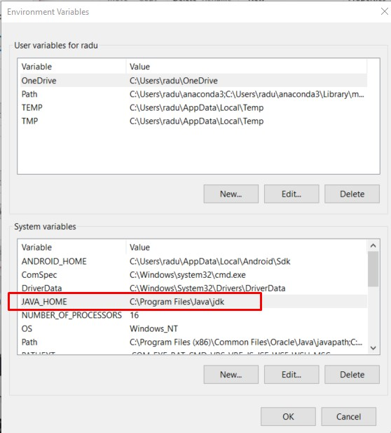

- **[Android Studio](https://developer.android.com/studio)**

  - Download and install Android Studio.
  - Open Android Studio, on welcome screen, go to "Configure" -> "SDK Manager" -> Check `Android 10.0 (Q)` and click "Apply", then wait for SDK to finish the installation.
  - After that, click on "Configure" again, select "AVD Manager" -> "Create Virtual Device" -> "Pixel 3" -> Click on `Download` on "Q (API Level 29)" -> Wait for Download and Install -> Select "Q" -> click "Next", "Finish".
  - You can check that your virtual Android Device will run properly by going on "Configure" again -> "AVD Manager" -> "Actions" tab -> Click on the green play button.
  - 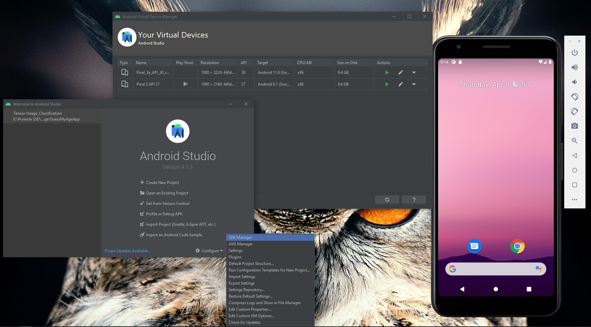
  - Close your device if you opened it previously.
  - Go again to "Configure" -> "SDK Manager" -> "SDK Tools" tab, and make sure you have the following checked/installed (click Apply after):
  - 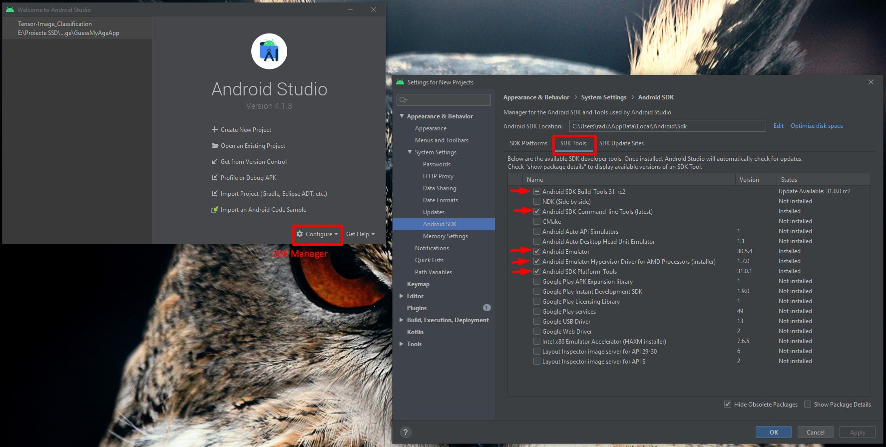
  - Now go to Windows Environment Variables, and add a variable (in System Variables section) with:
    - Variable Name: `ANDROID_HOME`
    - Variable Value: `C:\Users\radu\AppData\Local\Android\Sdk`
  - 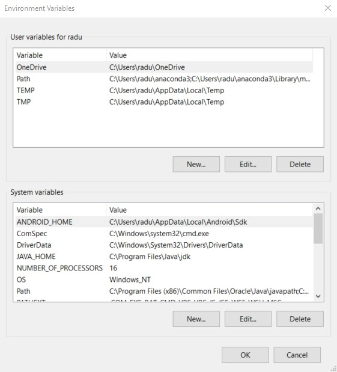
  - On Environment Variables again, click on **Path** -> Edit, and add those two paths:
    - `C:\Users\radu\AppData\Local\Android\Sdk\platform-tools`
    - `C:\Users\radu\AppData\Local\Android\Sdk\tools`
  - 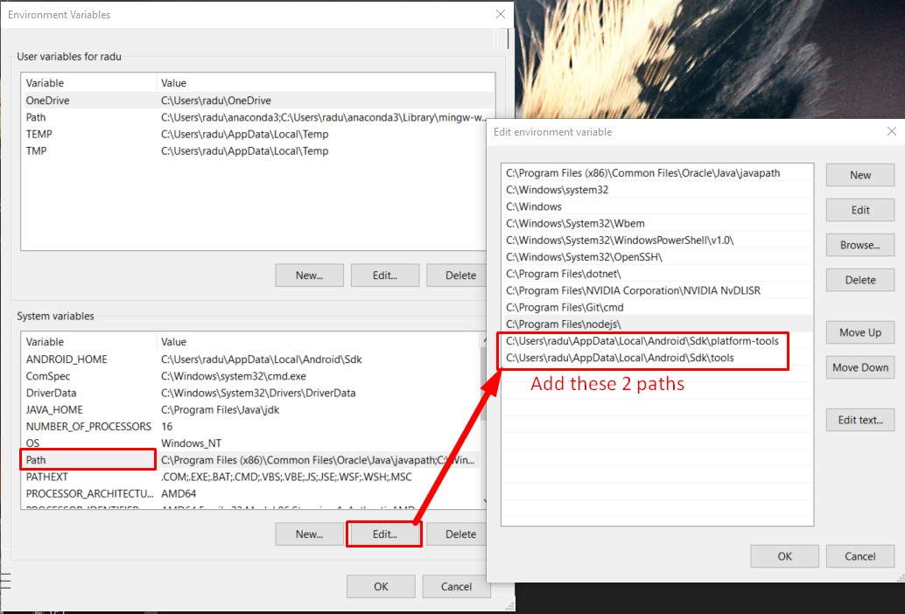

Restart PC.

(Optionally) Now, we can install React Native globally through Node Package Manager. For this, simply open CMD Prompt and run:

```bash
npm i -g react-native-cli
```

<br/>

## Creating and Running a React Native Project

Open CMD Prompt, and (if we installed React Native globally via `npm i -g react-native-cli`) run:

```bash
react-native init ShoppingList
```

Or else, run:

```bash
npx react-native init ShoppingList
```

Now, run `cd ./ShoppingList`, and then run:

```bash
npx react-native run-android
```

Now, you should wait a couple of minutes until all the dependencies are installed... After you will receive a BUILD SUCCESSFUL message, you see the virtual android device popping up, with the default Welcome Screen from React Native:

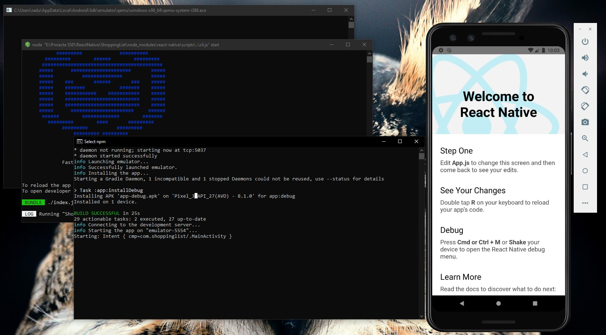

You will need to keep those 2 consoles open (don't close any of them):

- `qemu-system-i386.exe` is for your virtual android device
- `cli.js` is your running server (it compiles in real-time your Interpreted JavaScript code into Native Java for Android AND into Native Objective-C for IOS) - here you can reload the app by pressing "r". This console will also display our JavaScript errors and `console.log()`s
- `Select npm` :-?

<br/>

# Creating our first React Native App

[React Native Crash Course 2020 - Traversy Media](https://youtu.be/Hf4MJH0jDb4)

Let's go to our ShoppingList App folder with CMP Prompt (`cd ./ShoppingList`) and install/run the following:

```bash
npm i react-native-vector-icons
```

Note, if we need to have our server closed (our app closed) in order to install packages.

After that, we need to link our new package to the assets, by running:

```
react-native link react-native-vector-icons
```

And you should see a "success" message:

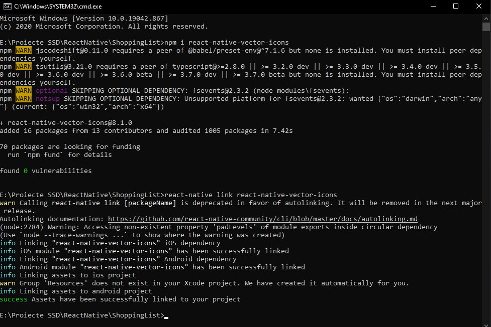

<br/>

We will also install a simple npm package:

```bash
npm i uuidv4
```

Now let's open VS Code in the current project folder, by running.

```bash
code .
```

Let's also open our server and app:

```bash
react-native run-android
```

<br/>

Our entry point to our application is **./App.js**. By default, all the code within this file is the Boilerplate for the Welcome React Native screen app. Note that if we change some text, it will automatically compile, reload, refresh and render to our app in real time.

We can delete all the code from here (to get rid of this boiler plate) and write our own. First we will create our main component (namely our function called `App`). In React (for Web Development) we used React DOM with `<div>`, `<h1>` etc tags. In React Native, we can't use HTML Tags, but instead, we will use React Native Components... therefore, we will import the `View` and the `Text` components from `react-native`. At the end, we will export our main component (as in React Web).

**./App.js**

```js
import React from "react";
import { View, Text } from "react-native";

const App = () => {
  return (
    <View>
      <Text>Hello World</Text>
    </View>
  );
};

export default App;
```

Nice, we have our first Hello World App in React Native.


**Note that React Native doesn't have any style by default. In a React Native App, we need to style everything by ourselves**

<br/>

- **View** component documentation - https://reactnative.dev/docs/view
- **Layout with Flexbox in React Native** - https://reactnative.dev/docs/flexbox

> **Note:** Flexbox works the same way in React Native as it does in CSS on the web, with a few exceptions. The defaults are different, with `flexDirection` defaulting to `column` instead of `row`, `alignContent` defaulting to `flex-start` instead of `stretch`, `flexShrink` defaulting to `0` instead of `1`, the `flex` parameter only supporting a single number.

## Styling our Hello World App

Now we will set some style to our **App.js** in order to have the Hello World text centered:

```js
import React from "react";
import { View, Text } from "react-native";

const App = () => {
  return (
    <View style={{ flex: 1, justifyContent: "center", alignItems: "center" }}>
      <Text style={{ color: "darkslateblue", fontSize: 30 }}>Hello World</Text>
    </View>
  );
};

export default App;
```

**Note:** The units in React Native are in pixels! We can't write '20px' or '2rem'... we can only write integers like '20'.

<br/>

However, if we use inline style, our code will get messy. Therefore we will use the **StyleSheet** component, and define an object named `styles`:

```js
import React from "react";
import { View, Text, StyleSheet } from "react-native";

const App = () => {
  return (
    <View style={styles.container}>
      <Text style={styles.text}>Hello World</Text>
    </View>
  );
};

const styles = StyleSheet.create({
  container: {
    flex: 1,
    justifyContent: "center",
    alignItems: "center",
  },
  text: {
    color: "darkslateblue",
    fontSize: 30,
  },
});

export default App;
```

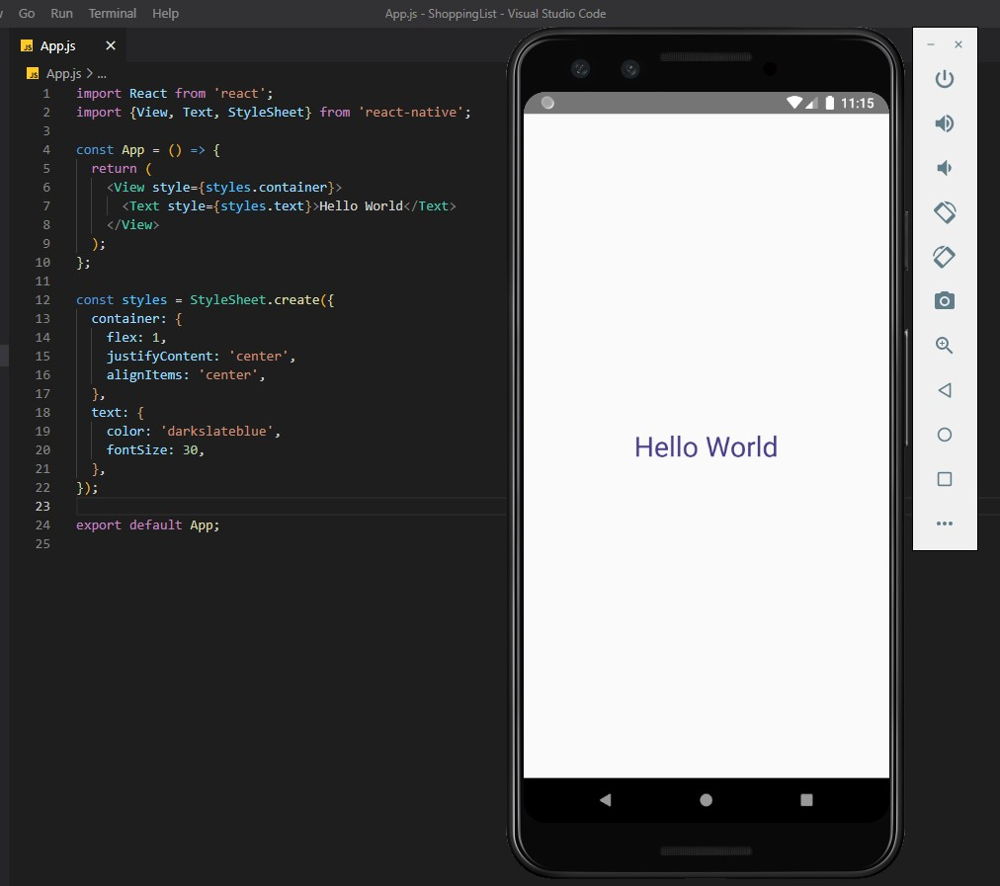

<br/>

We can also import other React Native components, like **Image** (we can use an external API for a dummy image, like https://randomuser.me/):

```js
import React from "react";
import { View, Text, Image, StyleSheet } from "react-native";

const App = () => {
  return (
    <View style={styles.container}>
      <Text style={styles.text}>Hello World{"\n"}Happy Coding!</Text>
      <Image
        source={{ uri: "https://randomuser.me/api/portraits/lego/3.jpg" }}
        style={styles.img}
      ></Image>
    </View>
  );
};

const styles = StyleSheet.create({
  container: {
    flex: 1,
    justifyContent: "center",
    alignItems: "center",
  },
  text: {
    color: "darkslateblue",
    fontSize: 30,
    textAlign: "center",
  },
  img: {
    width: 100,
    height: 100,
    borderRadius: 100 / 2,
  },
});

export default App;
```

Note that we can't use some values like 50%... So, in order to set 50% to our border-radius attribute, we will take the width and the height and divide them by 2. Note that we also don't have `<br/>` HTML tag, so we'll use a string break like `{'\n'}`.


<br/>

# Creating a ShoppingList App

(Saturday, April 10, 2021)

## Header Component

We'll create a new folder (in the project's root directory) called "components". Here, for now, we will have a new file called `Header.js`, where we will write a function component (we can also use a class component).

**./components/Header.js**

```js
import React from "react";
import { View, Text, StyleSheet } from "react-native";

const Header = () => {
  return (
    <View style={styles.header}>
      <Text style={styles.text}>My Shopping List</Text>
    </View>
  );
};

const styles = StyleSheet.create({
  header: {
    height: 60,
    padding: 15,
    backgroundColor: "darkslateblue",
  },
  text: {
    color: "#fff",
    fontSize: 23,
    textAlign: "center",
  },
});

export default Header;
```

And we will import it to our **./App.js**:

```js
import React from "react";
import { View, Text, StyleSheet } from "react-native";
import Header from "./components/Header";

const App = () => {
  return (
    <View style={styles.container}>
      <Header></Header>
    </View>
  );
};

const styles = StyleSheet.create({
  container: {
    flex: 1,
  },
});

export default App;
```


Note that on iphones X (the ones with a notch), we need to add a `paddingTop: 60,` to our `container` style class (in ./App.js).

Now, let's make the _My Shopping List_ string as a **prop** (value that we can give as an argument to our Header Component):


We can even go a step further and and destructure (pull out from the props) the props object by putting it's properties as the argument (instead of putting the `props` object as an argument)... And we can even set a default prop using `defaultProps`:

```js title="./components/Header.js"
/* ./components/Header.js */
import React from "react";
import { View, Text, StyleSheet } from "react-native";

const Header = ({ title }) => {
  return (
    <View style={styles.header}>
      <Text style={styles.text}>{title}</Text>
    </View>
  );
};

Header.defaultProps = {
  title: "My Shopping List",
};

const styles = StyleSheet.create({
  header: {
    height: 60,
    padding: 15,
    backgroundColor: "darkslateblue",
  },
  text: {
    color: "#fff",
    fontSize: 23,
    textAlign: "center",
  },
});

export default Header;
```

(With default props, if we don't give any value to our Header Component from ./App.js, it will display the a default value set in `defaultProps` object property of the Header component)

```js title="./App.js"
/* ./App.js */
import React from "react";
import { View, Text, StyleSheet } from "react-native";
import Header from "./components/Header";

const App = () => {
  return (
    <View style={styles.container}>
      <Header title="My Shopping List"></Header>
    </View>
  );
};

const styles = StyleSheet.create({
  container: {
    flex: 1,
  },
});

export default App;
```

<br/>

## States and FlatList component

Now let's deal with [React (Native) States](https://reactjs.org/docs/state-and-lifecycle.html) (or [this](https://reactnative.dev/docs/state) one)... we will also use the [FlatList](https://reactnative.dev/docs/flatlist) component to list out all the items in a state.

First we'll import `useState` from 'react', and then we'll declare a state called `items` with it's `setItems` function to manipulate the state. Inside our `useState()` function call, we'll put a default state with some hardcoded shopping items (more specific, a list with objects that have 'id' and 'text' properties):

```js
/* sample code using React States */
import React, {useState} from 'react';
...
const App = () => {
  const [items, setItems] = useState([
    {id: 3232, text: 'Milk'},
    {id: 3237, text: 'Juice'},
  ]);
}
```

We will also use our earlier installed `uuid` package to automatically generate unique id's. **UPDATE:** Weird... the `uuidv4` package can't be recognized (2021-04-10) and returns a 500 Server Error... we could instead install another package called `react-native-uuid`, so... in the CLI opened in the current folder, we run `npm remove uuidv4`, then `npm install react-native-uuid`. Apparently, linking it will be automatically from now on: `warn Calling react-native link [packageName] is deprecated in favor of autolinking. It will be removed in the next major release.` ... Now run `react-native run-android` again. (https://www.npmjs.com/package/react-native-uuid)

After that, we'll import `FlatList` component from 'react-native' , and bellow our `<Header>` component, we'll add out `<FlatList>`. From [documentation](https://reactnative.dev/docs/flatlist), the FlatList component needs a `data` attribute, and a `renderItem` function (that takes an item object as argument) to render whatever we want (in whatever style) each item of that list.

We'll set our FlatList data attribute to our `items` state, and we will define an arrow function for our renderItem attribute: this arrow function will render out a Text component with the `text` field of our item.

```js
/* App.js */
import React, { useState } from "react";
import { View, Text, StyleSheet, FlatList } from "react-native";
import Header from "./components/Header";
import uuid from "react-native-uuid";

const App = () => {
  const [items, setItems] = useState([
    { id: uuid.v4(), text: "Milk" },
    { id: uuid.v4(), text: "Butter" },
    { id: uuid.v4(), text: "Potatoes" },
    { id: uuid.v4(), text: "Salt" },
  ]);

  return (
    <View style={styles.container}>
      <Header></Header>
      <FlatList
        data={items}
        renderItem={({ item }) => <Text>{item.text}</Text>}
      ></FlatList>
    </View>
  );
};

const styles = StyleSheet.create({
  container: {
    flex: 1,
  },
});

export default App;
```

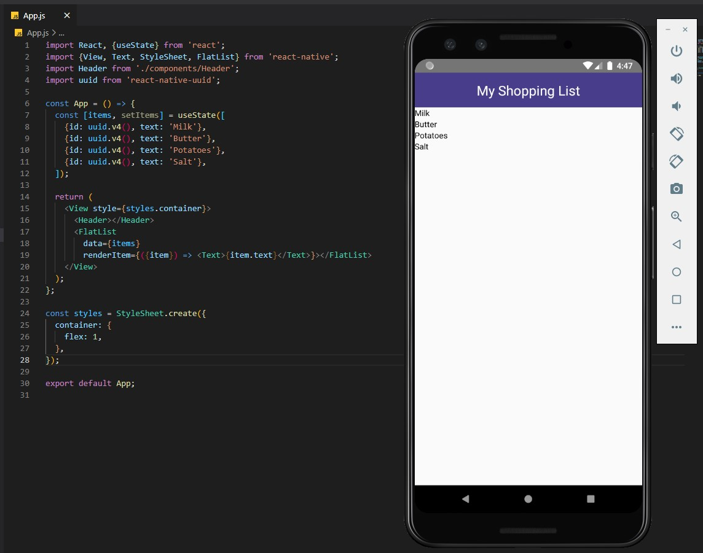

<br/>

### Separate component for displaying Shopping Items

Now, instead of just displaying text for each item in the list, we'll display a separate component. So, we'll create a separate component (`./components/ListItem.js`) for each Shopping Item, that takes as input argument the `item` object.

For this components, we'll use the following imports: `import {View, Text, StyleSheet, TouchableOpacity} from 'react-native';`, where `TouchableOpacity` is a touch element that is displayed as a form of "opacity" animation (flicker effect) when the user puts its finger on the selected item/object on the screen (this animation is by default in native android/ios apps).

For our styling, we will just add for each item a custom padding, backgroundColor and a borderBottom... we will also set the flex direction to row (by default is set to column) in order to include an additional "Delete" (Cross-X) button for each item. For this, we import `Icon` from `'react-native-vector-items/dist/fontAwesome'`, This `Icon` component will take props like the `name` of the icon, `size` in pixels, and `color`.

```js
/* ./components/ListItem.js */
import React from "react";
import { View, Text, StyleSheet, TouchableOpacity } from "react-native";
import Icon from "react-native-vector-icons/dist/FontAwesome";

const ListItem = ({ item }) => {
  return (
    <TouchableOpacity style={styles.listItem}>
      <View style={styles.listItemView}>
        <Text style={styles.listItemText}>{item.text}</Text>
        <Icon name="remove" size={20} color="firebrick"></Icon>
      </View>
    </TouchableOpacity>
  );
};

const styles = StyleSheet.create({
  listItem: {
    padding: 15,
    backgroundColor: "#f8f8f8",
    borderBottomWidth: 1,
    borderColor: "#DDD",
  },
  listItemView: {
    flexDirection: "row",
    justifyContent: "space-between",
    alignItems: "center",
  },
  listItemText: {
    color: "#0D0D0D",
    fontSize: 16,
  },
});

export default ListItem;
```

In our App.js, we'll replace the `<Text>` component from the `renderItem` function with our new imported component `<ListItem>`.

```js
/* ./App.js */
import React, { useState } from "react";
import { View, Text, StyleSheet, FlatList } from "react-native";
import Header from "./components/Header";
import ListItem from "./components/ListItem";
import uuid from "react-native-uuid";

const App = () => {
  const [items, setItems] = useState([
    { id: uuid.v4(), text: "Milk" },
    { id: uuid.v4(), text: "Butter" },
    { id: uuid.v4(), text: "Potatoes" },
    { id: uuid.v4(), text: "Salt" },
  ]);

  return (
    <View style={styles.container}>
      <Header></Header>
      <FlatList
        data={items}
        renderItem={({ item }) => <ListItem item={item}></ListItem>}
      ></FlatList>
    </View>
  );
};

const styles = StyleSheet.create({
  container: {
    flex: 1,
  },
});

export default App;
```

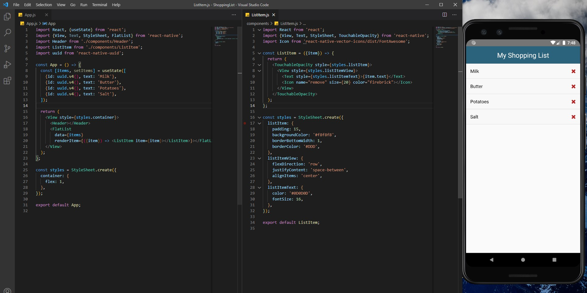

<br/>

## Implementing Delete functionality

Now, we want to delete the current selected item from the state when we click the X icon. The state is located in the `App` component, so we will want to call the delete function here, then we will pass this delete function as a prop to `ListItem` component.

Our `deleteItem` function will take the list item's `id` as parameter (to know which item to delete) . Inside this function we will call `setItems` (to manipulate the state) which will take in as parameter a `prevItems` variable that will contain the original state (previous state) before we wanted to delete a specific item... Now, to delete the item that we want (which we have a specific ID for it), we will just take the current list and filter it in order to show it without the item we wanted to delete. (Note that filtering is actually returning a list without that item, so it's acting like a true deletion).

Now, we will pass this function as a `deleteItem` prop to the `<ListItem>` component:

```js
/* sample code from App.js */
const App = () => {
  const [items, setItems] = useState([
    { id: uuid.v4(), text: "Milk" },
    { id: uuid.v4(), text: "Butter" },
  ]);

  const deleteItem = (id) => {
    setItems((prevItems) => {
      return prevItems.filter((item) => item.id != id);
    });
  };

  return (
    <View style={styles.container}>
      <Header />
      <FlatList
        data={items}
        renderItem={({ item }) => (
          <ListItem item={item} deleteItem={deleteItem} />
        )}
      />
    </View>
  );
};
```

Now we will go to `./components/ListItem.js` and set an `onPres` property to `<Icon>` component with the call of `deleteItem(item.id)` of the current list item. And we will also pass the `deleteItem` function in the component's arguments:

```js
/* ./components/ListItem.js */
import React from "react";
import { View, Text, StyleSheet, TouchableOpacity } from "react-native";
import Icon from "react-native-vector-icons/dist/FontAwesome";

const ListItem = ({ item, deleteItem }) => {
  return (
    <TouchableOpacity style={styles.listItem}>
      <View style={styles.listItemView}>
        <Text style={styles.listItemText}>{item.text}</Text>
        <Icon
          name="remove"
          size={20}
          color="firebrick"
          onPress={() => deleteItem(item.id)}
        />
      </View>
    </TouchableOpacity>
  );
};

const styles = StyleSheet.create({
  listItem: {
    padding: 15,
    backgroundColor: "#f8f8f8",
    borderBottomWidth: 1,
    borderColor: "#DDD",
  },
  listItemView: {
    flexDirection: "row",
    justifyContent: "space-between",
    alignItems: "center",
  },
  listItemText: {
    color: "#0D0D0D",
    fontSize: 16,
  },
});

export default ListItem;
```

And complete code for **./App.js**

```js
/* App.js */
import React, { useState } from "react";
import { View, Text, StyleSheet, FlatList } from "react-native";
import Header from "./components/Header";
import ListItem from "./components/ListItem";
import uuid from "react-native-uuid";

const App = () => {
  const [items, setItems] = useState([
    { id: uuid.v4(), text: "Milk" },
    { id: uuid.v4(), text: "Butter" },
    { id: uuid.v4(), text: "Potatoes" },
    { id: uuid.v4(), text: "Salt" },
  ]);

  const deleteItem = (id) => {
    setItems((prevItems) => {
      return prevItems.filter((item) => item.id != id);
    });
  };

  return (
    <View style={styles.container}>
      <Header />
      <FlatList
        data={items}
        renderItem={({ item }) => (
          <ListItem item={item} deleteItem={deleteItem} />
          // <Text onPress={() => deleteItem(item.id)}>{item.text}</Text>
        )}
      />
    </View>
  );
};

const styles = StyleSheet.create({
  container: {
    flex: 1,
  },
});

export default App;
```


Note, if we didn't wanted a separate ListItem component, we would simply have written `<Text onPress={() => deleteItem(item.id)}>{item.text}</Text>`.

<br/>

## Add an item functionality

### Design of AddItem component

Now we will create a new component in `./components/AddItems.js`:

```js
/* ./components/AddItem.js - without the states, only design */
import React from "react";
import {
  View,
  Text,
  StyleSheet,
  TextInput,
  TouchableOpacity,
} from "react-native";
import Icon from "react-native-vector-icons/dist/FontAwesome";

const AddItem = () => {
  return (
    <View>
      <TextInput placeholder="Add Item..." style={styles.input} />
      <TouchableOpacity style={styles.btn}>
        <Text style={styles.btnText}>
          <Icon name="plus" size={18} /> Add Item
        </Text>
      </TouchableOpacity>
    </View>
  );
};

const styles = StyleSheet.create({
  input: {
    height: 60,
    padding: 16,
    fontSize: 16,
  },
  btn: {
    backgroundColor: "#7CAFC8",
    padding: 8,
    marginLeft: 16,
    marginRight: 16,
  },
  btnText: {
    color: "#193949",
    fontSize: 20,
    textAlign: "center",
  },
});

export default AddItem;
```

We will import our new component in **App.js**, and we will place it between the `<Header>` and `<FlatList>` components: `import AddItem from './components//AddItem';`.

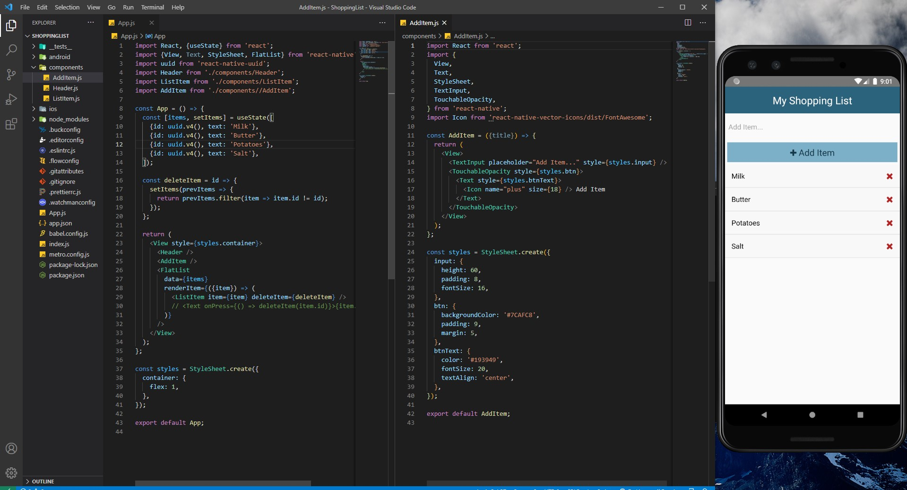

<br/>

### Adding State for retrieving the text in the input field

We will add a state `const [text, setText] = useState('');` within our `AddItem` component. Every time we have an input in React Native, we need to also have a prop called `onChangeText` and whenever we type something in the input field we are going to call a custom function called `onChange` (or whatever name we want).

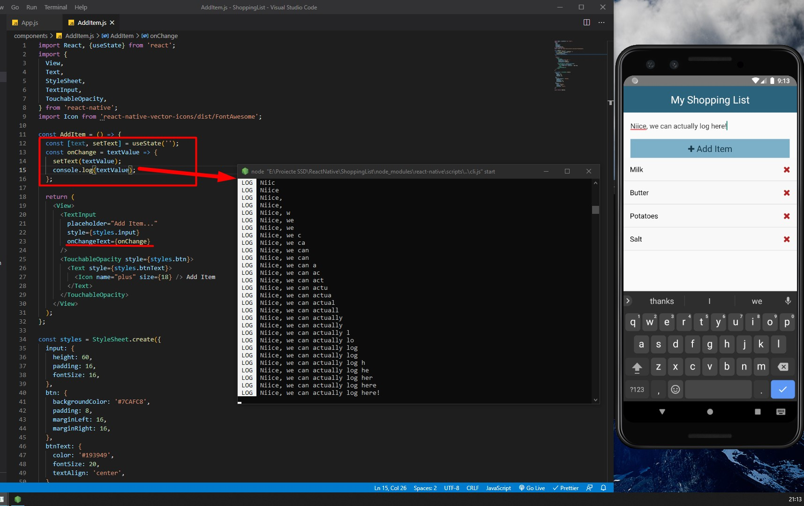

Therefore we will change our state with whatever text was actually typed in (basically we store our user's input in a variable that we will use to add the item to the list).

```js
/* ./components/AddItem.js - complete code */
import React, { useState } from "react";
import {
  View,
  Text,
  StyleSheet,
  TextInput,
  TouchableOpacity,
} from "react-native";
import Icon from "react-native-vector-icons/dist/FontAwesome";

const AddItem = ({ addItem }) => {
  const [text, setText] = useState("");
  const onChange = (textValue) => setText(textValue);

  return (
    <View>
      <TextInput
        placeholder="Add Item..."
        style={styles.input}
        onChangeText={onChange}
      />
      <TouchableOpacity style={styles.btn} onPress={() => addItem(text)}>
        <Text style={styles.btnText}>
          <Icon name="plus" size={18} /> Add Item
        </Text>
      </TouchableOpacity>
    </View>
  );
};

const styles = StyleSheet.create({
  input: {
    height: 60,
    padding: 16,
    fontSize: 16,
  },
  btn: {
    backgroundColor: "#7CAFC8",
    padding: 8,
    marginLeft: 16,
    marginRight: 16,
  },
  btnText: {
    color: "#193949",
    fontSize: 20,
    textAlign: "center",
  },
});

export default AddItem;
```

<br/>

### Adding addItem function in App.js

Now, in our main **App.js** component we will add a new function called `addItem` (right after the `deleteItem` function), where we will have our `text` that user have written, and where we will use the `setItems` function/state to retrieve the current list of items, on which we will add a new Item object.

After that, we will pass this `addItem` function as a prop to our recent created `<AddItem />` component.

```js
/* ./App.js - complete code */
import React, { useState } from "react";
import { View, Text, StyleSheet, FlatList } from "react-native";
import uuid from "react-native-uuid";
import Header from "./components/Header";
import ListItem from "./components/ListItem";
import AddItem from "./components//AddItem";

const App = () => {
  const [items, setItems] = useState([
    { id: uuid.v4(), text: "Milk" },
    { id: uuid.v4(), text: "Butter" },
    { id: uuid.v4(), text: "Potatoes" },
    { id: uuid.v4(), text: "Salt" },
  ]);

  const deleteItem = (id) => {
    setItems((prevItems) => {
      return prevItems.filter((item) => item.id != id);
    });
  };

  const addItem = (text) => {
    if (text) {
      setItems((prevItems) => {
        return [{ id: uuid.v4(), text }, ...prevItems];
      });
    }
  };

  return (
    <View style={styles.container}>
      <Header />
      <AddItem addItem={addItem} />
      <FlatList
        data={items}
        renderItem={({ item }) => (
          <ListItem item={item} deleteItem={deleteItem} />
          // <Text onPress={() => deleteItem(item.id)}>{item.text}</Text>
        )}
      />
    </View>
  );
};

const styles = StyleSheet.create({
  container: {
    flex: 1,
  },
});

export default App;
```

<br/>

Now we need to go back to **`AddItems.js`** . Here we will pass `({addItem})` function as an argument and add an `onPress` property with that function to our `<TouchableOpacity>` component.

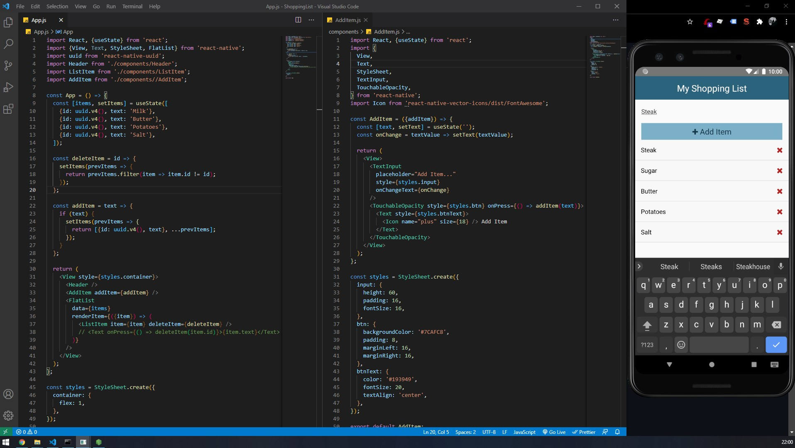

We can additionally add an Alert if the `text` string is empty:

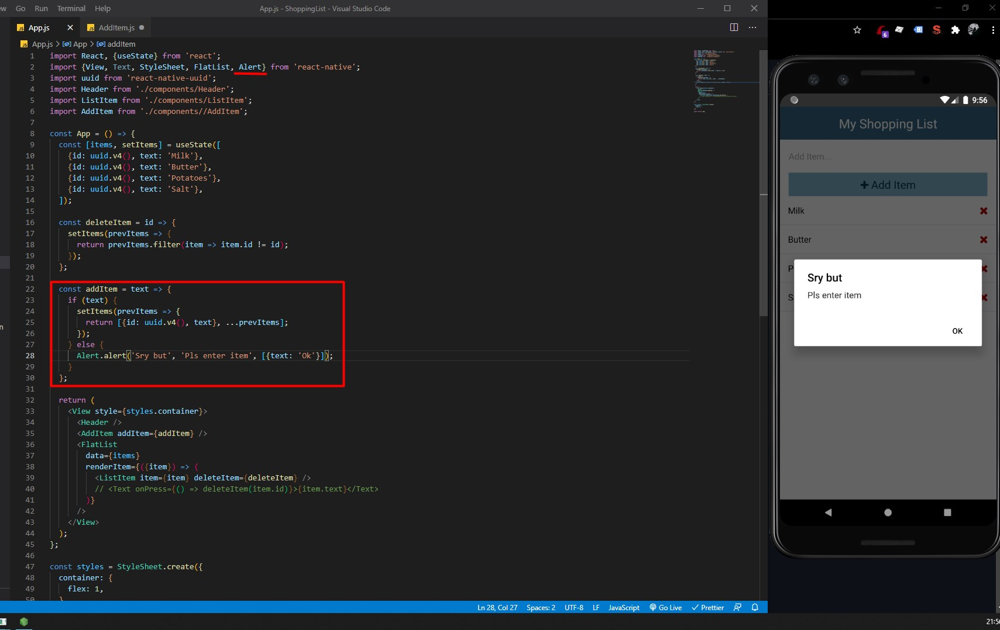

<br/>

Nice, we are done!

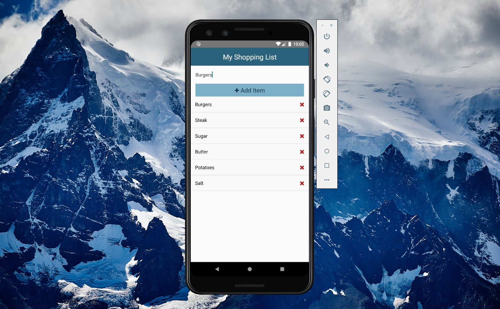

<br/>

## Complete Code

### App.js

```js
import React, { useState } from "react";
import { View, Text, StyleSheet, FlatList } from "react-native";
import uuid from "react-native-uuid";
import Header from "./components/Header";
import ListItem from "./components/ListItem";
import AddItem from "./components//AddItem";

const App = () => {
  const [items, setItems] = useState([
    { id: uuid.v4(), text: "Milk" },
    { id: uuid.v4(), text: "Butter" },
    { id: uuid.v4(), text: "Potatoes" },
    { id: uuid.v4(), text: "Salt" },
  ]);

  const deleteItem = (id) => {
    setItems((prevItems) => {
      return prevItems.filter((item) => item.id != id);
    });
  };

  const addItem = (text) => {
    if (text) {
      setItems((prevItems) => {
        return [...prevItems, { id: uuid.v4(), text }];
      });
    }
  };

  return (
    <View style={styles.container}>
      <Header />
      <AddItem addItem={addItem} />
      <FlatList
        data={items}
        renderItem={({ item }) => (
          <ListItem item={item} deleteItem={deleteItem} />
          // <Text onPress={() => deleteItem(item.id)}>{item.text}</Text>
        )}
      />
    </View>
  );
};

const styles = StyleSheet.create({
  container: {
    flex: 1,
  },
});

export default App;
```

### Components/Header.js

```js
import React from "react";
import { View, Text, StyleSheet } from "react-native";

const Header = ({ title }) => {
  return (
    <View style={styles.header}>
      <Text style={styles.text}>{title}</Text>
    </View>
  );
};

Header.defaultProps = {
  title: "My Shopping List",
};

const styles = StyleSheet.create({
  header: {
    height: 60,
    padding: 15,
    backgroundColor: "#2B627C",
  },
  text: {
    color: "#fff",
    fontSize: 23,
    textAlign: "center",
  },
});

export default Header;
```

### Components/ListItem.js

```js
import React from "react";
import { View, Text, StyleSheet, TouchableOpacity } from "react-native";
import Icon from "react-native-vector-icons/dist/FontAwesome";

const ListItem = ({ item, deleteItem }) => {
  return (
    <TouchableOpacity style={styles.listItem}>
      <View style={styles.listItemView}>
        <Text style={styles.listItemText}>{item.text}</Text>
        <Icon
          name="remove"
          size={20}
          color="firebrick"
          onPress={() => deleteItem(item.id)}
        />
      </View>
    </TouchableOpacity>
  );
};

const styles = StyleSheet.create({
  listItem: {
    padding: 15,
    backgroundColor: "#f8f8f8",
    borderBottomWidth: 1,
    borderColor: "#DDD",
  },
  listItemView: {
    flexDirection: "row",
    justifyContent: "space-between",
    alignItems: "center",
  },
  listItemText: {
    color: "#0D0D0D",
    fontSize: 16,
  },
});

export default ListItem;
```

### Components/AddItem.js

```js
import React, { useState } from "react";
import {
  View,
  Text,
  StyleSheet,
  TextInput,
  TouchableOpacity,
} from "react-native";
import Icon from "react-native-vector-icons/dist/FontAwesome";

const AddItem = ({ addItem }) => {
  const [text, setText] = useState("");
  const onChange = (textValue) => setText(textValue);

  return (
    <View>
      <TextInput
        placeholder="Add Item..."
        style={styles.input}
        onChangeText={onChange}
      />
      <TouchableOpacity style={styles.btn} onPress={() => addItem(text)}>
        <Text style={styles.btnText}>
          <Icon name="plus" size={18} /> Add Item
        </Text>
      </TouchableOpacity>
    </View>
  );
};

const styles = StyleSheet.create({
  input: {
    height: 60,
    padding: 16,
    fontSize: 16,
  },
  btn: {
    backgroundColor: "#7CAFC8",
    padding: 8,
    marginLeft: 16,
    marginRight: 16,
  },
  btnText: {
    color: "#193949",
    fontSize: 20,
    textAlign: "center",
  },
});

export default AddItem;
```

Note that our app doesn't save the data to a local storage, so, if the app is closed, all the deleted/added items are lost.

---

# Running on personal Android Device

Running `react-native run-android` on a connected Android Device.

First, refer to:

- https://developer.android.com/studio/command-line/adb
- https://stackoverflow.com/questions/40725219/react-native-run-android-on-specific-device

First thing first, we need to make sure we have `C:\Users\radu\AppData\Local\Android\Sdk\platform-tools` in our Windows Environment Variables -> Path -> Edit.

> **Note:** Android Debug Bridge (adb) comes preinstalled with Android SDK.

Now, we need to make sure we have **USB debugging enabled on our phone** (For this, we need to go in Settings -> About Phone -> Software Information -> Press multiple times on Build Number until it says "You are now a developer", then go to a new option in our phone's settings called "Developer Options" and check USB Debugging). Connect your phone to PC via USB Cable.

Now, open command prompt in the project's folder, and type:

```bash
adb devices
```

You should see your phone's ID.

Now run:

```bash
react-native run-android --deviceId=DEVICE_ID
```

Wait **a few minutes** (Mine took 4 minutes until BUILD SUCCESSFUL).

If you didn't face any additional problems, you should see your React Native app running on your own android device.
