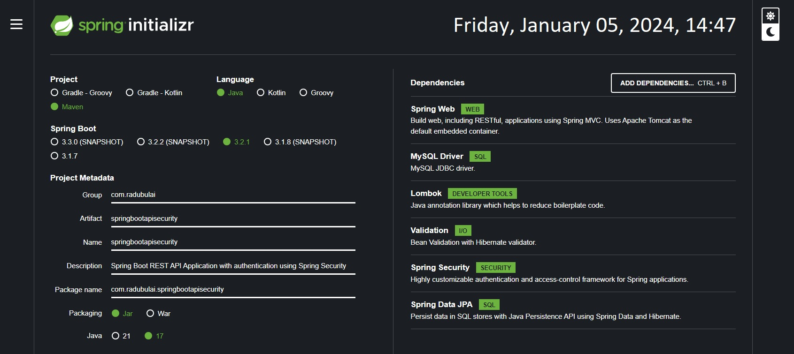

# Spring Boot API with Spring Security and Docker

Credits / Notes taken from:

- [Spring Boot API with Spring Security and Docker (15-Oct-2022) - 3h - from getarrays.io | Roland Toussaint "Junior"](https://www.youtube.com/watch?v=0iNmWIi5rG4)
  - [Source code for "Spring Boot API with Spring Security and Docker"](https://github.com/getarrays/apiapplication)

<br/>

Related Spring Boot tutorial notes from me:

- [Spring Boot Full Stack with Angular Application - EmployeeManager - August 2022](https://github.com/radualexandrub/Study/blob/master/SpringBoot/SpringBootWithAngularCourse.md)
- [Spring Boot with Angular App: Server Ping Status Tracker - July 2023](https://github.com/radualexandrub/Study/blob/master/SpringBoot/SpringBootAngularPingStatusApp.md)
- Check out all my study notes here: https://github.com/radualexandrub/Study/tree/master

<br/>

Table of Contents (ToC):

- [Spring Boot API with Spring Security and Docker](#spring-boot-api-with-spring-security-and-docker)
- [Project Setup](#project-setup)
  - [Spring Initializr](#spring-initializr)
- [CRUD Operations](#crud-operations)
- [Spring API Security](#spring-api-security)
- [Deployment using Docker](#deployment-using-docker)

<br/>

What is REST (API)? https://30secondsofinterviews.org/

> REST (REpresentational State Transfer) is a software design pattern for network architecture. A RESTful web application exposes data in the form of information about its resources.
>
> Generally, this concept is used in web applications to manage state. With most applications, there is a common theme of reading, creating, updating, and destroying data. Data is modularized into separate tables like `posts`, `users`, `comments`, and a RESTful API exposes access to this data with:
>
> - An identifier for the resource. This is known as the endpoint or URL for the resource.
> - The operation the server should perform on that resource in the form of an HTTP method or verb. The common HTTP methods are GET, POST, PUT, and DELETE.
>
> Here is an example of the URL and HTTP method with a `posts` resource:
>
> - Reading: `/posts/` => GET
> - Creating: `/posts/new` => POST
> - Updating: `/posts/:id` => PUT
> - Destroying: `/posts/:id` => DELETE

<br/>

# Project Setup

## Spring Initializr

(Friday, January 05, 2024, 14:35)

[Spring Initializr - Initializr generates Spring Boot project with just what you need to start quickly!](https://start.spring.io/)

Project configuration:

- _Project:_ Maven Project
- _Spring Boot:_ Version 3.2.1 (Jan 2024)
- _Project Metadata:_
  - _Group (domain):_ "ENTER YOUR DOMAIN HERE" (for me it'll be [com.radubulai](https://radubulai.com))
  - _Artifact (the name of the application):_ springbootapisecurity
  - _Name:_ springbootapisecurity
  - _Description:_ Spring Boot REST API Application with authentication using Spring Security
  - _Package name (you could leave the autogenerated name):_ com.radubulai.springbootapisecurity
  - _Packaging:_ Jar
  - _Java Version:_ 17

Dependencies:

- **Spring Web** - Build web, including RESTful, applications using Spring MVC. Uses Apache Tomcat as the default embedded container.
- **Spring Data JPA** - Persist data in SQL stores with Java Persistence API using Spring Data and Hibernate (ORM - Object Relational Mappind).
- **Spring Security** - Highly customizable authentication and access-control framework for Spring applications
- **MySQL JDBC driver**
- **Validation** `I/O` - Bean Validation with Hibernate validator.
- **Lombok** `DEVELOPER TOOL` - Java annotation library which helps to reduce boilerplate code.



<br/>

The contents of `pom.xml` file:

```xml
<?xml version="1.0" encoding="UTF-8"?>
<project xmlns="http://maven.apache.org/POM/4.0.0" xmlns:xsi="http://www.w3.org/2001/XMLSchema-instance"
    xsi:schemaLocation="http://maven.apache.org/POM/4.0.0 https://maven.apache.org/xsd/maven-4.0.0.xsd">
    <modelVersion>4.0.0</modelVersion>
    <parent>
        <groupId>org.springframework.boot</groupId>
        <artifactId>spring-boot-starter-parent</artifactId>
        <version>3.2.1</version>
        <relativePath/> <!-- lookup parent from repository -->
    </parent>
    <groupId>com.radubulai</groupId>
    <artifactId>springbootapisecurity</artifactId>
    <version>0.0.1-SNAPSHOT</version>
    <name>springbootapisecurity</name>
    <description>Spring Boot REST API Application with authentication using Spring Security</description>
    <properties>
        <java.version>17</java.version>
    </properties>
    <dependencies>
        <dependency>
            <groupId>org.springframework.boot</groupId>
            <artifactId>spring-boot-starter-data-jpa</artifactId>
        </dependency>
        <dependency>
            <groupId>org.springframework.boot</groupId>
            <artifactId>spring-boot-starter-security</artifactId>
        </dependency>
        <dependency>
            <groupId>org.springframework.boot</groupId>
            <artifactId>spring-boot-starter-validation</artifactId>
        </dependency>
        <dependency>
            <groupId>org.springframework.boot</groupId>
            <artifactId>spring-boot-starter-web</artifactId>
        </dependency>

        <dependency>
            <groupId>com.mysql</groupId>
            <artifactId>mysql-connector-j</artifactId>
            <scope>runtime</scope>
        </dependency>
        <dependency>
            <groupId>org.projectlombok</groupId>
            <artifactId>lombok</artifactId>
            <optional>true</optional>
        </dependency>
        <dependency>
            <groupId>org.springframework.boot</groupId>
            <artifactId>spring-boot-starter-test</artifactId>
            <scope>test</scope>
        </dependency>
        <dependency>
            <groupId>org.springframework.security</groupId>
            <artifactId>spring-security-test</artifactId>
            <scope>test</scope>
        </dependency>
    </dependencies>

    <build>
        <plugins>
            <plugin>
                <groupId>org.springframework.boot</groupId>
                <artifactId>spring-boot-maven-plugin</artifactId>
                <configuration>
                    <excludes>
                        <exclude>
                            <groupId>org.projectlombok</groupId>
                            <artifactId>lombok</artifactId>
                        </exclude>
                    </excludes>
                </configuration>
            </plugin>
        </plugins>
    </build>
</project>
```

<br/>

# CRUD Operations

Lorem Ipsum

<br/>

# Spring API Security

- Protect API routes (Only unprotected routes can be accessed by non-authenticated users)
- Create new user account functionality
- Log in with existing account
- Authenticated users are authorized
- Roles to manage access control

<br/>

# Deployment using Docker

Lorem Ipsum
